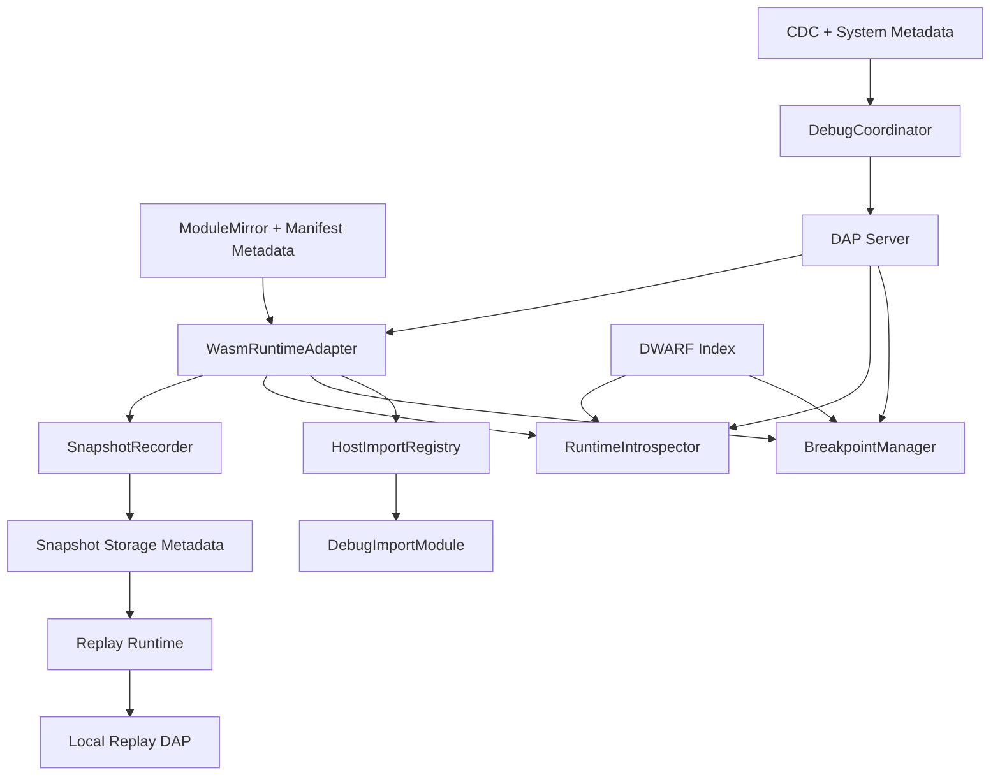

# Design Document: WASM Debug Runtime Foundation (Track B)

## Overview

Track B introduces runtime-level capabilities required for source-level WASM debugging,
DAP interaction, and deterministic snapshot/replay.

It is intentionally separated from Track A so immediate trace capabilities can ship without
partial or misleading runtime-debug placeholders.

## Dependency on Track A

Track B assumes the following Track A assets already exist:
1. Debug capability constants and policy surface.
2. SQL/CDC-backed debug session lifecycle.
3. Trace stream ingress integration via admin API ownership.
4. Harness/UI debug session integration primitives.

## Architecture Goals

1. Establish one runtime owner with interruption + introspection APIs.
2. Support both service and callback WASM execution through the same debug-capable runtime.
3. Map source breakpoints through DWARF and expose DAP operations.
4. Capture/replay deterministic execution in a controlled, bounded way.

## High-Level Architecture



## Core Components

### 1. WasmRuntimeAdapter

**Responsibility**
- Single owner for runtime instantiate/execute/suspend/inspect lifecycle.

**Contract**

```javascript
class WasmRuntimeAdapter {
  async prepareModule(moduleRef, artifacts) {}
  async createInstance(moduleRef, imports, options) {}
  async execute(instanceHandle, entrypoint, args, execOptions) {}
  async suspend(instanceHandle, suspendRequest) {}
  async resume(instanceHandle, resumeRequest) {}
  async inspect(instanceHandle, inspectRequest) {}
  async destroyInstance(instanceHandle) {}
}
```

**Design Constraints**
1. Must be reusable from both `WasmExecutor` and callback runtime driver.
2. Must expose deterministic suspension points for debugger control.
3. Must not leak runtime internals to unrelated layers.

### 2. HostImportRegistry

**Responsibility**
- Construct import object sets by capability/session context.

**Namespaces**
- `env` / `db` host operations
- `debug` debug operations (gated)

**Rules**
1. Import names are constants.
2. `debug` imports are present only when capability + active session allow.
3. Track A trace semantics remain compatible.

### 3. DWARF Indexing Pipeline

**Responsibility**
- Parse and index debug metadata for source offset mapping and symbol lookup.

**Subcomponents**
1. Artifact resolver (embedded section or sidecar pointer).
2. DWARF parser.
3. Index builder:
   - source -> offsets
   - offsets -> source
   - frame/local symbol maps.

**Storage Strategy**
- Cache index by module digest/version in local memory with bounded eviction.

### 4. BreakpointManager

**Responsibility**
- Own breakpoint registration, resolution, and hit processing.

**State**
- Session-scoped breakpoint set keyed by module + source location.
- Resolved offset map per runtime instance.

**Execution Control**
- Uses runtime adapter-supported interruption mode.
- Emits pause/resume events to DAP server.

### 5. RuntimeIntrospector

**Responsibility**
- Provide stack frames, local variables, and memory slices when paused.

**Limits**
- Max bytes per memory read.
- Max variables returned per scope request.
- Per-request timeout to avoid deadlock.

### 6. DAP Server

**Responsibility**
- Translate DAP protocol operations into runtime adapter + breakpoint/introspection calls.

**Lifecycle**
1. Bound to debug session attach.
2. Exposes endpoint metadata for coordinator handoff.
3. Stops on detach or terminal execution.

### 7. DebugCoordinator

**Responsibility**
- Track lineage stage endpoint for distributed callback handoff.

**Ownership**
- Uses existing metadata and CDC updates.
- Publishes endpoint transitions to subscribed clients.

### 8. SnapshotRecorder

**Responsibility**
- Record deterministic execution artifacts.

**Captured Data**
1. Input frames (context + rows/args).
2. Host-call ledger.
3. Memory boundary snapshots.
4. Timing and lineage metadata.

**Serialization**
- Versioned binary envelope + JSON manifest index.

### 9. Replay Runtime

**Responsibility**
- Reconstruct execution deterministically from snapshot artifacts.

**Rules**
1. Uses captured host-call ledger only.
2. Supports local DAP stepping/inspection.
3. Emits replay diagnostics and determinism check output.

## Integration with Existing Code Paths

### WasmExecutor Migration

Current:
- Reads `mod.exports[runExport]` and invokes directly.

Target:
1. Delegate instantiate + execute to `WasmRuntimeAdapter`.
2. Keep `WasmExecutor` as orchestration shell and policy enforcer.
3. Remove permanent direct export invocation path once migration is complete.

### Callback Runtime Migration

Current:
- `WasmComponentCallbackDriver` delegates to `WasmExecutor` with simplified context.

Target:
1. Driver passes full callback debug scope and context.
2. Underlying execution uses same runtime adapter as service handlers.

## Metadata and Table Design

Track B may require new metadata tables (or equivalent owned structures) such as:
1. `debug_sessions`
2. `debug_breakpoints`
3. `debug_snapshots`
4. `debug_snapshot_frames` (optional, depending on storage layout)

Design rules:
- Each table has a single owner.
- Writes go through SQL mutation path.
- CDC propagates distributed state.

## Transport and Ingress Design

1. Reuse `AdminWebSocketAPI` ownership for external debug transport.
2. Add DAP/debug routes under admin route constants.
3. Do not introduce parallel dedicated debug network services.

## Failure Model and Recovery

1. Missing DWARF when required:
   - Reject attach or return explicit DAP capability error.
2. Breakpoint resolution failure:
   - Keep session active, report per-breakpoint errors.
3. Runtime suspension failure:
   - Return DAP error and optionally terminate debug session safely.
4. Snapshot overflow/quota exceeded:
   - Stop capture for that session and emit structured diagnostic event.
5. Stage-handoff race:
   - Coordinator always publishes latest-known endpoint with monotonic stage ordering.

## Security and Isolation

1. Debug attachment requires authz checks scoped to tenant/service.
2. Debug metadata access enforces tenant scoping.
3. Memory inspection and snapshot data are treated as sensitive and audited.

## Observability

Required metrics:
1. `debug_dap_sessions_active`
2. `debug_breakpoint_hits_total`
3. `debug_suspend_failures_total`
4. `debug_snapshot_bytes_total`
5. `debug_replay_determinism_failures_total`

Required logs:
1. Session attach/detach with scope
2. Breakpoint resolution outcomes
3. Stage handoff endpoint changes
4. Snapshot start/stop and limit events

## Migration Strategy

### Phase B0: Adapter introduction

1. Introduce runtime adapter interface behind existing orchestration.
2. Keep behavior parity tests green.

### Phase B1: Service path migration

1. Move service execution to runtime adapter.
2. Validate performance and correctness.

### Phase B2: Callback path migration

1. Move callback WASM path to runtime adapter.
2. Validate lineage + stage behavior.

### Phase B3: DAP + DWARF

1. Add DWARF indexing and breakpoint manager.
2. Add DAP server and minimal debug commands.

### Phase B4: Distributed coordinator

1. Enable cross-node stage handoff.

### Phase B5: Snapshot + replay

1. Implement recorder, serializer, and replay runtime.
2. Add determinism checks.

## Track Boundary

No Track B item should be implemented as a lightweight placeholder in Track A.
All runtime-internal debug capabilities must follow this design and its task plan.
