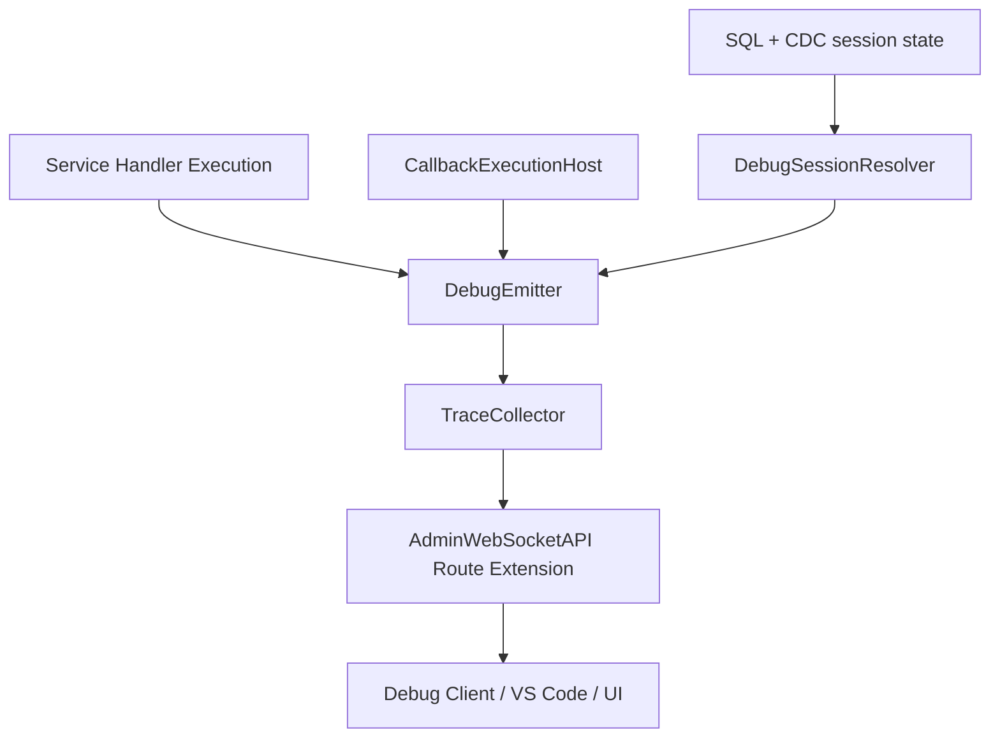

# Design Document: WASM Debugging (Track A Runtime-Aligned)

## Overview

This design delivers **Track A** debugging capabilities for the current execution architecture.

Current architecture facts this design preserves:
- `WasmExecutor` executes `mod.exports[runExport](context, args)`.
- `ModuleMirror` caches module payloads and exports.
- Callback execution goes through `CallbackExecutionHost` and runtime drivers.
- Admin ingress ownership is centralized in `AdminWebSocketAPI`.

Track A therefore focuses on structured tracing, SQL/CDC-backed session state, and harness/UI
integration. Track B (runtime internals for DWARF/DAP/snapshot replay) is fully defined in:
- `.kiro/specs/archived/wasm-debug-runtime-foundation/design.md`

## Design Principles

1. Reuse current execution ownership; do not create a second executor path.
2. Reuse admin ingress; do not create a parallel debug socket service.
3. Reuse SQL/CDC metadata ownership; do not create ad-hoc debug state replication.
4. Keep inactive-path overhead negligible via strict early gating.
5. Keep Track A and Track B boundaries explicit and non-overlapping.

## Architecture

### High-Level Flow



### Execution-Path Integration

1. Service execution path:
   - `WasmExecutor.execute(...)` resolves debug-active state and builds a trace helper.
   - The helper is attached to execution context as a bounded API (for example `ctx.debug.trace`).

2. Partition callback path:
   - `CallbackExecutionHost` resolves debug-active state per batch scope using lineage + service.
   - It passes trace-ready options/context through runtime-driver invocation.

3. Wasm component callback driver:
   - `WasmComponentCallbackDriver.invokeCallback(...)` currently drops `_options`.
   - Track A changes this to preserve and pass through debug-relevant context/options.

## Components

### Debug Constants (`src/debug/debug-constants.js`)

Defines:
- `DEBUG_CAPABILITY` (`debug.trace`, `debug.breakpoint`, `debug.snapshot`)
- `DEBUG_TRACE_LEVEL`
- trace event field constants
- error and log message constants

Track A uses `debug.trace`; Track B constants are defined now but not activated here.

### DebugSessionResolver (`src/debug/debug-session-resolver.js`)

Responsibilities:
1. Resolve active session(s) for service execution scope.
2. Resolve active session(s) for callback scope (`lineageId`, `stageId`, `serviceDefinitionId`).
3. Provide cheap `isTraceActive()` decision for hot path gating.

Inputs:
- Read-only system metadata access (cache/SQL read API).
- Session state synchronized by CDC.

### DebugEmitter (`src/debug/debug-emitter.js`)

Responsibilities:
1. Validate trace level.
2. Build Trace_Event envelope from supplied execution metadata.
3. Fast-return when session inactive.
4. Forward events to `TraceCollector`.

### TraceCollector (`src/debug/trace-collector.js`)

Responsibilities:
1. Maintain connected trace subscribers.
2. Filter by lineage prefix and optional level/node filters.
3. Forward serialized JSON events.
4. Drop events when no subscriber exists.

No independent network server is created here.

### Admin Debug Route Extension (`src/admin/admin-websocket-api.js`)

Responsibilities:
1. Expose debug trace stream endpoint(s) under existing admin API ownership.
2. Create/remove collector subscribers per connection.
3. Apply connection-level filter negotiation.

Proposed route constant additions:
- `ADMIN_ROUTE.DEBUG_TRACE_STREAM = '/api/admin/debug/trace'`
- Optional companion snapshot artifact route for harness output reuse.

## Data Model

### Trace_Event

```javascript
{
  level: 'error' | 'warn' | 'info' | 'debug' | 'trace',
  message: string,
  context: object | null,
  timestamp: number,
  lineageId: string | null,
  stageId: number | null,
  partitionId: string | null,
  nodeId: string,
  serviceDefinitionId: string,
  replicaId: string | null,
  runtimeKind: string,
  source: 'service' | 'partition_callback',
}
```

### Debug Session Metadata

Track A uses a dedicated `debug_sessions` system table as the single owner for active
trace-session state.

Ownership and flow:
- Writes flow through SQL mutation path.
- Replication/visibility flows via CDC.
- Resolver reads flow through the local `SystemTableCache` view fed by CDC.
- No direct node-to-node debug-state channel is introduced.

## Integration Details

### WasmExecutor Integration

Target API adjustment:

```javascript
await wasmExecutor.execute(func, context, args, {
  debugScope: {
    serviceDefinitionId,
    lineageId,
    stageId,
    partitionId,
    replicaId,
  },
});
```

Behavior:
1. Resolve session activity through `DebugSessionResolver`.
2. If inactive, execute current path unchanged.
3. If active, attach bounded debug API (trace only for Track A) to context/options.

### CallbackExecutionHost Integration

Behavior:
1. Resolve trace-active state per batch using lineage/stage/service scope.
2. Build trace metadata from existing owners (`lineageTracker`, stage index, partition ID).
3. Pass tracing helper/context through runtime driver options.

### CallbackRuntimeDriverRegistry Integration

Change needed:
- `WasmComponentCallbackDriver.invokeCallback(batch, descriptor, options)` must no longer ignore
  options so trace context can flow to executor.

## Harness and UI Design

### Harness

1. Scenario run config supports `debug.trace` enablement and filter scope.
2. Run artifacts include exported trace NDJSON or JSON lines.
3. Playback viewer can overlay trace timeline using lineage correlation.

### Admin UI

1. Add trace panel to existing test dashboard experience.
2. Filters: lineage prefix, node ID, level.
3. Keep same backend ownership and route domain as current admin dashboard.

## Failure Handling

1. Invalid trace level: deterministic validation error.
2. Collector unavailable: emitter logs and drops, no execution failure for user workload.
3. Session stale/missing: treated as inactive.
4. Admin stream disconnect: collector unsubscribes and continues drop/no-buffer behavior.

## Observability

Track A metrics:
1. `debug_trace_emitted_total`
2. `debug_trace_dropped_no_session_total`
3. `debug_trace_dropped_no_subscriber_total`
4. `debug_trace_stream_subscribers`

Track A logs should include lineage/session IDs where available.

## Track Boundary and Handoff

Track A explicitly stops before runtime internals required for:
1. Instruction-pointer breakpoints.
2. DWARF source mapping.
3. Linear memory introspection.
4. Snapshot capture and deterministic replay.

Those are defined in the dedicated Track B runtime foundation spec:
- `.kiro/specs/archived/wasm-debug-runtime-foundation/requirements.md`
- `.kiro/specs/archived/wasm-debug-runtime-foundation/design.md`
- `.kiro/specs/archived/wasm-debug-runtime-foundation/tasks.md`
