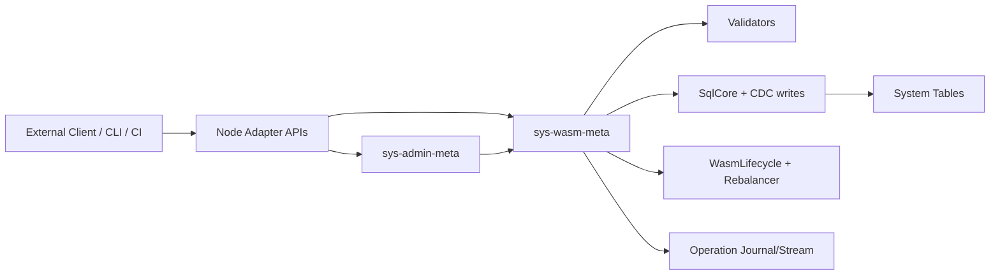

# Design Document: WASM/ADMIN Meta Services with Component Distribution

## Overview

This design implements the missing WASM artifact and service management pieces
as service-owned control-plane functionality.

It adopts component-model distribution practicalities:

- Canonical package identity: `namespace:name@version`
- Registry mapping by namespace, with per-package overrides
- OCI-compatible source references and digest pinning
- Deterministic dependency locks for activation

It also serviceizes admin surfaces:

- `sys-wasm-meta`: authoritative owner for WASM package/module/service commands
- `sys-admin-meta`: required service for broader admin surfaces, delegating
  WASM management commands to `sys-wasm-meta`

Both services are provisioned during seed bootstrap.
Node-local APIs remain compatibility adapters only.

## Goals

1. Implement production-grade module publish/fetch/resolve/activate flows.
2. Keep one mutation path through service-owned handlers.
3. Keep one lifecycle path through existing lifecycle/rebalancer owners.
4. Serviceize existing admin API behavior.
5. Provide deterministic distribution behavior through lock records.

## Non-Goals

1. Replacing lifecycle/rebalancer logic with API-layer orchestration.
2. Keeping long-term direct node-local admin mutation paths.
3. Allowing mutable dependency activation without explicit rollout.

## Service Topology



### Ownership Rules

1. WASM mutation commands: only `sys-wasm-meta`.
2. Generic admin commands: only `sys-admin-meta`.
3. Node adapters cannot mutate state directly.
4. Lifecycle mutations flow only via existing lifecycle/rebalancer owners.

## Component Distribution Model

### Package Identity

Canonical package ID:

```text
namespace:name@version
```

Examples:
- `acme:fraud-policy@1.4.2`
- `ddb:sql-callbacks@0.3.0`

### Source Resolution

Resolution order:

1. Explicit per-package override
2. Namespace registry mapping
3. Default registry mapping (if configured)

Resolved package sources can be OCI references. Activation requires digest
pinning.

### Dependency Locks

Before activation, dependency graph is resolved to immutable digests and stored
as a lock record. Locks are the replay source for restart/retry and rollout
determinism.

## Data Model

Planned tables (names may be finalized during implementation):

1. `module_manifests`
   - package id components (`namespace`, `name`, `version`)
   - digest
   - `run_export`
   - exports/dependencies/capabilities (json)
   - source reference (OCI or equivalent)
   - artifact pointer / code reference
2. `package_registry_mappings`
   - namespace -> registry mapping + policy metadata
3. `package_registry_overrides`
   - exact package override -> registry mapping
4. `module_dependency_locks`
   - lock id, target module/service revision, resolved dependency digests
5. `wasm_operations`
   - operation workflow state + idempotency metadata

Artifact bytes remain in canonical executable storage ownership path (`code`
table or finalized equivalent), while package metadata stays in manifest tables.

## API Model

## `sys-wasm-meta` Commands

- `publishModule`
- `getModule`
- `listModules`
- `createService`
- `updateService`
- `scaleService`
- `rolloutService`
- `deleteService`
- `getOperation`
- `streamOperations`

## `sys-admin-meta` Commands

- Existing admin query/stream operations (cache/state/ops/logs/config views)
- Delegation commands to `sys-wasm-meta` for WASM ownership areas

## Node Adapter Endpoints (Compatibility Layer)

- HTTP/WS entrypoints remain for external compatibility.
- Handlers forward to `sys-admin-meta`/`sys-wasm-meta` command interfaces.
- No direct partition/system-table mutation in adapters.

## Command Pipelines

### Publish Module

1. Validate request schema and identity format.
2. Verify digest against uploaded bytes.
3. Validate manifest + runtime contract (`run_export`).
4. Resolve dependencies using registry mappings and overrides.
5. Validate capabilities against tenant/service policy.
6. Persist artifact + manifest + dependency lock.
7. Emit audit and operation completion.

### Create / Rollout Service

1. Validate referenced package/module revision.
2. Validate service definition and policy constraints.
3. Persist service definition mutation via SQL/CDC path.
4. Trigger lifecycle/rebalancer update.
5. Track async progress in `wasm_operations`.
6. Stream operation events.

### Admin API Serviceization

1. Route existing admin actions into service-owned command handlers.
2. Maintain output compatibility for CLI while backend ownership shifts.
3. Remove direct node-local mutation logic once adapters are complete.

## Validation and Policy Reuse

Reused ownership components:

- `validateModuleManifest`
- `validateManifestRuntime`
- `resolveDependencies`
- `enforceCapabilityPolicy`
- `ServiceDefinitionValidator`

No duplicate validator logic is introduced in adapters.

## Security and Reliability

1. Authn/Authz enforced at service command layer.
2. Idempotency keys dedupe retried mutating requests.
3. Quotas on artifact size, package count, and concurrent operations.
4. Operation state machine provides resumable failure handling.
5. Fail-closed behavior for unresolved policy/dependency/validation checks.

## Testing Strategy

1. Unit tests for package identity parser, mapping resolution, and lock
   determinism.
2. Unit tests for service command idempotency and operation state transitions.
3. Integration tests for publish/fetch/rollout using registry mappings.
4. Integration tests for admin adapter -> service delegation behavior.
5. Compatibility tests to ensure existing CLI/admin UX remains functional during
   migration.

## Migration Plan

1. Introduce service command handlers and operation journal.
2. Add adapter forwarding in existing node APIs.
3. Migrate clients to service-owned APIs.
4. Remove direct mutation logic from node-local handlers.
5. Finalize deprecation of legacy direct admin mutation paths.
