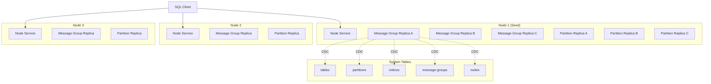

# Architecture

## Core Principles

1. **Universal Partition Architecture**: ALL tables (system tables and user tables) are implemented as partitions with odd-numbered Raft replicas (minimum 3)
2. **Fully Autonomous Management**: The system makes ALL replica placement and count decisions - no manual operator control
3. **Self-Describing**: All system metadata is stored within the database itself using the same infrastructure as user data
4. **Consensus-Based**: Both data storage and messaging use Raft for consistency
5. **Horizontally Scalable**: Add nodes to increase capacity and fault tolerance
6. **Policy-Driven**: Configurable policies control partition behavior and replica placement decisions
7. **One Way**: Each functionality has exactly one implementation - no fallbacks, no alternatives
8. **Best-of-Breed Libraries**: Leverage proven, mature libraries rather than building custom solutions
9. **Unified Rebalancing**: Same rebalancing logic for partitions and message groups, driven by policies
