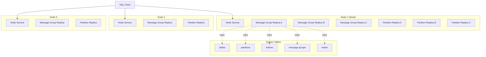
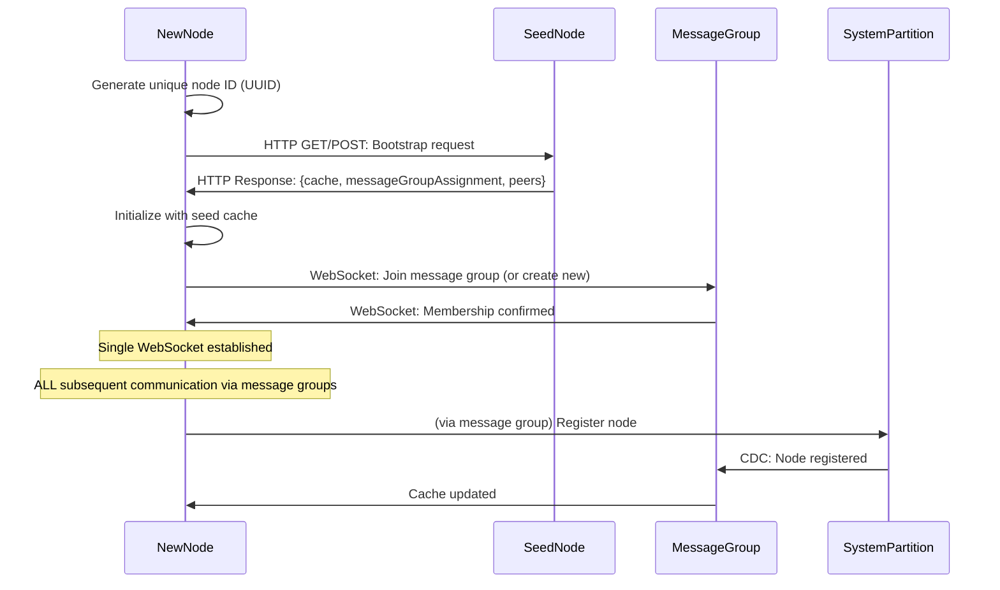
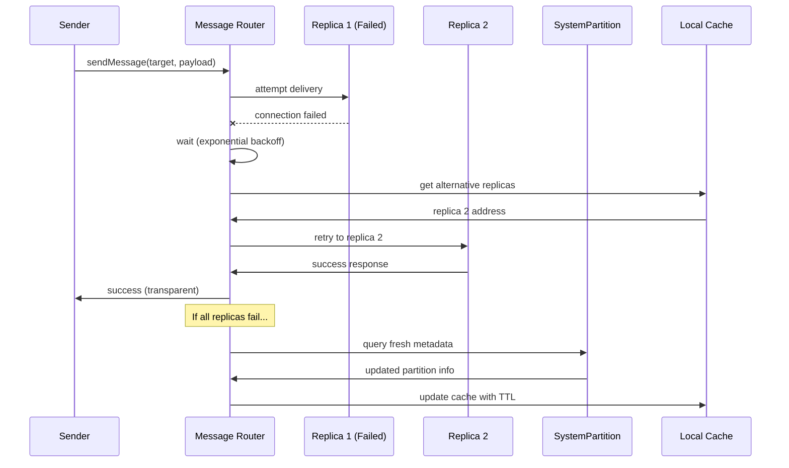
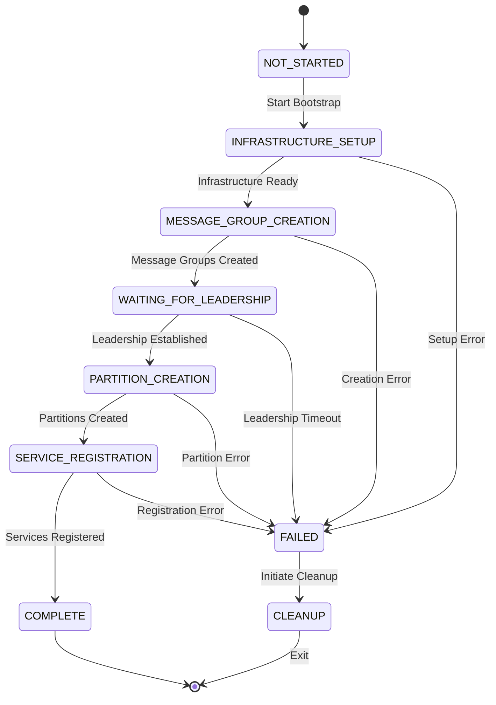
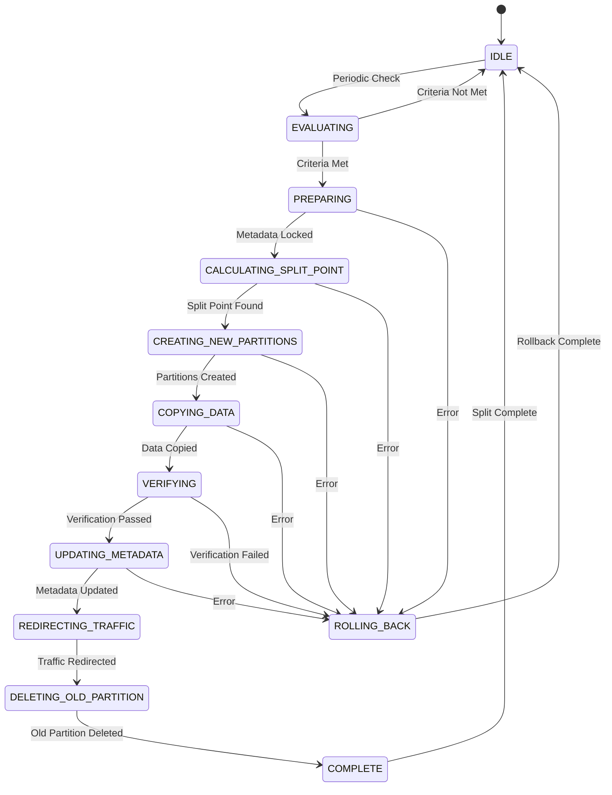
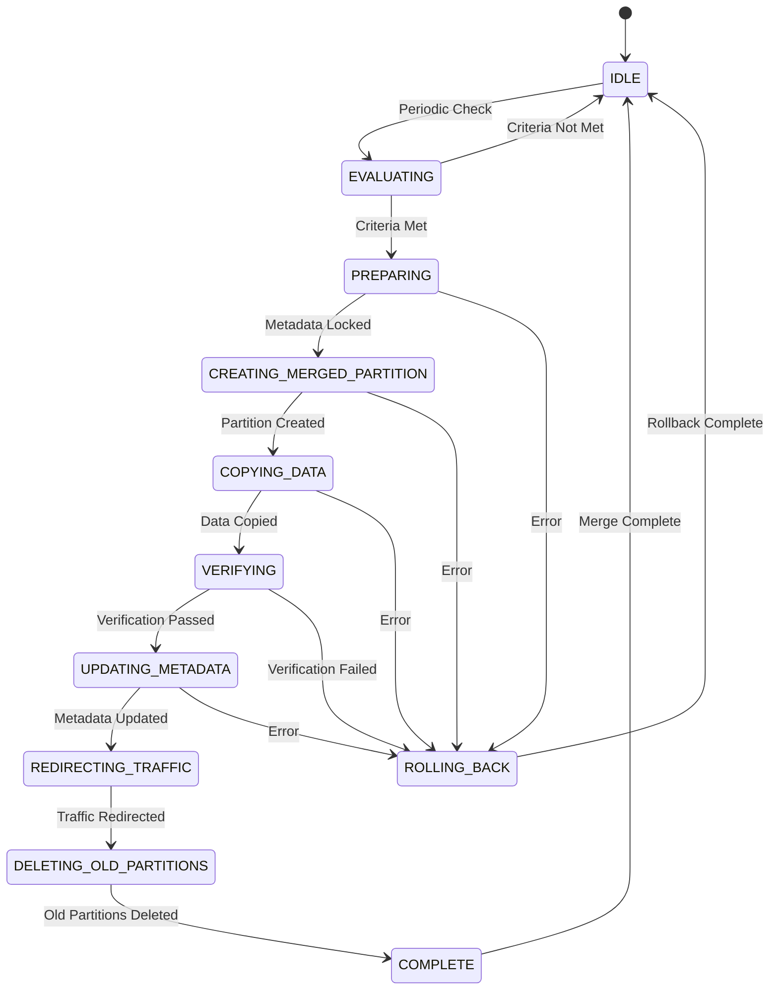
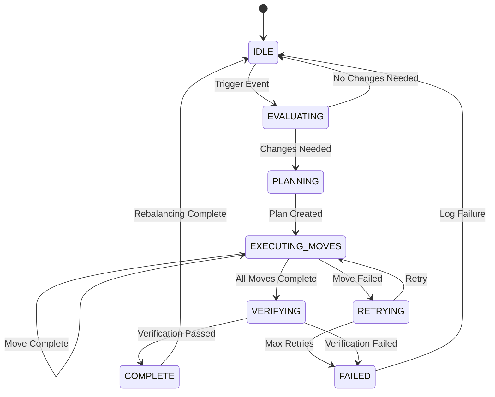

# Design Document: Distributed Database System

> **Source of Truth**: This design document implements the requirements specified in [requirements.md](./requirements.md). For implementation status, see [tasks.md](./tasks.md).

## Overview

The distributed database system is a self-contained, scalable database that stores all its metadata within itself. The architecture is built around three core concepts: nodes (physical/virtual machines), services (components running on nodes), and Raft consensus groups for both data storage and message routing.

**Core Architectural Truth:**

The system follows a simple, universal storage model:
1. **ALL persistent information** → stored in **tables**
2. **ALL tables** (system and user) → implemented as **partitions** (starting with one partition per table)
3. **ALL partitions** → implemented as **Raft consensus groups** with odd-numbered replicas (minimum 3)
4. **ALL partition replicas** → use **SQLite** for storage

**The ONLY exceptions:**
- Messages in transit (ephemeral, in Raft logs until delivered)
- In-memory caches (rebuilt from tables via CDC)

This means system tables like `nodes`, `partitions`, `tables`, `services` are implemented EXACTLY the same way as user tables - there is no special-case code or alternative storage mechanism.

**Core Architectural Principles:**
1. **Universal Partition Implementation**: ALL tables (system and user) are implemented as partitions with odd-numbered Raft replicas (3, 5, 7, etc.)
2. **Fully Autonomous Management**: The system makes ALL replica placement decisions - operators never manually specify locations
3. **Self-Describing**: All system metadata is stored within the database itself using the same infrastructure as user data
4. **Policy-Driven**: Configurable policies control all partition behavior and replica placement decisions

The system uses a layered approach where:
- **Physical Layer**: Nodes represent compute resources
- **Service Layer**: Services provide specific functionality (storage, messaging, administration)
- **Data Layer**: ALL tables (system and user) are partitioned and replicated using SQLite + Raft
- **Communication Layer**: Message groups handle inter-service communication and system state distribution

## Architecture



### Core Principles

1. **Universal Partition Architecture**: ALL tables (system tables and user tables) are implemented as partitions with odd-numbered Raft replicas (minimum 3)
2. **Fully Autonomous Management**: The system makes ALL replica placement and count decisions - no manual operator control
3. **Self-Describing**: All system metadata is stored within the database itself using the same infrastructure as user data
4. **Consensus-Based**: Both data storage and messaging use Raft for consistency
5. **Horizontally Scalable**: Add nodes to increase capacity and fault tolerance
6. **Policy-Driven**: Configurable policies control partition behavior and replica placement decisions
7. **One Way**: Each functionality has exactly one implementation - no fallbacks, no alternatives
8. **Best-of-Breed Libraries**: Leverage proven, mature libraries rather than building custom solutions
9. **Unified Rebalancing**: Same rebalancing logic for partitions and message groups, driven by policies

## Components and Interfaces

### Library Dependencies

The system will leverage proven, mature libraries for core functionality:

**Consensus and Replication:**
- `raft-logic` - Raft consensus implementation for both partition replicas and message groups
- `better-sqlite3` - High-performance SQLite bindings for partition storage

**Threading and Concurrency:**
- `worker_threads` - Node.js built-in worker threads for service isolation
- `piscina` - High-performance worker thread pool management
- `atomics` - Shared memory primitives for inter-thread communication
- `shared-array-buffer` - Shared memory between main thread and workers

**Networking and Communication:**
- `ws` - WebSocket implementation for inter-node communication
- `fastify` - High-performance web framework for REST APIs and HTTP services
- Message groups serve as the unified transport layer for all inter-service communication

**Logging and Observability:**
- `pino` - High-performance structured logging library
- `pino-pretty` - Human-readable log formatting for development

**Configuration and Validation:**
- `ajv` - JSON schema validation for configuration and data validation
- `dotenv` - Environment variable management

**Testing:**
- `fast-check` - Property-based testing framework
- `tap` - Test framework with built-in assertions and coverage

**Utilities:**
- `uuid` - RFC-compliant UUID generation for unique identifiers
- `lodash` - Utility functions for data manipulation

### Library Selection Rationale

**Why raft-logic**: Mature, well-tested Raft implementation specifically designed for JavaScript/Node.js environments. Provides both the consensus algorithm and the necessary abstractions for building distributed systems.

**Why better-sqlite3**: High-performance SQLite bindings with synchronous API that integrates well with Raft consensus patterns. Provides ACID guarantees at the partition level.

**Why pino**: Extremely fast structured logging library with minimal overhead. Supports multiple output formats and integrates well with monitoring systems.

**Why fastify**: High-performance web framework with built-in schema validation, plugin system, and excellent TypeScript support. Significantly faster than Express while maintaining ease of use.

**Why piscina**: High-performance worker thread pool that provides excellent load balancing, automatic scaling, and efficient task distribution. Handles the complexity of worker lifecycle management.

**Why worker_threads**: Node.js built-in threading that allows true parallelism while maintaining message-passing safety. Each service can run in isolation without blocking the main event loop.

### Threading Architecture

The system uses a hybrid threading model optimized for Node.js:

**Main Thread (Message Loop)**:
- Handles all network I/O using libuv's event loop
- Routes messages between services and external clients
- Manages worker thread pool lifecycle
- Coordinates cross-service communication

**Worker Threads (Service Execution)**:
- Each service (partition replica, message group replica) runs in its own worker thread
- Services communicate with main thread via message passing
- Heavy computational work (SQL queries, Raft consensus) happens in workers
- Shared memory used for high-frequency data exchange

**Thread Pool Management**:
```javascript
// Main thread coordinates service execution
class ServiceThreadManager {
  constructor() {
    this.pool = new Piscina({
      filename: './service-worker.js',
      minThreads: 2,
      maxThreads: os.cpus().length,
      idleTimeout: 30000
    });
  }
  
  async executeServiceOperation(serviceId, operation, data) {
    return this.pool.run({ serviceId, operation, data });
  }
}
```

**Inter-Service Communication Flow**:
1. External request arrives at main thread (via WebSocket/HTTP)
2. Main thread routes to appropriate service worker
3. Service worker processes request (SQL, Raft operations)
4. Results passed back through main thread
5. Main thread sends response to client

This architecture ensures:
- **Non-blocking I/O**: Main thread never blocks on service operations
- **Service Isolation**: Each service runs independently without interference
- **Efficient Resource Usage**: Thread pool scales based on load
- **Message Ordering**: Main thread ensures proper message sequencing

### Implementation Guidelines

The system implementation must adhere to strict coding guidelines defined in the requirements:

**Code Quality Constraints:**
- **Single Code Path**: Maintain exactly one implementation path for each functionality
- **No Feature Flags**: Use flags only for enabling/disabling observability features
- **Complete Rewrites**: When functionality changes, replace entirely without legacy support
- **No Conditional Compilation**: Avoid feature flags for core functionality

**Configuration Standards:**
- **Central Configuration**: All constants must reference the central configuration system
- **No Magic Numbers**: Avoid free-standing string or number literals in code
- **Symbolic Names**: Use descriptive configuration keys for all literal values

**JavaScript Standards:**
- **Google JavaScript Lint Rules**: ALL generated code MUST comply with Google JavaScript ESLint rules from the start
- **ES6+ Modules**: Use ES6 import/export syntax (not CommonJS require/module.exports)
- **Trailing Commas**: Always include trailing commas in multi-line objects, arrays, and function parameters
- **Unused Variables**: Prefix unused function parameters with underscore (e.g., `_unused`)
- **Line Length**: Maximum 100 characters per line
- **Indentation**: Use 2 spaces (not tabs)
- **Quotes**: Use single quotes for strings
- **Semicolons**: Always include semicolons at end of statements
- **ES6+ Only**: Use modern JavaScript features, Node.js 22.x
- **Modular Design**: Prefer small, descriptive functions over complex conditionals
- **File Size Limits**: Keep files under 500 lines for maintainability

**Library Integration:**
- **Best-of-Breed**: Leverage proven libraries rather than custom implementations
- **Consistent APIs**: Maintain uniform interfaces across all components
- **Error Handling**: Use library-native error handling patterns

**Linting Compliance:**
- ALL code must pass `npm run lint` without errors or warnings
- Run ESLint with `--fix` option to automatically fix formatting issues
- Never commit code that fails linting checks
- The project uses `.eslintrc.json` with Google JavaScript style guide as base

These guidelines ensure the codebase remains clean, maintainable, and follows industry best practices while leveraging the threading architecture effectively.

### Node Service

The Node Service is the administrative component present on every node.

**Responsibilities:**
- Start, stop, and monitor other services on the node using worker thread pool
- Handle node bootstrap and discovery using `fastify` for REST API
- Provide REST API for cluster joining
- Collect and report node resource statistics (CPU, memory, disk)
- Use `pino` for structured logging of all administrative operations
- Coordinate message routing between main thread and service workers

**Interface:**
```javascript
class NodeService {
  async startService(serviceConfig)
  async stopService(serviceId)
  async getNodeStats()
  async handleBootstrapRequest(newNodeAddress)
  async joinCluster(seedNodeAddress)
  async routeServiceMessage(serviceId, message) // Thread coordination
  async getServiceHealth(serviceId) // Worker health monitoring
}
  async getNodeStats()
  async handleBootstrapRequest(newNodeAddress)
  async joinCluster(seedNodeAddress)
}
```

### Message Group Service

Message groups provide reliable inter-service communication and system state distribution. They serve as the unified transport layer for **ALL** service-to-service communication, including Raft consensus messages between partition replicas and between message group replicas themselves.

**Communication Exceptions:**
The ONLY communications that do NOT go through message groups are:

**1. Initial Bootstrap (One-Time, Before Message Groups Available):**
- New node uses plain HTTP to contact seed node
- HTTP GET/POST to retrieve:
  - Initial system state cache (nodes, partitions, message groups)
  - Message group assignment (join existing or create new)
  - Peer addresses for message group joining
- This is a one-time operation during node startup

**2. Admin CLI Tool Connections:**
- Human operators connect to nodes via WebSocket for administration
- WebSocket endpoint: `/api/admin/stream`
- Used for monitoring, debugging, and manual operations
- Does not use message group infrastructure (direct connection to node)

**After Bootstrap - ALL Inter-Node Communication Uses Message Groups:**
- Single WebSocket connection per node pair
- ALL outgoing messages route through local message group replica (guaranteed delivery)
- ALL incoming messages route from remote message group replicas to local services
- No direct service-to-service communication
- No HTTP/REST APIs between nodes (except initial bootstrap)

**Communication Architecture:**

```
Node A                                    Node B
┌─────────────────────────┐              ┌─────────────────────────┐
│ Service X               │              │ Service Y               │
│   ↓ (send message)      │              │   ↑ (receive message)   │
│ Local Message Group     │              │ Local Message Group     │
│   ↓ (via WebSocket)     │              │   ↑ (via WebSocket)     │
└─────────────────────────┘              └─────────────────────────┘
         │                                        ↑
         └────── Single WebSocket Connection ────┘

Admin CLI Tool
    │
    └──── WebSocket: /api/admin/stream ────> Node A (direct)
```

**Key Benefits:**
- **Single connection per node pair**: Reduces connection overhead
- **Guaranteed delivery**: Message groups handle retries and persistence
- **Location transparency**: Services don't know peer locations
- **Simplified networking**: One WebSocket handles all inter-node traffic
- **Admin access**: Direct WebSocket for human operators

**Validates: Requirements 4.15-18**

**Message Group Topology:**
- Each message group is a 3-replica Raft group with in-memory storage
- Every node MUST have at least one local message group replica
- A node MAY have multiple local message group replicas (during transitions or in small clusters)
- Message groups form overlapping clusters as nodes are added:
  - 1 node: MG-1 has 3 replicas on node 1
  - 2 nodes: MG-1 has replicas on nodes 1, 1, 2 (rebalancer moves one)
  - 3 nodes: MG-1 has replicas on nodes 1, 2, 3
  - 4 nodes: MG-2 created with replicas on nodes 2, 3, 4 (node 4 gets local access)
  - N nodes: Rebalancer creates/moves replicas to ensure all nodes have local access

**Message Group Raft Communication:**
Message group replicas use OTHER message groups for their own Raft consensus communication. This creates a layered architecture:
- Layer 1: Bootstrap message group (MG-1) - uses InMemoryTransport initially, then switches to MessageGroupTransport once MG-2 exists
- Layer 2+: All other message groups use MessageGroupTransport routing through Layer 1
- This ensures location transparency even for message group management

**Partition Raft Communication:**
Partition replicas MUST use MessageGroupTransport for ALL Raft communication. There is NO fallback to InMemoryTransport in production. The transport is provided during partition service instantiation.

**Simultaneous Message Delivery and Persistence:**
Messages are delivered using a dual-path approach for reliability without blocking:
1. **Simultaneously**: Attempt direct delivery (local or via WebSocket) AND persist to Raft log
2. Persistence is non-blocking - doesn't wait for Raft consensus before attempting delivery
3. If direct delivery succeeds and acknowledgment received, message is complete
4. If direct delivery fails OR no acknowledgment, replay from persisted Raft log
5. Retry until acknowledgment received

This approach ensures:
- **Low latency**: Direct delivery attempts immediately without waiting for consensus
- **Durability**: Messages are replicated in Raft log (majority quorum) before delivery completes
- **No message loss**: Even if nodes crash, messages survive in the replicated Raft log
- **Exactly-once delivery**: Acknowledgments prevent duplicate delivery after retries

**System Table Cache Architecture:**
Each message group replica maintains its own System_Table_Cache. The cache lives within the message group replica service, not as a separate copy on the node. All message group replicas maintain identical caches via CDC subscription:
- `nodes` - Available nodes and their resource statistics
- `partitions` - Partition locations and replica assignments
- `tables` - Table schemas and policies
- `message_groups` - Message group membership
- `services` - Service registry

Local services query system information by calling any local message group replica on their node. Since all message group replica caches are identical (via CDC), it doesn't matter which local replica is used. The cache is updated automatically when system table partitions emit CDC events.

**Local Replica Selection:**

When a node has multiple local message group replicas (which can occur during node joining, rebalancing, or in small clusters), the system needs to select which replica to use for operations. Since all message group replicas maintain identical read-only caches via CDC, the selection strategy is simplified:

**Selection Strategy:**
- Use the first active local message group replica found
- No complex scoring or preference logic needed
- All replicas have identical cache state, so any active replica works

**Implementation:**
```javascript
class NodeService {
  getLocalMessageGroupReplica() {
    // Find first active local message group replica
    const localReplicas = this.messageGroupServices.values();
    
    for (const replica of localReplicas) {
      if (replica.status === 'active' && replica.isLeaderOrFollower()) {
        return replica;
      }
    }
    
    throw new Error('No active local message group replica available');
  }
  
  async querySystemTable(tableName, query) {
    const localReplica = this.getLocalMessageGroupReplica();
    return localReplica.querySystemCache(tableName, query);
  }
}
```

**Why This Works:**
- All message group replicas subscribe to the same system table CDC events
- CDC events are applied in HLC timestamp order, ensuring identical cache state
- Caches are read-only except for CDC handlers, preventing divergence
- Any active replica provides the same query results

**Validates: Requirements 4.24, 9.15**

**CRITICAL: Read-Only Cache Constraint (Requirement 32):**

The System_Table_Cache MUST be read-only for all components except CDC event handlers. This is a fundamental architectural constraint that ensures cache consistency across all nodes.

**Rules:**
1. **NO direct cache writes**: Components must NEVER call `applySystemTableChange()` to write to the cache
2. **ALL writes go through system tables**: Use `CDCIntegrationService.insertSystemTableRow()`, `updateSystemTableRow()`, or `deleteSystemTableRow()`
3. **CDC is the single source of truth**: Only CDC event handlers may update the cache
4. **Even local writes must use CDC**: Even if writing on the same node, writes must go through the system table partition

**Why This Matters:**
- **Consistency**: Direct cache writes bypass CDC, causing cache divergence across nodes
- **Ordering**: CDC provides a total order of events; direct writes break this guarantee
- **Auditability**: All changes are logged in Raft; direct cache writes are invisible
- **Failure recovery**: CDC events are replicated; direct cache writes are lost on crash

**ReadOnlySystemTableCache Wrapper:**

To enforce read-only access at runtime, the system provides a wrapper class that exposes only query methods:

```javascript
/**
 * Read-only wrapper for System_Table_Cache that enforces architectural constraint.
 * All components except CDC handlers receive this wrapper instead of direct cache access.
 */
class ReadOnlySystemTableCache {
  constructor(underlyingCache) {
    this._cache = underlyingCache;  // Private, not exposed
  }
  
  // Query methods (allowed)
  get(tableName, key) {
    return this._cache.get(tableName, key);
  }
  
  find(tableName, predicate) {
    return this._cache.find(tableName, predicate);
  }
  
  filter(tableName, predicate) {
    return this._cache.filter(tableName, predicate);
  }
  
  getAll(tableName) {
    return this._cache.getAll(tableName);
  }
  
  has(tableName, key) {
    return this._cache.has(tableName, key);
  }
  
  // Write methods are NOT exposed - attempting to call them results in error
  // insert() - NOT AVAILABLE
  // update() - NOT AVAILABLE
  // delete() - NOT AVAILABLE
  // applySystemTableChange() - NOT AVAILABLE
}

/**
 * Full System_Table_Cache with write capabilities.
 * Only CDC event handlers receive this class.
 */
class SystemTableCache {
  constructor() {
    this.tables = new Map();  // tableName -> Map(key -> value)
  }
  
  // Query methods (same as ReadOnlySystemTableCache)
  get(tableName, key) { /* ... */ }
  find(tableName, predicate) { /* ... */ }
  filter(tableName, predicate) { /* ... */ }
  getAll(tableName) { /* ... */ }
  has(tableName, key) { /* ... */ }
  
  // Write methods (ONLY for CDC handlers)
  applySystemTableChange(tableName, operation, data) {
    switch (operation) {
      case 'INSERT':
        this.tables.get(tableName).set(data.id, data);
        break;
      case 'UPDATE':
        this.tables.get(tableName).set(data.id, { 
          ...this.tables.get(tableName).get(data.id), 
          ...data 
        });
        break;
      case 'DELETE':
        this.tables.get(tableName).delete(data.id);
        break;
    }
    
    logger.debug('Applied CDC event to cache', {
      tableName,
      operation,
      key: data.id
    });
  }
}
```

**Dependency Injection Pattern:**

```javascript
// During service initialization
class ServiceInitializer {
  initializeServices(systemTableCache) {
    // Create read-only wrapper
    const readOnlyCache = new ReadOnlySystemTableCache(systemTableCache);
    
    // Inject read-only cache into most components
    const nodeService = new NodeService(readOnlyCache, cdcIntegrationService);
    const rebalancer = new UnifiedRebalancer(readOnlyCache, cdcIntegrationService);
    const failureDetector = new FailureDetector(readOnlyCache, cdcIntegrationService);
    
    // ONLY CDC handlers get the full writable cache
    const cdcHandler = new CDCEventHandler(systemTableCache);  // Full access
    
    logger.info('Services initialized with read-only cache enforcement');
  }
}
```

**Runtime Enforcement:**

If a component attempts to bypass the wrapper, the system logs an error:

```javascript
// Attempting to access write methods on ReadOnlySystemTableCache
try {
  readOnlyCache.applySystemTableChange('nodes', 'INSERT', data);
} catch (error) {
  // TypeError: readOnlyCache.applySystemTableChange is not a function
  logger.error('Attempted to write to read-only cache', {
    component: 'NodeService',
    operation: 'applySystemTableChange',
    error: error.message
  });
  throw new Error('Cache write violation: Use CDCIntegrationService for writes');
}
```

**Validates: Requirements 36.7-16**

**Common Violations to Avoid:**
```javascript
// ❌ WRONG - Direct cache write
this.systemTableCache.applySystemTableChange('nodes', 'INSERT', nodeData);

// ✅ CORRECT - Write through CDC
await this.cdcIntegrationService.insertSystemTableRow('nodes', nodeData);
// Cache will be updated automatically via CDC event
```

**Components That Need System Table Writers:**
- `NodeService` - For node registration and heartbeat updates
- `FailureDetector` - For marking nodes/services as failed
- `UnifiedRebalancer` - For creating/deleting services and message groups
- `ConfigurationManager` - For config updates
- `LogRetentionManager` - For log cleanup

All these components must have access to `CDCIntegrationService` to perform writes correctly.

**Bootstrap Sequence and CDC Flow:**

There is NO chicken-and-egg problem between message groups and system table partitions. The bootstrap sequence is straightforward:

**Phase 1: Message Group Initialization**
1. Seed node creates message group replicas (3 replicas, all local)
2. Message groups initialize with **empty caches** or minimal seed state
3. Message groups establish Raft leadership
4. Message groups are now ready to route messages

**Phase 2: System Table Partition Creation**
5. Seed node creates system table partitions (nodes, partitions, tables, etc.)
6. Each partition is a PartitionService using message groups for Raft transport
7. System table partitions establish Raft leadership
8. System table partitions are now operational

**Phase 3: Initial Data Population**
9. Bootstrap code writes initial data to system table partitions:
   - Seed node info → nodes table
   - Partition metadata → partitions table
   - Message group metadata → message_groups table
10. Each write generates a CDC event
11. CDC events are sent to message groups via message group transport

**Phase 4: Cache Population**
12. Message groups receive CDC events from system table partitions
13. Message groups apply CDC events to their System_Table_Cache
14. Caches are now populated with initial system state

**Phase 5: Ongoing Operation**
15. Any system table change (node join, partition split, etc.) generates CDC event
16. CDC events flow: System Table Partition → Message Group → Cache Update
17. All message group caches stay synchronized via CDC

**Key Insight:** Message groups don't need populated caches to function. They can:
- Route messages with empty caches (using addresses from message metadata)
- Receive CDC events to populate caches gradually
- Query system table partitions directly if cache is empty (with TTL)

The system table partitions are the **source of truth**. Message group caches are **read-only views** that are eventually consistent via CDC.

**Validates: Requirements 4.7, 4.8, 5.2, 5.3, 6.1-6.6**

**Responsibilities:**
- Accept and route messages between services using `raft-logic` for consensus
- Serve as the transport layer for partition replica Raft communication
- Deliver messages directly, persist asynchronously for retry
- Subscribe to CDC from system tables and maintain System_Table_Cache
- Provide API for local services to query system information from the cache
- Route messages locally (same-node) or remotely (cross-node via WebSocket) transparently

**Interface:**
```javascript
class MessageGroupService {
  async sendMessage(targetService, message)
  async receiveMessage(message)
  async subscribeToSystemTableCDC(tableName)
  async querySystemCache(tableName, query) // Local services call this
  async acknowledgeMessage(messageId)
  async routeRaftMessage(sourceReplica, targetReplica, raftMessage)
}
```

**Transport Architecture:**
```
Partition Replica A                    Partition Replica B
      ↓ Raft message                         ↑
      ↓                                      ↑
Message Group (local)  ←──────────→  Message Group (local or remote)
      ↓                                      ↑
      └──── WebSocket (if cross-node) ───────┘
```

All partition replicas communicate through message groups, which handle:
- Local routing (same-node): direct message passing between worker threads
- Remote routing (cross-node): WebSocket transport between nodes

This ensures location transparency — replicas don't know or care where their peers are located.

**Message Group Lifecycle:**

**Initial Creation:**
When the first (seed) node starts, it creates the first message group (MG-1) with all three replicas on itself:
```javascript
// Bootstrap: seed node creates first message group
const mg1 = {
  group_id: 'mg-1',
  replicas: [
    { replica_id: 'mg-1-r1', node_id: 'node-1' },
    { replica_id: 'mg-1-r2', node_id: 'node-1' },
    { replica_id: 'mg-1-r3', node_id: 'node-1' }
  ]
};
```

**Node Joining Process:**

The node joining process ensures every new node has immediate message group access without waiting for asynchronous rebalancing. This is critical for scalability to hundreds or thousands of nodes.

### Message Group Bootstrap Strategies

When a new node contacts the seed node via `/bootstrap`, the seed node determines the optimal message group assignment strategy based on current cluster state.

**Core Strategy: Replica Movement Protocol**

The system maintains exactly 3 replicas per message group in steady state. When new nodes join:

1. **Check for movable replicas**: If any message group has 2+ replicas on the same node, move one replica to the new node
2. **Create new message group**: If no message group has 2+ replicas on the same node, instruct the new node to create a new self-hosted message group

**Example Progression:**

```
Node 1 (seed):  MG-1 [N1, N1, N1]

Node 2 joins:   MG-1 [N1, N1, N2]  ← Moved 1 replica from N1 to N2

Node 3 joins:   MG-1 [N1, N2, N3]  ← Moved 1 replica from N1 to N3

Node 4 joins:   MG-1 [N1, N2, N3]  ← No movable replicas
                MG-2 [N4, N4, N4]  ← Created new message group

Node 5 joins:   MG-1 [N1, N2, N3]
                MG-2 [N4, N4, N5]  ← Moved 1 replica from N4 to N5

Node 6 joins:   MG-1 [N1, N2, N3]
                MG-2 [N4, N5, N6]  ← Moved 1 replica from N4 to N6

Node 7 joins:   MG-1 [N1, N2, N3]
                MG-2 [N4, N5, N6]  ← No movable replicas
                MG-3 [N7, N7, N7]  ← Created new message group
```

**Visual Overview:**

```
┌─────────────────────────────────────────────────────────────────┐
│                    Node Joining Decision Flow                    │
└─────────────────────────────────────────────────────────────────┘

New Node                    Seed Node                    Result
   │                           │                            │
   │──── POST /bootstrap ─────>│                            │
   │                           │                            │
   │                           │ Check existing             │
   │                           │ message groups             │
   │                           │                            │
   │                           ├─ Has 2+ replicas ─────────>│
   │                           │  on same node?             │
   │                           │                            │
   │                           │  YES                       │
   │<─ MOVE_REPLICA ───────────┤                            │
   │   (group_id, source_node) │                            │
   │                           │                            │
   │ Create local replica      │                            │
   │ Join existing Raft group  │                            │
   │ (temporarily 4 replicas)  │                            │
   │ Wait for sync             │                            │
   │ Remove old replica        │                            │
   │ (back to 3 replicas)      │                            │
   │                           │                            │
   │────────────────────────────────────────> ✓ Operational │
   │                           │                            │
   │                           │  NO                        │
   │<─ CREATE_SELF_HOSTED ─────┤                            │
   │   (new group_id)          │                            │
   │                           │                            │
   │ Create 3 local replicas   │                            │
   │ Initialize single-node    │                            │
   │ Raft group                │                            │
   │ Wait for leadership       │                            │
   │ (immediate)               │                            │
   │                           │                            │
   │────────────────────────────────────────> ✓ Operational │
```

**Bootstrap Decision Tree:**

When a new node contacts the seed node via `/bootstrap`:

```javascript
async function determineMessageGroupAssignment(newNodeId, existingMessageGroups) {
  // Strategy 1: Move replica from node with 2+ replicas
  const groupWithMovableReplica = findMessageGroupWithMovableReplica(existingMessageGroups);
  if (groupWithMovableReplica) {
    return {
      strategy: 'MOVE_REPLICA',
      groupId: groupWithMovableReplica.group_id,
      sourceNodeId: groupWithMovableReplica.source_node_id,
      replicaToMove: groupWithMovableReplica.replica_id,
      replicaAddresses: groupWithMovableReplica.replica_addresses
    };
  }
  
  // Strategy 2: Create self-hosted message group (like seed node)
  return {
    strategy: 'CREATE_SELF_HOSTED',
    groupId: `mg-${newNodeId}`,
    replicaCount: 3  // All 3 replicas on new node initially
  };
}

function findMessageGroupWithMovableReplica(messageGroups) {
  // Find a message group with 2+ replicas on the same node
  for (const group of messageGroups) {
    const replicasByNode = new Map();
    
    for (const replica of group.replicas) {
      const count = replicasByNode.get(replica.node_id) || 0;
      replicasByNode.set(replica.node_id, count + 1);
    }
    
    // Find node with 2+ replicas
    for (const [nodeId, count] of replicasByNode) {
      if (count >= 2) {
        // Found a movable replica
        const replicaToMove = group.replicas.find(r => r.node_id === nodeId);
        return {
          group_id: group.group_id,
          source_node_id: nodeId,
          replica_id: replicaToMove.replica_id,
          replica_addresses: group.replicas.map(r => r.address)
        };
      }
    }
  }
  
  return null;
}
```

**Strategy 1: Move Replica to New Node**

When an existing message group has 2+ replicas on the same node:

```javascript
// Seed node response
{
  messageGroupAssignment: {
    strategy: 'MOVE_REPLICA',
    groupId: 'mg-1',
    sourceNodeId: 'node-1',
    replicaToMove: 'mg-1-r2',
    replicaAddresses: [
      'ws://node-1:8080/services/mg-1-r1',
      'ws://node-1:8080/services/mg-1-r2',
      'ws://node-1:8080/services/mg-1-r3'
    ],
    existingPeerIds: ['1', '2', '3']  // Raft peer IDs
  }
}

// New node creates local replica and joins existing Raft group
async function moveReplicaToNewNode(assignment) {
  const localReplicaId = `${assignment.groupId}-r${Date.now()}`;
  const localReplicaAddress = `${this.nodeAddress}/services/${localReplicaId}`;
  
  logger.info('Moving message group replica to new node', {
    nodeId: this.nodeId,
    groupId: assignment.groupId,
    sourceNodeId: assignment.sourceNodeId,
    replicaToMove: assignment.replicaToMove
  });
  
  // Create message group service instance
  const messageGroup = new MessageGroupService({
    groupId: assignment.groupId,
    replicaId: localReplicaId,
    nodeAddress: this.nodeAddress,
    serviceAddress: localReplicaAddress
  });
  
  // PHASE 1: Join using direct WebSocket (bootstrap exception)
  // This solves the chicken-and-egg problem: can't use message groups to join message groups
  const raftConfig = {
    id: `${Date.now()}`,  // New Raft peer ID
    peers: [...assignment.existingPeerIds, `${Date.now()}`],
    storage: new InMemoryStorage(),
    transport: new WebSocketTransport({
      localAddress: localReplicaAddress,
      peerAddresses: assignment.replicaAddresses
    })
  };
  
  messageGroup.raftNode = new RaftNode(raftConfig);
  
  // Start Raft and join existing cluster (temporarily 4 replicas)
  await messageGroup.raftNode.start();
  
  // Wait for Raft to sync with existing replicas
  await messageGroup.raftNode.waitForLeader(5000);
  
  // Wait for full synchronization
  await this.waitForMessageGroupLeadership(messageGroup, localReplicaId, assignment.groupId);
  
  // PHASE 2: Switch to MessageGroupTransport
  // Now that we're a member, use message groups for all communication
  await messageGroup.switchToMessageGroupTransport();
  
  // Register new replica in system tables via CDC
  await this.cdcIntegrationService.insertSystemTableRow('message_group_replicas', {
    replica_id: localReplicaId,
    group_id: assignment.groupId,
    node_id: this.nodeId,
    status: 'active',
    created_at: Date.now()
  });
  
  // PHASE 3: Remove old replica (converge back to 3 replicas)
  // Instruct source node to remove the old replica
  await this.cdcIntegrationService.updateSystemTableRow('message_group_replicas', {
    replica_id: assignment.replicaToMove,
    status: 'removing'
  });
  
  // Wait for old replica to be removed via Raft membership change
  await this.waitForReplicaRemoval(assignment.groupId, assignment.replicaToMove);
  
  // Delete old replica from system tables
  await this.cdcIntegrationService.deleteSystemTableRow('message_group_replicas', {
    replica_id: assignment.replicaToMove
  });
  
  logger.info('Successfully moved message group replica', {
    nodeId: this.nodeId,
    groupId: assignment.groupId,
    newReplicaId: localReplicaId,
    removedReplicaId: assignment.replicaToMove,
    finalReplicaCount: 3
  });
}
```

**Replica Movement Timeline:**

```
T0: New node contacts seed node
T1: Seed identifies MG-1 has replicas [N1, N1, N2] (2 on N1)
T2: Seed instructs new node to join MG-1 and move replica from N1
T3: New node creates local replica (temporarily 4 replicas: [N1, N1, N2, N3])
T4: New replica joins Raft group via WebSocket
T5: New replica syncs with existing replicas
T6: New replica switches to MessageGroupTransport
T7: System marks old replica on N1 as 'removing'
T8: Raft membership change removes old replica
T9: Final state: MG-1 has 3 replicas [N1, N2, N3]
```

**Strategy 2: Create Self-Hosted Message Group**
        peerCount: peerAddresses.length
      });
    } else if (options.transport) {
      // Use provided transport (e.g., MessageGroupTransport for new groups)
      this.transport = options.transport;
    } else {
      // Single-node bootstrap: use InMemoryTransport
      this.transport = new InMemoryTransport();
    }
    
    // Initialize Raft with transport
    this.raftNode.transport = this.transport;
    await this.raftNode.start();
    await this.waitForLeader();
    
    this.isInitialized = true;
  }
  
  /**
   * Switch from WebSocket to MessageGroupTransport after joining
   * This completes the bootstrap process
   */
  async switchToMessageGroupTransport() {
    if (!(this.transport instanceof WebSocketTransport)) {
      logger.warn('Transport switch requested but not using WebSocket', {
        groupId: this.groupId,
        currentTransport: this.transport.constructor.name
      });
      return;
    }
    
    // Create MessageGroupTransport that uses this message group
    const newTransport = new MessageGroupTransport({
      messageGroup: this,
      localAddress: this.serviceAddress,
      peerAddresses: this.replicaAddressList
    });
    
    // Switch Raft to new transport
    this.transport = newTransport;
    this.raftNode.transport = newTransport;
    
    if (typeof newTransport.register === 'function') {
      newTransport.register(this.raftNode);
    }
    
    logger.info('Switched to MessageGroupTransport', {
      groupId: this.groupId,
      replicaId: this.replicaId
    });
  }
}
```

**Seed Node Membership Management:**

When a new node joins, the seed node must add it to the Raft configuration:

```javascript
// On seed node (after returning bootstrap response)
async addNodeToMessageGroup(groupId, newPeerId, newReplicaAddress) {
  const messageGroup = this.messageGroupServices.get(groupId);
  
  if (!messageGroup) {
    throw new Error(`Message group ${groupId} not found`);
  }
  
  if (messageGroup.isLeader) {
    // We're the leader, add peer directly
    await messageGroup.raftNode.addPeer({
      id: newPeerId,
      address: newReplicaAddress
    });
    
    logger.info('Added peer to message group', {
      groupId: groupId,
      peerId: newPeerId,
      address: newReplicaAddress
    });
  } else {
    // Forward request to leader via message group
    const leaderAddress = await this.findMessageGroupLeader(groupId);
    await messageGroup.sendMessage(leaderAddress, {
      type: 'ADD_PEER',
      peerId: newPeerId,
      peerAddress: newReplicaAddress
    });
  }
}
```

**Strategy 2: Create Self-Hosted Message Group**

When no existing message group has 2+ replicas on the same node:

```javascript
// Seed node response
{
  messageGroupAssignment: {
    strategy: 'CREATE_SELF_HOSTED',
    groupId: 'mg-node-456',
    replicaCount: 3
  }
}

// New node creates message group identical to seed node bootstrap
async function createSelfHostedMessageGroup(assignment) {
  logger.info('Creating self-hosted message group', {
    nodeId: this.nodeId,
    groupId: assignment.groupId
  });
  
  const replicas = [];
  const replicaAddresses = [];
  
  // Create 3 replicas all on this node
  for (let i = 0; i < 3; i++) {
    const replicaId = `${assignment.groupId}-r${i}`;
    replicas.push({
      replica_id: replicaId,
      group_id: assignment.groupId,
      node_id: this.nodeId,
      status: 'active',
      created_at: Date.now()
    });
    replicaAddresses.push(`${this.nodeAddress}/services/${replicaId}`);
  }
  
  // Create message group service (first replica)
  const messageGroup = new MessageGroupService({
    groupId: assignment.groupId,
    replicaId: replicas[0].replica_id,
    replicaAddresses: replicaAddresses,
    nodeAddress: this.nodeAddress
  });
  
  // Initialize as single-node Raft group (like seed node)
  // Uses InMemoryTransport since all replicas are local
  await messageGroup.initialize(replicaAddresses, replicaAddresses[0], {
    joining: false,  // Creating new group, not joining
    transport: new InMemoryTransport()  // All local
  });
  
  // Wait for leadership (should be immediate for single-node group)
  await this.waitForMessageGroupLeadership(
    messageGroup, 
    replicas[0].replica_id, 
    assignment.groupId
  );
  
  // Register message group and all replicas in system tables
  // Note: This uses HTTP to seed node since we don't have message group yet
  // OR we can use this newly created message group!
  await this.cdcIntegrationService.insertSystemTableRow('message_groups', {
    group_id: assignment.groupId,
    group_name: `message_group_${this.nodeId}`,
    replica_count: 3,
    policy: JSON.stringify({
      targetReplicaCount: 3,
      maxReplicaCount: 5,
      ensureLocalAccess: true
    }),
    created_at: Date.now()
  });
  
  for (const replica of replicas) {
    await this.cdcIntegrationService.insertSystemTableRow('message_group_replicas', replica);
  }
  
  logger.info('Successfully created self-hosted message group', {
    nodeId: this.nodeId,
    groupId: assignment.groupId,
    replicaCount: replicas.length
  });
}
```

**Complete Joining Timeline (Strategy 1: Join Existing):**

```
T0: Node-4 sends POST /bootstrap to node-1
    └─> HTTP (allowed exception)

T1: Node-1 (seed) processes request
    ├─> Writes to nodes table via CDC
    ├─> Determines MG-1 has capacity (3 replicas < 5)
    └─> Returns assignment: JOIN_EXISTING MG-1

T2: Node-4 receives assignment
    └─> Creates local MessageGroupService instance

T3: Node-4 connects to MG-1 replicas via WebSocket
    └─> WebSocket (temporary, for bootstrapping)
    └─> Raft transport uses WebSocket

T4: Node-4's Raft node starts
    └─> Connects to existing peers [node-1, node-2, node-3]

T5: Node-1 (MG-1 leader) adds peer-4 to Raft configuration
    └─> Raft membership change committed

T6: Node-1 replicates log to node-4
    └─> Node-4 syncs to current state

T7: Node-4 waits for leadership confirmation
    └─> Sees node-1 is leader, we're follower

T8: Node-4 switches to MessageGroupTransport
    └─> Now uses message groups for all communication

T9: Node-4 registers replica in system tables
    └─> Via CDC using message group

T10: Bootstrap complete
     └─> Node-4 fully operational
```

**Replica Movement vs Self-Hosted Creation:**

The system does NOT use asynchronous rebalancing for initial node joining. Instead:

**Strategy 1 (Replica Movement)**: Used when a message group has 2+ replicas on the same node
- New node immediately gets a replica moved to it during bootstrap
- Temporarily 4 replicas during the move (add new, then remove old)
- Converges back to 3 replicas as part of the bootstrap process
- No waiting for rebalancer

**Strategy 2 (Self-Hosted)**: Used when no message group has 2+ replicas on the same node
- New node creates its own message group with 3 replicas on itself
- Immediately operational with local message group access
- Stays at 3 replicas (no rebalancing needed)
- Future nodes will move replicas from this node when they join

**Example Timeline:**

```
Node 1 (seed):
  MG-1: [N1, N1, N1]  ← Self-hosted

Node 2 joins:
  Strategy: MOVE_REPLICA (MG-1 has 2+ on N1)
  MG-1: [N1, N1, N2]  ← Moved 1 replica from N1

Node 3 joins:
  Strategy: MOVE_REPLICA (MG-1 has 2+ on N1)
  MG-1: [N1, N2, N3]  ← Moved 1 replica from N1

Node 4 joins:
  Strategy: CREATE_SELF_HOSTED (no message group has 2+ on same node)
  MG-1: [N1, N2, N3]
  MG-2: [N4, N4, N4]  ← Self-hosted

Node 5 joins:
  Strategy: MOVE_REPLICA (MG-2 has 2+ on N4)
  MG-1: [N1, N2, N3]
  MG-2: [N4, N4, N5]  ← Moved 1 replica from N4

Node 6 joins:
  Strategy: MOVE_REPLICA (MG-2 has 2+ on N4)
  MG-1: [N1, N2, N3]
  MG-2: [N4, N5, N6]  ← Moved 1 replica from N4

Node 7 joins:
  Strategy: CREATE_SELF_HOSTED (no message group has 2+ on same node)
  MG-1: [N1, N2, N3]
  MG-2: [N4, N5, N6]
  MG-3: [N7, N7, N7]  ← Self-hosted
```

**Key Benefits:**

1. **Immediate Operability**: New node can communicate as soon as bootstrap completes
2. **No Waiting**: No dependency on asynchronous rebalancer
3. **Deterministic**: Same logic for node 2 or node 2000
4. **Always 3 Replicas**: Message groups maintain exactly 3 replicas in steady state
5. **Scalable**: Pattern repeats indefinitely as cluster grows

**Capacity Planning:**

For a cluster with N nodes:
- Message groups needed: ⌈N / 3⌉ (each message group serves 3 nodes)
- Each message group has exactly 3 replicas
- Every node has at least 1 local message group replica

Examples:
- 3 nodes: 1 message group (MG-1 on [N1, N2, N3])
- 6 nodes: 2 message groups (MG-1 on [N1, N2, N3], MG-2 on [N4, N5, N6])
- 9 nodes: 3 message groups
- 100 nodes: 34 message groups
- 1000 nodes: 334 message groups

**Message Group Creation Decision:**

```javascript
function shouldCreateNewMessageGroup(existingMessageGroups) {
  // Check if any message group has 2+ replicas on the same node
  for (const group of existingMessageGroups) {
    const replicasByNode = new Map();
    
    for (const replica of group.replicas) {
      const count = replicasByNode.get(replica.node_id) || 0;
      replicasByNode.set(replica.node_id, count + 1);
    }
    
    // If any node has 2+ replicas, we can move one
    for (const count of replicasByNode.values()) {
      if (count >= 2) {
        return false;  // Move replica instead
      }
    }
  }
  
  // No message group has movable replicas
  return true;  // Create new group
}
```

**Message Group Deletion:**
Message groups can be deleted when the cluster shrinks and consolidation is beneficial:
- If nodes leave and multiple nodes end up with multiple replicas from different groups
- The rebalancer consolidates by deleting excess groups and redistributing replicas
- Deletion only occurs when all messages in the group's Raft log have been delivered

```javascript
async function deleteMessageGroup(groupId) {
  // Ensure all messages delivered
  const pendingMessages = await checkPendingMessages(groupId);
  if (pendingMessages.length > 0) {
    throw new Error('Cannot delete message group with pending messages');
  }
  
  // Remove from system tables
  await querySystemPartition(
    'DELETE FROM message_groups WHERE group_id = ?',
    [groupId]
  );
  
  // Stop all replicas
  for (const replica of group.replicas) {
    await stopMessageGroupReplica(replica.replica_id);
  }
}
```

**Message Durability During Rebalancing:**
The key insight is that message groups use Raft for durability, not just routing:

1. **Message Send**: When a service sends a message through its local message group:
   ```javascript
   async sendMessage(targetService, message) {
     // Simultaneously:
     // 1. Attempt direct delivery to target
     const deliveryPromise = this.attemptDirectDelivery(targetService, message);
     
     // 2. Persist to Raft log (asynchronous, doesn't block delivery)
     const persistPromise = this.raftNode.appendEntry({
       type: 'MESSAGE',
       target: targetService,
       payload: message,
       timestamp: Date.now()
     });
     
     // Wait for either delivery OR persistence
     await Promise.race([deliveryPromise, persistPromise]);
   }
   ```

2. **Rebalancing**: When a message group replica is moved:
   - The Raft log contains all undelivered messages
   - New replica syncs the Raft log from existing replicas
   - Messages are replayed from the log until acknowledged
   - No messages are lost during the transition

3. **Failure Recovery**: If a node fails mid-delivery:
   - Message is already persisted in the Raft log (replicated to majority)
   - Another replica takes over and retries delivery from the log
   - Delivery continues until acknowledgment received

**Example Rebalancing Scenario:**
```
Initial state: MG-1 on nodes [1, 1, 2]
Message M1 sent from node-1, persisted in MG-1 Raft log
Rebalancing: Move MG-1 replica from node-1 to node-3

During move:
1. New replica on node-3 starts
2. Syncs Raft log from existing replicas (includes M1)
3. Old replica on node-1 stops
4. M1 still in log, will be retried until delivered
5. Once M1 acknowledged, removed from log

Result: MG-1 on nodes [1, 2, 3], M1 delivered successfully
```

This architecture ensures **exactly-once delivery** semantics:
- Messages are persisted before delivery completes
- Raft replication provides durability across failures
- Acknowledgments prevent duplicate delivery
- Rebalancing doesn't interrupt message flow

### Partition Service

Partition services store actual table data using SQLite with Raft consensus. Partition replicas communicate through message groups for all Raft consensus operations. All partition data is stored in physical SQLite files on disk (never in-memory) to ensure data persistence across restarts.

**Persistent Storage:**
Each partition replica stores its data in a SQLite database file on disk. The file path is determined by the configured data directory:
```
{data-dir}/partitions/{partition-id}/{replica-id}.db
```

The system creates the necessary directory structure automatically when partitions are created. SQLite WAL (Write-Ahead Logging) mode is used for better concurrency and crash recovery.

**Responsibilities:**
- Store and replicate table data within partition boundaries using `raft-logic` and `better-sqlite3`
- Use message groups as the transport layer for Raft consensus between replicas
- Execute SQL operations on partition data
- Generate CDC events for data changes
- Handle partition splitting and merging
- Maintain indices for the partition

**Interface:**
```javascript
class PartitionService {
  constructor(partitionId, tableId, partitionConfig, messageGroupTransport)
  async executeQuery(sqlQuery)
  async insertData(tableName, data)
  async updateData(tableName, whereClause, data)
  async deleteData(tableName, whereClause)
  async splitPartition(splitKey)
  async mergePartition(otherPartitionId)
  async calculatePartitionSize()
  async updatePartitionSize()
}
```

**Partition Size Tracking:**

Each partition tracks its data size using a hybrid approach that balances accuracy with performance:

**Write-Triggered Updates (Responsive):**
- After each write operation completes, schedule an async size update
- Debounced to maximum once per 5 seconds to avoid overhead
- Non-blocking: write operations return immediately

**Periodic Updates (Comprehensive):**
- Background process updates size every 60 seconds
- Ensures partitions with no recent writes still have current size
- Catches any missed updates from write-triggered path

```javascript
class PartitionService {
  constructor() {
    this.sizeUpdatePending = false;
    this.lastSizeUpdate = Date.now();
    this.sizeUpdateInterval = 60000;  // 60 seconds
    this.minUpdateInterval = 5000;    // 5 seconds minimum between updates
  }
  
  async calculatePartitionSize() {
    // Query SQLite for accurate size using page statistics
    const pageInfo = this.database.prepare(`
      SELECT page_count * page_size as size_bytes 
      FROM pragma_page_count(), pragma_page_size()
    `).get();
    
    return pageInfo.size_bytes || 0;
  }

  async updatePartitionSize() {
    try {
      const sizeBytes = await this.calculatePartitionSize();
      
      // Update partitions system table via CDC
      await this.cdcIntegrationService.updateSystemTableRow('partitions', {
        partition_id: this.partitionId,
        size_bytes: sizeBytes,
        updated_at: Date.now()
      });
      
      logger.debug('Partition size updated', {
        partitionId: this.partitionId,
        sizeBytes,
        sizeMB: (sizeBytes / (1024 * 1024)).toFixed(2)
      });
    } catch (error) {
      logger.error('Failed to update partition size', {
        partitionId: this.partitionId,
        error: error.message
      });
    }
  }
  
  // Called after write operations (INSERT, UPDATE, DELETE)
  scheduleSizeUpdate() {
    // Don't schedule if already pending
    if (this.sizeUpdatePending) {
      return;
    }
    
    // Don't update too frequently (debounce)
    const timeSinceLastUpdate = Date.now() - this.lastSizeUpdate;
    if (timeSinceLastUpdate < this.minUpdateInterval) {
      return;
    }
    
    this.sizeUpdatePending = true;
    
    // Execute asynchronously (non-blocking)
    setImmediate(async () => {
      try {
        await this.updatePartitionSize();
        this.lastSizeUpdate = Date.now();
      } finally {
        this.sizeUpdatePending = false;
      }
    });
  }
  
  // Periodic background updates for partitions with no recent writes
  startPeriodicSizeUpdates() {
    setInterval(async () => {
      const timeSinceLastUpdate = Date.now() - this.lastSizeUpdate;
      if (timeSinceLastUpdate >= this.sizeUpdateInterval) {
        await this.updatePartitionSize();
        this.lastSizeUpdate = Date.now();
      }
    }, this.sizeUpdateInterval);
  }
}
```

**Benefits of Hybrid Approach:**
- **Low latency**: Writes don't block on size calculation
- **Responsive**: Size updates within 5 seconds of writes
- **Accurate**: Periodic updates ensure no partition is stale
- **Efficient**: Debouncing prevents excessive overhead during write bursts
- **Reliable**: Periodic updates catch any missed write-triggered updates

**Validates: Requirements 31.5-9, 31.20**

**Raft Transport Integration:**
Partition replicas do not manage their own network transport. Instead, they receive a `messageGroupTransport` that implements the raft-logic transport interface but routes all messages through the message group infrastructure. This ensures:
- Location transparency (replicas work the same regardless of physical location)
- Unified message routing (all communication goes through message groups)
- Testability (tests use real message groups, not mock transports)

**System Tables Use Partition Service:**

**CRITICAL**: System tables (nodes, partitions, tables, services, message_groups, indices, logs, config) are implemented using PartitionService EXACTLY the same way as user tables. There is NO special-case code or alternative storage mechanism.

**What "hard-coded" means during bootstrap:**
- **Table schemas**: Column definitions, types, constraints are defined in code (not via CREATE TABLE SQL)
- **Initial IDs**: Partition IDs and replica IDs are pre-assigned to avoid circular dependency
- **Initial placement**: All replicas start on the seed node

**What "hard-coded" does NOT mean:**
- ❌ System tables do NOT use a different storage mechanism
- ❌ System tables do NOT bypass PartitionService
- ❌ System tables do NOT use plain SQLite without Raft

**Bootstrap creates system tables as:**
```javascript
// Example: Creating the 'nodes' system table during bootstrap
const nodesPartition = new PartitionService({
  partitionId: 'nodes-p1',
  tableId: 'nodes',
  tableName: 'nodes',
  schema: NODES_TABLE_SCHEMA,  // Hard-coded schema
  keyRange: { start: null, end: null },  // Full key space
  replicaCount: 3,
  replicaIds: ['nodes-p1-r1', 'nodes-p1-r2', 'nodes-p1-r3'],  // Hard-coded IDs
  nodeIds: [seedNodeId, seedNodeId, seedNodeId],  // All on seed node
  messageGroupTransport: messageGroupTransport
});

await nodesPartition.initialize();
```

This is identical to how user tables are created, except the schema comes from code instead of a CREATE TABLE statement.

**Validates: Requirements 3.2, 3.3, 3.4, 6.1**

### HLC Clock Service

The Hybrid Logical Clock (HLC) service provides globally ordered timestamps for all operations in the distributed system. HLC combines physical time with a logical counter to establish happens-before relationships across partitions without requiring synchronized physical clocks.

**Responsibilities:**
- Generate HLC timestamps for all write operations
- Maintain monotonically increasing timestamps within each node
- Update logical clock component when receiving events from the future
- Provide consistent timestamp ordering across all partitions
- Enable consistent snapshots for distributed queries

**HLC Structure:**
```javascript
class HLCTimestamp {
  constructor(physical, logical, nodeId) {
    this.physical = physical;  // Unix timestamp in milliseconds
    this.logical = logical;    // Logical counter (0-65535)
    this.nodeId = nodeId;      // Node ID for tie-breaking
  }
  
  toString() {
    return `${this.physical}-${this.logical}-${this.nodeId}`;
  }
  
  static fromString(str) {
    const [physical, logical, nodeId] = str.split('-');
    return new HLCTimestamp(
      parseInt(physical),
      parseInt(logical),
      nodeId
    );
  }
  
  compare(other) {
    if (this.physical !== other.physical) {
      return this.physical - other.physical;
    }
    if (this.logical !== other.logical) {
      return this.logical - other.logical;
    }
    return this.nodeId.localeCompare(other.nodeId);
  }
}
```

**Interface:**
```javascript
class HLCClockService {
  constructor(nodeId) {
    this.nodeId = nodeId;
    this.physical = Date.now();
    this.logical = 0;
    this.maxDrift = 500; // Maximum allowed clock drift in ms
  }
  
  // Generate new timestamp for local event
  now() {
    const physicalNow = Date.now();
    
    if (physicalNow > this.physical) {
      // Physical clock advanced, reset logical
      this.physical = physicalNow;
      this.logical = 0;
    } else {
      // Physical clock same or behind, increment logical
      this.logical++;
      
      // Check for logical overflow
      if (this.logical > 65535) {
        // Wait for physical clock to advance
        this.physical++;
        this.logical = 0;
      }
    }
    
    return new HLCTimestamp(this.physical, this.logical, this.nodeId);
  }
  
  // Update clock when receiving event from another node
  update(remoteTimestamp) {
    const physicalNow = Date.now();
    const remotePhy = remoteTimestamp.physical;
    
    // Check for excessive clock drift
    if (Math.abs(remotePhy - physicalNow) > this.maxDrift) {
      logger.warn('Excessive clock drift detected', {
        localTime: physicalNow,
        remoteTime: remotePhy,
        drift: Math.abs(remotePhy - physicalNow),
        maxDrift: this.maxDrift
      });
    }
    
    // Update to max of local, remote, and physical time
    const newPhysical = Math.max(this.physical, remotePhy, physicalNow);
    
    if (newPhysical === this.physical && newPhysical === remotePhy) {
      // Same physical time, increment logical past remote
      this.logical = Math.max(this.logical, remoteTimestamp.logical) + 1;
    } else if (newPhysical === this.physical) {
      // Local physical time wins, increment logical
      this.logical++;
    } else if (newPhysical === remotePhy) {
      // Remote physical time wins, use remote logical + 1
      this.physical = newPhysical;
      this.logical = remoteTimestamp.logical + 1;
    } else {
      // Physical clock advanced beyond both, reset logical
      this.physical = newPhysical;
      this.logical = 0;
    }
    
    return new HLCTimestamp(this.physical, this.logical, this.nodeId);
  }
}
```

**Usage in Write Operations:**

Every write operation gets an HLC timestamp:

```javascript
async function insertData(tableName, data) {
  // Generate HLC timestamp for this write
  const timestamp = this.hlcClock.now();
  
  // Add timestamp to data
  const dataWithTimestamp = {
    ...data,
    _hlc_timestamp: timestamp.toString(),
    _hlc_physical: timestamp.physical,
    _hlc_logical: timestamp.logical
  };
  
  // Write to SQLite with Raft replication
  await this.database.prepare(`
    INSERT INTO ${tableName} VALUES (?, ?, ?, ...)
  `).run(dataWithTimestamp);
  
  // Generate CDC event with HLC timestamp
  await this.emitCDCEvent({
    table: tableName,
    operation: 'INSERT',
    data: dataWithTimestamp,
    hlc_timestamp: timestamp.toString(),
    hlc_physical: timestamp.physical,
    hlc_logical: timestamp.logical
  });
}
```

**Usage in CDC Event Processing:**

Message groups receive CDC events with HLC timestamps and apply them in order:

```javascript
class CDCEventBuffer {
  constructor(maxSize = 1000) {
    this.buffer = [];
    this.maxSize = maxSize;
    this.appliedTimestamps = new Set(); // For deduplication
  }
  
  addEvent(event) {
    // Check for duplicate
    if (this.appliedTimestamps.has(event.hlc_timestamp)) {
      logger.debug('Skipping duplicate CDC event', {
        timestamp: event.hlc_timestamp
      });
      return;
    }
    
    // Add to buffer
    this.buffer.push(event);
    
    // Sort by HLC timestamp
    this.buffer.sort((a, b) => {
      const tsA = HLCTimestamp.fromString(a.hlc_timestamp);
      const tsB = HLCTimestamp.fromString(b.hlc_timestamp);
      return tsA.compare(tsB);
    });
    
    // Apply oldest events if buffer full
    while (this.buffer.length > this.maxSize) {
      const oldestEvent = this.buffer.shift();
      this.applyEvent(oldestEvent);
    }
  }
  
  applyEvent(event) {
    // Apply to System_Table_Cache
    this.systemTableCache.applySystemTableChange(
      event.table,
      event.operation,
      event.data
    );
    
    // Mark as applied
    this.appliedTimestamps.add(event.hlc_timestamp);
    
    // Update local HLC clock
    const eventTimestamp = HLCTimestamp.fromString(event.hlc_timestamp);
    this.hlcClock.update(eventTimestamp);
    
    logger.debug('Applied CDC event', {
      table: event.table,
      operation: event.operation,
      timestamp: event.hlc_timestamp
    });
  }
  
  // Flush all buffered events (called periodically)
  flushAll() {
    while (this.buffer.length > 0) {
      const event = this.buffer.shift();
      this.applyEvent(event);
    }
  }
}
```

**Usage in Distributed Queries:**

Queries use HLC timestamps to establish consistent snapshots across partitions:

```javascript
async function executeDistributedQuery(query) {
  // Select query timestamp at query start
  const queryTimestamp = this.hlcClock.now();
  
  logger.info('Starting distributed query', {
    query: query,
    timestamp: queryTimestamp.toString()
  });
  
  // Resolve partitions for this query
  const partitions = await this.resolvePartitions(query);
  
  // Execute on all partitions in parallel with same timestamp
  const results = await Promise.all(
    partitions.map(partition =>
      partition.executeQueryAtTimestamp(query, queryTimestamp)
    )
  );
  
  // Aggregate results
  return this.aggregateResults(results);
}

// In partition service
async executeQueryAtTimestamp(query, timestamp) {
  // Read data as of the specified HLC timestamp
  // This ensures consistent snapshot across all partitions
  const result = await this.database.prepare(`
    SELECT * FROM ${query.table}
    WHERE _hlc_physical <= ? 
      AND (_hlc_physical < ? OR _hlc_logical <= ?)
    ${query.whereClause}
  `).all(
    timestamp.physical,
    timestamp.physical,
    timestamp.logical
  );
  
  return result;
}
```

**Clock Skew Handling:**

HLC gracefully handles clock skew:

```javascript
// Scenario: Node A's clock is 100ms ahead of Node B

// Node A writes data
const tsA = hlcA.now();  // {physical: 1000, logical: 0}

// Node B receives CDC event from A
const tsB = hlcB.update(tsA);  // {physical: 1000, logical: 1}
// Node B's physical clock is 900, but HLC advances to 1000

// Node B writes data
const tsB2 = hlcB.now();  // {physical: 1000, logical: 2}
// Logical component ensures ordering despite clock skew

// Later, Node B's physical clock catches up
const tsB3 = hlcB.now();  // {physical: 1001, logical: 0}
// Physical clock advanced, logical resets
```

**Benefits:**
- **Global Ordering**: Establishes total order across all partitions
- **No Clock Sync Required**: Works correctly even with clock skew
- **Causality Tracking**: Happens-before relationships are preserved
- **Consistent Snapshots**: Distributed queries see consistent state
- **Duplicate Detection**: HLC timestamps enable CDC event deduplication

**Validates: Requirements 3.12-15, 4.19-23, 24.8-10, 25.7-8, 25.11-14**

### SQL Query Engine

The SQL Query Engine coordinates distributed query execution.

**Responsibilities:**
- Parse and validate SQL statements using proven SQL parsing libraries
- Resolve queries to relevant partitions based on partition key ranges
- Coordinate parallel execution across partitions
- Aggregate results from multiple partitions
- Handle transaction coordination

**Interface:**
```javascript
class SQLQueryEngine {
  async executeSelect(selectStatement)
  async executeInsert(insertStatement)
  async executeUpdate(updateStatement)
  async executeDelete(deleteStatement)
  async resolvePartitions(tableName, whereClause)
}
```

### Partition Key Management

The system uses standard SQL PRIMARY KEY as the partition key, making partitioning completely transparent to users.

**Automatic Partition Key Selection:**

When a table is created, the system automatically uses the PRIMARY KEY as the partition key:

```sql
-- User creates table with standard SQL
CREATE TABLE users (
  id TEXT PRIMARY KEY,
  name TEXT,
  email TEXT
);
-- System automatically uses 'id' as partition key
```

For composite primary keys:
```sql
CREATE TABLE events (
  user_id TEXT,
  timestamp INTEGER,
  event_type TEXT,
  PRIMARY KEY (user_id, timestamp)
);
-- System uses (user_id, timestamp) as composite partition key
```

**Partition Key Ranges:**

Each partition covers a contiguous range of key values:
- `partition_key_start`: Inclusive lower bound (NULL = negative infinity)
- `partition_key_end`: Exclusive upper bound (NULL = positive infinity)
- Ranges never overlap, never have gaps
- Union of all ranges covers entire key space

Example ranges:
```
Partition 1: [NULL, "m")     - handles keys < "m"
Partition 2: ["m", "z")      - handles keys >= "m" and < "z"  
Partition 3: ["z", NULL)     - handles keys >= "z"
```

**Initial Partition Creation:**

When a table is created, the system creates a single partition covering the entire key space:
```javascript
{
  partition_id: "table1_p1",
  table_id: "table1",
  partition_key_start: null,  // negative infinity
  partition_key_end: null,    // positive infinity
  replica_count: 3
}
```

**Partition Splitting:**

The system splits partitions when either storage or traffic thresholds are exceeded (Requirement 28):

**Split Criteria (either triggers split):**
- Storage utilization ≥ 10GB (default split_storage_threshold), OR
- Query traffic ≥ 1000 queries/minute (default split_traffic_threshold)

**Split Process:**
1. Monitor partition metrics (storage size, query count per minute)
2. When split criteria met, query partition for median PRIMARY KEY value
3. Create two new partitions with ranges `[start, median)` and `[median, end)`
4. Copy data to new partitions based on key ranges
5. Atomic switchover: update system tables, redirect queries
6. Delete old partition after confirmation

```javascript
async function evaluateSplitCriteria(partitionId) {
  const metrics = await getPartitionMetrics(partitionId);
  const policy = await getTablePolicy(metrics.table_id);
  
  const splitStorageThreshold = policy.split_storage_threshold || 10 * 1024 * 1024 * 1024; // 10GB
  const splitTrafficThreshold = policy.split_traffic_threshold || 1000; // queries/min
  
  // Split if EITHER threshold exceeded
  return metrics.storage_bytes >= splitStorageThreshold ||
         metrics.queries_per_minute >= splitTrafficThreshold;
}

async function splitPartition(partitionId) {
  const partition = await getPartition(partitionId);
  const table = await getTable(partition.table_id);
  
  // Calculate median of PRIMARY KEY for balanced distribution
  const medianKey = await queryPartition(
    partitionId,
    `SELECT ${table.partition_key} FROM ${table.table_name}
     ORDER BY ${table.partition_key}
     LIMIT 1 OFFSET (SELECT COUNT(*)/2 FROM ${table.table_name})`
  );
  
  // Create two new partitions
  const partition1 = {
    partition_key_start: partition.partition_key_start,
    partition_key_end: medianKey
  };
  
  const partition2 = {
    partition_key_start: medianKey,
    partition_key_end: partition.partition_key_end
  };
  
  // Copy data and switchover...
}
```

**Partition Merging:**

The system merges adjacent partitions when both storage and traffic are low (Requirement 28):

**Merge Criteria (both must be true):**
- Combined storage utilization ≤ 2GB (default merge_storage_threshold, 20% of split), AND
- Combined query traffic ≤ 200 queries/minute (default merge_traffic_threshold, 20% of split)

**Partition Split/Merge Coordination:**

To prevent conflicts between concurrent split and merge operations, the system uses a hybrid state machine approach that combines conflict prevention with atomic metadata updates:

**Partition States:**
- **NORMAL**: Partition is operational and can accept split/merge operations
- **SPLITTING**: Partition is currently being split (rejects merge requests)
- **MERGING**: Partition is currently being merged (rejects split requests)

**Hybrid Approach: State Machine + Atomic Metadata Updates**

The system uses a two-phase approach that provides both conflict prevention and atomic consistency:

1. **Phase 1: State Transition (Conflict Prevention)**
   - Transition from NORMAL to SPLITTING/MERGING via Raft consensus
   - Prevents concurrent conflicting operations
   - Provides observable state for monitoring

2. **Phase 2: Atomic Metadata Update + State Transition Back**
   - Single Raft entry contains: metadata changes + state transition back to NORMAL
   - All partition metadata updates atomically (partition table, key ranges, replicas)
   - State automatically returns to NORMAL as part of the atomic commit
   - Data movement happens asynchronously after metadata commit

**Conflict Prevention Rules:**

1. **Leader-Only Initiation**: Only the partition leader can initiate split or merge operations
2. **State Machine Enforcement**: Operations can only begin from NORMAL state
3. **Raft-Based State Transitions**: All state changes go through Raft consensus
4. **Directional Merge**: Left partition merges with right neighbor (prevents bidirectional conflicts)
5. **Priority Rules**: When both split and merge criteria are met, split takes priority

**Implementation:**

```javascript
class PartitionService {
  constructor(partitionId, raftNode) {
    this.partitionId = partitionId;
    this.raftNode = raftNode;
    this.state = 'NORMAL';
  }
  
  async evaluateSplitMerge() {
    // Only leader can initiate operations
    if (!this.raftNode.isLeader()) {
      return;
    }
    
    // Check current state
    if (this.state !== 'NORMAL') {
      logger.debug('Partition not in NORMAL state, skipping evaluation', {
        partitionId: this.partitionId,
        state: this.state
      });
      return;
    }
    
    // Evaluate criteria
    const shouldSplit = await this.evaluateSplitCriteria();
    const shouldMerge = await this.evaluateMergeCriteria();
    
    // Priority: split over merge
    if (shouldSplit && shouldMerge) {
      logger.info('Partition meets both split and merge criteria, prioritizing split', {
        partitionId: this.partitionId
      });
      await this.initiateSplit();
    } else if (shouldSplit) {
      await this.initiateSplit();
    } else if (shouldMerge) {
      await this.initiateMerge();
    }
  }
  
  async initiateSplit() {
    // PHASE 1: Transition to SPLITTING state (conflict prevention)
    const stateChange = {
      type: 'PARTITION_STATE_TRANSITION',
      partition_id: this.partitionId,
      from_state: 'NORMAL',
      to_state: 'SPLITTING',
      timestamp: HLC.now()
    };
    
    try {
      // Propose state transition through Raft
      await this.raftNode.propose(stateChange);
      
      // Wait for state transition to be applied
      await this.waitForState('SPLITTING');
      
      logger.info('Partition state transitioned to SPLITTING', {
        partitionId: this.partitionId
      });
      
      // PHASE 2: Execute split with atomic metadata update
      await this.executeSplit();
      
      logger.info('Partition split completed, state returned to NORMAL', {
        partitionId: this.partitionId
      });
      
    } catch (error) {
      logger.error('Partition split failed, reverting to NORMAL', {
        partitionId: this.partitionId,
        error: error.message
      });
      
      // On failure before atomic update, transition back to NORMAL
      await this.transitionState('NORMAL');
      throw error;
    }
  }
  
  /**
   * Execute partition split with atomic metadata update.
   * 
   * This single Raft entry contains:
   * - State transition (SPLITTING → NORMAL)
   * - Old partition deletion
   * - New partition creation with all metadata
   * - Replica assignments
   * - Table partition count update
   * 
   * All changes commit atomically or none commit.
   */
  async executeSplit() {
    const partition = await this.getPartitionMetadata();
    const table = await this.getTableMetadata();
    
    // Calculate median key for balanced distribution
    const medianKey = await this.calculateMedianKey();
    
    // Generate new partition IDs
    const leftPartitionId = `${partition.table_id}_p${Date.now()}_left`;
    const rightPartitionId = `${partition.table_id}_p${Date.now()}_right`;
    
    // Create atomic split log entry containing ALL metadata changes
    const atomicSplitEntry = {
      type: 'PARTITION_SPLIT_COMMIT',
      timestamp: HLC.now(),
      
      // State transition embedded in atomic update
      state_transition: {
        partition_id: partition.partition_id,
        from_state: 'SPLITTING',
        to_state: 'NORMAL'
      },
      
      // Old partition being split
      old_partition: {
        partition_id: partition.partition_id,
        table_id: partition.table_id,
        partition_key_start: partition.partition_key_start,
        partition_key_end: partition.partition_key_end,
        replica_assignments: partition.replicas,
        status: 'SPLITTING'
      },
      
      // New left partition
      left_partition: {
        partition_id: leftPartitionId,
        table_id: partition.table_id,
        partition_key_start: partition.partition_key_start,
        partition_key_end: medianKey,
        replica_count: partition.replica_count,
        replica_assignments: partition.replicas,  // Inherit replicas
        status: 'NORMAL',
        created_at: Date.now()
      },
      
      // New right partition
      right_partition: {
        partition_id: rightPartitionId,
        table_id: partition.table_id,
        partition_key_start: medianKey,
        partition_key_end: partition.partition_key_end,
        replica_count: partition.replica_count,
        replica_assignments: partition.replicas,  // Inherit replicas
        status: 'NORMAL',
        created_at: Date.now()
      },
      
      // Atomic operations to perform
      operations: [
        { type: 'DELETE', table: 'partitions', key: partition.partition_id },
        { type: 'INSERT', table: 'partitions', data: this.left_partition },
        { type: 'INSERT', table: 'partitions', data: this.right_partition },
        { type: 'UPDATE', table: 'tables', key: partition.table_id, 
          data: { partition_count: table.partition_count + 1 } }
      ]
    };
    
    // Propose split through Raft - all replicas apply atomically
    await this.raftNode.propose(atomicSplitEntry);
    
    // Wait for atomic commit
    await this.waitForLogEntry(atomicSplitEntry);
    
    logger.info('Partition split metadata committed atomically', {
      oldPartitionId: partition.partition_id,
      leftPartitionId: leftPartitionId,
      rightPartitionId: rightPartitionId,
      medianKey: medianKey,
      stateTransition: 'SPLITTING → NORMAL'
    });
    
    // PHASE 3: Data movement (asynchronous, after metadata committed)
    // Queries now route to new partitions immediately
    await this.copyDataToNewPartitions(leftPartitionId, rightPartitionId, medianKey);
  }
  
  /**
   * Execute partition merge with atomic metadata update.
   */
  async executeMerge(rightPartition) {
    const leftPartition = await this.getPartitionMetadata();
    const table = await this.getTableMetadata();
    
    // Generate new merged partition ID
    const mergedPartitionId = `${leftPartition.table_id}_p${Date.now()}_merged`;
    
    // Create atomic merge log entry
    const mergeLogEntry = {
      type: 'PARTITION_MERGE',
      timestamp: HLC.now(),
      
      // Partitions being merged
      left_partition: {
        partition_id: leftPartition.partition_id,
        partition_key_start: leftPartition.partition_key_start,
        partition_key_end: leftPartition.partition_key_end,
        status: 'MERGING'
      },
      
      right_partition: {
        partition_id: rightPartition.partition_id,
        partition_key_start: rightPartition.partition_key_start,
        partition_key_end: rightPartition.partition_key_end,
        status: 'MERGING'
      },
      
      // New merged partition
      merged_partition: {
        partition_id: mergedPartitionId,
        table_id: leftPartition.table_id,
        partition_key_start: leftPartition.partition_key_start,
        partition_key_end: rightPartition.partition_key_end,
        replica_count: leftPartition.replica_count,
        replica_assignments: leftPartition.replicas,  // Inherit from left
        status: 'NORMAL',
        created_at: Date.now()
      },
      
      // Metadata operations to perform atomically
      operations: [
        { type: 'DELETE', table: 'partitions', key: leftPartition.partition_id },
        { type: 'DELETE', table: 'partitions', key: rightPartition.partition_id },
        { type: 'INSERT', table: 'partitions', data: this.merged_partition },
        { type: 'UPDATE', table: 'tables', key: leftPartition.table_id,
          data: { partition_count: table.partition_count - 1 } }
      ]
    };
    
    // Propose merge through Raft - all replicas apply atomically
    await this.raftNode.propose(mergeLogEntry);
    
    // Wait for merge to be committed
    await this.waitForLogEntry(mergeLogEntry);
    
    logger.info('Partition merge metadata committed atomically', {
      leftPartitionId: leftPartition.partition_id,
      rightPartitionId: rightPartition.partition_id,
      mergedPartitionId: mergedPartitionId
    });
    
    // Now copy data to merged partition (can be done asynchronously)
    await this.copyDataToMergedPartition(mergedPartitionId);
  }
}
```

**Atomic Metadata Update Guarantees:**

The single Raft log entry approach ensures:

1. **Atomicity**: All metadata changes + state transition commit together or none commit
2. **Consistency**: All replicas see the same metadata state
3. **Isolation**: No partial split/merge states visible to queries
4. **Durability**: Changes are replicated before acknowledgment
5. **Idempotency**: Safe to retry if Raft consensus fails

**Benefits of Hybrid Approach:**

✅ **Conflict Prevention**: SPLITTING/MERGING state prevents concurrent conflicting operations  
✅ **Atomic Metadata**: All metadata changes commit together in single Raft entry  
✅ **Observable Progress**: Can monitor state transitions for debugging  
✅ **Clean Rollback**: If preparation fails, just transition back to NORMAL  
✅ **Immediate Query Routing**: Queries route to new partitions as soon as metadata commits  
✅ **Asynchronous Data Movement**: Data copying doesn't block query routing  

**Rollback on Failure:**

If preparation fails before atomic update:
- Partition state transitions back to NORMAL via separate Raft entry
- No metadata changes applied
- Operation can be retried later

If Raft proposal fails during atomic update:
- No metadata changes are applied (atomicity)
- Partition remains in SPLITTING/MERGING state
- Can retry atomic update or rollback to NORMAL

**Query Routing During Split/Merge:**

**Phase 1 (SPLITTING/MERGING state)**:
- Queries continue to route to the old partition
- New partitions are not yet visible

**Phase 2 (After atomic commit)**:
- State is NORMAL, new partitions are visible
- Queries immediately route to new partitions
- Data movement happens asynchronously in background

**Validates: Requirements 3.20-23, 3.29**

```javascript
class PartitionService {
  constructor(partitionId, raftNode) {
    this.partitionId = partitionId;
    this.raftNode = raftNode;
    this.state = 'NORMAL';
  }
  
  async evaluateSplitMerge() {
    // Only leader can initiate operations
    if (!this.raftNode.isLeader()) {
      return;
    }
    
    // Check current state
    if (this.state !== 'NORMAL') {
      logger.debug('Partition not in NORMAL state, skipping evaluation', {
        partitionId: this.partitionId,
        state: this.state
      });
      return;
    }
    
    // Evaluate criteria
    const shouldSplit = await this.evaluateSplitCriteria();
    const shouldMerge = await this.evaluateMergeCriteria();
    
    // Priority: split over merge
    if (shouldSplit && shouldMerge) {
      logger.info('Partition meets both split and merge criteria, prioritizing split', {
        partitionId: this.partitionId
      });
      await this.initiateSplit();
    } else if (shouldSplit) {
      await this.initiateSplit();
    const rightPartition = await this.getRightAdjacentPartition();
    if (!rightPartition) {
      return false;
    }
    
    const leftMetrics = await this.getPartitionMetrics();
    const rightMetrics = await this.getPartitionMetrics(rightPartition.partition_id);
    const policy = await this.getTablePolicy();
    
    const mergeStorageThreshold = policy.merge_storage_threshold || 2 * 1024 * 1024 * 1024;
    const mergeTrafficThreshold = policy.merge_traffic_threshold || 200;
    
    const combinedStorage = leftMetrics.storage_bytes + rightMetrics.storage_bytes;
    const combinedTraffic = leftMetrics.queries_per_minute + rightMetrics.queries_per_minute;
    
    // Both criteria must be met for merge
    return combinedStorage <= mergeStorageThreshold &&
           combinedTraffic <= mergeTrafficThreshold;
  }
}
```

**Atomic Metadata Updates:**

All partition metadata updates (partition table, key ranges, replica assignments) are updated atomically through a single Raft log entry. This ensures:

- All replicas see the same metadata state
- No partial split/merge states are visible to queries
- Automatic rollback if Raft consensus fails
- Idempotent operations (safe to retry)

**Conflict Scenarios and Resolutions:**

| Scenario | Resolution |
|----------|------------|
| Partition splitting while merge requested | Merge rejected (partition in SPLITTING state) |
| Partition merging while split requested | Split rejected (partition in MERGING state) |
| Both split and merge criteria met | Split takes priority, merge re-evaluated after split |
| Two adjacent partitions both try to merge | Only left partition can initiate merge with right |
| Split/merge operation fails | State reverts to NORMAL via Raft consensus |
| Leader changes during operation | New leader observes state, continues or rolls back |

**Validates: Requirements 3.16-28**

**Adjacency Definition:**
Partitions are adjacent when one's partition_key_end equals the other's partition_key_start (logical adjacency by key range).

**Merge Process:**
1. Identify adjacent partition pairs: P1 `[a, b)` and P2 `[b, c)`
2. Evaluate combined metrics against merge thresholds
3. Create new partition with combined range: `[a, c)`
4. Copy data from both partitions
5. Atomic switchover
6. Delete old partitions

```javascript
async function evaluateMergeCriteria(partition1Id, partition2Id) {
  const p1 = await getPartition(partition1Id);
  const p2 = await getPartition(partition2Id);
  
  // Check logical adjacency by key range
  if (!areAdjacent(p1, p2)) {
    return false;
  }
  
  const metrics1 = await getPartitionMetrics(partition1Id);
  const metrics2 = await getPartitionMetrics(partition2Id);
  const policy = await getTablePolicy(p1.table_id);
  
  const mergeStorageThreshold = policy.merge_storage_threshold || 2 * 1024 * 1024 * 1024; // 2GB
  const mergeTrafficThreshold = policy.merge_traffic_threshold || 200; // queries/min
  
  const combinedStorage = metrics1.storage_bytes + metrics2.storage_bytes;
  const combinedTraffic = metrics1.queries_per_minute + metrics2.queries_per_minute;
  
  // Merge only if BOTH thresholds are below limits
  return combinedStorage <= mergeStorageThreshold &&
         combinedTraffic <= mergeTrafficThreshold;
}

function areAdjacent(partition1, partition2) {
  // Adjacent by key range: one's end equals the other's start
  return partition1.partition_key_end === partition2.partition_key_start;
}
```

**Query Routing:**

The SQL Query Engine resolves queries to relevant partitions based on WHERE clause conditions:

```javascript
function resolvePartitions(tableName, whereClause) {
  const table = getTable(tableName);
  const keyConditions = extractKeyConditions(whereClause, table.partition_key);
  
  if (!keyConditions) {
    // No PRIMARY KEY filter - query all partitions (scatter-gather)
    return getAllPartitions(tableName);
  }
  
  // Find partitions whose ranges overlap with query conditions
  return partitions.filter(p => 
    rangeOverlaps(p.partition_key_start, p.partition_key_end, keyConditions)
  );
}
```

Examples:
- `WHERE id = 'user123'` → single partition containing 'user123'
- `WHERE id >= 'm' AND id < 'z'` → all partitions overlapping `['m', 'z')`
- `WHERE id IN ('a', 'b', 'c')` → union of partitions containing each value
- No WHERE clause on PRIMARY KEY → all partitions (scatter-gather)

**Range Integrity Validation:**

The system maintains invariants to prevent gaps and overlaps:

```javascript
function validatePartitionRanges(tableId) {
  const partitions = getPartitions(tableId).sort(byKeyRange);
  
  // First partition starts at NULL (negative infinity)
  assert(partitions[0].partition_key_start === null);
  
  // Last partition ends at NULL (positive infinity)
  assert(partitions[partitions.length - 1].partition_key_end === null);
  
  // Check contiguity (no gaps, no overlaps)
  for (let i = 0; i < partitions.length - 1; i++) {
    assert(partitions[i].partition_key_end === partitions[i+1].partition_key_start);
  }
}
```

This validation runs after every split or merge operation to ensure data integrity.

### Transaction Management

The system provides serializable isolation for single-partition transactions from day 1, with cross-partition write transactions deferred to future work.

**Implementation Phases:**
- **Phase 1 (Current)**: Single-partition serializable transactions
- **Phase 2 (Current)**: Cross-partition consistent snapshot reads
- **Phase 3 (Future)**: Cross-partition serializable write transactions (2PC)

**Phase 1 & 2: Single-Partition Serializable Transactions (Current)**

Each partition provides full ACID guarantees with serializable isolation using optimistic concurrency control:

```javascript
class Transaction {
  constructor(partitionService) {
    this.partition = partitionService;
    this.startTimestamp = HLC.now();
    this.readSet = new Map();  // key -> version timestamp
    this.writeSet = new Map(); // key -> new value
    this.operations = [];
  }
  
  async read(key) {
    // Read current value and track version
    const result = await this.partition.readWithVersion(key);
    this.readSet.set(key, result.version);
    this.operations.push({ type: 'READ', key, version: result.version });
    return result.value;
  }
  
  async write(key, value) {
    // Buffer write for commit time
    this.writeSet.set(key, value);
    this.operations.push({ type: 'WRITE', key, value });
  }
  
  async commit() {
    const db = this.partition.getSQLiteConnection();
    
    try {
      await db.exec('BEGIN TRANSACTION');
      
      // Validate read set (conflict detection)
      for (const [key, readVersion] of this.readSet) {
        const currentVersion = await this.partition.getKeyVersion(key);
        
        // If key was modified after we read it, we have a conflict
        if (currentVersion.timestamp > readVersion.timestamp) {
          throw new SerializationConflictError(
            `Key ${key} was modified by another transaction. ` +
            `Read at ${readVersion.timestamp}, now at ${currentVersion.timestamp}`
          );
        }
      }
      
      // Apply writes with new HLC timestamp
      const commitTimestamp = HLC.now();
      for (const [key, value] of this.writeSet) {
        await this.partition.writeWithVersion(key, value, commitTimestamp);
      }
      
      // Replicate via Raft before committing
      await this.partition.replicateTransactionLog(this.operations, commitTimestamp);
      
      await db.exec('COMMIT');
      
      logger.debug('Transaction committed', {
        partitionId: this.partition.partitionId,
        startTimestamp: this.startTimestamp.toString(),
        commitTimestamp: commitTimestamp.toString(),
        readSetSize: this.readSet.size,
        writeSetSize: this.writeSet.size
      });
      
      return { success: true, commitTimestamp };
      
    } catch (error) {
      await db.exec('ROLLBACK');
      
      if (error instanceof SerializationConflictError) {
        logger.debug('Serialization conflict detected', {
          partitionId: this.partition.partitionId,
          error: error.message
        });
        throw error;  // Caller will retry
      }
      
      throw error;
    }
  }
  
  async rollback() {
    const db = this.partition.getSQLiteConnection();
    await db.exec('ROLLBACK');
    
    logger.debug('Transaction rolled back', {
      partitionId: this.partition.partitionId,
      startTimestamp: this.startTimestamp.toString()
    });
  }
}
```

**Automatic Retry Logic:**

```javascript
class TransactionExecutor {
  async executeWithRetry(transactionFn, maxRetries = 3) {
    let attempt = 0;
    let backoffMs = 10;  // Start with 10ms
    
    while (attempt < maxRetries) {
      try {
        const txn = new Transaction(this.partition);
        const result = await transactionFn(txn);
        await txn.commit();
        return result;
        
      } catch (error) {
        if (error instanceof SerializationConflictError && attempt < maxRetries - 1) {
          attempt++;
          
          logger.debug('Retrying transaction after conflict', {
            attempt,
            maxRetries,
            backoffMs
          });
          
          // Exponential backoff with jitter
          const jitter = Math.random() * backoffMs * 0.5;
          await sleep(backoffMs + jitter);
          backoffMs *= 2;  // Double backoff for next attempt
          
        } else {
          throw error;  // Give up or non-retryable error
        }
      }
    }
    
    throw new Error(`Transaction failed after ${maxRetries} attempts`);
  }
}
```

**Transaction Validation:**

Before executing a transaction, validate that all operations target the same partition:

```javascript
function validateSinglePartition(operations, tableName) {
  const partitions = new Set();
  
  for (const op of operations) {
    const keyValue = extractPrimaryKey(op);
    const partition = resolvePartitionForKey(tableName, keyValue);
    partitions.add(partition.partition_id);
  }
  
  if (partitions.size > 1) {
    throw new Error(
      'Cross-partition write transactions not supported in current implementation. ' +
      'Transaction spans partitions: ' + Array.from(partitions).join(', ') + '. ' +
      'Consider redesigning schema to keep related data in the same partition, ' +
      'or wait for Future Requirement 32 (cross-partition write transactions).'
    );
  }
}
```

**Isolation Guarantees:**

Single-partition transactions provide:
- ✅ **Serializability**: Equivalent to some serial execution
- ✅ **No dirty reads**: Only see committed data
- ✅ **No non-repeatable reads**: Consistent snapshot at start timestamp
- ✅ **No phantom reads**: Read set validation prevents phantoms
- ✅ **No write skew**: Conflict detection catches write skew
- ✅ **No read skew**: Consistent snapshot via HLC timestamps

**Cross-Partition Consistent Reads (Current)**

Cross-partition SELECT queries execute with consistent snapshots using HLC timestamps:

```javascript
class SQLQueryEngine {
  async executeDistributedSelect(query) {
    // Select query timestamp at query start (consistent snapshot)
    const queryTimestamp = HLC.now();
    
    logger.info('Starting distributed query', {
      query: query.sql,
      timestamp: queryTimestamp.toString()
    });
    
    // Parse query and identify relevant partitions
    const partitions = this.resolvePartitions(query.tableName, query.whereClause);
    
    // Execute query on all partitions in parallel with same timestamp
    const results = await Promise.all(
      partitions.map(p => this.queryPartitionAtTimestamp(p, query, queryTimestamp))
    );
    
    // Aggregate results
    return this.aggregateResults(results, query);
  }
  
  async queryPartitionAtTimestamp(partition, query, timestamp) {
    // Read data as of the specified HLC timestamp
    // This ensures consistent snapshot across all partitions
    const result = await partition.executeQueryAtTimestamp(query, timestamp);
    return result;
  }
  
  async aggregateResults(partitionResults, query) {
    let combined = [];
    
    // Merge results from all partitions
    for (const result of partitionResults) {
      combined = combined.concat(result.rows);
    }
    
    // Apply ORDER BY, LIMIT, etc.
    if (query.orderBy) {
      combined = this.sortResults(combined, query.orderBy);
    }
    
    if (query.limit) {
      combined = combined.slice(0, query.limit);
    }
    
    // Apply aggregate functions if present
    if (query.aggregates) {
      combined = this.computeAggregates(combined, query.aggregates);
    }
    
    return combined;
  }
}
```

**JOIN Operations:**

Cross-partition JOINs use a scatter-gather approach with consistent snapshots:

```javascript
async function executeJoin(leftTable, rightTable, joinCondition) {
  // Use same timestamp for both tables (consistent snapshot)
  const queryTimestamp = HLC.now();
  
  // Query both tables across all partitions at same timestamp
  const leftResults = await queryAllPartitionsAtTimestamp(leftTable, queryTimestamp);
  const rightResults = await queryAllPartitionsAtTimestamp(rightTable, queryTimestamp);
  
  // Perform join in memory at coordinator
  return performHashJoin(leftResults, rightResults, joinCondition);
}
```

**Read Load Distribution:**

Read-only queries can target any replica (not just leaders):

```javascript
function selectReplicaForRead(partition) {
  const replicas = partition.replicas.filter(r => r.status === 'active');
  
  // Round-robin or random selection
  return replicas[Math.floor(Math.random() * replicas.length)];
}
```

**Validates: Requirements 23, 24, 25**

**Phase 3: Cross-Partition Write Transactions (Future Requirement 32)**

Future implementation will use two-phase commit for atomic writes across partitions:

```javascript
// Future: Two-Phase Commit Coordinator
class DistributedTransactionCoordinator {
  async executeDistributedTransaction(operations) {
    const participants = this.identifyParticipants(operations);
    const txnId = generateTransactionId();
    const coordinatorTimestamp = HLC.now();
    
    try {
      // Phase 1: Prepare
      logger.info('Starting 2PC prepare phase', { txnId, participants: participants.length });
      
      const prepareResults = await Promise.all(
        participants.map(p => p.prepare(txnId, operations, coordinatorTimestamp))
      );
      
      if (prepareResults.every(r => r.success)) {
        // Phase 2: Commit
        logger.info('2PC prepare successful, committing', { txnId });
        
        await Promise.all(
          participants.map(p => p.commit(txnId))
        );
        
        return { success: true, commitTimestamp: coordinatorTimestamp };
        
      } else {
        // Abort
        logger.warn('2PC prepare failed, aborting', { 
          txnId, 
          failures: prepareResults.filter(r => !r.success) 
        });
        
        await Promise.all(
          participants.map(p => p.abort(txnId))
        );
        
        throw new Error('Transaction aborted during prepare phase');
      }
      
    } catch (error) {
      // Ensure cleanup on any error
      await Promise.all(
        participants.map(p => p.abort(txnId).catch(() => {}))  // Best effort
      );
      throw error;
    }
  }
}
```

**Note**: Phase 3 extends the serializable isolation from Phase 1 to cross-partition writes, maintaining all the same guarantees (no dirty reads, no write skew, etc.) but with the added complexity of 2PC coordination.
        return this.retryTransaction(txn);
      }
      throw error;
    }
  }
}
```

### Consistency Guarantees

The system aims to provide CockroachDB-equivalent consistency guarantees through a phased implementation.

**Target Guarantees (Requirement 21):**

1. **Serializable Isolation**: Strongest SQL isolation level
2. **Linearizability**: Single-key operations appear atomic
3. **External Consistency**: Real-time transaction ordering
4. **Causality**: Transaction effects are visible to subsequent transactions

**Current State (Phase 1-2):**

- **Single-Partition**: Full ACID with READ COMMITTED isolation via SQLite
- **Cross-Partition Reads**: Eventually consistent (within cache TTL)
- **No Anomalies**: Within single partition, all anomalies prevented by SQLite

**Future Implementation (Phase 3-4):**

The system will achieve full CockroachDB-level guarantees through:

**Hybrid Logical Clocks (HLC):**

HLC combines physical and logical clocks for global ordering without clock synchronization:

```javascript
class HybridLogicalClock {
  constructor() {
    this.physicalTime = 0;
    this.logicalTime = 0;
  }
  
  now() {
    const currentPhysical = Date.now();
    
    if (currentPhysical > this.physicalTime) {
      // Physical time advanced
      this.physicalTime = currentPhysical;
      this.logicalTime = 0;
    } else {
      // Physical time hasn't advanced, increment logical
      this.logicalTime++;
    }
    
    return {
      physical: this.physicalTime,
      logical: this.logicalTime
    };
  }
  
  update(remoteTimestamp) {
    const currentPhysical = Date.now();
    const maxPhysical = Math.max(
      currentPhysical,
      this.physicalTime,
      remoteTimestamp.physical
    );
    
    if (maxPhysical === this.physicalTime && 
        maxPhysical === remoteTimestamp.physical) {
      // Same physical time, take max logical + 1
      this.logicalTime = Math.max(
        this.logicalTime,
        remoteTimestamp.logical
      ) + 1;
    } else if (maxPhysical === this.physicalTime) {
      this.logicalTime++;
    } else if (maxPhysical === remoteTimestamp.physical) {
      this.physicalTime = maxPhysical;
      this.logicalTime = remoteTimestamp.logical + 1;
    } else {
      this.physicalTime = maxPhysical;
      this.logicalTime = 0;
    }
    
    return this.now();
  }
}
```

**Transaction Timestamp Assignment:**

```javascript
class Transaction {
  constructor() {
    this.startTimestamp = HLC.now();
    this.commitTimestamp = null;
    this.readSet = new Map();    // key -> version timestamp
    this.writeSet = new Map();   // key -> new value
  }
  
  async commit() {
    // Assign commit timestamp
    this.commitTimestamp = HLC.now();
    
    // Ensure commit timestamp > start timestamp (causality)
    if (this.commitTimestamp <= this.startTimestamp) {
      this.commitTimestamp = HLC.update(this.startTimestamp);
    }
    
    // Validate serializability
    await this.validateReadSet();
    
    // Write with commit timestamp
    await this.applyWrites(this.commitTimestamp);
  }
}
```

**Serializability Validation:**

```javascript
async function validateReadSet(transaction) {
  // Check if any read keys were modified by concurrent transactions
  for (const [key, readVersion] of transaction.readSet) {
    const currentVersion = await getKeyVersion(key);
    
    // If key was written after we read it, we have a conflict
    if (currentVersion.timestamp > readVersion.timestamp &&
        currentVersion.timestamp < transaction.commitTimestamp) {
      throw new SerializationError(
        `Read-write conflict on key ${key}: ` +
        `read at ${readVersion.timestamp}, ` +
        `written at ${currentVersion.timestamp}`
      );
    }
  }
}
```

**Linearizability for Single-Key Operations:**

```javascript
async function linearizableRead(key) {
  // Route to partition leader
  const leader = await getPartitionLeader(key);
  
  // Read with current HLC timestamp
  const timestamp = HLC.now();
  const value = await leader.read(key, timestamp);
  
  // Ensure read reflects all prior writes
  // (leader's HLC ensures this)
  return value;
}

async function linearizableWrite(key, value) {
  // Route to partition leader
  const leader = await getPartitionLeader(key);
  
  // Write with HLC timestamp
  const timestamp = HLC.now();
  await leader.write(key, value, timestamp);
  
  // Replicate via Raft before acknowledging
  await leader.waitForReplication();
  
  return timestamp;
}
```

**External Consistency:**

External consistency ensures that if T1 commits before T2 starts (in real time), T2 sees T1's effects:

```javascript
class TransactionManager {
  async executeTransaction(txn) {
    // Assign start timestamp
    txn.startTimestamp = HLC.now();
    
    // Execute reads and writes
    await txn.execute();
    
    // Assign commit timestamp > start timestamp
    txn.commitTimestamp = HLC.now();
    
    // Ensure commit timestamp respects real-time ordering
    // HLC's physical component ensures this
    if (txn.commitTimestamp.physical < txn.startTimestamp.physical) {
      throw new Error('Clock skew detected');
    }
    
    await txn.commit();
    
    return txn.commitTimestamp;
  }
}
```

**Causality:**

Causality ensures that if a client observes T1's effects, subsequent transactions see T1:

```javascript
class Client {
  constructor() {
    this.lastSeenTimestamp = HLC.now();
  }
  
  async executeTransaction(txn) {
    // Ensure transaction starts after last seen timestamp
    txn.startTimestamp = HLC.update(this.lastSeenTimestamp);
    
    const result = await this.txnManager.execute(txn);
    
    // Update last seen timestamp
    this.lastSeenTimestamp = HLC.update(result.commitTimestamp);
    
    return result;
  }
}
```

**Preventing Isolation Anomalies:**

The combination of serializability validation and timestamp ordering prevents all anomalies:

1. **Dirty Reads**: Prevented by reading only committed data
2. **Non-Repeatable Reads**: Prevented by snapshot isolation at start timestamp
3. **Phantom Reads**: Prevented by validating read set at commit
4. **Write Skew**: Prevented by detecting read-write conflicts
5. **Read Skew**: Prevented by consistent snapshot reads

**Conflict Detection Example:**

```javascript
// Transaction T1: Read X, Write Y
const t1 = new Transaction();
const x1 = await t1.read('X');  // Read X at timestamp 100
await t1.write('Y', x1 + 1);    // Write Y based on X

// Transaction T2: Read Y, Write X (concurrent)
const t2 = new Transaction();
const y2 = await t2.read('Y');  // Read Y at timestamp 101
await t2.write('X', y2 + 1);    // Write X based on Y

// At commit time:
// T1 commits first at timestamp 150
// T2 tries to commit at timestamp 151
// T2's read set includes Y (read at 101)
// T1 wrote Y at 150 (after T2 read it)
// Conflict detected! T2 aborted and retried
```

**Handling Network Partitions:**

During network partitions, Raft ensures consistency:
- Minority partitions cannot commit (no quorum)
- Majority partition continues operating
- Transactions in minority partition are blocked
- When partition heals, minority catches up via Raft log

**Handling Clock Skew:**

HLC handles clock skew gracefully:
- Physical component tracks wall clock time
- Logical component ensures ordering when physical clocks are close
- Even with clock skew, logical component maintains correctness
- Maximum skew tolerance: configurable (e.g., 500ms)

### Authentication and Authorization

The system integrates with Keycloak for comprehensive authentication and authorization.

**Keycloak Integration Architecture:**

```
┌─────────────┐
│  Keycloak   │
│   Server    │
└──────┬──────┘
       │ OAuth 2.0 / OpenID Connect
       │
       ├──────────────┬──────────────┬──────────────┐
       │              │              │              │
   ┌───▼───┐      ┌───▼───┐      ┌───▼───┐      ┌───▼───┐
   │ Node  │      │ Node  │      │ Node  │      │Client │
   │   1   │◄────►│   2   │◄────►│   3   │      │       │
   └───────┘      └───────┘      └───────┘      └───────┘
     JWT            JWT            JWT            JWT
   validation     validation     validation     validation
```

**Library Dependencies:**

```javascript
// Add to existing dependencies
const dependencies = {
  // ... existing dependencies
  'keycloak-connect': '^23.0.0',  // Keycloak Node.js adapter
  'jsonwebtoken': '^9.0.0',        // JWT parsing and validation
  'jwks-rsa': '^3.1.0'             // Keycloak public key retrieval
};
```

**Configuration:**

```javascript
// config/keycloak.js
const keycloakConfig = {
  realm: process.env.KEYCLOAK_REALM || 'distributed-db',
  authServerUrl: process.env.KEYCLOAK_URL || 'http://localhost:8080',
  sslRequired: process.env.KEYCLOAK_SSL_REQUIRED || 'external',
  resource: process.env.KEYCLOAK_CLIENT_ID || 'ddb-cluster',
  credentials: {
    secret: process.env.KEYCLOAK_CLIENT_SECRET
  },
  confidentialPort: 0,
  
  // Service account for inter-service auth
  serviceAccount: {
    clientId: process.env.KEYCLOAK_SERVICE_CLIENT_ID || 'ddb-service',
    clientSecret: process.env.KEYCLOAK_SERVICE_CLIENT_SECRET
  }
};
```

**Node Authentication (Bootstrap):**

When a node joins the cluster, it authenticates using a service account:

```javascript
class NodeService {
  async joinCluster(seedNodeAddress) {
    // Obtain service account token from Keycloak
    const token = await this.getServiceAccountToken();
    
    // Include token in bootstrap request
    const response = await fetch(`${seedNodeAddress}/register`, {
      method: 'POST',
      headers: {
        'Authorization': `Bearer ${token}`,
        'Content-Type': 'application/json'
      },
      body: JSON.stringify({
        node_id: this.nodeId,
        node_address: this.nodeAddress,
        resource_stats: this.getResourceStats()
      })
    });
    
    if (response.status === 401) {
      throw new Error('Authentication failed: Invalid service account token');
    }
    
    return response.json();
  }
  
  async getServiceAccountToken() {
    const response = await fetch(
      `${keycloakConfig.authServerUrl}/realms/${keycloakConfig.realm}/protocol/openid-connect/token`,
      {
        method: 'POST',
        headers: { 'Content-Type': 'application/x-www-form-urlencoded' },
        body: new URLSearchParams({
          grant_type: 'client_credentials',
          client_id: keycloakConfig.serviceAccount.clientId,
          client_secret: keycloakConfig.serviceAccount.clientSecret
        })
      }
    );
    
    const data = await response.json();
    return data.access_token;
  }
}
```

**Inter-Service Authentication:**

All inter-service messages include JWT tokens:

```javascript
class MessageGroupService {
  async sendMessage(targetService, message) {
    // Attach JWT token to message
    const token = await this.getServiceAccountToken();
    
    const authenticatedMessage = {
      ...message,
      auth: {
        token: token,
        timestamp: Date.now()
      }
    };
    
    return this.routeMessage(targetService, authenticatedMessage);
  }
  
  async receiveMessage(message) {
    // Validate JWT token
    try {
      const decoded = await this.validateToken(message.auth.token);
      
      // Check token hasn't expired
      if (decoded.exp * 1000 < Date.now()) {
        throw new Error('Token expired');
      }
      
      // Check service has required role
      if (!this.hasRequiredRole(decoded, 'ddb-service')) {
        throw new Error('Insufficient permissions');
      }
      
      // Process message
      return this.processMessage(message);
    } catch (error) {
      logger.error('Authentication failed', { error, message });
      throw new AuthenticationError('Invalid or expired token');
    }
  }
}
```

**JWT Token Validation:**

```javascript
const jwksClient = require('jwks-rsa');
const jwt = require('jsonwebtoken');

class TokenValidator {
  constructor() {
    this.client = jwksClient({
      jwksUri: `${keycloakConfig.authServerUrl}/realms/${keycloakConfig.realm}/protocol/openid-connect/certs`,
      cache: true,
      cacheMaxAge: 600000  // 10 minutes
    });
  }
  
  async getKey(header, callback) {
    this.client.getSigningKey(header.kid, (err, key) => {
      if (err) {
        callback(err);
        return;
      }
      const signingKey = key.getPublicKey();
      callback(null, signingKey);
    });
  }
  
  async validateToken(token) {
    return new Promise((resolve, reject) => {
      jwt.verify(token, this.getKey.bind(this), {
        audience: keycloakConfig.resource,
        issuer: `${keycloakConfig.authServerUrl}/realms/${keycloakConfig.realm}`,
        algorithms: ['RS256']
      }, (err, decoded) => {
        if (err) {
          reject(err);
        } else {
          resolve(decoded);
        }
      });
    });
  }
}
```

**SQL Client Authentication:**

Clients must authenticate before executing queries:

```javascript
class SQLQueryEngine {
  async executeQuery(query, authToken) {
    // Validate client token
    const decoded = await this.tokenValidator.validateToken(authToken);
    
    // Check permissions based on roles
    const hasPermission = this.checkPermission(decoded, query);
    if (!hasPermission) {
      throw new AuthorizationError(
        `User ${decoded.preferred_username} lacks permission for ${query.type}`
      );
    }
    
    // Execute query
    return this.execute(query);
  }
  
  checkPermission(decodedToken, query) {
    const roles = decodedToken.realm_access?.roles || [];
    
    // Define role-based permissions
    const permissions = {
      'ddb-admin': ['SELECT', 'INSERT', 'UPDATE', 'DELETE', 'CREATE', 'DROP'],
      'ddb-write': ['SELECT', 'INSERT', 'UPDATE', 'DELETE'],
      'ddb-read': ['SELECT']
    };
    
    // Check if user has required role
    for (const role of roles) {
      if (permissions[role]?.includes(query.type)) {
        return true;
      }
    }
    
    return false;
  }
}
```

**TLS/SSL Configuration:**

All inter-node communication uses TLS:

```javascript
const https = require('https');
const fs = require('fs');

const tlsOptions = {
  key: fs.readFileSync(process.env.TLS_KEY_PATH || './certs/server-key.pem'),
  cert: fs.readFileSync(process.env.TLS_CERT_PATH || './certs/server-cert.pem'),
  ca: fs.readFileSync(process.env.TLS_CA_PATH || './certs/ca-cert.pem'),
  requestCert: true,
  rejectUnauthorized: true
};

// Create HTTPS server for Node Service
const server = https.createServer(tlsOptions, app);
```

**WebSocket with TLS:**

```javascript
const WebSocket = require('ws');

const wss = new WebSocket.Server({
  server: server,  // HTTPS server
  verifyClient: async (info, callback) => {
    // Extract JWT from query string or headers
    const token = extractToken(info.req);
    
    try {
      await tokenValidator.validateToken(token);
      callback(true);
    } catch (error) {
      callback(false, 401, 'Unauthorized');
    }
  }
});
```

**Security Logging:**

```javascript
class SecurityLogger {
  logAuthenticationEvent(event) {
    logger.info('Authentication event', {
      type: event.type,  // 'success' | 'failure'
      user: event.user,
      service: event.service,
      timestamp: Date.now(),
      ip: event.ip,
      reason: event.reason
    });
  }
  
  logAuthorizationEvent(event) {
    logger.warn('Authorization event', {
      type: event.type,  // 'granted' | 'denied'
      user: event.user,
      resource: event.resource,
      action: event.action,
      timestamp: Date.now(),
      reason: event.reason
    });
  }
}
```

**Token Refresh:**

Handle token expiration gracefully:

```javascript
class TokenManager {
  constructor() {
    this.token = null;
    this.tokenExpiry = null;
    this.refreshThreshold = 60000;  // Refresh 1 minute before expiry
  }
  
  async getValidToken() {
    if (!this.token || this.needsRefresh()) {
      this.token = await this.refreshToken();
      this.tokenExpiry = this.extractExpiry(this.token);
    }
    return this.token;
  }
  
  needsRefresh() {
    if (!this.tokenExpiry) return true;
    return Date.now() > (this.tokenExpiry - this.refreshThreshold);
  }
  
  async refreshToken() {
    // Request new token from Keycloak
    return await getServiceAccountToken();
  }
}
```

**Keycloak Realm Configuration:**

Example Keycloak realm setup:

```json
{
  "realm": "distributed-db",
  "enabled": true,
  "clients": [
    {
      "clientId": "ddb-cluster",
      "enabled": true,
      "publicClient": false,
      "serviceAccountsEnabled": false,
      "standardFlowEnabled": true,
      "directAccessGrantsEnabled": true
    },
    {
      "clientId": "ddb-service",
      "enabled": true,
      "publicClient": false,
      "serviceAccountsEnabled": true,
      "standardFlowEnabled": false
    }
  ],
  "roles": {
    "realm": [
      { "name": "ddb-admin" },
      { "name": "ddb-write" },
      { "name": "ddb-read" },
      { "name": "ddb-service" }
    ]
  }
}
```

### Failure Detection via Message Groups

The system leverages **existing message group infrastructure** for distributed failure detection. Instead of a separate failure detector component, message group leaders detect node failures through Raft's built-in failure detection combined with heartbeat monitoring in the System_Table_Cache.

**Core Design Principle: Reuse Existing Infrastructure**

Message groups already provide everything needed for failure detection:
- ✅ Distributed across all nodes (every node has local message group replica)
- ✅ Raft consensus with built-in failure detection (150-500ms for replica failures)
- ✅ System_Table_Cache with node heartbeat information
- ✅ CDC-based notification system
- ✅ Communication infrastructure via message groups

**No new components needed!**

**Two-Layer Detection:**
- **Layer 1 (Raft-Level)**: Fast detection of individual replica failures (150-500ms) - built into Raft
- **Layer 2 (Node-Level)**: Confirmation of entire node failures (15 seconds) - via heartbeat + cross-group confirmation

**Architecture Overview:**

```
┌─────────────────────────────────────────────────────────────┐
│     Failure Detection via Message Group Raft Consensus      │
└─────────────────────────────────────────────────────────────┘

Message Group MG-1: Replicas on [Node 1, Node 2, Node 3]
                    Leader: Node 1

Node 3 fails ❌
    ↓
Raft detects: Node 3 replica not responding (150-500ms)
    ↓
MG-1 Leader (Node 1) observes: Lost quorum member
    ↓
Leader checks: Is this a node failure or just replica failure?
    ↓
Leader queries System_Table_Cache: Node 3 last_heartbeat
    ↓
If last_heartbeat > threshold: Potential node failure
    ↓
Leader checks cross-group confirmation:
    Query cache: How many other message groups have unreachable replicas on Node 3?
    ↓
If majority of groups confirm: Node failure confirmed
    ↓
Leader writes to nodes table via CDC:
    { node_id: 'node-3', status: 'failed' }
    ↓
CDC propagates to all message groups
    ↓
All partition/message group leaders receive event
    ↓
Leaders with replicas on Node 3 trigger rebalancing
```

**Heartbeat Mechanism:**

Each node sends periodic heartbeats by updating the nodes system table via CDC:

```javascript
class NodeService {
  constructor() {
    this.heartbeatInterval = 5000;  // 5 seconds (configurable)
    this.heartbeatTimeout = 15000;  // 3x interval (configurable)
  }
  
  startHeartbeat() {
    setInterval(async () => {
      try {
        await this.sendHeartbeat();
      } catch (error) {
        logger.error('Failed to send heartbeat', {
          nodeId: this.nodeId,
          error: error.message
        });
      }
    }, this.heartbeatInterval);
  }
  
  async sendHeartbeat() {
    const stats = await this.getNodeStats();
    
    // Write to nodes table via CDC (not direct cache write!)
    await this.cdcIntegrationService.updateSystemTableRow('nodes', {
      node_id: this.nodeId,
      last_heartbeat: Date.now(),
      status: 'active',
      cpu_usage_percent: stats.cpu,
      memory_usage_percent: stats.memory,
      disk_usage_percent: stats.disk
    });
    
    logger.debug('Heartbeat sent', {
      nodeId: this.nodeId,
      timestamp: Date.now()
    });
  }
}
```

**Failure Detection Logic:**

```javascript
class FailureDetector {
  constructor(systemTableCache, cdcIntegrationService) {
    this.cache = systemTableCache;  // Read-only cache
    this.cdcService = cdcIntegrationService;  // For writes
    this.checkInterval = 5000;  // Check every 5 seconds
    this.failureThreshold = 15000;  // 15 seconds = 3 missed heartbeats
    this.suspicionThreshold = 10000;  // 10 seconds = 2 missed heartbeats
    this.flappingWindow = 30000;  // 30 seconds
    this.flappingThreshold = 3;  // 3 failures in window
    this.recentFailures = new Map();  // nodeId -> failure timestamps
  }
  
  start() {
    setInterval(async () => {
      await this.checkNodeHealth();
    }, this.checkInterval);
  }
  
  async checkNodeHealth() {
    const now = Date.now();
    const nodes = this.cache.getAllNodes();
    
    for (const node of nodes) {
      // Skip self
      if (node.node_id === this.localNodeId) {
        continue;
      }
      
      const timeSinceHeartbeat = now - node.last_heartbeat;
      
      // Node is suspected (slow to respond)
      if (timeSinceHeartbeat > this.suspicionThreshold && 
          timeSinceHeartbeat <= this.failureThreshold &&
          node.status === 'active') {
        
        logger.warn('Node suspected of failure', {
          nodeId: node.node_id,
          timeSinceHeartbeat,
          threshold: this.suspicionThreshold
        });
        
        await this.cdcService.updateSystemTableRow('nodes', {
          node_id: node.node_id,
          status: 'suspected',
          updated_at: now
        });
      }
      
      // Node has failed (no heartbeat for too long)
      if (timeSinceHeartbeat > this.failureThreshold && 
          node.status !== 'failed') {
        
        logger.error('Node failure detected', {
          nodeId: node.node_id,
          timeSinceHeartbeat,
          threshold: this.failureThreshold,
          lastHeartbeat: new Date(node.last_heartbeat).toISOString()
        });
        
        await this.handleNodeFailure(node);
      }
      
      // Node recovery detected
      if (node.status === 'failed' && 
          timeSinceHeartbeat < this.failureThreshold) {
        
        logger.info('Node recovery detected', {
          nodeId: node.node_id,
          downtime: now - (node.failed_at || node.last_heartbeat)
        });
        
        await this.handleNodeRecovery(node);
      }
    }
  }
  
  async handleNodeFailure(node) {
    const now = Date.now();
    
    // Check for flapping (repeated failures)
    const recentFailures = this.recentFailures.get(node.node_id) || [];
    const recentCount = recentFailures.filter(
      t => now - t < this.flappingWindow
    ).length;
    
    if (recentCount >= this.flappingThreshold) {
      logger.error('Node flapping detected', {
        nodeId: node.node_id,
        failureCount: recentCount,
        window: this.flappingWindow,
        action: 'Increasing failure threshold adaptively'
      });
      
      // Increase threshold adaptively (up to 60 seconds)
      this.failureThreshold = Math.min(
        this.failureThreshold * 1.5,
        60000
      );
    }
    
    // Record this failure
    recentFailures.push(now);
    this.recentFailures.set(node.node_id, recentFailures);
    
    // Mark node as failed via CDC
    await this.cdcService.updateSystemTableRow('nodes', {
      node_id: node.node_id,
      status: 'failed',
      failed_at: now,
      updated_at: now
    });
    
    // Mark all partition replicas on this node as failed
    const partitionReplicas = this.cache.getPartitionReplicasOnNode(node.node_id);
    for (const replica of partitionReplicas) {
      await this.cdcService.updateSystemTableRow('partition_replicas', {
        replica_id: replica.replica_id,
        status: 'failed',
        updated_at: now
      });
      
      logger.warn('Marked partition replica as failed', {
        replicaId: replica.replica_id,
        partitionId: replica.partition_id,
        nodeId: node.node_id
      });
    }
    
    // Mark all message group replicas on this node as failed
    const messageGroupReplicas = this.cache.getMessageGroupReplicasOnNode(node.node_id);
    for (const replica of messageGroupReplicas) {
      await this.cdcService.updateSystemTableRow('message_group_replicas', {
        replica_id: replica.replica_id,
        status: 'failed',
        updated_at: now
      });
      
      logger.warn('Marked message group replica as failed', {
        replicaId: replica.replica_id,
        groupId: replica.group_id,
        nodeId: node.node_id
      });
    }
    
    // Trigger immediate rebalancing (critical event)
    logger.info('Triggering emergency rebalancing', {
      nodeId: node.node_id,
      reason: 'node_failure',
      partitionReplicasAffected: partitionReplicas.length,
      messageGroupReplicasAffected: messageGroupReplicas.length
    });
    
    // This will be picked up by the rebalancer's critical event detection
    // (Requirement 8.12: immediate rebalancing for critical events)
  }
  
  async handleNodeRecovery(node) {
    const now = Date.now();
    
    // Mark node as recovering
    await this.cdcService.updateSystemTableRow('nodes', {
      node_id: node.node_id,
      status: 'recovering',
      recovered_at: now,
      updated_at: now
    });
    
    logger.info('Node marked as recovering', {
      nodeId: node.node_id,
      message: 'Rebalancer will gradually restore replicas to this node'
    });
    
    // Replicas will be rebalanced back to this node gradually
    // by the normal rebalancing process (not emergency)
  }
}
```

**Adaptive Threshold Management:**

```javascript
class FailureDetector {
  startAdaptiveThresholdReset() {
    // Reset adaptive thresholds after stability period
    setInterval(() => {
      const now = Date.now();
      const stableThreshold = 300000;  // 5 minutes
      
      for (const [nodeId, failures] of this.recentFailures) {
        const lastFailure = Math.max(...failures);
        
        if (now - lastFailure > stableThreshold) {
          // Node has been stable, reset threshold
          this.failureThreshold = 15000;  // Back to default
          this.recentFailures.delete(nodeId);
          
          logger.info('Reset adaptive threshold for stable node', {
            nodeId,
            newThreshold: this.failureThreshold
          });
        }
      }
    }, 60000);  // Check every minute
  }
}
```

**Configuration:**

Failure detection parameters are stored in the config system table:

```javascript
const failureDetectionConfig = {
  heartbeat_interval_ms: 5000,      // How often nodes send heartbeats
  suspicion_threshold_ms: 10000,    // When to suspect a node (2x interval)
  failure_threshold_ms: 15000,      // When to mark as failed (3x interval)
  check_interval_ms: 5000,          // How often to check for failures
  flapping_window_ms: 30000,        // Window for detecting flapping
  flapping_threshold: 3,            // Failures in window = flapping
  adaptive_max_threshold_ms: 60000, // Maximum adaptive threshold
  stability_period_ms: 300000       // Time before resetting adaptive threshold
};
```

### Replica-Level Failure Handling

The system uses a two-layer failure detection approach that distinguishes between replica-level failures (detected by Raft) and node-level failures (detected by heartbeats).

**Raft-Native Failure Detection:**

Raft consensus automatically detects replica failures through its built-in heartbeat mechanism (150-500ms timeout). The system relies on Raft's native failure handling rather than creating immediate replacements.

**Design Rationale:**

1. **Proven Approach**: Used by etcd, Consul, and CockroachDB
2. **Avoids False Positives**: Waits for node-level confirmation before creating replacements
3. **Graceful Degradation**: Partitions continue operating with 2/3 replicas (quorum maintained)
4. **Simple**: Leverages Raft's built-in failure detection without additional complexity
5. **Matches Architecture**: Integrates with existing node failure detection (Requirement 30)

**Failure Scenarios:**

**Scenario 1: Transient Network Blip**
```
T0: Replica A misses Raft heartbeat (network blip)
T1: Raft marks Replica A as unavailable
T2: Partition continues with Replicas B and C (2/3 quorum)
T3: Network recovers (< 15 seconds)
T4: Replica A reconnects to Raft
T5: Replica A syncs from leader's Raft log
T6: Partition back to 3/3 replicas

Result: No replacement created, automatic recovery
```

**Scenario 2: Process Crash (Node Still Healthy)**
```
T0: Replica A process crashes
T1: Raft marks Replica A as unavailable (150-500ms)
T2: Partition continues with Replicas B and C (2/3 quorum)
T3: Node heartbeat still succeeds (node is healthy)
T4: Process manager restarts Replica A (< 15 seconds)
T5: Replica A rejoins Raft and syncs log
T6: Partition back to 3/3 replicas

Result: No replacement created, automatic recovery
```

**Scenario 3: Node Failure**
```
T0: Node 1 fails (hardware failure, network partition)
T1: Raft marks Replica A as unavailable (150-500ms)
T2: Partition continues with Replicas B and C (2/3 quorum)
T3: Node heartbeat fails (5 seconds)
T4: Node marked as 'suspected' (10 seconds)
T5: Node marked as 'failed' (15 seconds)
T6: All replicas on Node 1 marked as 'failed'
T7: Rebalancer creates replacement replicas on healthy nodes
T8: New Replica D joins Raft and syncs log
T9: Partition back to 3/3 replicas

Result: Replacement created after node-level confirmation
```

**Scenario 4: Permanent Replica Failure (Disk Corruption)**
```
T0: Replica A's disk corrupts
T1: Raft marks Replica A as unavailable
T2: Partition continues with Replicas B and C (2/3 quorum)
T3: Node heartbeat still succeeds (node is healthy)
T4: Replica A cannot recover (disk corruption)
T5: Node heartbeat eventually fails (node becomes unhealthy)
T6: Node marked as 'failed' (15 seconds after heartbeat stops)
T7: Rebalancer creates replacement replica

Result: Replacement created after node-level confirmation
```

**Implementation:**

```javascript
class PartitionService {
  constructor(partitionId, raftNode) {
    this.partitionId = partitionId;
    this.raftNode = raftNode;
  }
  
  // Raft automatically handles replica failures
  onRaftHeartbeatTimeout(peerId) {
    // Raft marks peer as unavailable
    this.raftNode.peers.get(peerId).status = 'unavailable';
    
    // Log warning but continue operating
    logger.warn('Raft peer unavailable', {
      partitionId: this.partitionId,
      peerId: peerId,
      remainingPeers: this.getAvailablePeers().length,
      hasQuorum: this.hasQuorum(),
      action: 'Continuing with remaining replicas'
    });
    
    // NO immediate action - wait for node-level failure detection
    // If node is truly failed, node heartbeat will fail and trigger replacement
    // If transient, replica will automatically rejoin
  }
  
  onRaftHeartbeatRestored(peerId) {
    // Replica reconnected
    logger.info('Raft peer reconnected', {
      partitionId: this.partitionId,
      peerId: peerId,
      action: 'Syncing from Raft log'
    });
    
    // Raft automatically syncs the replica from the log
    // No manual intervention needed
  }
  
  hasQuorum() {
    const availablePeers = this.getAvailablePeers().length;
    const totalPeers = this.raftNode.peers.size;
    return availablePeers >= Math.floor(totalPeers / 2) + 1;
  }
  
  getAvailablePeers() {
    return Array.from(this.raftNode.peers.values())
      .filter(peer => peer.status !== 'unavailable');
  }
}
```

**Monitoring and Alerting:**

```javascript
class PartitionHealthMonitor {
  async checkPartitionHealth() {
    const partitions = this.cache.getAllPartitions();
    
    for (const partition of partitions) {
      const healthyReplicas = partition.replicas.filter(r => 
        r.status === 'active' && this.isNodeHealthy(r.node_id)
      );
      
      const targetReplicas = partition.policy.replica_count;
      
      // Warn if operating with reduced replicas
      if (healthyReplicas.length < targetReplicas) {
        logger.warn('Partition operating with reduced replicas', {
          partitionId: partition.partition_id,
          healthyReplicas: healthyReplicas.length,
          targetReplicas: targetReplicas,
          hasQuorum: healthyReplicas.length >= Math.floor(targetReplicas / 2) + 1,
          status: healthyReplicas.length >= 2 ? 'degraded' : 'critical'
        });
      }
      
      // Error if lost quorum
      if (healthyReplicas.length < Math.floor(targetReplicas / 2) + 1) {
        logger.error('Partition lost quorum', {
          partitionId: partition.partition_id,
          healthyReplicas: healthyReplicas.length,
          targetReplicas: targetReplicas,
          status: 'unavailable',
          action: 'Partition cannot serve requests until quorum restored'
        });
      }
    }
  }
}
```

**Benefits of Raft-Native Approach:**

✅ **Simple**: No additional failure detection logic needed  
✅ **Proven**: Standard Raft behavior used by production systems  
✅ **Avoids Churn**: No unnecessary replica creation for transient failures  
✅ **Automatic Recovery**: Replicas rejoin automatically when they recover  
✅ **Graceful Degradation**: Partitions continue operating with 2/3 replicas  
✅ **No False Positives**: Waits for node-level confirmation  
✅ **Matches "One Way" Principle**: Single code path, no alternatives  

**Trade-offs:**

⚠️ **Recovery Time**: 15 seconds to detect node failure and create replacement  
⚠️ **Temporary Reduced Redundancy**: Operates with 2/3 replicas during recovery  
⚠️ **Process Failures**: Takes 15 seconds to detect if process crashes but node is healthy  

**When to Consider Grace Period (Future Enhancement):**

If 15-second recovery time is too slow for specific workloads, a configurable grace period (5-10 seconds) can be added:

```javascript
// Optional future enhancement
const replicaFailureConfig = {
  grace_period_ms: 5000,  // Wait 5 seconds before creating replacement
  enabled: false          // Disabled by default (use Raft-native)
};
```

This would create replacements faster than node-level detection but slower than immediate Raft timeout, reducing false positives while improving recovery time.

**Validates: Requirements 30.15-24**

**Integration with Rebalancing:**

The failure detector integrates with the rebalancer through the system table cache:

1. **Failure detected** → Mark node/replicas as 'failed' via CDC
2. **CDC event propagates** → All message group caches updated
3. **Rebalancer sees failed replicas** → Triggers immediate rebalancing (Requirement 8.12)
4. **Replacement replicas created** → System maintains target replica count

**Benefits:**
- **Fast detection**: 15 seconds for node failures, 150-500ms for replica failures
- **False positive prevention**: Adaptive thresholds for flapping nodes
- **Consistent state**: All status changes via CDC
- **Observable**: Comprehensive logging of all state transitions
- **Configurable**: All thresholds in config table

**Validates: Requirements 30, 14.1-2, 8.12, 8.17-19**

### Unified Rebalancer

The Rebalancer is a service that manages replica placement for both partitions and message groups. It uses the same algorithm for all scenarios, driven by policies. **The Rebalancer operates fully autonomously - operators never manually specify replica placement or counts.**

**Service Architecture:**
- The Rebalancer runs as a service on each node (like NodeService, PartitionService, MessageGroupService)
- Rebalancers communicate with remote NodeService instances **via message groups** (not direct HTTP)
- Rebalancers send commands to create/delete replicas through the message group infrastructure
- All rebalancer operations use the same guaranteed-delivery message transport as other services

**Design Philosophy:**
- **Fully Autonomous**: ALL replica placement decisions are made by the system based on policies and resource availability
- **No Manual Control**: The system provides no APIs or interfaces for operators to override placement decisions
- **One Algorithm**: The same rebalancing logic handles node 2 joining as node 10 joining
- **Policy-Driven**: Decisions are informed by Table_Policy (for partitions) or Message_Group_Policy (for message groups)
- **Independent Operations**: Rebalancing operations don't require coordination; concurrent operations simply converge to stable state
- **Eventual Consistency**: The system converges to optimal placement over time
- **Odd Replica Counts**: All replica counts must be odd numbers (3, 5, 7, etc.) for Raft quorum

**Rebalancing Triggers:**
- Node joins the cluster
- Node leaves the cluster (graceful or failure)
- Policy changes (replica count, placement constraints)
- Resource thresholds exceeded (disk space, CPU, memory)

**Policy Types:**

```javascript
// Table Policy - governs partition replicas
const tablePolicy = {
  replicaCount: 3,              // Default replica count (odd numbers)
  minReplicaCount: 3,           // Minimum during rebalancing
  maxReplicaCount: 7,           // Maximum allowed
  splitThreshold: 0.8,          // Disk usage triggering split
  mergeThreshold: 0.2,          // Utilization triggering merge
  placementConstraints: {
    spreadAcrossNodes: true,    // Avoid multiple replicas on same node
    considerDiskSpace: true,
    considerCpuLoad: true,
    considerMemoryLoad: true
  }
};

// Message Group Policy - governs message group replicas
const messageGroupPolicy = {
  targetReplicaCount: 3,        // Target replica count (optimal state)
  maxReplicaCount: 5,           // Maximum during transitions (temporary)
  ensureLocalAccess: true,      // Every node must have local replica
  placementConstraints: {
    spreadAcrossNodes: true,
    preferNearbyNodes: true     // Future: latency groups
  }
};
```

**Rebalancing Algorithm:**

Each partition and message group leader makes rebalancing decisions independently for its own replicas. There is no global coordinator or cross-leader coordination. The system converges to an optimal state through independent decisions by each leader.

**Key Principles:**
- Each partition/message group leader evaluates its own replica placement
- Leaders make decisions based on global state (node list, policies) but act independently
- No coordination between leaders - they may rebalance concurrently
- System converges through eventual consistency as each leader optimizes locally

```javascript
class Rebalancer {
  constructor(entityId, entityType, isLeader) {
    this.entityId = entityId;           // partition_id or message_group_id
    this.entityType = entityType;       // 'partition' or 'message_group'
    this.isLeader = isLeader;           // Only leader can rebalance
  }
  
  // Single entry point for all rebalancing - called by leader only
  async rebalance(trigger, policy) {
    if (!this.isLeader) {
      throw new Error('Only leader can initiate rebalancing');
    }
    
    const currentState = await this.getCurrentReplicaState();
    const targetState = this.calculateTargetState(currentState, policy);
    const moves = this.calculateMoves(currentState, targetState);
    
    // Execute moves independently - no coordination with other leaders
    for (const move of moves) {
      await this.executeMove(move);
    }
  }
  
  // Works for both partitions and message groups
  calculateTargetState(current, policy) {
    const nodes = this.getAvailableNodes();
    // Use targetReplicaCount for message groups, replicaCount for partitions
    const targetReplicaCount = policy.targetReplicaCount || policy.replicaCount;
    
    // For message groups: ensure every node has local access
    if (policy.ensureLocalAccess) {
      return this.calculateMessageGroupPlacement(nodes, targetReplicaCount);
    }
    
    // For partitions: spread across nodes by policy
    return this.calculatePartitionPlacement(nodes, targetReplicaCount, policy);
  }
  
  // Message group specific: ensure local access for all nodes
  calculateMessageGroupPlacement(nodes, targetReplicaCount) {
    // Create/move message groups so every node has at least one local replica
    // Target 3 replicas, may temporarily grow to 5 during transitions
    // Eagerly converge back to 3 replicas after transitions complete
  }
}
```

**Independent Rebalancing Example:**

```
Scenario: 3 partitions (P1, P2, P3), new node N4 joins

Time T0: Node N4 joins cluster
  - CDC event broadcast to all nodes
  - P1 leader (on N1), P2 leader (on N2), P3 leader (on N3) all receive event

Time T1: P1 leader evaluates (30s + jitter)
  - Current: [N1, N2, N3]
  - Target: [N1, N2, N4] (move replica from N3 to N4 for better spread)
  - Initiates move: N3 → N4

Time T2: P2 leader evaluates (30s + different jitter)
  - Current: [N1, N2, N3]
  - Target: [N2, N3, N4] (move replica from N1 to N4)
  - Initiates move: N1 → N4

Time T3: P3 leader evaluates (30s + different jitter)
  - Current: [N1, N2, N3]
  - Target: [N1, N3, N4] (move replica from N2 to N4)
  - Initiates move: N2 → N4

Result: All three leaders independently decided to use N4, no coordination needed
  - P1: [N1, N2, N4]
  - P2: [N2, N3, N4]
  - P3: [N1, N3, N4]
  - N4 now has 3 replicas (balanced with other nodes)
```

**Convergence Through Independent Decisions:**

The system converges because:
1. All leaders see the same global state (node list, policies)
2. All leaders use the same placement algorithm
3. Each leader optimizes for its own entity
4. Over time, the aggregate effect is a balanced system

No explicit coordination is needed because:
- Leaders don't compete for resources (any node can host any replica)
- Concurrent moves don't conflict (Raft handles replica addition/removal safely)
- Suboptimal intermediate states are temporary and self-correcting

**Message Group Rebalancing Example:**

```
Initial: 1 node
  MG-1: [N1, N1, N1]  (all 3 replicas on seed node)

Node 2 joins:
  MG-1: [N1, N1, N2]  (move one replica to N2)

Node 3 joins:
  MG-1: [N1, N2, N3]  (move one replica to N3)

Node 4 joins:
  MG-1: [N1, N2, N3]  (unchanged)
  MG-2: [N2, N3, N4]  (new group created, N4 has local access)

Node 5 joins:
  MG-1: [N1, N2, N3]
  MG-2: [N3, N4, N5]  (rebalanced, N5 has local access)

Node 3 fails:
  MG-1: [N1, N2, N4]  (replica moved from N3 to N4)
  MG-2: [N4, N5, N1]  (replica moved from N3 to N1)
```

**Interface:**
```javascript
class Rebalancer {
  async rebalancePartitions(tableId, policy)
  async rebalanceMessageGroups(policy)
  async onNodeJoin(nodeId)
  async onNodeLeave(nodeId)
  async onPolicyChange(entityId, newPolicy)
  calculateTargetState(currentState, policy)
  calculateMoves(currentState, targetState)
  async executeMove(move)
}
```

**Rebalancing Scheduling Strategy:**

In a large system with many partitions and message groups, reacting immediately to every CDC event (like node-join) would cause a "thundering herd" problem — thousands of partition leaders all checking rebalancing simultaneously.

The solution is a hybrid approach: periodic checks with jitter, plus immediate checks for critical states.

**Trigger Classification:**

| Trigger Type | Response | Examples |
|-------------|----------|----------|
| **Critical** | Immediate check | Replica count below minimum, node failure affecting replicas, message group has no local replica on a node |
| **Opportunistic** | Periodic check | New node joined, node load changed, policy updated |

**Scheduling Algorithm:**

```javascript
class RebalanceScheduler {
  constructor(entityId, entityType) {
    this.entityId = entityId;
    this.entityType = entityType; // 'partition' or 'message_group'
    this.baseInterval = 30000;    // 30 seconds
    this.maxInterval = 120000;    // 2 minutes
    this.currentInterval = this.baseInterval;
  }
  
  scheduleNextCheck() {
    // Add jitter: ±25% of interval to spread load
    const jitter = this.currentInterval * 0.25 * (Math.random() - 0.5);
    const delay = this.currentInterval + jitter;
    
    setTimeout(() => this.checkRebalance(), delay);
  }
  
  async checkRebalance() {
    const needsRebalance = await this.evaluateState();
    
    if (needsRebalance) {
      await this.rebalance();
      this.currentInterval = this.baseInterval; // Reset on action
    } else {
      // Exponential backoff if stable - check less frequently
      this.currentInterval = Math.min(
        this.currentInterval * 1.5,
        this.maxInterval
      );
    }
    
    // Schedule next check
    this.scheduleNextCheck();
  }
  
  async evaluateState() {
    const currentReplicas = await this.getCurrentReplicas();
    const policy = await this.getPolicy();
    
    // Critical checks - trigger immediate rebalancing
    if (this.isCriticalState(currentReplicas, policy)) {
      logger.warn('Critical rebalancing state detected', {
        entityId: this.entityId,
        entityType: this.entityType,
        reason: this.getCriticalReason(currentReplicas, policy)
      });
      return true;
    }
    
    // Opportunistic checks - can wait for periodic schedule
    if (this.isSuboptimalState(currentReplicas, policy)) {
      logger.info('Suboptimal rebalancing state detected', {
        entityId: this.entityId,
        entityType: this.entityType
      });
      return true;
    }
    
    return false;
  }
  
  isCriticalState(replicas, policy) {
    const healthyReplicas = replicas.filter(r => r.status === 'active');
    const minReplicas = policy.minReplicaCount || 3;
    
    // Critical: Below minimum replica count
    if (healthyReplicas.length < minReplicas) {
      return true;
    }
    
    // Critical: Message group has no local replica on some node
    if (this.entityType === 'message_group' && policy.ensureLocalAccess) {
      const nodesWithoutLocalReplica = this.getNodesWithoutLocalReplica(replicas);
      if (nodesWithoutLocalReplica.length > 0) {
        return true;
      }
    }
    
    return false;
  }
  
  isSuboptimalState(replicas, policy) {
    const targetCount = policy.targetReplicaCount || policy.replicaCount;
    const healthyReplicas = replicas.filter(r => r.status === 'active');
    
    // Suboptimal: Not at target replica count
    if (healthyReplicas.length !== targetCount) {
      return true;
    }
    
    // Suboptimal: Replicas not spread across nodes
    if (policy.placementConstraints?.spreadAcrossNodes) {
      const nodeDistribution = this.getNodeDistribution(replicas);
      if (this.hasMultipleReplicasOnSameNode(nodeDistribution)) {
        return true;
      }
    }
    
    return false;
  }
  
  // Trigger immediate check (called by CDC event handlers)
  triggerImmediateCheck(reason) {
    logger.info('Immediate rebalancing check triggered', {
      entityId: this.entityId,
      entityType: this.entityType,
      reason
    });
    
    // Cancel pending scheduled check
    if (this.scheduledCheck) {
      clearTimeout(this.scheduledCheck);
    }
    
    // Execute check immediately
    setImmediate(() => this.checkRebalance());
  }
}
```

**Integration with CDC Events:**

```javascript
class PartitionLeader {
  constructor(partitionId) {
    this.partitionId = partitionId;
    this.scheduler = new RebalanceScheduler(partitionId, 'partition');
    
    // Start periodic checks
    this.scheduler.scheduleNextCheck();
    
    // Subscribe to CDC events for immediate triggers
    this.subscribeToCDCEvents();
  }
  
  subscribeToCDCEvents() {
    // Listen for node failures
    this.cdcSubscription.on('nodes', (event) => {
      if (event.operation === 'UPDATE' && event.data.status === 'failed') {
        // Node failed - check if it affects our replicas
        const affectsUs = this.hasReplicaOnNode(event.data.node_id);
        if (affectsUs) {
          this.scheduler.triggerImmediateCheck('node_failure');
        }
      }
    });
    
    // Listen for policy changes
    this.cdcSubscription.on('tables', (event) => {
      if (event.operation === 'UPDATE' && 
          event.data.table_id === this.getTableId()) {
        this.scheduler.triggerImmediateCheck('policy_change');
      }
    });
  }
}
```

**Load Distribution:**

With jitter, rebalancing checks are naturally distributed across time:

```
Example: 1000 partitions, node joins at T0

Without jitter:
T0+30s: All 1000 partition leaders check simultaneously (thundering herd)

With ±25% jitter (22.5s to 37.5s):
T0+22.5s: ~50 leaders check
T0+25.0s: ~100 leaders check
T0+27.5s: ~150 leaders check
T0+30.0s: ~200 leaders check (peak)
T0+32.5s: ~150 leaders check
T0+35.0s: ~100 leaders check
T0+37.5s: ~50 leaders check

Result: Load spread over 15 seconds instead of spike at 30s
```

**Validates: Requirements 10.11-12**
      this.currentInterval = Math.min(
        this.currentInterval * 1.5,
        this.maxInterval
      );
    }
    
    this.scheduleNextCheck();
  }
  
  // Called on CDC events - only react immediately to critical state
  onCDCEvent(event) {
    if (this.isCriticalState(event)) {
      this.currentInterval = this.baseInterval;
      this.checkRebalance(); // Immediate check
    }
    // Otherwise, let the periodic check handle it
  }
  
  isCriticalState(event) {
    // Critical: requires immediate attention
    if (event.type === 'node_failed' && this.affectsMyReplicas(event)) {
      return true;
    }
    if (event.type === 'replica_count_dropped' && event.count < this.policy.minReplicaCount) {
      return true;
    }
    if (this.entityType === 'message_group' && !this.hasLocalReplicaOnAllNodes()) {
      return true;
    }
    return false;
  }
}
```

**Benefits of this approach:**
- **No thundering herd**: New node joins trigger gradual rebalancing over 30-60 seconds
- **Fast recovery**: Critical failures (replica loss, node failure) trigger immediate action
- **Self-tuning**: Stable partitions check less frequently (up to 2 minutes), reducing overhead
- **Distributed load**: Jitter ensures checks are spread across time, not synchronized

**Example scenario - 1000 partitions, new node joins:**
1. CDC event: "node-5 joined" delivered to all partition leaders
2. Each leader sees this is NOT critical (just an opportunity)
3. Each leader continues with its periodic schedule (30-120s with jitter)
4. Over the next 60 seconds, partitions gradually check and some rebalance
5. System converges to optimal state without load spike
```

## Data Models

### System Tables Schema

**tables**
```sql
CREATE TABLE tables (
  table_id TEXT PRIMARY KEY,
  table_name TEXT UNIQUE NOT NULL,
  schema_definition TEXT NOT NULL,
  partition_key TEXT NOT NULL,
  table_policies TEXT NOT NULL, -- JSON
  created_at INTEGER NOT NULL,
  updated_at INTEGER NOT NULL
);
```

**partitions**
```sql
CREATE TABLE partitions (
  partition_id TEXT PRIMARY KEY,
  table_id TEXT NOT NULL,
  partition_key_start TEXT,
  partition_key_end TEXT,
  replica_count INTEGER NOT NULL DEFAULT 3,
  size_bytes INTEGER NOT NULL DEFAULT 0,
  leader_node_id TEXT,
  state TEXT NOT NULL DEFAULT 'NORMAL', -- NORMAL, SPLITTING, MERGING
  created_at INTEGER NOT NULL,
  updated_at INTEGER NOT NULL,
  FOREIGN KEY (table_id) REFERENCES tables(table_id),
  FOREIGN KEY (leader_node_id) REFERENCES nodes(node_id)
);
```

**nodes**
```sql
CREATE TABLE nodes (
  node_id TEXT PRIMARY KEY,
  node_address TEXT UNIQUE NOT NULL,
  cpu_cores INTEGER NOT NULL,
  memory_mb INTEGER NOT NULL,
  disk_gb INTEGER NOT NULL,
  cpu_usage_percent REAL DEFAULT 0,
  memory_usage_percent REAL DEFAULT 0,
  disk_usage_percent REAL DEFAULT 0,
  status TEXT NOT NULL DEFAULT 'active', -- active, inactive, failed
  last_heartbeat INTEGER NOT NULL,
  created_at INTEGER NOT NULL
);
```

**message_groups**
```sql
CREATE TABLE message_groups (
  group_id TEXT PRIMARY KEY,
  group_name TEXT UNIQUE NOT NULL,
  replica_count INTEGER NOT NULL DEFAULT 3,
  policy TEXT NOT NULL DEFAULT '{}', -- JSON: Message_Group_Policy
  created_at INTEGER NOT NULL,
  updated_at INTEGER NOT NULL
);
```

**message_group_replicas**
```sql
CREATE TABLE message_group_replicas (
  replica_id TEXT PRIMARY KEY,
  group_id TEXT NOT NULL,
  node_id TEXT NOT NULL,
  status TEXT NOT NULL DEFAULT 'active', -- active, syncing, failed
  created_at INTEGER NOT NULL,
  updated_at INTEGER NOT NULL,
  FOREIGN KEY (group_id) REFERENCES message_groups(group_id),
  FOREIGN KEY (node_id) REFERENCES nodes(node_id)
);
```

**indices**
```sql
CREATE TABLE indices (
  index_id TEXT PRIMARY KEY,
  table_id TEXT NOT NULL,
  index_name TEXT NOT NULL,
  column_names TEXT NOT NULL, -- JSON array
  index_type TEXT NOT NULL DEFAULT 'btree',
  created_at INTEGER NOT NULL,
  FOREIGN KEY (table_id) REFERENCES tables(table_id),
  UNIQUE(table_id, index_name)
);
```

**logs**
```sql
CREATE TABLE logs (
  log_id TEXT PRIMARY KEY,
  timestamp INTEGER NOT NULL,
  level TEXT NOT NULL,  -- ERROR, WARN, INFO, DEBUG, TRACE
  node_id TEXT NOT NULL,
  service_id TEXT,
  service_type TEXT,  -- node, partition, message_group
  message TEXT NOT NULL,
  trace_id TEXT,
  metadata TEXT,  -- JSON: custom fields
  created_at INTEGER NOT NULL,
  FOREIGN KEY (node_id) REFERENCES nodes(node_id)
);

CREATE INDEX idx_logs_timestamp ON logs(timestamp);
CREATE INDEX idx_logs_level ON logs(level);
CREATE INDEX idx_logs_node ON logs(node_id);
CREATE INDEX idx_logs_trace ON logs(trace_id);
```

**config**
```sql
CREATE TABLE config (
  config_key TEXT PRIMARY KEY,
  config_value TEXT NOT NULL,
  value_type TEXT NOT NULL,  -- string, number, boolean, json
  requires_restart BOOLEAN NOT NULL DEFAULT 0,
  description TEXT,
  default_value TEXT NOT NULL,
  updated_by TEXT,
  updated_at INTEGER,
  created_at INTEGER NOT NULL
);

CREATE INDEX idx_config_requires_restart ON config(requires_restart);
```

**live_queries**
```sql
CREATE TABLE live_queries (
  query_id TEXT PRIMARY KEY,
  table_name TEXT NOT NULL,
  predicate_hash TEXT NOT NULL,
  predicate_sql TEXT NOT NULL,
  partition_key_value TEXT,
  client_count INTEGER NOT NULL DEFAULT 0,
  created_at INTEGER NOT NULL,
  last_activity_at INTEGER NOT NULL,
  FOREIGN KEY (table_name) REFERENCES tables(table_name)
);

CREATE INDEX idx_live_queries_table ON live_queries(table_name);
CREATE INDEX idx_live_queries_activity ON live_queries(last_activity_at);
```

**contexts**
```sql
CREATE TABLE contexts (
  context_id TEXT PRIMARY KEY,
  context_type TEXT NOT NULL,  -- 'function', 'service', 'user'
  context_name TEXT NOT NULL,
  context_data TEXT NOT NULL,  -- JSON blob
  owner_id TEXT,               -- function_id, service_id, etc.
  created_at INTEGER NOT NULL,
  updated_at INTEGER NOT NULL,
  UNIQUE(context_type, context_name)
);

CREATE INDEX idx_contexts_type ON contexts(context_type);
CREATE INDEX idx_contexts_owner ON contexts(owner_id);
```

**code** (schema reserved for future WASM project)
```sql
CREATE TABLE code (
  function_id TEXT PRIMARY KEY,
  function_name TEXT UNIQUE NOT NULL,
  version INTEGER NOT NULL DEFAULT 1,
  executor_type TEXT NOT NULL DEFAULT 'wasm',  -- 'wasm', 'javascript', etc.
  code_blob BLOB NOT NULL,                      -- Compiled WASM or JS
  signature TEXT NOT NULL,                      -- JSON: input/output types
  permissions TEXT NOT NULL DEFAULT '[]',       -- JSON: what it can access
  created_at INTEGER NOT NULL,
  updated_at INTEGER NOT NULL
);

CREATE INDEX idx_code_name ON code(function_name);
CREATE INDEX idx_code_type ON code(executor_type);
```

### CDC Event Format

CDC (Change Data Capture) events are emitted whenever data changes in any partition. Each event includes HLC timestamps for global ordering across partitions.

**CDC Event Structure:**
```javascript
{
  // Event identification
  event_id: "uuid-v4",
  
  // Source information
  table_name: "users",
  partition_id: "users_p1",
  node_id: "node-1",
  
  // Operation details
  operation: "INSERT" | "UPDATE" | "DELETE",
  data: {
    // The actual row data
    id: "user-123",
    name: "Alice",
    email: "alice@example.com",
    // ... other columns
  },
  old_data: {
    // For UPDATE operations, the previous values
    // null for INSERT and DELETE
  },
  
  // HLC timestamp for global ordering
  hlc_timestamp: "1704067200000-0-node-1",  // Full HLC timestamp string
  hlc_physical: 1704067200000,               // Physical component (Unix ms)
  hlc_logical: 0,                            // Logical component (0-65535)
  
  // Raft log position (for deduplication within partition)
  raft_log_index: 12345,
  raft_log_term: 3,
  
  // Event metadata
  created_at: 1704067200000,
  trace_id: "optional-trace-id"
}
```

**CDC Event Ordering Guarantees:**

1. **Within-Partition Ordering**: Events from the same partition are totally ordered by Raft log index
2. **Cross-Partition Ordering**: Events from different partitions are ordered by HLC timestamp
3. **Monotonic Timestamps**: HLC timestamps are monotonically increasing within each partition
4. **Causality Preservation**: If event A happens-before event B, then HLC(A) < HLC(B)

**CDC Event Processing:**

Message groups receive CDC events and apply them to System_Table_Cache in HLC timestamp order:

```javascript
// Message group receives CDC event
async function handleCDCEvent(event) {
  // Update local HLC clock
  const eventTimestamp = HLCTimestamp.fromString(event.hlc_timestamp);
  this.hlcClock.update(eventTimestamp);
  
  // Add to CDC event buffer for ordering
  this.cdcEventBuffer.addEvent(event);
  
  // Buffer will apply events in HLC timestamp order
}
```

**CDC Subscription:**

Message groups subscribe to CDC events from all system table partitions:

```javascript
// Subscribe to system table CDC
await this.subscribeToSystemTableCDC('nodes');
await this.subscribeToSystemTableCDC('partitions');
await this.subscribeToSystemTableCDC('tables');
await this.subscribeToSystemTableCDC('message_groups');
await this.subscribeToSystemTableCDC('services');
await this.subscribeToSystemTableCDC('config');
```

**Validates: Requirements 3.12-15, 4.19-23**

### Live Queries

Live Queries provide real-time streaming of data changes that match a SELECT predicate. They build on the existing CDC infrastructure to deliver selective change notifications to clients.

**Design Philosophy:**

- **Partition-Aware**: Live queries subscribe only to partitions that could contain matching data based on WHERE clause analysis
- **Query Grouping**: Identical queries share CDC subscriptions and predicate evaluation to reduce overhead
- **Lease-Based Lifecycle**: Clients must actively renew subscriptions, ensuring predictable resource cleanup
- **Cursor-Based Resumption**: Clients can resume from a specific HLC timestamp after reconnection

**Architecture Overview:**

```
┌─────────────────────────────────────────────────────────────────┐
│                    Live Query Architecture                       │
├─────────────────────────────────────────────────────────────────┤
│                                                                  │
│  Client A ──┐                                                   │
│  Client B ──┼──→ QueryGroup ──→ CDC Subscription ──→ Partition  │
│  Client C ──┘    (shared)       (partition-aware)               │
│                                                                  │
│  1. Clients with identical queries join same QueryGroup         │
│  2. QueryGroup maintains single CDC subscription per partition  │
│  3. Predicate evaluated once per CDC event                      │
│  4. Results fan-out to all clients in group                     │
│                                                                  │
└─────────────────────────────────────────────────────────────────┘
```

**Live Query Flow:**

```
1. Client: LIVE SELECT * FROM orders WHERE customer_id = 123
                    ↓
2. Parse query, extract table and predicate
                    ↓
3. Analyze WHERE clause for partition key (customer_id)
                    ↓
4. Calculate affected partitions: hash(123) → partition-7
                    ↓
5. Find or create QueryGroup for this query signature
                    ↓
6. Subscribe to CDC from partition-7 only
                    ↓
7. Send initial snapshot to client
                    ↓
8. Stream matching CDC events as they occur
```

**Partition-Aware Subscription:**

Live queries analyze the WHERE clause to determine which partitions to subscribe to:

```javascript
class LiveQueryService {
  constructor(query, client) {
    this.queryId = generateUUID();
    this.table = query.table;
    this.predicate = compilePredicate(query.where);
    this.partitionKeyValue = this.extractPartitionKeyValue(query.where);
    this.subscribedPartitions = new Set();
    this.client = client;
    this.lastRenewal = Date.now();
    this.ttlMs = 30000; // Default 30 second TTL
    this.lastSeenHLC = null;
  }
  
  async start() {
    // Calculate which partitions match the partition key in WHERE clause
    await this.updatePartitionSubscriptions();
    
    // Subscribe to partition topology changes for this table
    await this.subscribeToPartitionChanges();
    
    // Send initial snapshot
    await this.sendInitialSnapshot();
  }
  
  extractPartitionKeyValue(whereClause) {
    // Extract partition key value from WHERE clause
    // e.g., WHERE customer_id = 123 → returns 123
    // e.g., WHERE customer_id IN (1, 2, 3) → returns [1, 2, 3]
    // e.g., WHERE status = 'pending' (non-partition-key) → returns null
    const partitionKeyColumn = this.getPartitionKeyColumn();
    return extractEqualityValue(whereClause, partitionKeyColumn);
  }
  
  async findPartitionsForKey(table, keyValue) {
    if (keyValue === null) {
      // No partition key in WHERE - must subscribe to all partitions
      logger.warn('Live query without partition key filter - subscribing to all partitions', {
        queryId: this.queryId,
        table
      });
      return await this.getAllPartitionsForTable(table);
    }
    
    // Calculate which partition(s) contain this key value
    const partitions = await querySystemCache('partitions', {
      table_name: table
    });
    
    const matchingPartitions = new Set();
    for (const partition of partitions) {
      if (this.keyInRange(keyValue, partition.partition_key_start, partition.partition_key_end)) {
        matchingPartitions.add(partition.partition_id);
      }
    }
    
    return matchingPartitions;
  }
  
  keyInRange(key, start, end) {
    // Check if key falls within [start, end) range
    // null start = negative infinity, null end = positive infinity
    const afterStart = start === null || key >= start;
    const beforeEnd = end === null || key < end;
    return afterStart && beforeEnd;
  }
}
```

**Partition Split/Merge Handling:**

When partitions split or merge, live queries automatically recalculate their subscriptions:

```javascript
class LiveQueryService {
  async subscribeToPartitionChanges() {
    // Watch for partition topology changes on our table
    await subscribeToSystemTableCDC('partitions', (change) => {
      if (change.new?.table_name === this.table || 
          change.old?.table_name === this.table) {
        this.handlePartitionTopologyChange(change);
      }
    });
  }
  
  async handlePartitionTopologyChange(change) {
    const { operation, old: oldPartition, new: newPartition } = change;
    
    logger.info('Partition topology change detected', {
      queryId: this.queryId,
      operation,
      partitionId: newPartition?.partition_id || oldPartition?.partition_id
    });
    
    // Recalculate which partitions we should be subscribed to
    await this.updatePartitionSubscriptions();
  }
  
  async updatePartitionSubscriptions() {
    const relevantPartitions = await this.findPartitionsForKey(
      this.table,
      this.partitionKeyValue
    );
    
    // Unsubscribe from partitions no longer relevant
    for (const partitionId of this.subscribedPartitions) {
      if (!relevantPartitions.has(partitionId)) {
        await this.unsubscribeFromPartition(partitionId);
        this.subscribedPartitions.delete(partitionId);
        
        logger.debug('Unsubscribed from partition', {
          queryId: this.queryId,
          partitionId
        });
      }
    }
    
    // Subscribe to new partitions
    for (const partitionId of relevantPartitions) {
      if (!this.subscribedPartitions.has(partitionId)) {
        await this.subscribeToPartition(partitionId);
        this.subscribedPartitions.add(partitionId);
        
        logger.debug('Subscribed to partition', {
          queryId: this.queryId,
          partitionId
        });
      }
    }
  }
}
```

**Query Grouping:**

Clients with identical queries share CDC subscriptions and predicate evaluation:

```javascript
class LiveQueryManager {
  constructor() {
    // Key: normalized query signature
    // Value: QueryGroup with subscriber list
    this.queryGroups = new Map();
    this.clientSubscriptions = new Map(); // clientId → Set<queryId>
  }
  
  async registerLiveQuery(query, client) {
    const groupKey = this.computeGroupKey(query);
    
    let group = this.queryGroups.get(groupKey);
    
    if (group) {
      // Join existing group - no new CDC subscription needed
      group.addClient(client);
      
      logger.info('Client joined existing query group', {
        groupKey,
        clientCount: group.clients.size
      });
    } else {
      // Create new group with CDC subscription
      group = new QueryGroup(query);
      group.addClient(client);
      this.queryGroups.set(groupKey, group);
      
      await group.startCDCSubscriptions();
      
      logger.info('Created new query group', {
        groupKey,
        partitionCount: group.subscribedPartitions.size
      });
    }
    
    // Send initial snapshot to new client
    await group.sendSnapshotToClient(client);
    
    // Track client's subscriptions
    if (!this.clientSubscriptions.has(client.id)) {
      this.clientSubscriptions.set(client.id, new Set());
    }
    this.clientSubscriptions.get(client.id).add(group.queryId);
    
    return {
      queryId: group.queryId,
      expiresAt: Date.now() + group.ttlMs,
      renewBefore: Date.now() + (group.ttlMs * 0.7)
    };
  }
  
  computeGroupKey(query) {
    // Normalize: same table + same predicate = same group
    // Partition calculation happens inside the group
    return `${query.table}:${canonicalizePredicate(query.where)}`;
  }
}

class QueryGroup {
  constructor(query) {
    this.queryId = generateUUID();
    this.query = query;
    this.clients = new Map(); // clientId → ClientSubscription
    this.predicate = compilePredicate(query.where);
    this.subscribedPartitions = new Set();
    this.ttlMs = 30000;
  }
  
  addClient(client) {
    this.clients.set(client.id, {
      client,
      lastRenewal: Date.now(),
      lastSeenHLC: null
    });
  }
  
  removeClient(clientId) {
    this.clients.delete(clientId);
    
    // If no clients left, tear down the group
    if (this.clients.size === 0) {
      this.cleanup();
      return true; // Group should be removed
    }
    return false;
  }
  
  handleCDCEvent(change) {
    // Evaluate predicate once for all clients
    const result = this.evaluateChange(change);
    
    if (result) {
      // Fan-out to all clients
      for (const [clientId, subscription] of this.clients) {
        try {
          subscription.client.send(result);
          subscription.lastSeenHLC = change.hlc_timestamp;
        } catch (error) {
          logger.warn('Failed to send to client', {
            queryId: this.queryId,
            clientId,
            error: error.message
          });
        }
      }
    }
  }
  
  evaluateChange(change) {
    const { operation, data: newRow, old_data: oldRow } = change;
    
    switch (operation) {
      case 'INSERT':
        if (this.predicate(newRow)) {
          return { type: 'insert', row: newRow, hlc: change.hlc_timestamp };
        }
        break;
        
      case 'UPDATE':
        const oldMatched = oldRow && this.predicate(oldRow);
        const newMatched = this.predicate(newRow);
        
        if (!oldMatched && newMatched) {
          // Row now matches predicate - treat as insert
          return { type: 'insert', row: newRow, hlc: change.hlc_timestamp };
        } else if (oldMatched && !newMatched) {
          // Row no longer matches - treat as delete
          return { type: 'delete', row: oldRow, hlc: change.hlc_timestamp };
        } else if (oldMatched && newMatched) {
          // Row still matches - send update
          return { type: 'update', old: oldRow, new: newRow, hlc: change.hlc_timestamp };
        }
        // Neither matched - ignore
        break;
        
      case 'DELETE':
        if (oldRow && this.predicate(oldRow)) {
          return { type: 'delete', row: oldRow, hlc: change.hlc_timestamp };
        }
        break;
    }
    
    return null; // No match
  }
}
```

**Lease-Based Lifecycle Management:**

Clients must actively renew their subscriptions to prevent resource leaks:

```javascript
class LiveQuerySubscription {
  constructor(queryId, client, ttlMs = 30000) {
    this.queryId = queryId;
    this.client = client;
    this.ttlMs = ttlMs;
    this.lastRenewal = Date.now();
    this.lastSeenHLC = null;
  }
  
  renew(cursor) {
    this.lastRenewal = Date.now();
    this.lastSeenHLC = cursor; // Client tells us where they are
    
    return {
      queryId: this.queryId,
      expiresAt: this.lastRenewal + this.ttlMs,
      renewBefore: this.lastRenewal + (this.ttlMs * 0.7) // Suggest renewal time
    };
  }
  
  isExpired() {
    return Date.now() > this.lastRenewal + this.ttlMs;
  }
}

class LiveQueryManager {
  startCleanupLoop() {
    setInterval(() => {
      for (const [groupKey, group] of this.queryGroups) {
        // Check each client subscription in the group
        for (const [clientId, subscription] of group.clients) {
          if (this.isSubscriptionExpired(subscription)) {
            group.removeClient(clientId);
            
            logger.info('Live query subscription expired', {
              queryId: group.queryId,
              clientId,
              lastRenewal: subscription.lastRenewal
            });
          }
        }
        
        // Remove empty groups
        if (group.clients.size === 0) {
          group.cleanup();
          this.queryGroups.delete(groupKey);
          
          logger.info('Query group removed (no clients)', {
            groupKey
          });
        }
      }
    }, 5000); // Check every 5 seconds
  }
  
  isSubscriptionExpired(subscription) {
    return Date.now() > subscription.lastRenewal + subscription.ttlMs;
  }
}
```

**Cursor-Based Resumption:**

Clients can resume from their last position after reconnection:

```javascript
class LiveQueryManager {
  async resumeLiveQuery(queryId, clientId, cursor) {
    const group = this.findGroupByQueryId(queryId);
    
    if (!group) {
      throw new Error(`Query group not found: ${queryId}`);
    }
    
    // Validate cursor is within retention window
    const cursorHLC = HLCTimestamp.fromString(cursor);
    const retentionWindowMs = 300000; // 5 minutes default
    const oldestAllowed = Date.now() - retentionWindowMs;
    
    if (cursorHLC.physical < oldestAllowed) {
      throw new Error('Cursor too old - full resync required');
    }
    
    // Re-add client to group
    const client = this.getClient(clientId);
    group.addClient(client);
    
    // Replay events from cursor position
    await group.replayEventsFromCursor(client, cursor);
    
    return {
      queryId,
      resumed: true,
      fromCursor: cursor,
      expiresAt: Date.now() + group.ttlMs
    };
  }
}
```

**WebSocket Close Detection (Hybrid Approach):**

Use lease expiry as primary mechanism, with WebSocket close for immediate cleanup:

```javascript
class LiveQueryManager {
  handleClientConnection(client) {
    // Immediate cleanup on WebSocket close
    client.on('close', () => {
      this.removeAllClientSubscriptions(client.id);
      
      logger.info('Client disconnected - cleaned up subscriptions', {
        clientId: client.id
      });
    });
  }
  
  removeAllClientSubscriptions(clientId) {
    const subscriptions = this.clientSubscriptions.get(clientId);
    
    if (subscriptions) {
      for (const queryId of subscriptions) {
        const group = this.findGroupByQueryId(queryId);
        if (group) {
          const shouldRemoveGroup = group.removeClient(clientId);
          if (shouldRemoveGroup) {
            this.removeGroup(group);
          }
        }
      }
      
      this.clientSubscriptions.delete(clientId);
    }
  }
}
```

**System Table Schema:**

```sql
CREATE TABLE live_queries (
  query_id TEXT PRIMARY KEY,
  table_name TEXT NOT NULL,
  predicate_hash TEXT NOT NULL,
  predicate_sql TEXT NOT NULL,
  partition_key_value TEXT,
  client_count INTEGER NOT NULL DEFAULT 0,
  created_at INTEGER NOT NULL,
  last_activity_at INTEGER NOT NULL,
  FOREIGN KEY (table_name) REFERENCES tables(table_name)
);

CREATE INDEX idx_live_queries_table ON live_queries(table_name);
CREATE INDEX idx_live_queries_activity ON live_queries(last_activity_at);
```

**Configuration:**

| Key Name | Type | Default Value | Hot Reload | Description |
|----------|------|---------------|------------|-------------|
| `live_query.default_ttl_ms` | number | 30000 | Yes | Default TTL for live query subscriptions |
| `live_query.max_per_client` | number | 100 | Yes | Maximum concurrent live queries per client |
| `live_query.cleanup_interval_ms` | number | 5000 | Yes | Interval for checking expired subscriptions |
| `live_query.cursor_retention_ms` | number | 300000 | Yes | How long to retain events for cursor resumption |
| `live_query.warn_no_partition_key` | boolean | true | Yes | Log warning when query lacks partition key filter |

**Validates: Requirements 33.1-20**

### Function Extensibility Framework

The Function Extensibility Framework provides extension points for user-defined functions, enabling future projects (such as WASM-based stored procedures) to integrate without modifying core database code.

**Design Philosophy:**

- **Plugin Architecture**: External projects register function executors; core database provides the hooks
- **CDC-Consistent State**: All function context/state flows through CDC for cluster-wide consistency
- **Continuation-Passing**: Query results can trigger function invocations for async workflows
- **Schema Reservation**: The `code` table schema is defined but not implemented - reserved for future WASM project

**Architecture Overview:**

```
┌─────────────────────────────────────────────────────────────────┐
│              Function Extensibility Architecture                 │
├─────────────────────────────────────────────────────────────────┤
│                                                                  │
│  External Project (e.g., WASM Functions)                        │
│       │                                                          │
│       ▼                                                          │
│  ┌─────────────────┐                                            │
│  │ FunctionRegistry │◄── Register executor by type              │
│  └────────┬────────┘                                            │
│           │                                                      │
│           ▼                                                      │
│  ┌─────────────────┐    ┌─────────────────┐                     │
│  │  QueryExecutor  │    │ CDCSubscription │                     │
│  │                 │    │    Manager      │                     │
│  │ - executeQuery  │    │                 │                     │
│  │ - ...ThenInvoke │    │ - subscribe     │                     │
│  └────────┬────────┘    │ - ...WithInvoke │                     │
│           │             └────────┬────────┘                     │
│           ▼                      ▼                              │
│  ┌─────────────────────────────────────────┐                    │
│  │           contexts table (CDC)           │                    │
│  │  - Function state replicated to all nodes│                    │
│  └─────────────────────────────────────────┘                    │
│                                                                  │
└─────────────────────────────────────────────────────────────────┘
```

**System Tables:**

```sql
-- Generic context storage for functions/services
CREATE TABLE contexts (
  context_id TEXT PRIMARY KEY,
  context_type TEXT NOT NULL,  -- 'function', 'service', 'user'
  context_name TEXT NOT NULL,
  context_data TEXT NOT NULL,  -- JSON blob
  owner_id TEXT,               -- function_id, service_id, etc.
  created_at INTEGER NOT NULL,
  updated_at INTEGER NOT NULL,
  UNIQUE(context_type, context_name)
);

CREATE INDEX idx_contexts_type ON contexts(context_type);
CREATE INDEX idx_contexts_owner ON contexts(owner_id);

-- Reserved schema for function definitions (implementation deferred)
CREATE TABLE code (
  function_id TEXT PRIMARY KEY,
  function_name TEXT UNIQUE NOT NULL,
  version INTEGER NOT NULL DEFAULT 1,
  executor_type TEXT NOT NULL DEFAULT 'wasm',  -- 'wasm', 'javascript', etc.
  code_blob BLOB NOT NULL,                      -- Compiled WASM or JS
  signature TEXT NOT NULL,                      -- JSON: input/output types
  permissions TEXT NOT NULL DEFAULT '[]',       -- JSON: what it can access
  created_at INTEGER NOT NULL,
  updated_at INTEGER NOT NULL
);

CREATE INDEX idx_code_name ON code(function_name);
CREATE INDEX idx_code_type ON code(executor_type);
```

**QueryExecutor API:**

The QueryExecutor provides programmatic query execution for internal services and future function executors:

```javascript
/**
 * Internal API for programmatic query execution.
 * Used by function executors to run queries on behalf of user functions.
 */
class QueryExecutor {
  constructor(sqlQueryEngine, functionRegistry) {
    this.sqlQueryEngine = sqlQueryEngine;
    this.functionRegistry = functionRegistry;
  }
  
  /**
   * Execute a query and return results directly.
   * @param {string} sql - SQL statement to execute
   * @param {Array} params - Query parameters
   * @param {Object} options - Execution options (timeout, etc.)
   * @returns {Promise<{rows: Array, affectedRows: number, partitions: Array}>}
   */
  async executeQuery(sql, params = [], options = {}) {
    const timeout = options.timeout || 30000;
    
    const result = await Promise.race([
      this.sqlQueryEngine.execute(sql, params),
      this.timeoutPromise(timeout)
    ]);
    
    logger.debug('Query executed via QueryExecutor', {
      sql: sql.substring(0, 100),
      paramCount: params.length,
      rowCount: result.rows?.length || 0
    });
    
    return result;
  }
  
  /**
   * Execute a query with streaming callback for large result sets.
   * @param {string} sql - SQL statement to execute
   * @param {Array} params - Query parameters
   * @param {Function} callback - Called for each batch of rows
   * @param {Object} options - Execution options (batchSize, etc.)
   */
  async executeQueryWithCallback(sql, params, callback, options = {}) {
    const batchSize = options.batchSize || 100;
    
    await this.sqlQueryEngine.executeStreaming(sql, params, async (rows) => {
      await callback(rows);
    }, { batchSize });
    
    logger.debug('Streaming query completed', {
      sql: sql.substring(0, 100)
    });
  }
  
  /**
   * Execute a query and invoke a function with the results.
   * This is the continuation-passing pattern for async workflows.
   * @param {string} sql - SQL statement to execute
   * @param {Array} params - Query parameters
   * @param {string} nextFunctionId - Function to invoke with results
   * @param {Object} nextFunctionContext - Context to pass to next function
   * @returns {Promise<{invocationId: string}>}
   */
  async executeQueryThenInvoke(sql, params, nextFunctionId, nextFunctionContext = {}) {
    const invocationId = generateUUID();
    
    // Execute query
    const result = await this.executeQuery(sql, params);
    
    // Invoke the next function with query results
    await this.functionRegistry.invoke(nextFunctionId, {
      ...nextFunctionContext,
      queryResult: result,
      invocationId
    });
    
    logger.info('Query completed, function invoked', {
      invocationId,
      nextFunctionId,
      rowCount: result.rows?.length || 0
    });
    
    return { invocationId };
  }
  
  timeoutPromise(ms) {
    return new Promise((_, reject) => {
      setTimeout(() => reject(new Error(`Query timeout after ${ms}ms`)), ms);
    });
  }
}
```

**FunctionRegistry:**

The FunctionRegistry provides a plugin architecture for registering function executors:

```javascript
/**
 * Plugin registry for function executors.
 * External projects (e.g., WASM) register their executors here.
 */
class FunctionRegistry {
  constructor(systemTableCache, cdcIntegrationService) {
    this.executors = new Map();  // executorType → executor
    this.systemTableCache = systemTableCache;
    this.cdcIntegrationService = cdcIntegrationService;
  }
  
  /**
   * Register a function executor for a given type.
   * @param {string} executorType - Type identifier (e.g., 'wasm', 'javascript')
   * @param {Object} executor - Executor with execute(func, context, args) method
   */
  registerExecutor(executorType, executor) {
    if (this.executors.has(executorType)) {
      logger.warn('Overwriting existing executor', { executorType });
    }
    
    this.executors.set(executorType, executor);
    
    logger.info('Function executor registered', {
      executorType,
      executorName: executor.name || 'anonymous'
    });
  }
  
  /**
   * Unregister a function executor.
   * @param {string} executorType - Type identifier to unregister
   */
  unregisterExecutor(executorType) {
    this.executors.delete(executorType);
    
    logger.info('Function executor unregistered', { executorType });
  }
  
  /**
   * Invoke a function by ID.
   * @param {string} functionId - ID of function to invoke
   * @param {Object} context - Execution context
   * @param {Object} args - Arguments to pass to function
   * @returns {Promise<any>} - Function result
   */
  async invoke(functionId, context = {}, args = {}) {
    // Look up function definition from code table
    const func = await this.getFunction(functionId);
    
    if (!func) {
      throw new Error(`Function not found: ${functionId}`);
    }
    
    // Get executor for this function type
    const executor = this.executors.get(func.executor_type);
    
    if (!executor) {
      throw new Error(
        `No executor registered for type '${func.executor_type}'. ` +
        `Available types: ${Array.from(this.executors.keys()).join(', ') || 'none'}`
      );
    }
    
    logger.debug('Invoking function', {
      functionId,
      functionName: func.function_name,
      executorType: func.executor_type
    });
    
    // Execute the function
    const result = await executor.execute(func, context, args);
    
    logger.debug('Function completed', {
      functionId,
      hasResult: result !== undefined
    });
    
    return result;
  }
  
  /**
   * Invoke a function by name (convenience method).
   * @param {string} functionName - Name of function to invoke
   * @param {Object} context - Execution context
   * @param {Object} args - Arguments to pass to function
   */
  async invokeByName(functionName, context = {}, args = {}) {
    const func = await this.getFunctionByName(functionName);
    
    if (!func) {
      throw new Error(`Function not found: ${functionName}`);
    }
    
    return this.invoke(func.function_id, context, args);
  }
  
  async getFunction(functionId) {
    // Query code table (via cache or direct query)
    return this.systemTableCache.get('code', functionId);
  }
  
  async getFunctionByName(functionName) {
    return this.systemTableCache.find('code', (f) => f.function_name === functionName);
  }
  
  /**
   * List all registered executor types.
   */
  getRegisteredExecutorTypes() {
    return Array.from(this.executors.keys());
  }
}
```

**CDCSubscriptionManager:**

Extends CDC subscription capabilities for programmatic use:

```javascript
/**
 * Manages programmatic CDC subscriptions for functions and services.
 * Builds on the Live Query infrastructure.
 */
class CDCSubscriptionManager {
  constructor(liveQueryManager, functionRegistry) {
    this.liveQueryManager = liveQueryManager;
    this.functionRegistry = functionRegistry;
    this.subscriptions = new Map();  // subscriptionId → subscription
  }
  
  /**
   * Subscribe to CDC events with a callback function.
   * @param {string} subscriberId - Unique identifier for subscriber
   * @param {string} tableName - Table to subscribe to
   * @param {string} predicate - SQL WHERE clause predicate
   * @param {Function} callback - Called when matching events occur
   * @returns {Promise<{subscriptionId: string}>}
   */
  async subscribe(subscriberId, tableName, predicate, callback) {
    const subscriptionId = `${subscriberId}:${tableName}:${generateUUID()}`;
    
    const subscription = {
      subscriptionId,
      subscriberId,
      tableName,
      predicate,
      callback,
      type: 'callback',
      createdAt: Date.now()
    };
    
    this.subscriptions.set(subscriptionId, subscription);
    
    // Register with underlying CDC infrastructure
    await this.registerCDCHandler(subscription);
    
    logger.info('CDC subscription created', {
      subscriptionId,
      subscriberId,
      tableName
    });
    
    return { subscriptionId };
  }
  
  /**
   * Subscribe to CDC events that trigger a function invocation.
   * @param {string} subscriberId - Unique identifier for subscriber
   * @param {string} tableName - Table to subscribe to
   * @param {string} predicate - SQL WHERE clause predicate
   * @param {string} functionId - Function to invoke on matching events
   * @param {Object} baseContext - Base context to pass to function
   * @returns {Promise<{subscriptionId: string}>}
   */
  async subscribeWithInvoke(subscriberId, tableName, predicate, functionId, baseContext = {}) {
    const subscriptionId = `${subscriberId}:${tableName}:${generateUUID()}`;
    
    const subscription = {
      subscriptionId,
      subscriberId,
      tableName,
      predicate,
      functionId,
      baseContext,
      type: 'invoke',
      createdAt: Date.now()
    };
    
    this.subscriptions.set(subscriptionId, subscription);
    
    // Register with underlying CDC infrastructure
    await this.registerCDCHandler(subscription);
    
    logger.info('CDC subscription with invoke created', {
      subscriptionId,
      subscriberId,
      tableName,
      functionId
    });
    
    return { subscriptionId };
  }
  
  /**
   * Unsubscribe from CDC events.
   * @param {string} subscriptionId - Subscription to cancel
   */
  async unsubscribe(subscriptionId) {
    const subscription = this.subscriptions.get(subscriptionId);
    
    if (!subscription) {
      throw new Error(`Subscription not found: ${subscriptionId}`);
    }
    
    await this.unregisterCDCHandler(subscription);
    this.subscriptions.delete(subscriptionId);
    
    logger.info('CDC subscription removed', { subscriptionId });
  }
  
  async registerCDCHandler(subscription) {
    const compiledPredicate = compilePredicate(subscription.predicate);
    
    // Hook into CDC event stream for this table
    await subscribeToTableCDC(subscription.tableName, async (change) => {
      // Evaluate predicate
      const matches = this.evaluateChange(change, compiledPredicate);
      
      if (matches) {
        await this.handleMatchingEvent(subscription, change, matches);
      }
    });
  }
  
  async handleMatchingEvent(subscription, change, matchResult) {
    if (subscription.type === 'callback') {
      // Direct callback
      try {
        await subscription.callback(change, matchResult);
      } catch (error) {
        logger.error('CDC callback failed', {
          subscriptionId: subscription.subscriptionId,
          error: error.message
        });
      }
    } else if (subscription.type === 'invoke') {
      // Invoke function
      try {
        await this.functionRegistry.invoke(subscription.functionId, {
          ...subscription.baseContext,
          cdcEvent: change,
          matchResult,
          subscriptionId: subscription.subscriptionId
        });
      } catch (error) {
        logger.error('CDC function invocation failed', {
          subscriptionId: subscription.subscriptionId,
          functionId: subscription.functionId,
          error: error.message
        });
      }
    }
  }
  
  evaluateChange(change, predicate) {
    // Similar to Live Query evaluation
    const { operation, data: newRow, old_data: oldRow } = change;
    
    switch (operation) {
      case 'INSERT':
        return predicate(newRow) ? { type: 'insert', row: newRow } : null;
      case 'UPDATE':
        const oldMatched = oldRow && predicate(oldRow);
        const newMatched = predicate(newRow);
        if (!oldMatched && newMatched) return { type: 'enter', row: newRow };
        if (oldMatched && !newMatched) return { type: 'exit', row: oldRow };
        if (oldMatched && newMatched) return { type: 'update', old: oldRow, new: newRow };
        return null;
      case 'DELETE':
        return oldRow && predicate(oldRow) ? { type: 'delete', row: oldRow } : null;
      default:
        return null;
    }
  }
}
```

**Context Management:**

Functions can store and retrieve state via the contexts table:

```javascript
/**
 * Context manager for function state storage.
 * All writes go through CDC for cluster-wide consistency.
 */
class ContextManager {
  constructor(systemTableCache, cdcIntegrationService) {
    this.systemTableCache = systemTableCache;
    this.cdcIntegrationService = cdcIntegrationService;
  }
  
  /**
   * Get a context by type and name.
   * @param {string} contextType - Type of context ('function', 'service', 'user')
   * @param {string} contextName - Name of the context
   * @returns {Object|null} - Context data or null if not found
   */
  getContext(contextType, contextName) {
    const contexts = this.systemTableCache.filter('contexts', (c) => 
      c.context_type === contextType && c.context_name === contextName
    );
    
    if (contexts.length === 0) {
      return null;
    }
    
    return JSON.parse(contexts[0].context_data);
  }
  
  /**
   * Set a context (creates or updates).
   * Goes through CDC for cluster-wide consistency.
   * @param {string} contextType - Type of context
   * @param {string} contextName - Name of the context
   * @param {Object} contextData - Data to store (will be JSON serialized)
   * @param {string} ownerId - Optional owner ID (function_id, service_id, etc.)
   */
  async setContext(contextType, contextName, contextData, ownerId = null) {
    const existing = this.systemTableCache.find('contexts', (c) =>
      c.context_type === contextType && c.context_name === contextName
    );
    
    const contextId = existing?.context_id || generateUUID();
    const now = Date.now();
    
    if (existing) {
      await this.cdcIntegrationService.updateSystemTableRow('contexts', {
        context_id: contextId,
        context_data: JSON.stringify(contextData),
        owner_id: ownerId,
        updated_at: now
      });
    } else {
      await this.cdcIntegrationService.insertSystemTableRow('contexts', {
        context_id: contextId,
        context_type: contextType,
        context_name: contextName,
        context_data: JSON.stringify(contextData),
        owner_id: ownerId,
        created_at: now,
        updated_at: now
      });
    }
    
    logger.debug('Context updated', {
      contextType,
      contextName,
      ownerId
    });
  }
  
  /**
   * Delete a context.
   * @param {string} contextType - Type of context
   * @param {string} contextName - Name of the context
   */
  async deleteContext(contextType, contextName) {
    const existing = this.systemTableCache.find('contexts', (c) =>
      c.context_type === contextType && c.context_name === contextName
    );
    
    if (existing) {
      await this.cdcIntegrationService.deleteSystemTableRow('contexts', {
        context_id: existing.context_id
      });
      
      logger.debug('Context deleted', {
        contextType,
        contextName
      });
    }
  }
  
  /**
   * List all contexts for an owner.
   * @param {string} ownerId - Owner ID to filter by
   * @returns {Array} - List of contexts
   */
  getContextsByOwner(ownerId) {
    return this.systemTableCache.filter('contexts', (c) => c.owner_id === ownerId)
      .map(c => ({
        ...c,
        context_data: JSON.parse(c.context_data)
      }));
  }
}
```

**Integration with Service Initialization:**

```javascript
class ServiceInitializer {
  initializeExtensibilityFramework(systemTableCache, cdcIntegrationService) {
    // Create context manager
    const contextManager = new ContextManager(
      systemTableCache,
      cdcIntegrationService
    );
    
    // Create function registry (no executors registered yet)
    const functionRegistry = new FunctionRegistry(
      systemTableCache,
      cdcIntegrationService
    );
    
    // Create query executor
    const queryExecutor = new QueryExecutor(
      this.sqlQueryEngine,
      functionRegistry
    );
    
    // Create CDC subscription manager
    const cdcSubscriptionManager = new CDCSubscriptionManager(
      this.liveQueryManager,
      functionRegistry
    );
    
    logger.info('Function extensibility framework initialized', {
      registeredExecutors: functionRegistry.getRegisteredExecutorTypes()
    });
    
    return {
      contextManager,
      functionRegistry,
      queryExecutor,
      cdcSubscriptionManager
    };
  }
}
```

**Future WASM Project Integration Example:**

```javascript
// In the future WASM project:
class WasmFunctionExecutor {
  constructor(wasmRuntime) {
    this.wasmRuntime = wasmRuntime;
    this.name = 'wasm-executor';
  }
  
  async execute(func, context, args) {
    // Load WASM module from func.code_blob
    const module = await this.wasmRuntime.compile(func.code_blob);
    
    // Create sandboxed instance with host functions
    const instance = await this.wasmRuntime.instantiate(module, {
      // Host functions exposed to WASM
      query: (sql, params) => context.queryExecutor.executeQuery(sql, params),
      getContext: (name) => context.contextManager.getContext('function', name),
      setContext: (name, data) => context.contextManager.setContext('function', name, data, func.function_id),
      invoke: (funcId, args) => context.functionRegistry.invoke(funcId, context, args),
      respond: (result) => context.resultCallback(result)
    });
    
    // Execute the function
    return instance.exports.main(args);
  }
}

// Registration at startup
functionRegistry.registerExecutor('wasm', new WasmFunctionExecutor(wasmRuntime));
```

**Validates: Requirements 34.1-18**

### System Table Field Update Logic

This section documents when and how specific system table fields are updated to ensure consistency across the distributed system.

#### Partition Size Tracking (size_bytes)

**Field:** `partitions.size_bytes` (INTEGER NOT NULL DEFAULT 0)

**Purpose:** Track storage utilization for partition split/merge decisions and admin monitoring.

**Update Triggers:**
1. After INSERT operations complete on a partition
2. After UPDATE operations that change row size
3. After DELETE operations complete
4. Periodically (every 60 seconds by default) for accuracy

**Update Logic:**
```javascript
class PartitionService {
  async updatePartitionSize() {
    // Calculate size using SQLite pragmas
    const pageCount = await this.db.pragma('page_count');
    const pageSize = await this.db.pragma('page_size');
    const sizeBytes = pageCount * pageSize;
    
    // Write to partitions table via CDC (not direct cache write!)
    await this.cdcIntegrationService.updateSystemTableRow('partitions', {
      partition_id: this.partitionId,
      size_bytes: sizeBytes,
      updated_at: Date.now()
    });
    
    // CDC event will propagate to all message group caches
  }
  
  async afterWriteOperation(operation) {
    // Update size after write operations
    if (['INSERT', 'UPDATE', 'DELETE'].includes(operation)) {
      await this.updatePartitionSize();
    }
  }
}
```

**CDC Propagation:** Size updates generate CDC events that update all message group caches, ensuring consistent size information across the cluster.

**Validates: Requirement 31.3, 31.5**

#### Partition Leader Tracking (leader_node_id)

**Field:** `partitions.leader_node_id` (TEXT, FOREIGN KEY to nodes.node_id)

**Purpose:** Track which node is currently the Raft leader for each partition, enabling admin CLI to display leadership information.

**Update Triggers:**
1. When a partition replica becomes Raft leader (after election)
2. When a partition replica steps down from leadership
3. During partition initialization (seed node bootstrap)

**Update Logic:**
```javascript
class PartitionService {
  async onRaftStateChange(newState, oldState) {
    // Only update when transitioning to/from leader
    if (newState === 'leader' && oldState !== 'leader') {
      await this.becameLeader();
    } else if (oldState === 'leader' && newState !== 'leader') {
      await this.steppedDownFromLeader();
    }
  }
  
  async becameLeader() {
    // Update partitions table with new leader
    await this.cdcIntegrationService.updateSystemTableRow('partitions', {
      partition_id: this.partitionId,
      leader_node_id: this.nodeId,
      updated_at: Date.now()
    });
    
    logger.debug('Partition leader updated', {
      partitionId: this.partitionId,
      nodeId: this.nodeId,
      role: 'leader'
    });
  }
  
  async steppedDownFromLeader() {
    // Clear leader when stepping down (new leader will update)
    // This is optional - new leader update will overwrite anyway
    logger.debug('Partition leader stepped down', {
      partitionId: this.partitionId,
      nodeId: this.nodeId,
      previousRole: 'leader'
    });
  }
}
```

**CDC Propagation:** Leader changes generate CDC events that update all message group caches, ensuring consistent leadership information.

**Validates: Requirement 31.4, 31.6**

#### Service Raft Role Tracking (raft_role)

**Field:** `services.raft_role` (TEXT, values: 'leader', 'follower', 'candidate', null)

**Purpose:** Track Raft role for all Raft-based services (partitions and message groups), enabling admin CLI to display service roles.

**Update Triggers:**
1. When a service becomes Raft leader
2. When a service becomes Raft follower
3. When a service becomes Raft candidate (during election)
4. During service initialization

**Update Logic:**
```javascript
class RaftBasedService {
  async onRaftStateChange(newState, oldState) {
    // Map Raft state to role
    const roleMap = {
      'leader': 'leader',
      'follower': 'follower',
      'candidate': 'candidate'
    };
    
    const newRole = roleMap[newState] || null;
    const oldRole = roleMap[oldState] || null;
    
    if (newRole !== oldRole) {
      await this.updateRaftRole(newRole);
    }
  }
  
  async updateRaftRole(role) {
    // Update services table with new role
    await this.cdcIntegrationService.updateSystemTableRow('services', {
      service_id: this.serviceId,
      raft_role: role,
      updated_at: Date.now()
    });
    
    // Log at DEBUG level (not INFO) per Requirement 6.17
    logger.debug('Service Raft role updated', {
      serviceId: this.serviceId,
      serviceType: this.serviceType,
      nodeId: this.nodeId,
      role: role
    });
  }
}
```

**CDC Propagation:** Role changes generate CDC events that update all message group caches, ensuring consistent role information.

**Special Cases:**
- Node services (non-Raft): `raft_role` remains null
- During bootstrap: Services may have null role until Raft leadership is established
- During network partitions: Minority partition services may remain in 'candidate' state

**Validates: Requirement 14.6, 14.7, 14.8**

#### Update Frequency and Performance

**Partition Size Updates:**
- Triggered after write operations (INSERT/UPDATE/DELETE)
- Periodic updates every 60 seconds (configurable via `partition.metrics_update_interval_ms`)
- Batched to avoid excessive CDC traffic
- Asynchronous - does not block write operations

**Leadership Updates:**
- Triggered only on Raft state transitions (infrequent)
- Typically occurs during: node startup, node failure, network partition recovery
- Low overhead - leadership changes are rare in stable clusters

**Role Updates:**
- Triggered only on Raft state transitions
- Logged at DEBUG level to avoid log spam during normal operation
- INFO level only during bootstrap initialization phases

**CDC Event Volume:**
- Size updates: ~1 event per partition per minute (low volume)
- Leadership updates: ~1 event per partition per leadership change (very low volume)
- Role updates: ~1 event per service per state change (very low volume)

**Validates: Requirements 31.7, 14.8, 6.17**

## Configuration Catalog

This section provides a comprehensive catalog of all configuration keys used throughout the system. All configuration is stored in the `config` system table and can be queried or updated via SQL. Configuration keys marked with "Hot Reload: Yes" can be updated without restarting the system; keys marked "Hot Reload: No" require a system restart to take effect.

**Configuration Management:**
- All configuration keys are seeded from environment variables on first startup
- Updates are made via SQL: `UPDATE config SET config_value = 'new_value' WHERE config_key = 'key_name'`
- Configuration watchers notify components when hot-reloadable values change
- See Requirement 30 for detailed configuration management behavior

### Node Configuration

| Key Name | Type | Default Value | Hot Reload | Description |
|----------|------|---------------|------------|-------------|
| `node.heartbeat_interval_ms` | number | 3000 | Yes | Interval between node heartbeat updates to system tables |
| `node.heartbeat_timeout_ms` | number | 5000 | Yes | Time before a node is considered failed if no heartbeat received |
| `node.stats_collection_interval_ms` | number | 10000 | Yes | Interval for collecting CPU, memory, and disk statistics |
| `node.bootstrap_timeout_ms` | number | 30000 | No | Maximum time to wait for bootstrap process to complete |
| `node.max_services_per_node` | number | 100 | Yes | Maximum number of services (partitions + message groups) per node |

### Raft Configuration

| Key Name | Type | Default Value | Hot Reload | Description |
|----------|------|---------------|------------|-------------|
| `raft.election_timeout_min_ms` | number | 1000 | No | Minimum Raft leader election timeout |
| `raft.election_timeout_max_ms` | number | 2000 | No | Maximum Raft leader election timeout (randomized between min and max) |
| `raft.heartbeat_interval_ms` | number | 500 | No | Interval between Raft leader heartbeats to followers |
| `raft.snapshot_interval_entries` | number | 10000 | Yes | Number of log entries before triggering snapshot |
| `raft.snapshot_threshold_bytes` | number | 104857600 | Yes | Log size in bytes (100MB) before triggering snapshot |
| `raft.max_append_entries_batch` | number | 100 | Yes | Maximum number of entries in a single AppendEntries RPC |
| `raft.log_compaction_enabled` | boolean | true | Yes | Enable automatic log compaction after snapshots |

### Message Group Configuration

| Key Name | Type | Default Value | Hot Reload | Description |
|----------|------|---------------|------------|-------------|
| `message_group.default_replica_count` | number | 3 | No | Default number of replicas for new message groups |
| `message_group.max_replica_count` | number | 7 | No | Maximum allowed replicas per message group |
| `message_group.ensure_local_access` | boolean | true | No | Ensure every node has at least one local message group replica |
| `message_group.leadership_wait_timeout_ms` | number | 5000 | Yes | Time to wait for message group leadership during bootstrap |
| `message_group.leadership_wait_max_ms` | number | 30000 | Yes | Maximum time to wait for leadership with exponential backoff |
| `message_group.cache_ttl_ms` | number | 30000 | Yes | Time-to-live for cached system table data in message groups |
| `message_group.message_retry_max_attempts` | number | 3 | Yes | Maximum retry attempts for failed message delivery |
| `message_group.message_retry_initial_delay_ms` | number | 100 | Yes | Initial delay before first retry |
| `message_group.message_retry_backoff_multiplier` | number | 2.0 | Yes | Exponential backoff multiplier for retries |
| `message_group.message_retry_max_delay_ms` | number | 5000 | Yes | Maximum delay between retry attempts |
| `message_group.message_retry_jitter_factor` | number | 0.1 | Yes | Jitter factor (0.0-1.0) to prevent thundering herd |
| `message_group.cdc_buffer_size` | number | 1000 | Yes | CDC event buffer size for reordering out-of-order events |
| `message_group.cdc_buffer_flush_interval_ms` | number | 5000 | Yes | Interval for flushing buffered CDC events |

### Partition Configuration

| Key Name | Type | Default Value | Hot Reload | Description |
|----------|------|---------------|------------|-------------|
| `partition.default_replica_count` | number | 3 | No | Default number of replicas for new partitions |
| `partition.max_replica_count` | number | 7 | No | Maximum allowed replicas per partition |
| `partition.split_storage_threshold_bytes` | number | 10737418240 | Yes | Storage threshold (10GB) for partition split |
| `partition.split_traffic_threshold_qpm` | number | 1000 | Yes | Query traffic threshold (queries per minute) for split |
| `partition.merge_storage_threshold_bytes` | number | 2147483648 | Yes | Storage threshold (2GB, 20% of split) for partition merge |
| `partition.merge_traffic_threshold_qpm` | number | 200 | Yes | Traffic threshold (queries per minute, 20% of split) for merge |
| `partition.split_merge_evaluation_interval_ms` | number | 300000 | Yes | Interval (5 minutes) for evaluating split/merge criteria |
| `partition.metrics_update_interval_ms` | number | 60000 | Yes | Interval for updating partition metrics (size, traffic) |
| `partition.query_timeout_ms` | number | 30000 | Yes | Timeout for partition queries |
| `partition.max_result_buffer_bytes` | number | 1073741824 | Yes | Maximum result buffering (1GB) per query at coordinator |

### Storage Configuration

| Key Name | Type | Default Value | Hot Reload | Description |
|----------|------|---------------|------------|-------------|
| `storage.data_dir` | string | './data' | No | Base directory for all partition data files |

**Command-Line Parameter:**
The data directory can be specified via the `--data-dir` command-line parameter, which takes precedence over the `DATA_DIR` environment variable.

**Environment Variable:**
The `DATA_DIR` environment variable can be used as an alternative to the command-line parameter.

**Precedence Order:**
1. `--data-dir` command-line parameter (highest priority)
2. `DATA_DIR` environment variable
3. Default value `./data` (lowest priority)

**Directory Structure:**
```
{data-dir}/
└── partitions/
    ├── {partition-id-1}/
    │   ├── {replica-id-1}.db
    │   ├── {replica-id-1}.db-wal
    │   └── {replica-id-1}.db-shm
    ├── {partition-id-2}/
    │   ├── {replica-id-2}.db
    │   ├── {replica-id-2}.db-wal
    │   └── {replica-id-2}.db-shm
    └── ...
```

**Database Path Generation:**
```javascript
function getPartitionDbPath(dataDir, partitionId, replicaId) {
  return path.join(dataDir, 'partitions', partitionId, `${replicaId}.db`);
}
```

**Startup Validation:**
- The system validates that the data directory exists or can be created
- The system validates that the data directory is writable
- If validation fails, the system exits with a clear error message

**Validates: Requirements 35.1-10**

### Rebalancing Configuration

| Key Name | Type | Default Value | Hot Reload | Description |
|----------|------|---------------|------------|-------------|
| `rebalancer.periodic_check_interval_ms` | number | 60000 | Yes | Interval (1 minute) for periodic rebalancing checks |
| `rebalancer.periodic_check_jitter_ms` | number | 10000 | Yes | Jitter (±10 seconds) to prevent thundering herd |
| `rebalancer.critical_check_delay_ms` | number | 5000 | Yes | Delay before critical rebalancing (replica below minimum) |
| `rebalancer.max_concurrent_moves` | number | 5 | Yes | Maximum concurrent replica moves across cluster |
| `rebalancer.move_timeout_ms` | number | 300000 | Yes | Timeout (5 minutes) for a single replica move operation |
| `rebalancer.min_replica_count` | number | 3 | No | Minimum replica count before triggering critical rebalancing |
| `rebalancer.node_capacity_cpu_threshold` | number | 0.8 | Yes | CPU usage threshold (80%) for node capacity |
| `rebalancer.node_capacity_memory_threshold` | number | 0.8 | Yes | Memory usage threshold (80%) for node capacity |
| `rebalancer.node_capacity_disk_threshold` | number | 0.9 | Yes | Disk usage threshold (90%) for node capacity |

### Performance and Scalability Configuration

| Key Name | Type | Default Value | Hot Reload | Description |
|----------|------|---------------|------------|-------------|
| `performance.max_parallel_partitions` | number | 1000 | Yes | Maximum partitions to query in parallel |
| `performance.max_partition_connections` | number | 10000 | Yes | Maximum concurrent partition connections per query |
| `performance.query_p50_target_ms` | number | 100 | Yes | Target p50 query latency (milliseconds) |
| `performance.query_p99_target_ms` | number | 500 | Yes | Target p99 query latency for up to 100 partitions |
| `performance.slow_partition_multiplier` | number | 2.0 | Yes | Multiplier (2×median) to identify slow partitions |
| `performance.speculative_execution_enabled` | boolean | true | Yes | Enable speculative execution for slow partitions |
| `performance.speculative_execution_delay_ms` | number | 200 | Yes | Delay before starting speculative execution |
| `performance.streaming_aggregation_enabled` | boolean | true | Yes | Enable streaming aggregation for large result sets |

### Logging Configuration

| Key Name | Type | Default Value | Hot Reload | Description |
|----------|------|---------------|------------|-------------|
| `logging.level` | string | 'info' | Yes | Global log level: error, warn, info, debug, trace |
| `logging.buffer_size_entries` | number | 1000 | Yes | Number of log entries to buffer during bootstrap |
| `logging.flush_interval_ms` | number | 5000 | Yes | Interval for flushing buffered logs to logs table |
| `logging.retention_days` | number | 30 | Yes | Number of days to retain log entries |
| `logging.retention_check_interval_ms` | number | 86400000 | Yes | Interval (24 hours) for log retention cleanup |
| `logging.include_trace_id` | boolean | true | Yes | Include trace_id in all log entries for request tracing |
| `logging.stdout_enabled` | boolean | true | Yes | Enable logging to stdout in addition to logs table |
| `logging.pretty_print` | boolean | false | Yes | Enable pretty-printed logs (development only) |

### Authentication Configuration

| Key Name | Type | Default Value | Hot Reload | Description |
|----------|------|---------------|------------|-------------|
| `auth.keycloak_enabled` | boolean | false | No | Enable Keycloak authentication |
| `auth.keycloak_url` | string | '' | No | Keycloak server URL |
| `auth.keycloak_realm` | string | '' | No | Keycloak realm name |
| `auth.keycloak_client_id` | string | '' | No | Keycloak client ID for this system |
| `auth.keycloak_client_secret` | string | '' | No | Keycloak client secret (stored encrypted) |
| `auth.jwt_validation_enabled` | boolean | true | Yes | Enable JWT token validation |
| `auth.jwt_expiry_tolerance_seconds` | number | 60 | Yes | Tolerance (seconds) for JWT expiry validation |
| `auth.tls_enabled` | boolean | false | No | Enable TLS/SSL for inter-node communication |
| `auth.tls_cert_path` | string | '' | No | Path to TLS certificate file |
| `auth.tls_key_path` | string | '' | No | Path to TLS private key file |

### Timeout Configuration

| Key Name | Type | Default Value | Hot Reload | Description |
|----------|------|---------------|------------|-------------|
| `timeout.bootstrap_total_ms` | number | 30000 | No | Total timeout for node bootstrap process |
| `timeout.service_start_ms` | number | 10000 | Yes | Timeout for starting a single service |
| `timeout.service_stop_ms` | number | 5000 | Yes | Timeout for stopping a single service |
| `timeout.raft_join_ms` | number | 10000 | Yes | Timeout for joining a Raft group |
| `timeout.query_execution_ms` | number | 30000 | Yes | Default timeout for SQL query execution |
| `timeout.transaction_ms` | number | 60000 | Yes | Default timeout for transactions |
| `timeout.websocket_connect_ms` | number | 5000 | Yes | Timeout for WebSocket connection establishment |
| `timeout.http_request_ms` | number | 10000 | Yes | Timeout for HTTP requests |

### Threshold Configuration

| Key Name | Type | Default Value | Hot Reload | Description |
|----------|------|---------------|------------|-------------|
| `threshold.partition_count_warning_min` | number | 10 | Yes | Warn if table has fewer partitions (reduces parallelism) |
| `threshold.partition_count_warning_max` | number | 10000 | Yes | Warn if table has more partitions (increases overhead) |
| `threshold.replica_health_check_failures` | number | 3 | Yes | Consecutive health check failures before marking replica failed |
| `threshold.node_failure_detection_count` | number | 3 | Yes | Consecutive heartbeat misses before marking node failed |
| `threshold.message_queue_size_warning` | number | 10000 | Yes | Warn if message queue exceeds this size |
| `threshold.raft_log_size_warning_bytes` | number | 1073741824 | Yes | Warn if Raft log exceeds 1GB before compaction |

### Worker Thread Configuration

| Key Name | Type | Default Value | Hot Reload | Description |
|----------|------|---------------|------------|-------------|
| `worker.min_threads` | number | 2 | No | Minimum worker threads in pool |
| `worker.max_threads` | number | (CPU cores) | No | Maximum worker threads (defaults to CPU core count) |
| `worker.idle_timeout_ms` | number | 30000 | Yes | Idle timeout before worker thread termination |
| `worker.task_queue_size` | number | 1000 | Yes | Maximum queued tasks before backpressure |

### CDC Configuration

| Key Name | Type | Default Value | Hot Reload | Description |
|----------|------|---------------|------------|-------------|
| `cdc.enabled` | boolean | true | No | Enable Change Data Capture |
| `cdc.batch_size` | number | 100 | Yes | Number of CDC events to batch before processing |
| `cdc.flush_interval_ms` | number | 1000 | Yes | Interval for flushing CDC events |
| `cdc.retry_max_attempts` | number | 5 | Yes | Maximum retry attempts for failed CDC delivery |
| `cdc.retry_backoff_ms` | number | 1000 | Yes | Initial backoff delay for CDC retry |

### Live Query Configuration

| Key Name | Type | Default Value | Hot Reload | Description |
|----------|------|---------------|------------|-------------|
| `live_query.default_ttl_ms` | number | 30000 | Yes | Default TTL for live query subscriptions |
| `live_query.max_per_client` | number | 100 | Yes | Maximum concurrent live queries per client |
| `live_query.cleanup_interval_ms` | number | 5000 | Yes | Interval for checking expired subscriptions |
| `live_query.cursor_retention_ms` | number | 300000 | Yes | How long to retain events for cursor resumption |
| `live_query.warn_no_partition_key` | boolean | true | Yes | Log warning when query lacks partition key filter |

### HLC Configuration

| Key Name | Type | Default Value | Hot Reload | Description |
|----------|------|---------------|------------|-------------|
| `hlc.max_drift_ms` | number | 500 | Yes | Maximum allowed clock drift in milliseconds before warning |
| `hlc.max_logical_counter` | number | 65535 | No | Maximum value for logical counter before overflow |
| `hlc.drift_check_interval_ms` | number | 60000 | Yes | Interval for checking clock drift across nodes |
| `hlc.sync_on_startup` | boolean | true | No | Synchronize HLC with other nodes on startup |

**Configuration Categories Summary:**
- **Node**: Node-level settings for heartbeats, statistics, and service limits
- **Raft**: Consensus algorithm parameters for elections, heartbeats, and snapshots
- **Message Groups**: Message routing, retry logic, CDC buffering, and cache management
- **Partitions**: Data storage, split/merge thresholds, and query settings
- **Rebalancing**: Replica placement and movement policies
- **Performance**: Query execution, parallelism, and latency targets
- **Logging**: Log levels, retention, and output configuration
- **Authentication**: Keycloak integration and TLS settings
- **Timeouts**: Operation timeouts across all components
- **Thresholds**: Warning and failure detection thresholds
- **Worker Threads**: Thread pool management for service execution
- **CDC**: Change Data Capture event processing
- **Live Query**: Real-time streaming query subscriptions and lifecycle management
- **HLC**: Hybrid Logical Clock configuration for global ordering

**Hot Reload Capability:**
- Configuration keys with "Hot Reload: Yes" can be updated via SQL and take effect immediately
- Configuration keys with "Hot Reload: No" require a system restart to take effect
- Hot reload is implemented via configuration watchers that subscribe to config table CDC events
- See Requirement 30 for detailed hot reload behavior

### Service Registry Schema

**services**
```sql
CREATE TABLE services (
  service_id TEXT PRIMARY KEY,
  service_type TEXT NOT NULL, -- 'node', 'partition', 'message_group'
  service_address TEXT UNIQUE NOT NULL,
  node_id TEXT NOT NULL,
  config TEXT NOT NULL, -- JSON
  raft_role TEXT, -- 'leader', 'follower', 'candidate', null for non-Raft services
  status TEXT NOT NULL DEFAULT 'active',
  created_at INTEGER NOT NULL,
  updated_at INTEGER NOT NULL,
  FOREIGN KEY (node_id) REFERENCES nodes(node_id)
);
```

### Address Schema

Addresses follow a hierarchical format: `protocol://node_address:service_port/service_path`

Examples:
- Node address: `ws://192.168.1.100:8080`
- Service address: `ws://192.168.1.100:8080/partition/table1_p1_r1`
- Message group address: `ws://192.168.1.100:8080/message_group/mg1_r1`

## Node Bootstrap Sequence

When a new node joins the cluster, it follows this simplified sequence:



**Simplified Bootstrap Process:**

1. **New Node Self-Initialization:**
   - New node generates its own unique node ID using UUID v4
   - New node collects its own resource statistics (CPU, memory, disk)
   - New node prepares bootstrap request

2. **Bootstrap Request (HTTP - ONLY Exception):**
   - New node calls HTTP GET/POST on seed node with:
     - `node_id`: Self-generated UUID
     - `node_address`: Its own WebSocket address
     - `resource_stats`: CPU cores, memory, disk capacity
   - **This is the ONLY HTTP communication** - everything else uses message groups

3. **Seed Node Returns Bootstrap Data:**
   - Seed node returns:
     - **Initial cache**: Snapshot of system state (nodes, partitions, message groups)
     - **Message group assignment**: Join existing group OR create new self-hosted group
     - **Peer addresses**: WebSocket addresses of message group replicas to join
   - New node now has enough information to join the cluster

4. **Message Group Joining:**
   - New node establishes **single WebSocket connection** to message group peers
   - New node joins message group Raft cluster
   - Message group membership confirmed
   - **From this point forward, ALL communication uses message groups**

5. **Node Registration:**
   - New node sends registration message **via message group** to system partition
   - System partition writes node record (generates CDC event)
   - CDC event propagates to all message group caches
   - New node is now fully registered

6. **Post-Bootstrap:**
   - New node starts its Node Service and becomes available
   - Rebalancer detects new node through cache updates
   - Rebalancer assigns replicas to new node **via message groups**
   - All subsequent communication uses the single WebSocket per node

**Key Simplifications:**

1. **Single HTTP call**: Only the initial bootstrap uses HTTP
2. **Single WebSocket per node**: All subsequent communication uses one connection
3. **Seed cache**: New node gets initial state from seed, then updates via CDC
4. **Message group first**: Node joins message group before registering in system tables
5. **Guaranteed delivery**: All messages after bootstrap use message group infrastructure

**Communication Flow After Bootstrap:**

```
Service A (Node 1) wants to send to Service B (Node 2):
  1. Service A → Local Message Group (Node 1)
  2. Local Message Group → WebSocket → Remote Message Group (Node 2)
  3. Remote Message Group → Service B (Node 2)
  
All messages guaranteed delivered via Raft persistence in message groups.
```

**Benefits:**

- Simpler bootstrap sequence (5 steps instead of 10+)
- Single WebSocket connection per node pair (efficient)
- No circular dependency on message groups for bootstrap
- Guaranteed message delivery for all post-bootstrap communication
- Easier to debug and test
- Clear separation: HTTP for bootstrap, message groups for everything else

## Error Handling

### Failure Scenarios and Recovery Strategies

This section documents how the system handles various failure scenarios, following industry best practices from distributed systems literature, particularly CockroachDB's approach to fault tolerance and the Raft consensus algorithm.

**References:**
- [CockroachDB Architecture](https://www.cockroachlabs.com/docs/stable/architecture/overview.html)
- [Raft Consensus Algorithm](https://raft.github.io/)
- [Google Spanner Paper](https://research.google/pubs/pub39966/)
- [Designing Data-Intensive Applications](https://dataintensive.net/) by Martin Kleppmann

#### 1. Single Node Failure

**Scenario:** One node crashes or becomes unreachable.

**Detection:**
- Heartbeat timeout (default: 5 seconds)
- Raft leader election timeout (default: 1-2 seconds)
- Message delivery failures with retry exhaustion

**Impact:**
- Partitions with replicas on failed node: Majority (2/3) still available → **No service disruption**
- Message groups with replicas on failed node: Majority (2/3) still available → **No service disruption**
- Raft automatically elects new leaders for affected groups

**Recovery:**
1. Failure detector marks node as failed in system tables (via CDC)
2. Rebalancer identifies under-replicated partitions and message groups
3. New replicas created on healthy nodes within 30-60 seconds
4. New replicas sync state from existing replicas via Raft snapshot + log replay
5. System returns to full replication factor

**Guarantees Maintained:**
- ✅ Data availability (majority quorum)
- ✅ Consistency (Raft consensus)
- ✅ No data loss (replicated before acknowledgment)

#### 2. Multiple Node Failures (Minority)

**Scenario:** Multiple nodes fail, but less than majority (e.g., 1 out of 3 nodes in a 3-node cluster).

**Detection:** Same as single node failure, but affects more partitions.

**Impact:**
- Most partitions maintain majority quorum → **Service continues**
- Some partitions may lose majority if all replicas were on failed nodes → **Those partitions become unavailable**

**Recovery:**
1. Same as single node failure, but more replicas need replacement
2. Rebalancer prioritizes partitions with lowest replica count
3. Recovery time proportional to number of affected partitions

**Guarantees Maintained:**
- ✅ Consistency for available partitions
- ⚠️ Availability reduced for partitions without quorum
- ✅ No data loss for partitions with quorum

#### 3. Majority Node Failure (Catastrophic)

**Scenario:** Majority of nodes fail (e.g., 2 out of 3 nodes).

**Detection:** Immediate - most Raft groups lose quorum.

**Impact:**
- **System becomes read-only or unavailable**
- No writes can be committed (no quorum)
- Reads may be stale or unavailable depending on configuration

**Recovery:**
1. Manual intervention required to restore majority
2. Bring failed nodes back online OR
3. Manually reconfigure Raft groups to remove failed nodes (dangerous - requires operator judgment)

**Guarantees Maintained:**
- ✅ Consistency (no writes without quorum prevents split-brain)
- ❌ Availability (system unavailable)
- ✅ No data loss (committed data preserved on surviving nodes)

**Prevention:** Deploy across multiple availability zones with odd replica counts (3, 5, 7).

#### 4. Network Partition (Split-Brain Scenario)

**Scenario:** Network splits cluster into two or more isolated groups.

**Detection:**
- Nodes in minority partition cannot reach majority
- Raft election timeouts in minority partition
- Heartbeat failures across partition boundary

**Impact:**
- **Majority partition:** Continues operating normally
- **Minority partition:** Cannot commit writes (no quorum), becomes read-only or unavailable
- Prevents split-brain by design (Raft's majority requirement)

**Recovery:**
1. When network heals, minority partition rejoins automatically
2. Minority replicas sync missed updates from majority via Raft log
3. No manual intervention required
4. Conflicting writes impossible (minority couldn't commit)

**Guarantees Maintained:**
- ✅ Consistency (Raft prevents split-brain)
- ⚠️ Availability (minority partition unavailable for writes)
- ✅ No data loss or conflicts

**Example:**
```
Initial: 5 nodes [A, B, C, D, E]
Network partition: [A, B, C] | [D, E]

Majority partition [A, B, C]:
- Has 3/5 nodes (majority)
- Continues accepting reads and writes
- Elects leaders normally

Minority partition [D, E]:
- Has 2/5 nodes (minority)
- Cannot elect leaders (no quorum)
- Rejects writes, may serve stale reads
- Waits for network to heal
```

#### 5. Leader Failure

**Scenario:** The Raft leader for a partition or message group crashes.

**Detection:**
- Followers detect missing heartbeats from leader
- Election timeout triggers (1-2 seconds)

**Impact:**
- **Brief unavailability** during leader election (1-2 seconds)
- In-flight requests may fail and need retry
- No data loss (committed entries are on majority)

**Recovery:**
1. Followers start election after timeout
2. Candidate with most up-to-date log wins
3. New leader resumes operations
4. Clients retry failed requests to new leader

**Guarantees Maintained:**
- ✅ Consistency (new leader has all committed entries)
- ⚠️ Brief unavailability (1-2 second election)
- ✅ No data loss

#### 6. Slow/Unresponsive Node (Gray Failure)

**Scenario:** Node is alive but responding slowly (disk issues, CPU saturation, network congestion).

**Detection:**
- Request timeouts
- Increased latency metrics
- Raft heartbeat delays (but not complete failure)

**Impact:**
- Increased tail latency for requests routed to slow node
- May cause Raft leader to step down if heartbeats are too slow
- Other replicas remain healthy

**Recovery:**
1. Clients retry to alternative replicas (load balancing)
2. If persistent, failure detector eventually marks node as failed
3. Rebalancer moves replicas away from slow node
4. Operator investigates root cause (disk, network, etc.)

**Mitigation:**
- Speculative execution: Query multiple replicas, use fastest response
- Adaptive timeouts based on observed latency
- Health checks beyond simple heartbeats

#### 7. Data Corruption

**Scenario:** Disk corruption, bit flips, or software bugs corrupt data on one or more replicas.

**Detection:**
- Checksum validation on read
- Raft log integrity checks
- Replica comparison during sync

**Impact:**
- Corrupted replica serves incorrect data
- May cause Raft log divergence

**Recovery:**
1. Detect corruption via checksum mismatch
2. Mark corrupted replica as failed
3. Create new replica from healthy replicas
4. Corrupted replica syncs from leader (full snapshot)
5. If all replicas corrupted: restore from backup (if available)

**Prevention:**
- Checksums on all stored data
- Regular integrity checks
- ECC memory and reliable storage

#### 8. Message Loss or Duplication

**Scenario:** Network drops messages or delivers them multiple times.

**Detection:**
- Raft sequence numbers detect gaps or duplicates
- Message acknowledgments track delivery

**Impact:**
- **Message loss:** Raft retransmits from log
- **Message duplication:** Raft deduplicates via sequence numbers

**Recovery:**
- Automatic - Raft handles retransmission and deduplication
- No application-level intervention needed

**Guarantees Maintained:**
- ✅ Exactly-once semantics (Raft deduplication)
- ✅ Ordered delivery (Raft log sequence)
- ✅ No message loss (persistent log)

#### 9. Clock Skew

**Scenario:** System clocks drift apart across nodes.

**Detection:**
- HLC (Hybrid Logical Clock) detects skew via logical component
- Monitoring alerts on excessive physical clock drift

**Impact:**
- Timestamps may not reflect true real-time ordering
- HLC's logical component maintains correctness despite skew

**Recovery:**
- HLC automatically compensates using logical clock
- Operator should sync clocks via NTP
- System remains correct even with moderate skew (up to configured threshold)

**Guarantees Maintained:**
- ✅ Consistency (HLC logical component ensures ordering)
- ✅ External consistency (within clock skew bounds)
- ⚠️ Timestamps may not match wall clock exactly

**Prevention:**
- Deploy NTP on all nodes
- Monitor clock skew
- Configure maximum tolerable skew (e.g., 500ms)

#### 10. Cascading Failures

**Scenario:** One failure triggers additional failures (e.g., load spike on remaining nodes causes them to fail).

**Detection:**
- Multiple simultaneous node failures
- Rapid increase in error rates
- Resource exhaustion metrics

**Impact:**
- Can lead to total system unavailability
- Most dangerous failure mode

**Prevention:**
1. **Load shedding:** Reject requests when overloaded rather than crash
2. **Circuit breakers:** Stop sending requests to failing services
3. **Backpressure:** Slow down clients when system is overloaded
4. **Resource limits:** Prevent any single operation from exhausting resources
5. **Graceful degradation:** Reduce functionality rather than fail completely

**Recovery:**
1. Identify root cause (often a single overloaded component)
2. Reduce load (rate limiting, reject non-critical requests)
3. Bring nodes back gradually (avoid thundering herd)
4. Monitor for stability before resuming full traffic

#### 11. Partition Split/Merge Failures

**Scenario:** Split or merge operation fails midway (node crashes, network partition, etc.).

**Detection:**
- Split/merge coordinator detects failure
- Timeout on split/merge operation

**Impact:**
- Temporary inconsistency in partition metadata
- Some queries may fail during transition

**Recovery:**
1. **Atomic switchover:** Use two-phase commit for metadata updates
2. **Rollback:** If split/merge fails, revert to original partition
3. **Retry:** Coordinator retries operation after failure recovery
4. **Idempotency:** Split/merge operations are idempotent (safe to retry)

**Guarantees Maintained:**
- ✅ No data loss (data copied before switchover)
- ⚠️ Brief unavailability during recovery
- ✅ Consistency (atomic metadata updates)

#### 12. Bootstrap Failures

**Scenario:** Node fails during initial cluster bootstrap or when joining cluster.

**Detection:**
- Bootstrap timeout
- Incomplete service initialization
- Partially created system tables or Raft logs

**Impact:**
- Node doesn't join cluster
- Cluster remains at previous size
- Partial state may exist on failed node

**Recovery Strategy: Clean Slate and Exit**

The system uses a simple "clean slate and exit" approach. Bootstrap failures are rare (once per node lifetime), and the system state is minimal (in-memory message groups + low-volume system table metadata). Automatic retry logic would add complexity without significant benefit.

**On Bootstrap Failure:**

```javascript
async function performBootstrap(config) {
  try {
    logger.info('Starting bootstrap', { nodeId: config.nodeId });
    
    // Phase 1: Infrastructure setup
    await setupInfrastructure();
    
    // Phase 2: Message group creation/joining
    await initializeMessageGroups(config);
    
    // Phase 3: Partition creation/joining
    await initializePartitions(config);
    
    // Phase 4: Service registration
    await registerServices(config);
    
    logger.info('Bootstrap completed successfully', { nodeId: config.nodeId });
    
  } catch (error) {
    logger.error('Bootstrap failed, cleaning up and exiting', {
      nodeId: config.nodeId,
      error: error.message,
      stack: error.stack,
      phase: error.phase || 'unknown'
    });
    
    // Clean up partial state
    await cleanupPartialBootstrap();
    
    // Exit with error code - operator/orchestrator will handle retry
    process.exit(1);
  }
}
```

**Cleanup Implementation:**

```javascript
async function cleanupPartialBootstrap() {
  logger.info('Cleaning up partial bootstrap state');
  
  try {
    // Stop any running services (in-memory, just stop workers)
    const runningServices = await getRunningServices();
    for (const service of runningServices) {
      logger.debug('Stopping service', { serviceId: service.id });
      await service.stop();
    }
    
    // Remove Raft logs (both partition and message group)
    const raftLogDirs = await findRaftLogDirectories();
    for (const dir of raftLogDirs) {
      logger.debug('Removing Raft log directory', { path: dir });
      await fs.rm(dir, { recursive: true, force: true });
    }
    
    // Remove SQLite databases (partition data)
    const dbFiles = await findSQLiteDatabases();
    for (const file of dbFiles) {
      logger.debug('Removing SQLite database', { path: file });
      await fs.unlink(file);
    }
    
    logger.info('Cleanup completed');
  } catch (cleanupError) {
    logger.error('Cleanup failed, manual intervention may be required', {
      error: cleanupError.message
    });
  }
}
```

**Restart Detection:**

If a node restarts after a failed bootstrap, detect and clean any remaining partial state:

```javascript
async function detectAndCleanPartialState() {
  const hasRaftLogs = await checkRaftLogsExist();
  const hasSQLiteDBs = await checkSQLiteDatabasesExist();
  const hasSystemTables = await checkSystemTablesComplete();
  
  // If we have partial state (some but not all indicators), clean it
  if ((hasRaftLogs || hasSQLiteDBs) && !hasSystemTables) {
    logger.warn('Detected partial bootstrap state from previous failure, cleaning up');
    await cleanupPartialBootstrap();
  }
}
```

**Idempotency Guarantees:**

All bootstrap operations must be idempotent to support safe restart:

1. **System Table Creation**: Use `CREATE TABLE IF NOT EXISTS`
2. **Service Registration**: Check if service exists before creating
3. **Raft Group Joining**: Raft handles duplicate join requests gracefully
4. **Node Registration**: Seed node checks for duplicate node IDs

**Operator/Orchestrator Responsibilities:**

- **Retry Logic**: External system decides when/how to retry (immediate, backoff, etc.)
- **Seed Node Selection**: If seed node is down, operator can specify alternate seed
- **Monitoring**: Track bootstrap failures and alert on repeated failures
- **Manual Intervention**: For persistent failures, operator investigates and fixes root cause

**Why This Approach Works:**

- **Simplicity**: No complex retry logic, error classification, or backoff strategies
- **Separation of Concerns**: Node handles cleanup, operator handles retry policy
- **Minimal State**: Message groups are in-memory, system tables are low-volume metadata
- **Rare Event**: Bootstrap happens once per node lifetime, not worth complex recovery
- **Clear Failure Signal**: Non-zero exit code tells orchestrator something went wrong

**Prevention:**
- Comprehensive bootstrap state tracking (Requirement 27)
- Atomic phase transitions
- Detailed logging at each step
- Idempotent operations

### Failure Recovery Priorities

The system prioritizes recovery based on impact:

1. **Critical (Immediate):** Partitions below minimum replica count
2. **High (< 5 minutes):** Message groups below minimum replica count
3. **Medium (< 30 minutes):** Partitions below target replica count
4. **Low (< 1 hour):** Message groups below target replica count
5. **Maintenance:** Rebalancing for optimal distribution

### Testing Failure Scenarios

The system should be tested against all failure scenarios using chaos engineering:

- **Jepsen testing:** Verify consistency under network partitions
- **Fault injection:** Randomly kill nodes, drop messages, corrupt data
- **Load testing:** Verify behavior under high load + failures
- **Upgrade testing:** Rolling upgrades with failures

### Node Failure Detection

1. **Heartbeat Monitoring**: Message groups monitor node heartbeats
2. **Failure Detection**: Missing heartbeats trigger failure detection
3. **Replica Replacement**: Create new replicas on healthy nodes
4. **State Synchronization**: New replicas sync from existing replicas

### Network Partition Handling

1. **Raft Consensus**: Each Raft group maintains consistency during partitions
2. **Majority Rule**: Operations require majority of replicas to be available
3. **Split-Brain Prevention**: Minority partitions become read-only
4. **Automatic Recovery**: Rejoin partitions when network heals

### Data Corruption Recovery

1. **Checksum Validation**: Validate data integrity on read operations
2. **Replica Comparison**: Compare data across replicas to detect corruption
3. **Automatic Repair**: Replace corrupted replicas from healthy ones
4. **Backup Restoration**: Restore from backups if all replicas are corrupted

## Simplified Retry Protocol

The system uses a simplified retry protocol with exponential backoff instead of complex redirect handling.

### Design Philosophy

- **Simple Retry**: On failure, retry with exponential backoff
- **Client-Side Load Balancing**: Try different replicas from partition metadata
- **No Redirect Responses**: Services simply fail requests they can't handle
- **Direct System Queries**: On repeated failures, query system partition for fresh metadata

### Retry Strategy

**Exponential Backoff Configuration:**
```javascript
const retryConfig = {
  maxRetries: 3,
  initialDelayMs: 100,
  maxDelayMs: 2000,
  backoffMultiplier: 2,
  jitterFactor: 0.1  // ±10% randomization
};
```

**Retry Logic:**
```javascript
async function sendMessageWithRetry(targetService, message, options = {}) {
  const retries = options.retries || 0;
  const maxRetries = options.maxRetries || retryConfig.maxRetries;
  
  try {
    return await sendMessage(targetService, message);
  } catch (error) {
    if (retries >= maxRetries) {
      throw new MaxRetriesExceededError(
        `Failed after ${maxRetries} retries`,
        { originalError: error, targetService }
      );
    }
    
    // Calculate delay with exponential backoff and jitter
    const baseDelay = Math.min(
      retryConfig.initialDelayMs * Math.pow(retryConfig.backoffMultiplier, retries),
      retryConfig.maxDelayMs
    );
    const jitter = baseDelay * retryConfig.jitterFactor * (Math.random() - 0.5);
    const delay = baseDelay + jitter;
    
    await sleep(delay);
    
    // Try alternative replica if available
    const alternativeTarget = selectAlternativeReplica(targetService);
    const nextTarget = alternativeTarget || targetService;
    
    return sendMessageWithRetry(nextTarget, message, {
      ...options,
      retries: retries + 1
    });
  }
}
```

### Alternative Replica Selection

When a request fails, try a different replica from the same partition:

```javascript
function selectAlternativeReplica(failedServiceAddress) {
  // Parse service address to extract partition ID
  const partitionId = extractPartitionId(failedServiceAddress);
  if (!partitionId) return null;
  
  // Query local cache for partition replicas
  const partition = localCache.getPartition(partitionId);
  if (!partition || !partition.replicas) return null;
  
  // Filter out the failed address
  const alternatives = partition.replicas
    .map(r => r.serviceAddress)
    .filter(addr => addr !== failedServiceAddress);
  
  if (alternatives.length === 0) return null;
  
  // Round-robin or random selection
  return alternatives[Math.floor(Math.random() * alternatives.length)];
}
```

### Cache Refresh on Repeated Failures

If multiple retries fail, refresh metadata from system partition:

```javascript
async function refreshPartitionMetadata(partitionId) {
  // Query system partition directly for fresh data
  const freshData = await querySystemPartition(
    `SELECT * FROM partitions WHERE partition_id = ?`,
    [partitionId]
  );
  
  if (freshData) {
    // Update local cache with TTL
    localCache.setPartition(partitionId, freshData, {
      ttl: 30000  // 30 seconds
    });
    return freshData;
  }
  
  return null;
}```

### Local Cache with TTL

Services maintain a simple local cache of system metadata with time-to-live:

```javascript
class LocalMetadataCache {
  constructor(defaultTTL = 30000) {  // 30 seconds default
    this.cache = new Map();
    this.defaultTTL = defaultTTL;
  }
  
  set(key, value, options = {}) {
    const ttl = options.ttl || this.defaultTTL;
    const expiresAt = Date.now() + ttl;
    
    this.cache.set(key, {
      value,
      expiresAt
    });
  }
  
  get(key) {
    const entry = this.cache.get(key);
    if (!entry) return null;
    
    // Check if expired
    if (Date.now() > entry.expiresAt) {
      this.cache.delete(key);
      return null;
    }
    
    return entry.value;
  }
  
  getPartition(partitionId) {
    return this.get(`partition:${partitionId}`);
  }
  
  setPartition(partitionId, data, options) {
    this.set(`partition:${partitionId}`, data, options);
  }
}
```

### Retry Flow Diagram



### Benefits of Simplified Approach

**Compared to Complex Redirect Protocol:**

1. **Simpler Implementation**: ~200 lines instead of ~1000 lines
2. **Easier to Debug**: Standard retry pattern, no redirect chains to trace
3. **No Protocol Overhead**: No redirect response parsing or cache update hints
4. **Works with Any Failure**: Connection failures, timeouts, errors all handled uniformly
5. **Self-Healing**: Cache TTL ensures stale data is eventually refreshed

**Trade-offs:**

- Slightly higher latency on first failure (retry delay vs immediate redirect)
- No explicit cache correction hints (relies on TTL expiration)
- May retry to same failed replica if cache is stale (mitigated by alternative selection)

**When This Works Well:**

- Leader elections are infrequent (Raft is stable)
- Cache TTL (30s) is acceptable for metadata freshness
- Network failures are transient (retry succeeds quickly)
- System partition is highly available (3+ replicas)

## Graceful Cache Staleness Handling

The system handles cache staleness through simple TTL-based expiration and query-on-miss.

### Cache Miss Handling

When a cache lookup misses (expired or not present), query the system partition directly:

```javascript
async function getPartitionMetadata(partitionId) {
  // Check local cache first
  let metadata = localCache.getPartition(partitionId);
  
  if (metadata) {
    return metadata;  // Cache hit
  }
  
  // Cache miss - query system partition
  metadata = await querySystemPartition(
    `SELECT * FROM partitions WHERE partition_id = ?`,
    [partitionId]
  );
  
  if (metadata) {
    // Store in cache with TTL
    localCache.setPartition(partitionId, metadata, {
      ttl: 30000  // 30 seconds
    });
  }
  
  return metadata;
}
```

### Metrics and Monitoring

Track cache performance for observability:

```javascript
class CacheMetrics {
  constructor() {
    this.hits = 0;
    this.misses = 0;
    this.queries = 0;
    this.errors = 0;
  }
  
  recordHit() { this.hits++; }
  recordMiss() { this.misses++; }
  recordQuery() { this.queries++; }
  recordError() { this.errors++; }
  
  getHitRate() {
    const total = this.hits + this.misses;
    return total > 0 ? this.hits / total : 0;
  }
  
  getStats() {
    return {
      hits: this.hits,
      misses: this.misses,
      queries: this.queries,
      errors: this.errors,
      hitRate: this.getHitRate()
    };
  }
}
```

### Benefits of TTL-Based Approach

1. **Simple**: No complex staleness detection or proactive refresh logic
2. **Predictable**: Cache behavior is deterministic (TTL expiration)
3. **Self-Healing**: Stale data is automatically refreshed after TTL
4. **Low Overhead**: No background refresh tasks or miss counters
5. **Works with Failures**: Query failures don't corrupt cache state

### Configuration

```javascript
const cacheConfig = {
  defaultTTL: 30000,        // 30 seconds for most metadata
  partitionTTL: 30000,      // Partition metadata
  nodeTTL: 60000,           // Node metadata (changes less frequently)
  serviceTTL: 30000,        // Service metadata
  maxCacheSize: 10000       // Maximum cache entries
};
```

## Single Executable Packaging

The system supports building both the distributed database system and the admin CLI tool as free-standing single executables for Linux deployment.

### Packaging Technology

The system uses Node.js Single Executable Application (SEA) feature, available in Node.js 20+ and stable in Node.js 22+.

**Build Process Overview:**
1. Bundle all JavaScript source files into a single entry point
2. Generate SEA configuration blob
3. Inject blob into Node.js binary
4. Sign the executable (optional, for distribution)

### Build Configuration

```javascript
// sea-config.json for main system
{
  "main": "dist/index.bundle.js",
  "output": "dist/sea-prep.blob",
  "disableExperimentalSEAWarning": true,
  "useSnapshot": false,
  "useCodeCache": true,
  "assets": {
    "config-schema": "src/config/schemas.js"
  }
}

// sea-config-cli.json for admin CLI
{
  "main": "dist/admin-cli.bundle.js",
  "output": "dist/sea-cli-prep.blob",
  "disableExperimentalSEAWarning": true,
  "useSnapshot": false,
  "useCodeCache": true
}
```

### Bundling Strategy

The system uses **esbuild** for fast, efficient bundling:

```javascript
// build-sea.js
const esbuild = require('esbuild');

async function buildBundle(entryPoint, outputFile) {
  await esbuild.build({
    entryPoints: [entryPoint],
    bundle: true,
    platform: 'node',
    target: 'node22',
    outfile: outputFile,
    external: ['better-sqlite3'], // Native modules handled separately
    minify: true,
    sourcemap: false
  });
}

// Build main system bundle
await buildBundle('src/index.js', 'dist/index.bundle.js');

// Build CLI bundle
await buildBundle('src/admin-cli.js', 'dist/admin-cli.bundle.js');
```

### Native Module Handling

Native modules like `better-sqlite3` require special handling:

**Approach 1: Prebuild Binaries**
- Include prebuilt native binaries for target Linux architectures (x64, arm64)
- Extract at runtime to a temporary directory
- Load using absolute path

**Approach 2: Static Linking**
- Compile native modules statically into the executable
- Requires custom build of better-sqlite3 with static SQLite

```javascript
// Native module loader for SEA
class NativeModuleLoader {
  constructor() {
    this.extractDir = path.join(os.tmpdir(), 'ddb-native');
  }

  async loadBetterSqlite3() {
    const platform = process.platform;
    const arch = process.arch;
    const binaryName = `better_sqlite3_${platform}_${arch}.node`;
    
    // Check if running as SEA
    if (process.pkg || require.main?.filename?.includes('.sea.')) {
      const extractedPath = path.join(this.extractDir, binaryName);
      
      if (!fs.existsSync(extractedPath)) {
        // Extract from embedded assets
        const assetData = sea.getAsset(binaryName);
        fs.mkdirSync(this.extractDir, { recursive: true });
        fs.writeFileSync(extractedPath, assetData);
      }
      
      return require(extractedPath);
    }
    
    // Normal require for development
    return require('better-sqlite3');
  }
}
```

### Build Scripts

```bash
#!/bin/bash
# build-executables.sh

set -e

# Ensure Node.js 22+
NODE_VERSION=$(node -v | cut -d'v' -f2 | cut -d'.' -f1)
if [ "$NODE_VERSION" -lt 22 ]; then
  echo "Error: Node.js 22+ required for SEA builds"
  exit 1
fi

# Bundle JavaScript
echo "Bundling JavaScript..."
node build-sea.js

# Generate SEA blobs
echo "Generating SEA blobs..."
node --experimental-sea-config sea-config.json
node --experimental-sea-config sea-config-cli.json

# Copy Node.js binary
echo "Creating executables..."
cp $(which node) dist/distributed-db
cp $(which node) dist/ddb-cli

# Inject SEA blobs
echo "Injecting SEA blobs..."
npx postject dist/distributed-db NODE_SEA_BLOB dist/sea-prep.blob \
  --sentinel-fuse NODE_SEA_FUSE_fce680ab2cc467b6e072b8b5df1996b2

npx postject dist/ddb-cli NODE_SEA_BLOB dist/sea-cli-prep.blob \
  --sentinel-fuse NODE_SEA_FUSE_fce680ab2cc467b6e072b8b5df1996b2

# Make executable
chmod +x dist/distributed-db
chmod +x dist/ddb-cli

echo "Build complete!"
echo "  Main system: dist/distributed-db"
echo "  CLI tool:    dist/ddb-cli"
```

### Package.json Scripts

```json
{
  "scripts": {
    "build:bundle": "node build-sea.js",
    "build:sea": "./build-executables.sh",
    "build:all": "npm run build:bundle && npm run build:sea"
  }
}
```

### Executable Behavior

The single executables behave identically to the non-packaged versions:

**Main System (`distributed-db`):**
```bash
# Start as seed node
./distributed-db

# Start and join existing cluster
./distributed-db --seed ws://192.168.1.100:8080

# With custom configuration
./distributed-db --config /etc/ddb/config.env
```

**CLI Tool (`ddb-cli`):**
```bash
# Connect to local node
./ddb-cli

# Connect to specific node
./ddb-cli --host 192.168.1.100 --port 8080

# Execute single command
./ddb-cli --execute "SELECT * FROM nodes"
```

### Distribution Considerations

**Target Platforms:**
- Linux x64 (primary)
- Linux arm64 (secondary)

**Dependencies:**
- glibc 2.17+ (compatible with most Linux distributions)
- No external runtime dependencies

**File Sizes (approximate):**
- Main system: ~80-100 MB (includes Node.js runtime + SQLite)
- CLI tool: ~60-80 MB (includes Node.js runtime)

### Testing Single Executables

```javascript
// test/integration/single-executable.test.js
const { execSync, spawn } = require('child_process');
const path = require('path');

describe('Single Executable', () => {
  const mainExe = path.join(__dirname, '../../dist/distributed-db');
  const cliExe = path.join(__dirname, '../../dist/ddb-cli');

  it('main executable starts without Node.js in PATH', () => {
    // Run with empty PATH to verify no Node.js dependency
    const result = execSync(`${mainExe} --version`, {
      env: { PATH: '' }
    });
    expect(result.toString()).toMatch(/\d+\.\d+\.\d+/);
  });

  it('CLI executable connects and executes queries', () => {
    const result = execSync(`${cliExe} --execute "SELECT 1"`, {
      env: { PATH: '' }
    });
    expect(result.toString()).toContain('1');
  });

  it('main executable behaves identically to npm start', async () => {
    // Compare outputs of both versions
    const seaOutput = execSync(`${mainExe} --dry-run`);
    const npmOutput = execSync('npm start -- --dry-run');
    expect(seaOutput.toString()).toEqual(npmOutput.toString());
  });
});
```

## State Machines for Critical Operations

This section defines detailed state machines for critical operations in the distributed database system. Each state machine ensures atomic, recoverable operations with clear failure handling.

### 1. Bootstrap State Machine

The bootstrap process initializes a new node, either as the seed node or joining an existing cluster.

#### States



#### State Definitions

| State | Description | Entry Actions | Exit Conditions |
|-------|-------------|---------------|-----------------|
| **NOT_STARTED** | Initial state before bootstrap begins | None | User initiates bootstrap |
| **INFRASTRUCTURE_SETUP** | Setting up basic infrastructure (config, logging, network) | Load config, initialize logger, setup network listeners | Infrastructure ready OR error |
| **MESSAGE_GROUP_CREATION** | Creating message group replicas | Create message group services, register handlers | All message groups created OR error |
| **WAITING_FOR_LEADERSHIP** | Waiting for message groups to establish Raft leadership | Poll for leadership status | Leadership established OR timeout (30s) |
| **PARTITION_CREATION** | Creating partition replicas for system tables | Create partition services, register with message group transport | All partitions created OR error |
| **SERVICE_REGISTRATION** | Registering services in system tables | Write service metadata via CDC | Registration complete OR error |
| **COMPLETE** | Bootstrap successfully completed | Log success summary | Terminal state |
| **FAILED** | Bootstrap failed at some step | Log error with context | Cleanup initiated |
| **CLEANUP** | Cleaning up partially initialized services | Stop services, delete data, release resources | Cleanup complete |

#### Transition Logic

```javascript
class BootstrapStateMachine {
  constructor(nodeId, seedNodeAddress) {
    this.state = 'NOT_STARTED';
    this.nodeId = nodeId;
    this.seedNodeAddress = seedNodeAddress;
    this.createdServices = [];
    this.error = null;
  }
  
  async execute() {
    try {
      await this.transition('INFRASTRUCTURE_SETUP');
      await this.setupInfrastructure();
      
      await this.transition('MESSAGE_GROUP_CREATION');
      await this.createMessageGroups();
      
      await this.transition('WAITING_FOR_LEADERSHIP');
      await this.waitForLeadership();
      
      await this.transition('PARTITION_CREATION');
      await this.createPartitions();
      
      await this.transition('SERVICE_REGISTRATION');
      await this.registerServices();
      
      await this.transition('COMPLETE');
      logger.info('Bootstrap completed successfully', {
        nodeId: this.nodeId,
        servicesCreated: this.createdServices.length
      });
    } catch (error) {
      await this.handleFailure(error);
    }
  }
  
  async transition(newState) {
    const oldState = this.state;
    this.state = newState;
    logger.info('Bootstrap state transition', {
      nodeId: this.nodeId,
      from: oldState,
      to: newState
    });
  }
  
  async handleFailure(error) {
    this.error = error;
    await this.transition('FAILED');
    logger.error('Bootstrap failed', {
      nodeId: this.nodeId,
      state: this.state,
      error: error.message,
      stack: error.stack
    });
    
    await this.transition('CLEANUP');
    await this.cleanup();
    process.exit(1);
  }
  
  async cleanup() {
    logger.info('Cleaning up partially initialized services', {
      nodeId: this.nodeId,
      serviceCount: this.createdServices.length
    });
    
    for (const service of this.createdServices.reverse()) {
      try {
        await service.stop();
        await service.deleteData();
      } catch (cleanupError) {
        logger.error('Cleanup error', {
          serviceId: service.id,
          error: cleanupError.message
        });
      }
    }
  }
}
```

#### Failure Recovery

- **Any state → FAILED**: Log error with full context (which step, which service, error details)
- **FAILED → CLEANUP**: Stop all created services, delete partial data
- **CLEANUP → Exit**: Exit with non-zero code
- **Retry**: Operator restarts node, bootstrap begins from NOT_STARTED

### 2. Partition Split State Machine

The partition split operation divides one partition into two adjacent partitions.

#### States



#### State Definitions

| State | Description | Entry Actions | Exit Conditions |
|-------|-------------|---------------|-----------------|
| **IDLE** | Partition operating normally | None | Periodic evaluation trigger |
| **EVALUATING** | Checking if split criteria are met | Query partition size and traffic metrics | Criteria met OR not met |
| **PREPARING** | Preparing for split operation | Lock partition metadata, log split initiation | Ready OR error |
| **CALCULATING_SPLIT_POINT** | Finding median PRIMARY KEY value | Query for median key | Split point found OR error |
| **CREATING_NEW_PARTITIONS** | Creating two new partition Raft groups | Create partition services with new key ranges | Partitions created OR error |
| **COPYING_DATA** | Copying data to new partitions | Bulk copy rows based on key ranges | Copy complete OR error |
| **VERIFYING** | Verifying data integrity | Compare row counts, checksums | Verification passed OR failed |
| **UPDATING_METADATA** | Atomically updating system tables | Two-phase commit for metadata | Metadata updated OR error |
| **REDIRECTING_TRAFFIC** | Routing queries to new partitions | Update routing tables | Traffic redirected |
| **DELETING_OLD_PARTITION** | Removing old partition | Stop old partition services, delete data | Deletion complete |
| **COMPLETE** | Split successfully completed | Log success, update metrics | Return to IDLE |
| **ROLLING_BACK** | Reverting failed split | Delete new partitions, restore old partition | Rollback complete |

#### Transition Logic

```javascript
class PartitionSplitStateMachine {
  constructor(partitionId) {
    this.state = 'IDLE';
    this.partitionId = partitionId;
    this.splitPoint = null;
    this.newPartitions = [];
    this.oldPartition = null;
  }
  
  async evaluate() {
    if (this.state !== 'IDLE') {
      return; // Split already in progress
    }
    
    await this.transition('EVALUATING');
    
    const metrics = await this.getPartitionMetrics();
    const policy = await this.getTablePolicy();
    
    const shouldSplit = 
      metrics.sizeBytes >= policy.splitStorageThreshold ||
      metrics.queriesPerMinute >= policy.splitTrafficThreshold;
    
    if (!shouldSplit) {
      await this.transition('IDLE');
      return;
    }
    
    // Criteria met - initiate split
    await this.executeSplit();
  }
  
  async executeSplit() {
    try {
      await this.transition('PREPARING');
      await this.lockPartitionMetadata();
      this.oldPartition = await this.getPartition(this.partitionId);
      
      await this.transition('CALCULATING_SPLIT_POINT');
      this.splitPoint = await this.calculateMedianKey();
      
      await this.transition('CREATING_NEW_PARTITIONS');
      this.newPartitions = await this.createNewPartitions(
        [this.oldPartition.keyStart, this.splitPoint],
        [this.splitPoint, this.oldPartition.keyEnd]
      );
      
      await this.transition('COPYING_DATA');
      await this.copyDataToNewPartitions();
      
      await this.transition('VERIFYING');
      await this.verifyDataIntegrity();
      
      await this.transition('UPDATING_METADATA');
      await this.updateSystemTables();
      
      await this.transition('REDIRECTING_TRAFFIC');
      await this.updateRoutingTables();
      
      await this.transition('DELETING_OLD_PARTITION');
      await this.deleteOldPartition();
      
      await this.transition('COMPLETE');
      logger.info('Partition split completed', {
        oldPartitionId: this.partitionId,
        newPartitions: this.newPartitions.map(p => p.id),
        splitPoint: this.splitPoint
      });
      
      await this.transition('IDLE');
    } catch (error) {
      await this.rollback(error);
    }
  }
  
  async rollback(error) {
    await this.transition('ROLLING_BACK');
    logger.error('Partition split failed, rolling back', {
      partitionId: this.partitionId,
      state: this.state,
      error: error.message
    });
    
    // Delete new partitions if created
    for (const partition of this.newPartitions) {
      await partition.delete();
    }
    
    // Unlock metadata
    await this.unlockPartitionMetadata();
    
    await this.transition('IDLE');
  }
  
  async calculateMedianKey() {
    const table = await this.getTable();
    const result = await this.oldPartition.query(`
      SELECT ${table.partitionKey} as median_key
      FROM ${table.tableName}
      ORDER BY ${table.partitionKey}
      LIMIT 1 OFFSET (SELECT COUNT(*)/2 FROM ${table.tableName})
    `);
    return result.rows[0]?.median_key;
  }
}
```

#### Atomicity Guarantees

- **Two-Phase Metadata Update**: System tables updated atomically
- **Rollback on Failure**: Any failure before UPDATING_METADATA → full rollback
- **Idempotency**: Split can be retried safely after failure
- **No Data Loss**: Old partition retained until verification passes

### 3. Partition Merge State Machine

The partition merge operation combines two adjacent partitions into one.

#### States



#### State Definitions

| State | Description | Entry Actions | Exit Conditions |
|-------|-------------|---------------|-----------------|
| **IDLE** | Partitions operating normally | None | Periodic evaluation trigger |
| **EVALUATING** | Checking if merge criteria are met | Query combined size and traffic | Criteria met OR not met |
| **PREPARING** | Preparing for merge operation | Lock both partition metadata, verify adjacency | Ready OR error |
| **CREATING_MERGED_PARTITION** | Creating new merged partition Raft group | Create partition with combined key range | Partition created OR error |
| **COPYING_DATA** | Copying data from both old partitions | Bulk copy from both sources | Copy complete OR error |
| **VERIFYING** | Verifying data integrity | Compare row counts, checksums | Verification passed OR failed |
| **UPDATING_METADATA** | Atomically updating system tables | Two-phase commit for metadata | Metadata updated OR error |
| **REDIRECTING_TRAFFIC** | Routing queries to merged partition | Update routing tables | Traffic redirected |
| **DELETING_OLD_PARTITIONS** | Removing old partitions | Stop old services, delete data | Deletion complete |
| **COMPLETE** | Merge successfully completed | Log success, update metrics | Return to IDLE |
| **ROLLING_BACK** | Reverting failed merge | Delete merged partition, restore old partitions | Rollback complete |

#### Transition Logic

```javascript
class PartitionMergeStateMachine {
  constructor(leftPartitionId) {
    this.state = 'IDLE';
    this.leftPartitionId = leftPartitionId;
    this.rightPartitionId = null;
    this.mergedPartition = null;
    this.oldPartitions = [];
  }
  
  async evaluate() {
    if (this.state !== 'IDLE') {
      return; // Merge already in progress
    }
    
    await this.transition('EVALUATING');
    
    // Only left partition (lower key range) evaluates merge
    const rightPartition = await this.getRightAdjacentPartition();
    if (!rightPartition) {
      // I'm the rightmost partition, no merge possible
      await this.transition('IDLE');
      return;
    }
    
    this.rightPartitionId = rightPartition.id;
    
    const leftMetrics = await this.getPartitionMetrics(this.leftPartitionId);
    const rightMetrics = await this.getPartitionMetrics(this.rightPartitionId);
    const policy = await this.getTablePolicy();
    
    const combinedSize = leftMetrics.sizeBytes + rightMetrics.sizeBytes;
    const combinedTraffic = leftMetrics.queriesPerMinute + rightMetrics.queriesPerMinute;
    
    const shouldMerge = 
      combinedSize <= policy.mergeStorageThreshold &&
      combinedTraffic <= policy.mergeTrafficThreshold;
    
    if (!shouldMerge) {
      await this.transition('IDLE');
      return;
    }
    
    // Criteria met - initiate merge
    await this.executeMerge();
  }
  
  async executeMerge() {
    try {
      await this.transition('PREPARING');
      await this.lockPartitionMetadata([this.leftPartitionId, this.rightPartitionId]);
      
      const leftPartition = await this.getPartition(this.leftPartitionId);
      const rightPartition = await this.getPartition(this.rightPartitionId);
      
      // Verify adjacency
      if (leftPartition.keyEnd !== rightPartition.keyStart) {
        throw new Error('Partitions are not adjacent');
      }
      
      this.oldPartitions = [leftPartition, rightPartition];
      
      await this.transition('CREATING_MERGED_PARTITION');
      this.mergedPartition = await this.createMergedPartition(
        leftPartition.keyStart,
        rightPartition.keyEnd
      );
      
      await this.transition('COPYING_DATA');
      await this.copyDataFromBothPartitions();
      
      await this.transition('VERIFYING');
      await this.verifyDataIntegrity();
      
      await this.transition('UPDATING_METADATA');
      await this.updateSystemTables();
      
      await this.transition('REDIRECTING_TRAFFIC');
      await this.updateRoutingTables();
      
      await this.transition('DELETING_OLD_PARTITIONS');
      await this.deleteOldPartitions();
      
      await this.transition('COMPLETE');
      logger.info('Partition merge completed', {
        oldPartitions: [this.leftPartitionId, this.rightPartitionId],
        mergedPartition: this.mergedPartition.id
      });
      
      await this.transition('IDLE');
    } catch (error) {
      await this.rollback(error);
    }
  }
  
  async rollback(error) {
    await this.transition('ROLLING_BACK');
    logger.error('Partition merge failed, rolling back', {
      leftPartitionId: this.leftPartitionId,
      rightPartitionId: this.rightPartitionId,
      error: error.message
    });
    
    // Delete merged partition if created
    if (this.mergedPartition) {
      await this.mergedPartition.delete();
    }
    
    // Unlock metadata
    await this.unlockPartitionMetadata([this.leftPartitionId, this.rightPartitionId]);
    
    await this.transition('IDLE');
  }
}
```

#### Merge Ownership Rule

**CRITICAL**: Only the partition with the lower key range evaluates and initiates merges with its right neighbor. This prevents conflicts where both partitions try to merge simultaneously.

### 4. Replica Rebalancing State Machine

The rebalancing operation moves replicas across nodes to achieve optimal distribution.

#### States



#### State Definitions

| State | Description | Entry Actions | Exit Conditions |
|-------|-------------|---------------|-----------------|
| **IDLE** | No rebalancing in progress | None | Trigger event (node join/leave, periodic check) |
| **EVALUATING** | Assessing current replica distribution | Query current replicas, node stats, policies | Changes needed OR not needed |
| **PLANNING** | Calculating optimal replica placement | Generate list of moves (add/remove/move) | Plan created |
| **EXECUTING_MOVES** | Executing replica moves one at a time | Add replica, sync data, remove old replica | Move complete OR failed |
| **RETRYING** | Retrying failed move | Exponential backoff, retry | Retry OR max retries exceeded |
| **VERIFYING** | Verifying final replica distribution | Check replica counts, distribution | Verification passed OR failed |
| **COMPLETE** | Rebalancing successfully completed | Log success, update metrics | Return to IDLE |
| **FAILED** | Rebalancing failed | Log failure, alert operator | Return to IDLE |

#### Transition Logic

```javascript
class RebalancingStateMachine {
  constructor(partitionOrGroupId, type) {
    this.state = 'IDLE';
    this.id = partitionOrGroupId;
    this.type = type; // 'partition' or 'message_group'
    this.moves = [];
    this.currentMoveIndex = 0;
    this.retryCount = 0;
  }
  
  async trigger(event) {
    if (this.state !== 'IDLE') {
      logger.debug('Rebalancing already in progress', {
        id: this.id,
        type: this.type,
        state: this.state
      });
      return;
    }
    
    await this.transition('EVALUATING');
    
    const currentReplicas = await this.getCurrentReplicas();
    const policy = await this.getPolicy();
    const nodes = await this.getHealthyNodes();
    
    // Use targetReplicaCount for message groups, replicaCount for partitions
    const targetReplicaCount = policy.targetReplicaCount || policy.replicaCount;
    const healthyReplicaCount = currentReplicas.filter(r => r.status === 'active').length;
    
    if (healthyReplicaCount === targetReplicaCount && this.isWellDistributed(currentReplicas, nodes)) {
      // No changes needed
      await this.transition('IDLE');
      return;
    }
    
    await this.executeRebalancing(currentReplicas, targetReplicaCount, nodes);
  }
  
  async executeRebalancing(currentReplicas, targetCount, nodes) {
    await this.transition('PLANNING');
    
    this.moves = await this.calculateMoves(currentReplicas, targetCount, nodes);
    
    if (this.moves.length === 0) {
      await this.transition('IDLE');
      return;
    }
    
    logger.info('Rebalancing plan created', {
      id: this.id,
      type: this.type,
      moveCount: this.moves.length,
      moves: this.moves
    });
    
    await this.transition('EXECUTING_MOVES');
    
    for (this.currentMoveIndex = 0; this.currentMoveIndex < this.moves.length; this.currentMoveIndex++) {
      const move = this.moves[this.currentMoveIndex];
      
      try {
        await this.executeMove(move);
        this.retryCount = 0; // Reset retry count on success
      } catch (error) {
        await this.handleMoveFailure(move, error);
        if (this.state === 'FAILED') {
          return; // Max retries exceeded
        }
      }
    }
    
    await this.transition('VERIFYING');
    await this.verifyRebalancing();
    
    await this.transition('COMPLETE');
    logger.info('Rebalancing completed', {
      id: this.id,
      type: this.type,
      movesExecuted: this.moves.length
    });
    
    await this.transition('IDLE');
  }
  
  async executeMove(move) {
    switch (move.type) {
      case 'ADD':
        await this.addReplica(move.targetNode);
        break;
      case 'REMOVE':
        await this.removeReplica(move.replicaId);
        break;
      case 'MOVE':
        await this.addReplica(move.targetNode);
        await this.removeReplica(move.sourceReplicaId);
        break;
    }
  }
  
  async handleMoveFailure(move, error) {
    this.retryCount++;
    
    if (this.retryCount >= 3) {
      await this.transition('FAILED');
      logger.error('Rebalancing failed after max retries', {
        id: this.id,
        type: this.type,
        move: move,
        error: error.message
      });
      await this.transition('IDLE');
      return;
    }
    
    await this.transition('RETRYING');
    logger.warn('Move failed, retrying', {
      id: this.id,
      type: this.type,
      move: move,
      retryCount: this.retryCount,
      error: error.message
    });
    
    const delay = Math.pow(2, this.retryCount) * 1000; // Exponential backoff
    await sleep(delay);
    
    await this.transition('EXECUTING_MOVES');
  }
  
  async calculateMoves(currentReplicas, targetCount, nodes) {
    const moves = [];
    const healthyReplicas = currentReplicas.filter(r => r.status === 'active');
    
    // Remove replicas on failed nodes
    for (const replica of currentReplicas) {
      if (replica.status === 'failed') {
        moves.push({ type: 'REMOVE', replicaId: replica.id });
      }
    }
    
    // Add replicas if below target
    while (healthyReplicas.length + moves.filter(m => m.type === 'ADD').length < targetCount) {
      const targetNode = this.selectBestNode(nodes, healthyReplicas);
      moves.push({ type: 'ADD', targetNode: targetNode.id });
    }
    
    // Move replicas for better distribution
    const redistributionMoves = this.calculateRedistributionMoves(healthyReplicas, nodes);
    moves.push(...redistributionMoves);
    
    return moves;
  }
}
```

#### Rebalancing Triggers

- **Critical (Immediate)**: Replica count below minimum
- **High Priority**: Node failure detected
- **Medium Priority**: Node join
- **Low Priority**: Periodic check (every 5 minutes with jitter)

#### Concurrency Handling

- Each partition/message group leader rebalances independently
- No coordination between leaders
- Eventual consistency - system converges to stable state
- Conflicts resolved by Raft (only one leader can commit changes)

### State Machine Invariants

All state machines maintain these invariants:

1. **Single Active State**: Each operation is in exactly one state at any time
2. **Atomic Transitions**: State transitions are atomic and logged
3. **Rollback Capability**: Failed operations can roll back to previous stable state
4. **Idempotency**: Operations can be safely retried after failure
5. **Observability**: All state transitions are logged with full context
6. **Timeout Protection**: Long-running states have timeouts to prevent hangs

### State Persistence

State machines persist their state to survive crashes:

```javascript
class StateMachinePersistence {
  async saveState(stateMachine) {
    await this.db.insert('state_machine_checkpoints', {
      operation_id: stateMachine.id,
      operation_type: stateMachine.type,
      current_state: stateMachine.state,
      context: JSON.stringify(stateMachine.getContext()),
      timestamp: Date.now()
    });
  }
  
  async loadState(operationId) {
    const checkpoint = await this.db.query(
      'SELECT * FROM state_machine_checkpoints WHERE operation_id = ? ORDER BY timestamp DESC LIMIT 1',
      [operationId]
    );
    
    if (!checkpoint) return null;
    
    return {
      state: checkpoint.current_state,
      context: JSON.parse(checkpoint.context)
    };
  }
  
  async resumeOperation(operationId) {
    const savedState = await this.loadState(operationId);
    if (!savedState) return;
    
    // Recreate state machine and resume from saved state
    const stateMachine = this.createStateMachine(savedState.context);
    stateMachine.state = savedState.state;
    await stateMachine.resume();
  }
}
```

## Testing Strategy

The testing strategy employs both unit tests for specific functionality and property-based tests for universal correctness properties.

### Unit Testing Approach

Unit tests will focus on:
- **Component Integration**: Testing interfaces between services
- **Edge Cases**: Boundary conditions and error scenarios
- **Protocol Handling**: Mock and WebSocket protocol implementations
- **Bootstrap Sequences**: Node joining and system table creation

### Property-Based Testing Framework

We will use **fast-check** for JavaScript property-based testing, configured with **maximum 10 iterations per test** (`numRuns: 10`).

**CRITICAL REQUIREMENT**: NO property-based test should iterate more than 10 times. This ensures:
- Fast test execution during development
- Reasonable test output that doesn't overflow context
- Quick feedback loops for developers
- Consistent test duration across all properties

Each property test will be tagged with: **Feature: distributed-database-system, Property {number}: {property_text}**

### Test Environment Setup

- **Mock Protocol**: For testing multiple nodes in single process
- **WebSocket Protocol**: For realistic distributed testing
- **Test Clusters**: Automated setup/teardown of multi-node clusters
- **Failure Injection**: Simulate node failures, network partitions, and data corruption

## Correctness Properties

*A property is a characteristic or behavior that should hold true across all valid executions of a system—essentially, a formal statement about what the system should do. Properties serve as the bridge between human-readable specifications and machine-verifiable correctness guarantees.*

### Property 1: Address Uniqueness
*For any* set of nodes and services in the system, all assigned addresses should be unique with no collisions
**Validates: Requirements 1.5, 2.1**

### Property 2: Node Service Presence
*For any* node in the system, it should always have exactly one Node Service running
**Validates: Requirements 1.3**

### Property 3: Replica Placement Policy Compliance
*For any* service placement decision, the chosen node should satisfy the optimal placement policies considering CPU, memory, and other resource constraints
**Validates: Requirements 2.2, 2.5, 8.1, 8.2**

### Property 4: Table Partition Structure
*For any* table created in the system, it should be implemented as one or more partitions, each using SQLite with Raft consensus
**Validates: Requirements 3.2, 3.3**

### Property 5: Default Replica Count
*For any* partition created without explicit configuration, it should have exactly three replicas by default
**Validates: Requirements 3.4**

### Property 6: Change Data Capture Generation
*For any* data modification operation on any table, corresponding CDC events should be generated and delivered to subscribed message groups
**Validates: Requirements 3.5, 4.4**

### Property 7: Partition Splitting Trigger
*For any* partition with replicas on nodes having less than 20% free disk space, partition splitting should be triggered according to table policies
**Validates: Requirements 3.6**

### Property 8: Message Group Replica Distribution
*For any* cluster configuration, every node should have at least one local message group replica, and the rebalancer should create/move replicas to maintain this invariant as nodes join or leave
**Validates: Requirements 4.3, 7.6, 7.7, 8.6**

### Property 9: Message Delivery Reliability
*For any* message sent through the message group system, it should be delivered directly when possible and persisted asynchronously for retry if delivery fails
**Validates: Requirements 4.2**

### Property 20: Location Transparent Communication
*For any* pair of partition replicas, communication should work identically whether replicas are on the same node or different nodes, with all messages routed through message groups
**Validates: Requirements 4.6, 4.7, 9.2, 9.3, 9.4**

### Property 10: SQL Query Distribution
*For any* SELECT statement, it should be resolved to the correct partitions and executed in parallel, with results properly aggregated
**Validates: Requirements 6.1, 6.2, 6.4, 6.5**

### Property 11: Node Bootstrap Consistency
*For any* new node with a self-generated UUID, when it registers with a seed node, it should successfully receive system partition leader addresses and be able to query the cluster state directly
**Validates: Requirements 7.1, 7.2, 7.3, 7.4, 7.5**

### Property 12: Unified Rebalancer Behavior
*For any* rebalancing trigger (node join, node leave, policy change), the same rebalancing algorithm should be used for both partitions and message groups, with behavior determined solely by the applicable policy
**Validates: Requirements 8.1, 8.7, 8.8**

### Property 21: System Table Cache in Message Group Replicas
*For any* message group replica in the system, it should maintain its own System_Table_Cache that is identical to all other message group replicas (eventually consistent via CDC)
**Validates: Requirements 4.4, 4.5, 4.8**

### Property 23: Rebalancing Scheduling
*For any* non-critical CDC event (like node-join), partition and message group leaders should NOT immediately trigger rebalancing, but instead rely on periodic checks with jitter to prevent thundering herd behavior
**Validates: Requirements 8.10**

### Property 13: Configuration Centralization
*For any* constant or literal value used in the system, it should be referenced through the central configuration system rather than hard-coded
**Validates: Requirements 10.1, 10.2, 10.3**

### Property 14: Code Path Uniqueness
*For any* functionality in the system, there should be exactly one implementation path with no conditional compilation or feature flags for core features
**Validates: Requirements 11.1, 11.2, 11.4**

### Property 15: Index Maintenance Consistency
*For any* data change operation, all relevant indices should be automatically updated to maintain consistency with the base table data
**Validates: Requirements 12.2, 12.3, 12.5**

### Property 16: Table Policy Application
*For any* partition operation (split, merge, replication), the operation should follow the policies defined in the table's configuration
**Validates: Requirements 13.1, 13.2, 13.3, 13.4, 13.5**

### Property 17: Fault Recovery Behavior
*For any* node failure scenario, the system should detect the failure, mark affected replicas as unavailable, and create replacement replicas to maintain minimum counts
**Validates: Requirements 14.1, 14.2**

### Property 18: Write Operation Durability
*For any* write operation (INSERT, UPDATE, DELETE), it should be routed to the appropriate partition leader and replicated to all replicas before acknowledgment
**Validates: Requirements 15.1, 15.2, 15.3, 15.4**

### Property 19: Structured Logging Consistency
*For any* log entry generated by the system, it should use the designated logging library and include consistent structured metadata (node_id, service_id, timestamp)
**Validates: Requirements 16.1, 16.4**

### Property 24: Retry with Exponential Backoff
*For any* failed message delivery, the system should retry with exponential backoff up to the configured maximum retries, trying alternative replicas when available
**Validates: Requirements 17.1, 17.2**

### Property 25: Maximum Retry Limiting
*For any* message that fails repeatedly, the system should limit retries to the configured maximum and return an error with diagnostic information when exceeded
**Validates: Requirements 17.3**

### Property 26: Alternative Replica Selection
*For any* failed service request, the system should attempt delivery to alternative replicas from the same partition when available
**Validates: Requirements 17.2**

### Property 27: Cache TTL Expiration
*For any* cached metadata entry, it should expire after the configured TTL and be refreshed from the system partition on next access
**Validates: Requirements 17.6**

### Property 28: Query-on-Miss Behavior
*For any* cache miss (expired or not present), the system should query the system partition directly and update the local cache with the fresh data
**Validates: Requirements 17.5, 17.7**

### Property 29: Fresh Metadata on Repeated Failures
*For any* target that experiences multiple consecutive failures, the system should query system partitions for fresh metadata before retrying
**Validates: Requirements 17.5**

### Property 30: Single Executable Completeness
*For any* single executable build of the system or CLI tool, it should include all required dependencies and run without requiring Node.js to be installed on the target system
**Validates: Requirements 18.1, 18.2, 18.3, 18.4**

### Property 31: Single Executable Behavioral Equivalence
*For any* operation performed by the single executable version, it should produce identical results to the non-packaged version running under Node.js
**Validates: Requirements 18.6**

### Property 32: Universal Partition Implementation
*For any* table in the system (system table or user table), it should be implemented as one or more partitions with no distinction in infrastructure
**Validates: Requirements 3.2**

### Property 33: Odd Replica Count Invariant
*For any* partition or message group in the system, its replica count should always be an odd number (3, 5, 7, etc.) to satisfy Raft quorum requirements
**Validates: Requirements 19.1, 19.5**

### Property 34: Autonomous Placement Decisions
*For any* replica placement or movement decision, it should be made autonomously by the Rebalancer based on policies and system state, with no operator input
**Validates: Requirements 19.2, 19.3**

### Property 35: Policy-Driven Automatic Adjustment
*For any* policy change affecting replica placement, the system should automatically adjust replica locations and counts to comply with the new policy without operator intervention
**Validates: Requirements 19.4**

### Property 36: Automatic Partition Key from PRIMARY KEY
*For any* table created with a PRIMARY KEY, the system should automatically use that PRIMARY KEY as the partition key without user intervention
**Validates: Requirements 20.1**

### Property 37: PRIMARY KEY Requirement
*For any* user table creation attempt without a PRIMARY KEY, the system should reject the creation and require a PRIMARY KEY to be defined
**Validates: Requirements 20.2**

### Property 38: Initial Partition Full Range
*For any* newly created table, the system should create exactly one initial partition with key range [NULL, NULL) covering the entire key space
**Validates: Requirements 20.3**

### Property 39: Median Split Point
*For any* partition split operation, the split point should be calculated as the median PRIMARY KEY value to ensure balanced distribution between the two resulting partitions
**Validates: Requirements 20.4**

### Property 40: Contiguous Non-Overlapping Ranges
*For any* table's set of partitions, the partition key ranges should be contiguous with no gaps and no overlaps, covering the entire key space exactly once
**Validates: Requirements 20.5**

### Property 41: Query Routing by Key Range
*For any* query with WHERE clause conditions on the PRIMARY KEY, the system should route to only those partitions whose key ranges overlap with the query conditions
**Validates: Requirements 20.6**

### Property 42: Scatter-Gather for Non-Key Queries
*For any* query without PRIMARY KEY filters in the WHERE clause, the system should route to all partitions and aggregate results
**Validates: Requirements 20.7**

### Property 43: Adjacent Partition Merging
*For any* partition merge operation, the system should only merge partitions that are adjacent (where one's end key equals the other's start key)
**Validates: Requirements 20.8**

### Property 44: Range Integrity Validation
*For any* partition split or merge operation, the system should validate that partition ranges remain contiguous and non-overlapping before committing the change
**Validates: Requirements 20.9**

### Property 45: Partition Transparency
*For any* user query result, the system should never expose partition details, making partitioning completely transparent to database users
**Validates: Requirements 20.10**

### Property 46: Single-Partition ACID Guarantees
*For any* transaction that operates on data within a single partition, the system should provide full ACID guarantees using SQLite's transaction support
**Validates: Requirements 21.1**

### Property 47: Cross-Partition Transaction Rejection
*For any* transaction that attempts to modify data in multiple partitions, the system should return an error indicating cross-partition transactions are not supported
**Validates: Requirements 21.3**

### Property 48: Transaction Durability via Raft
*For any* committed transaction, the system should ensure durability through Raft replication before acknowledging the commit to the client
**Validates: Requirements 21.6**

### Property 49: Distributed Query Parallelism
*For any* SELECT query spanning multiple partitions, the system should execute it by querying all relevant partitions in parallel
**Validates: Requirements 22.1**

### Property 50: Cross-Partition JOIN Support
*For any* JOIN operation between tables in different partitions, the system should aggregate results correctly while preserving SQL semantics
**Validates: Requirements 22.2, 22.3**

### Property 51: Read-Only Query Non-Blocking
*For any* read-only query execution, the system should not block writes to any partition
**Validates: Requirements 22.4**

### Property 52: Read Load Distribution
*For any* read-only query, the system should be able to route it to any available replica (not just leaders) to distribute load
**Validates: Requirements 22.5**

### Property 53: Aggregate Function Correctness
*For any* cross-partition query with aggregate functions (COUNT, SUM, AVG, MIN, MAX), the system should produce results equivalent to executing the query on a single-partition table
**Validates: Requirements 22.7**

### Property 54: Serializable Isolation
*For any* set of concurrent transactions, the system should produce results equivalent to some serial execution of those transactions
**Validates: Requirements 23.1, 23.2**

### Property 55: Linearizability for Single-Key Operations
*For any* single-key read or write operation, the operation should appear to execute atomically at a single point in time between invocation and response
**Validates: Requirements 23.3**

### Property 56: External Consistency
*For any* two transactions T1 and T2, if T1 commits before T2 starts in real time, then T2 should observe all effects of T1
**Validates: Requirements 23.4**

### Property 57: Causality Preservation
*For any* client that observes the effects of transaction T1, all subsequent transactions from that client should observe T1's effects
**Validates: Requirements 23.5**

### Property 58: Anomaly Prevention
*For any* execution of concurrent transactions, the system should prevent all standard isolation anomalies including dirty reads, non-repeatable reads, phantom reads, write skew, and read skew
**Validates: Requirements 23.6**

### Property 59: Global Transaction Ordering
*For any* set of transactions, the system should establish a global order using timestamp-based ordering that is consistent across all partitions
**Validates: Requirements 23.7**

### Property 60: Consistent Snapshot Reads
*For any* transaction read operation, the read should reflect a consistent snapshot as of the transaction's start timestamp
**Validates: Requirements 23.8**

### Property 61: Automatic Conflict Resolution
*For any* detected conflict between concurrent transactions, the system should abort one transaction and automatically retry it with exponential backoff
**Validates: Requirements 23.9**

### Property 62: Consistency Under Failures
*For any* system state with network partitions, node failures, or clock skew, the system should maintain all consistency guarantees
**Validates: Requirements 23.10**

### Property 63: Node Authentication via Keycloak
*For any* node attempting to join the cluster, the system should authenticate it using a valid Keycloak service account token before allowing registration
**Validates: Requirements 24.2**

### Property 64: Inter-Service JWT Validation
*For any* inter-service message, the system should validate the JWT token issued by Keycloak before processing the message
**Validates: Requirements 24.3**

### Property 65: SQL Client Authentication
*For any* SQL client connection attempt, the system should require and validate a Keycloak-issued JWT token before allowing query execution
**Validates: Requirements 24.5**

### Property 66: JWT Signature Validation
*For any* JWT token received, the system should validate the signature using Keycloak's public keys to ensure authenticity
**Validates: Requirements 24.6**

### Property 67: Role-Based Access Control
*For any* authenticated request, the system should enforce permissions based on roles defined in Keycloak
**Validates: Requirements 24.7**

### Property 68: Token Expiration Enforcement
*For any* JWT token that has expired, the system should reject the request and require re-authentication
**Validates: Requirements 24.8**

### Property 69: Security Event Logging
*For any* authentication or authorization event (success or failure), the system should log the event with relevant details for security auditing
**Validates: Requirements 24.10**

### Property 70: Parallel Query Execution
*For any* query spanning multiple partitions, the system should execute partition queries in parallel with total latency determined by the slowest partition response
**Validates: Requirements 25.1**

### Property 71: Coordinator Resource Limits
*For any* query, the system should enforce coordinator resource limits (max partitions, max memory) and reject queries that would exceed these limits
**Validates: Requirements 25.2, 25.3, 25.8**

### Property 72: Latency Target Achievement
*For any* set of queries under normal operating conditions, p50 latency should be ≤ 100ms and p99 latency should be ≤ 500ms for queries spanning ≤ 100 partitions
**Validates: Requirements 25.4, 25.5**

### Property 73: Straggler Detection
*For any* partition query that takes > 2× median latency, the system should detect it as a straggler and log a warning
**Validates: Requirements 25.10**

### Property 74: Speculative Execution
*For any* detected straggler partition, the system should initiate speculative execution on an alternative replica to reduce tail latency
**Validates: Requirements 25.11**

### Property 75: Streaming Aggregation
*For any* query with large result sets, the system should use streaming aggregation to avoid buffering all results in memory
**Validates: Requirements 25.9**

### Property 76: Partition Count Optimization
*For any* table, the system should provide recommendations when partition count is outside the optimal range (100-1000 for most workloads)
**Validates: Requirements 25.13, 25.15**


## Future Enhancements

The following design elements are planned for future releases to provide full distributed transaction capabilities.

### Distributed Write Transactions (Phase 3)

**Two-Phase Commit Protocol:**

The system will implement a coordinator-based 2PC protocol for cross-partition writes:

1. **Transaction Coordinator Selection**: The partition containing the first write becomes the coordinator
2. **Prepare Phase**: Coordinator sends PREPARE messages to all participant partitions
3. **Vote Collection**: Participants vote YES (can commit) or NO (must abort)
4. **Decision Phase**: Coordinator decides COMMIT (all YES) or ABORT (any NO)
5. **Completion**: Coordinator sends decision to all participants

**Coordinator Recovery:**

If the coordinator fails during 2PC:
- Participants maintain transaction state in Raft log
- New leader of coordinator partition recovers transaction state
- Recovery process completes or aborts in-flight transactions

**Deadlock Detection:**

Distributed deadlock detection using wait-for graphs:
- Each partition maintains local wait-for graph
- Periodically exchange graphs between partitions
- Detect cycles across partitions
- Abort youngest transaction in cycle

### Serializable Isolation (Phase 4)

**Timestamp Ordering:**

Use hybrid logical clocks (HLC) for global transaction ordering:
- Each node maintains HLC synchronized via message passing
- Transactions assigned timestamp at start
- Reads/writes ordered by timestamp
- Conflicts detected when timestamps violate serializability

**Optimistic Concurrency Control:**

Track read and write sets for conflict detection:
```javascript
class Transaction {
  constructor() {
    this.readSet = new Map();    // key -> version
    this.writeSet = new Map();   // key -> new value
    this.timestamp = HLC.now();
  }
  
  async validate() {
    // Check if any read keys were modified by concurrent transactions
    for (const [key, version] of this.readSet) {
      const currentVersion = await getKeyVersion(key);
      if (currentVersion > version) {
        throw new ConflictError('Read-write conflict detected');
      }
    }
  }
}
```

**Automatic Retry:**

Retry aborted transactions with exponential backoff:
```javascript
async function executeWithRetry(txn, maxRetries = 3) {
  for (let attempt = 0; attempt < maxRetries; attempt++) {
    try {
      return await execute(txn);
    } catch (error) {
      if (error instanceof ConflictError && attempt < maxRetries - 1) {
        const delay = Math.min(100 * Math.pow(2, attempt), 2000);
        await sleep(delay);
        continue;
      }
      throw error;
    }
  }
}
```

**Snapshot Isolation Alternative:**

For read-heavy workloads, provide snapshot isolation:
- Transactions read from consistent snapshot at start timestamp
- Writes checked for conflicts only at commit
- Lower overhead than full serializability
- Prevents write skew but allows some anomalies

### Performance Optimizations

**Read-Only Transaction Optimization:**

Read-only transactions skip 2PC entirely:
- No coordinator needed
- No prepare/commit phases
- Direct reads from any replica
- Snapshot timestamp for consistency

**Single-Partition Fast Path:**

Detect single-partition transactions early:
- Skip 2PC overhead
- Use local SQLite transactions
- Significantly lower latency

**Batching:**

Batch multiple small transactions:
- Amortize 2PC overhead
- Reduce network round-trips
- Improve throughput for write-heavy workloads

### Migration Path

**Gradual Rollout:**

1. Deploy Phase 3 (2PC) to subset of tables first
2. Monitor performance and correctness
3. Gradually enable for more tables
4. Deploy Phase 4 (serializability) similarly

**Feature Flags:**

Use configuration to control transaction features:
```javascript
const txnConfig = {
  enableDistributedWrites: false,  // Phase 3
  enableSerializable: false,       // Phase 4
  isolationLevel: 'READ_COMMITTED' // Current
};
```

**Backward Compatibility:**

Ensure new features don't break existing single-partition transactions:
- Single-partition path remains unchanged
- New code paths only for multi-partition operations
- Existing applications continue working without changes


### Performance and Scalability

The system is designed for horizontal scalability with clear performance targets and resource limits.

**Parallel Query Execution Model:**

Queries spanning multiple partitions execute in parallel, with total latency determined by the slowest partition:

```
Query Latency = max(P1, P2, ..., PN) + aggregation_overhead

Where:
- P1, P2, ..., PN are individual partition query times
- aggregation_overhead grows with result size, not partition count
```

**Latency Budget Breakdown:**

```javascript
const latencyBudget = {
  // Target: p50 = 100ms total
  networkRTT: 10ms,           // Round-trip to coordinator
  authentication: 5ms,         // JWT validation
  queryPlanning: 5ms,          // Partition resolution
  partitionQuery: 50ms,        // Parallel execution (slowest partition)
  aggregation: 20ms,           // Result merging
  networkReturn: 10ms,         // Response to client
  // Total: 100ms
  
  // p99 budget accounts for tail latency
  p99_multiplier: 2.5,         // Stragglers can be 2.5× slower
  // p99 target: 250ms for well-distributed queries
};
```

**Coordinator Resource Limits:**

```javascript
class QueryCoordinator {
  constructor() {
    this.limits = {
      maxConcurrentPartitions: 10000,    // OS connection limit
      maxResultBufferSize: 1024 * 1024 * 1024,  // 1GB
      maxQueryTimeout: 30000,             // 30 seconds
      stragglerThreshold: 2.0             // 2× median latency
    };
  }
  
  async executeDistributedQuery(query) {
    const partitions = await this.resolvePartitions(query);
    
    // Check partition count limit
    if (partitions.length > this.limits.maxConcurrentPartitions) {
      throw new Error(
        `Query spans ${partitions.length} partitions, ` +
        `exceeding limit of ${this.limits.maxConcurrentPartitions}`
      );
    }
    
    // Execute in parallel with timeout
    const startTime = Date.now();
    const results = await Promise.race([
      this.executeParallel(partitions, query),
      this.timeout(this.limits.maxQueryTimeout)
    ]);
    
    const queryTime = Date.now() - startTime;
    
    // Track metrics
    metrics.recordQueryLatency(queryTime);
    metrics.recordPartitionFanout(partitions.length);
    
    // Stream results to avoid buffering
    return this.streamResults(results, query);
  }
  
  async executeParallel(partitions, query) {
    // Query all partitions simultaneously
    const promises = partitions.map(partition => 
      this.queryPartitionWithRetry(partition, query)
    );
    
    return Promise.all(promises);
  }
}
```

**Straggler Detection and Mitigation:**

```javascript
class StragglerMitigator {
  constructor() {
    this.medianLatencyWindow = new SlidingWindow(1000);  // Last 1000 queries
  }
  
  async queryPartitionWithStragglerDetection(partition, query) {
    const medianLatency = this.medianLatencyWindow.getMedian();
    const stragglerThreshold = medianLatency * 2;
    
    // Start primary query
    const primaryPromise = this.queryPartition(partition, query);
    
    // Set up speculative execution
    const speculativePromise = new Promise((resolve) => {
      setTimeout(async () => {
        logger.warn('Straggler detected, starting speculative execution', {
          partition: partition.id,
          threshold: stragglerThreshold
        });
        
        // Query alternative replica
        const altReplica = this.selectAlternativeReplica(partition);
        const result = await this.queryPartition(altReplica, query);
        resolve(result);
      }, stragglerThreshold);
    });
    
    // Return whichever completes first
    return Promise.race([primaryPromise, speculativePromise]);
  }
  
  selectAlternativeReplica(partition) {
    const replicas = partition.replicas.filter(r => r.healthy);
    
    // Exclude the replica we just tried
    const alternatives = replicas.filter(r => 
      r.id !== partition.lastQueriedReplica
    );
    
    // Select least loaded
    return alternatives.reduce((best, current) => 
      current.load < best.load ? current : best
    );
  }
}
```

**Streaming Aggregation:**

```javascript
class StreamingAggregator {
  async *aggregateResults(partitionResults, query) {
    // Don't buffer all results in memory
    
    if (query.orderBy) {
      // External merge sort for ordered results
      yield* this.externalMergeSort(partitionResults, query.orderBy);
    } else if (query.groupBy) {
      // Streaming hash aggregation
      yield* this.streamingHashAggregate(partitionResults, query.groupBy);
    } else {
      // Simple streaming - yield as results arrive
      for await (const partitionResult of partitionResults) {
        for (const row of partitionResult.rows) {
          yield row;
        }
      }
    }
  }
  
  async *externalMergeSort(partitionResults, orderBy) {
    // Use min-heap to merge sorted partition results
    const heap = new MinHeap((a, b) => 
      this.compare(a, b, orderBy)
    );
    
    // Initialize heap with first row from each partition
    for (const result of partitionResults) {
      const iterator = result.rows[Symbol.iterator]();
      const first = iterator.next();
      if (!first.done) {
        heap.insert({ row: first.value, iterator });
      }
    }
    
    // Yield rows in sorted order
    while (!heap.isEmpty()) {
      const { row, iterator } = heap.extractMin();
      yield row;
      
      // Get next row from same partition
      const next = iterator.next();
      if (!next.done) {
        heap.insert({ row: next.value, iterator });
      }
    }
  }
}
```

**Tail Latency Tracking:**

```javascript
class LatencyTracker {
  constructor() {
    this.histogram = new Histogram();
    this.partitionLatencies = new Map();
  }
  
  recordQuery(partitions, latencies) {
    // Record overall query latency (max of partition latencies)
    const maxLatency = Math.max(...latencies);
    this.histogram.record(maxLatency);
    
    // Track per-partition latencies
    for (let i = 0; i < partitions.length; i++) {
      const partition = partitions[i];
      const latency = latencies[i];
      
      if (!this.partitionLatencies.has(partition.id)) {
        this.partitionLatencies.set(partition.id, new Histogram());
      }
      
      this.partitionLatencies.get(partition.id).record(latency);
    }
    
    // Identify slow partitions
    const medianLatency = this.histogram.getPercentile(50);
    for (let i = 0; i < partitions.length; i++) {
      if (latencies[i] > medianLatency * 2) {
        logger.warn('Slow partition detected', {
          partition: partitions[i].id,
          latency: latencies[i],
          median: medianLatency,
          ratio: latencies[i] / medianLatency
        });
      }
    }
  }
  
  getMetrics() {
    return {
      p50: this.histogram.getPercentile(50),
      p95: this.histogram.getPercentile(95),
      p99: this.histogram.getPercentile(99),
      p999: this.histogram.getPercentile(99.9),
      slowPartitions: this.identifySlowPartitions()
    };
  }
  
  identifySlowPartitions() {
    const slow = [];
    const globalP50 = this.histogram.getPercentile(50);
    
    for (const [partitionId, hist] of this.partitionLatencies) {
      const partitionP50 = hist.getPercentile(50);
      if (partitionP50 > globalP50 * 1.5) {
        slow.push({
          partitionId,
          p50: partitionP50,
          ratio: partitionP50 / globalP50
        });
      }
    }
    
    return slow.sort((a, b) => b.ratio - a.ratio);
  }
}
```

**Partition Count Optimization:**

```javascript
class PartitionOptimizer {
  analyzeTablePartitioning(table) {
    const partitionCount = table.partitions.length;
    const tableSize = table.totalSizeBytes;
    const avgPartitionSize = tableSize / partitionCount;
    
    // Optimal range: 100-1000 partitions for most workloads
    const recommendations = [];
    
    if (partitionCount < 10 && tableSize > 100 * 1024 * 1024 * 1024) {
      // Large table with few partitions
      recommendations.push({
        type: 'TOO_FEW_PARTITIONS',
        message: `Table has only ${partitionCount} partitions for ${this.formatSize(tableSize)}. ` +
                 `Consider increasing to 100-1000 partitions for better parallelism.`,
        impact: 'Query parallelism is limited, reducing throughput.'
      });
    }
    
    if (partitionCount > 10000) {
      // Too many partitions
      recommendations.push({
        type: 'TOO_MANY_PARTITIONS',
        message: `Table has ${partitionCount} partitions. ` +
                 `Consider reducing to 1000-5000 partitions to reduce overhead.`,
        impact: 'High metadata overhead and increased tail latency risk.'
      });
    }
    
    if (avgPartitionSize < 100 * 1024 * 1024) {
      // Partitions too small
      recommendations.push({
        type: 'PARTITIONS_TOO_SMALL',
        message: `Average partition size is ${this.formatSize(avgPartitionSize)}. ` +
                 `Consider merging to target 1-10GB per partition.`,
        impact: 'Overhead of managing many small partitions outweighs benefits.'
      });
    }
    
    if (avgPartitionSize > 50 * 1024 * 1024 * 1024) {
      // Partitions too large
      recommendations.push({
        type: 'PARTITIONS_TOO_LARGE',
        message: `Average partition size is ${this.formatSize(avgPartitionSize)}. ` +
                 `Consider splitting to target 1-10GB per partition.`,
        impact: 'Large partitions slow down queries and rebalancing operations.'
      });
    }
    
    return {
      partitionCount,
      avgPartitionSize,
      optimalRange: [100, 1000],
      recommendations
    };
  }
}
```

**Performance Metrics:**

```javascript
const performanceMetrics = {
  // Latency histograms
  queryLatency: new Histogram(),
  partitionQueryLatency: new Histogram(),
  aggregationLatency: new Histogram(),
  
  // Counters
  queriesExecuted: new Counter(),
  partitionsQueried: new Counter(),
  stragglerDetections: new Counter(),
  speculativeExecutions: new Counter(),
  
  // Gauges
  activeQueries: new Gauge(),
  partitionFanoutP50: new Gauge(),
  partitionFanoutP99: new Gauge(),
  
  // Per-partition metrics
  partitionLatencies: new Map(),
  partitionQueryRates: new Map()
};
```

**Scalability Limits:**

```javascript
const scalabilityLimits = {
  // Cluster limits
  maxNodes: 1000,
  maxPartitionsTotal: 100000,
  maxPartitionsPerTable: 10000,
  
  // Query limits
  maxPartitionsPerQuery: 1000,
  maxResultBufferSize: 1024 * 1024 * 1024,  // 1GB
  maxConcurrentConnections: 10000,
  
  // Partition sizing
  targetPartitionSize: {
    min: 1 * 1024 * 1024 * 1024,      // 1GB
    max: 10 * 1024 * 1024 * 1024,     // 10GB
    optimal: 5 * 1024 * 1024 * 1024   // 5GB
  },
  
  // Performance targets
  latencyTargets: {
    p50: 100,   // ms
    p99: 500,   // ms for ≤100 partitions
    p999: 1000  // ms for ≤1000 partitions
  }
};
```


### Observability and Monitoring

The system provides comprehensive observability through structured logging to system tables, enabling SQL-based monitoring and analysis.

**Design Philosophy:**

- **Logs as Data**: All logs are stored in the `logs` system table, queryable via SQL
- **Structured Logging**: Every log entry includes consistent metadata for filtering and aggregation
- **Metrics from Logs**: Derive metrics from structured log data rather than separate metrics storage
- **Bootstrap Buffering**: Buffer logs during bootstrap until the logs table is available
- **Grafana Integration**: Direct SQL queries enable visualization without additional infrastructure

**System Table Schema:**

```sql
CREATE TABLE logs (
  log_id TEXT PRIMARY KEY,
  timestamp INTEGER NOT NULL,
  level TEXT NOT NULL,  -- ERROR, WARN, INFO, DEBUG, TRACE
  node_id TEXT NOT NULL,
  service_id TEXT,
  service_type TEXT,  -- node, partition, message_group
  message TEXT NOT NULL,
  trace_id TEXT,
  metadata TEXT,  -- JSON: custom fields
  created_at INTEGER NOT NULL,
  FOREIGN KEY (node_id) REFERENCES nodes(node_id)
);

CREATE INDEX idx_logs_timestamp ON logs(timestamp);
CREATE INDEX idx_logs_level ON logs(level);
CREATE INDEX idx_logs_node ON logs(node_id);
CREATE INDEX idx_logs_trace ON logs(trace_id);
```

**Bootstrap Logging Strategy:**

```javascript
class BootstrapLogger {
  constructor() {
    this.buffer = [];
    this.logsTableReady = false;
    this.maxBufferSize = 10000;
  }
  
  log(level, message, metadata = {}) {
    const entry = {
      log_id: uuid.v4(),
      timestamp: Date.now(),
      level: level.toUpperCase(),
      node_id: process.env.NODE_ID,
      service_id: metadata.service_id || null,
      service_type: metadata.service_type || null,
      message,
      trace_id: metadata.trace_id || null,
      metadata: JSON.stringify(metadata),
      created_at: Date.now()
    };
    
    // Always log to stdout during bootstrap
    if (!this.logsTableReady) {
      console.log(JSON.stringify(entry));
      
      // Buffer for later flush
      this.buffer.push(entry);
      
      // Prevent unbounded growth
      if (this.buffer.length > this.maxBufferSize) {
        this.buffer.shift();
      }
    } else {
      // Write directly to logs table
      this.writeToLogsTable(entry);
    }
  }

  
  async onLogsTableReady() {
    this.logsTableReady = true;
    
    logger.info('Logs table ready, flushing buffer', {
      bufferedEntries: this.buffer.length
    });
    
    // Flush buffered entries
    for (const entry of this.buffer) {
      await this.writeToLogsTable(entry);
    }
    
    this.buffer = [];
  }
  
  async writeToLogsTable(entry) {
    try {
      await querySystemPartition(
        `INSERT INTO logs (log_id, timestamp, level, node_id, service_id,
          service_type, message, trace_id, metadata, created_at)
         VALUES (?, ?, ?, ?, ?, ?, ?, ?, ?, ?)`,
        [entry.log_id, entry.timestamp, entry.level, entry.node_id,
         entry.service_id, entry.service_type, entry.message,
         entry.trace_id, entry.metadata, entry.created_at]
      );
    } catch (error) {
      console.error('Failed to write log entry', { error, entry });
    }
  }
}
```

**Pino Integration:**

```javascript
const pino = require('pino');

class LoggingSystem {
  constructor() {
    this.bootstrapLogger = new BootstrapLogger();
    
    // Configure pino with custom transport
    this.pino = pino({
      level: process.env.LOG_LEVEL || 'info',
      base: {
        node_id: process.env.NODE_ID,
        pid: process.pid
      },
      timestamp: pino.stdTimeFunctions.isoTime
    }, this.createTransport());
  }
  
  createTransport() {
    return {
      write: (log) => {
        const parsed = JSON.parse(log);
        this.bootstrapLogger.log(
          parsed.level,
          parsed.msg,
          {
            service_id: parsed.service_id,
            service_type: parsed.service_type,
            trace_id: parsed.trace_id,
            ...parsed
          }
        );
      }
    };
  }
  
  async initialize() {
    await this.bootstrapLogger.onLogsTableReady();
  }
}
```

**Structured Logging Examples:**

```javascript
// Query execution logging
logger.info('Query executed', {
  service_id: 'partition_1',
  service_type: 'partition',
  trace_id: 'trace-123',
  query_type: 'SELECT',
  table_name: 'users',
  partition_count: 3,
  duration_ms: 45,
  rows_returned: 150
});

// Node join logging
logger.info('Node joined cluster', {
  service_id: 'node_service',
  service_type: 'node',
  new_node_id: 'node-456',
  cluster_size: 5,
  rebalancing_triggered: true
});

// Error logging
logger.error('Partition replica failed', {
  service_id: 'partition_1_r2',
  service_type: 'partition',
  partition_id: 'partition_1',
  replica_id: 'r2',
  error_type: 'RAFT_CONSENSUS_FAILURE',
  error_message: 'Lost quorum',
  stack_trace: error.stack
});
```

**SQL-Based Log Queries:**

```sql
-- Query errors in the last hour
SELECT timestamp, node_id, service_id, message, metadata
FROM logs
WHERE level = 'ERROR'
  AND timestamp > (strftime('%s', 'now') - 3600) * 1000
ORDER BY timestamp DESC;

-- Aggregate query latencies by partition
SELECT 
  json_extract(metadata, '$.partition_id') as partition_id,
  COUNT(*) as query_count,
  AVG(json_extract(metadata, '$.duration_ms')) as avg_latency_ms,
  MAX(json_extract(metadata, '$.duration_ms')) as max_latency_ms
FROM logs
WHERE message = 'Query executed'
  AND timestamp > (strftime('%s', 'now') - 3600) * 1000
GROUP BY partition_id
ORDER BY avg_latency_ms DESC;

-- Track node joins over time
SELECT 
  DATE(timestamp / 1000, 'unixepoch') as date,
  COUNT(*) as joins
FROM logs
WHERE message = 'Node joined cluster'
GROUP BY date
ORDER BY date DESC;
```

**Metrics Derivation from Logs:**

```javascript
class MetricsCollector {
  async collectQueryMetrics(timeRangeMs = 3600000) {
    const since = Date.now() - timeRangeMs;
    
    const result = await querySystemPartition(`
      SELECT 
        COUNT(*) as total_queries,
        AVG(json_extract(metadata, '$.duration_ms')) as avg_latency,
        json_extract(metadata, '$.query_type') as query_type,
        SUM(CASE WHEN json_extract(metadata, '$.duration_ms') < 100 
            THEN 1 ELSE 0 END) * 100.0 / COUNT(*) as p50_under_100ms
      FROM logs
      WHERE message = 'Query executed'
        AND timestamp > ?
      GROUP BY query_type
    `, [since]);
    
    return result;
  }
  
  async collectErrorRate(timeRangeMs = 3600000) {
    const since = Date.now() - timeRangeMs;
    
    const result = await querySystemPartition(`
      SELECT 
        COUNT(*) as error_count,
        json_extract(metadata, '$.error_type') as error_type,
        node_id
      FROM logs
      WHERE level = 'ERROR'
        AND timestamp > ?
      GROUP BY error_type, node_id
      ORDER BY error_count DESC
    `, [since]);
    
    return result;
  }
}
```

**Grafana Integration:**

Grafana can query the logs table directly using a PostgreSQL-compatible SQL interface:

```javascript
// Grafana datasource configuration
{
  "type": "postgres",
  "url": "postgresql://grafana_user@node1:5432/distributed_db",
  "database": "distributed_db",
  "user": "grafana_user",
  "jsonData": {
    "sslmode": "require",
    "postgresVersion": 1400
  }
}

// Example Grafana query for query latency over time
SELECT 
  timestamp as time,
  json_extract(metadata, '$.duration_ms') as value,
  json_extract(metadata, '$.partition_id') as metric
FROM logs
WHERE message = 'Query executed'
  AND $__timeFilter(timestamp)
ORDER BY timestamp;

// Example Grafana query for error rate
SELECT 
  timestamp as time,
  COUNT(*) as value
FROM logs
WHERE level = 'ERROR'
  AND $__timeFilter(timestamp)
GROUP BY timestamp / 60000  -- 1-minute buckets
ORDER BY timestamp;
```

**Log Retention Policies:**

```javascript
// Table policy for logs table
const logsTablePolicy = {
  retentionDays: 30,
  retentionQuery: `
    DELETE FROM logs
    WHERE timestamp < (strftime('%s', 'now') - (30 * 86400)) * 1000
  `,
  retentionSchedule: '0 2 * * *'  // Run at 2 AM daily
};

class LogRetentionManager {
  constructor(policy) {
    this.policy = policy;
  }
  
  async enforceRetention() {
    const cutoffTimestamp = Date.now() - (this.policy.retentionDays * 86400000);
    
    logger.info('Enforcing log retention policy', {
      retention_days: this.policy.retentionDays,
      cutoff_timestamp: cutoffTimestamp
    });
    
    const result = await querySystemPartition(
      'DELETE FROM logs WHERE timestamp < ?',
      [cutoffTimestamp]
    );
    
    logger.info('Log retention completed', {
      deleted_rows: result.changes
    });
  }
  
  scheduleRetention() {
    // Schedule daily retention enforcement
    setInterval(() => {
      this.enforceRetention();
    }, 86400000);  // 24 hours
  }
}
```


### Dynamic Configuration Management

The system provides dynamic configuration through a system table, enabling runtime updates and hot reload without restarts.

**Design Philosophy:**

- **Configuration as Data**: All config stored in `config` system table
- **Environment Variable Seeding**: Initial values from env vars at startup
- **Hot Reload**: Most config changes apply immediately via watchers
- **Audit Trail**: Track who changed what and when
- **Type Safety**: Validate config values before applying
- **Default Values**: Every config key has a sensible default

**System Table Schema:**

```sql
CREATE TABLE config (
  config_key TEXT PRIMARY KEY,
  config_value TEXT NOT NULL,
  value_type TEXT NOT NULL,  -- string, number, boolean, json
  requires_restart BOOLEAN NOT NULL DEFAULT 0,
  description TEXT,
  default_value TEXT NOT NULL,
  updated_by TEXT,
  updated_at INTEGER,
  created_at INTEGER NOT NULL
);

CREATE INDEX idx_config_requires_restart ON config(requires_restart);
```

**Configuration Seeding from Environment Variables:**

```javascript
class ConfigurationManager {
  constructor() {
    this.watchers = new Map();
    this.cache = new Map();
  }
  
  async seedFromEnvironment() {
    const configDefinitions = [
      {
        key: 'log_level',
        envVar: 'LOG_LEVEL',
        type: 'string',
        default: 'info',
        requiresRestart: false,
        description: 'Logging level (error, warn, info, debug, trace)'
      },
      {
        key: 'max_partition_size_gb',
        envVar: 'MAX_PARTITION_SIZE_GB',
        type: 'number',
        default: '10',
        requiresRestart: false,
        description: 'Maximum partition size before split (GB)'
      },
      {
        key: 'rebalancer_interval_ms',
        envVar: 'REBALANCER_INTERVAL_MS',
        type: 'number',
        default: '30000',
        requiresRestart: false,
        description: 'Rebalancer check interval (milliseconds)'
      },
      {
        key: 'raft_election_timeout_ms',
        envVar: 'RAFT_ELECTION_TIMEOUT_MS',
        type: 'number',
        default: '1000',
        requiresRestart: true,
        description: 'Raft election timeout (milliseconds)'
      }
    ];

    
    for (const def of configDefinitions) {
      // Check if key already exists
      const existing = await this.get(def.key);
      if (existing !== null) {
        continue;  // Don't overwrite existing config
      }
      
      // Get value from env var or use default
      const value = process.env[def.envVar] || def.default;
      
      await querySystemPartition(`
        INSERT INTO config (config_key, config_value, value_type,
          requires_restart, description, default_value, created_at)
        VALUES (?, ?, ?, ?, ?, ?, ?)
      `, [
        def.key,
        value,
        def.type,
        def.requiresRestart ? 1 : 0,
        def.description,
        def.default,
        Date.now()
      ]);
      
      logger.info('Config seeded', {
        key: def.key,
        value,
        source: process.env[def.envVar] ? 'env' : 'default'
      });
    }
  }
}
```

**Configuration Watchers:**

```javascript
class ConfigurationManager {
  watch(configKey, callback) {
    if (!this.watchers.has(configKey)) {
      this.watchers.set(configKey, []);
    }
    
    this.watchers.get(configKey).push(callback);
    
    logger.debug('Config watcher registered', {
      config_key: configKey,
      watcher_count: this.watchers.get(configKey).length
    });
  }
  
  async update(configKey, newValue, updatedBy) {
    // Validate config exists
    const config = await this.getConfigMetadata(configKey);
    if (!config) {
      throw new Error(`Config key not found: ${configKey}`);
    }
    
    // Validate value type
    const validatedValue = this.validateValue(newValue, config.value_type);
    
    // Update in database
    await querySystemPartition(`
      UPDATE config
      SET config_value = ?,
          updated_by = ?,
          updated_at = ?
      WHERE config_key = ?
    `, [validatedValue, updatedBy, Date.now(), configKey]);
    
    // Update cache
    this.cache.set(configKey, validatedValue);
    
    // Notify watchers
    await this.notifyWatchers(configKey, validatedValue, config);
  }

  
  async notifyWatchers(configKey, newValue, config) {
    const watchers = this.watchers.get(configKey) || [];
    
    if (config.requires_restart) {
      logger.warn('Config change requires restart', {
        config_key: configKey,
        new_value: newValue
      });
      return;
    }
    
    logger.info('Notifying config watchers', {
      config_key: configKey,
      new_value: newValue,
      watcher_count: watchers.length
    });
    
    for (const callback of watchers) {
      try {
        await callback(newValue);
      } catch (error) {
        logger.error('Config watcher failed', {
          config_key: configKey,
          error: error.message
        });
      }
    }
  }
  
  validateValue(value, type) {
    switch (type) {
      case 'string':
        return String(value);
      case 'number':
        const num = Number(value);
        if (isNaN(num)) {
          throw new Error(`Invalid number: ${value}`);
        }
        return String(num);
      case 'boolean':
        return String(value === 'true' || value === true);
      case 'json':
        JSON.parse(value);  // Validate JSON
        return value;
      default:
        throw new Error(`Unknown type: ${type}`);
    }
  }
}
```

**Hot Reload Example:**

```javascript
// Rebalancer watches rebalancer_interval_ms config
class Rebalancer {
  constructor(configManager) {
    this.configManager = configManager;
    this.intervalMs = 30000;
    this.intervalHandle = null;
    
    // Watch for config changes
    configManager.watch('rebalancer_interval_ms', (newValue) => {
      this.updateInterval(Number(newValue));
    });
    
    this.start();
  }
  
  async start() {
    const interval = await this.configManager.get('rebalancer_interval_ms');
    this.intervalMs = Number(interval);
    this.scheduleNextCheck();
  }
  
  updateInterval(newIntervalMs) {
    logger.info('Rebalancer interval updated', {
      old_interval: this.intervalMs,
      new_interval: newIntervalMs
    });
    
    this.intervalMs = newIntervalMs;
    
    // Restart with new interval
    if (this.intervalHandle) {
      clearTimeout(this.intervalHandle);
    }
    this.scheduleNextCheck();
  }
  
  scheduleNextCheck() {
    this.intervalHandle = setTimeout(() => {
      this.checkRebalance();
      this.scheduleNextCheck();
    }, this.intervalMs);
  }
}
```

**SQL-Based Configuration Management:**

```sql
-- View all configuration
SELECT config_key, config_value, value_type, requires_restart, description
FROM config
ORDER BY config_key;

-- Update configuration (hot reload if requires_restart = 0)
UPDATE config
SET config_value = '60000',
    updated_by = 'admin@example.com',
    updated_at = strftime('%s', 'now') * 1000
WHERE config_key = 'rebalancer_interval_ms';

-- View configurations requiring restart
SELECT config_key, config_value, description
FROM config
WHERE requires_restart = 1;

-- Audit configuration changes
SELECT 
  config_key,
  config_value,
  updated_by,
  datetime(updated_at / 1000, 'unixepoch') as updated_at
FROM config
WHERE updated_at IS NOT NULL
ORDER BY updated_at DESC;
```

**Configuration Change Detection via CDC:**

```javascript
class ConfigChangeDetector {
  constructor(configManager) {
    this.configManager = configManager;
  }
  
  async subscribeToCDC() {
    // Subscribe to config table changes
    await subscribeToSystemTableCDC('config', (change) => {
      this.handleConfigChange(change);
    });
  }
  
  async handleConfigChange(change) {
    if (change.operation === 'UPDATE') {
      const configKey = change.new.config_key;
      const newValue = change.new.config_value;
      
      logger.info('Config change detected via CDC', {
        config_key: configKey,
        old_value: change.old.config_value,
        new_value: newValue,
        updated_by: change.new.updated_by
      });
      
      // Update local cache
      this.configManager.cache.set(configKey, newValue);
      
      // Trigger watchers
      await this.configManager.notifyWatchers(
        configKey,
        newValue,
        change.new
      );
    }
  }
}
```

**Configuration Validation:**

```javascript
class ConfigValidator {
  constructor() {
    this.validators = new Map();
    this.registerDefaultValidators();
  }
  
  registerDefaultValidators() {
    // Log level validator
    this.validators.set('log_level', (value) => {
      const validLevels = ['error', 'warn', 'info', 'debug', 'trace'];
      if (!validLevels.includes(value)) {
        throw new Error(
          `Invalid log level: ${value}. Must be one of: ${validLevels.join(', ')}`
        );
      }
    });
    
    // Positive number validator
    this.validators.set('max_partition_size_gb', (value) => {
      const num = Number(value);
      if (num <= 0) {
        throw new Error('max_partition_size_gb must be positive');
      }
      if (num > 1000) {
        throw new Error('max_partition_size_gb cannot exceed 1000');
      }
    });
    
    // Interval validator
    this.validators.set('rebalancer_interval_ms', (value) => {
      const num = Number(value);
      if (num < 1000) {
        throw new Error('rebalancer_interval_ms must be at least 1000ms');
      }
      if (num > 3600000) {
        throw new Error('rebalancer_interval_ms cannot exceed 1 hour');
      }
    });
  }
  
  validate(configKey, value) {
    const validator = this.validators.get(configKey);
    if (validator) {
      validator(value);
    }
  }
}
```

**Configuration Access API:**

```javascript
class ConfigurationManager {
  async get(configKey) {
    // Check cache first
    if (this.cache.has(configKey)) {
      return this.cache.get(configKey);
    }
    
    // Query database
    const result = await querySystemPartition(
      'SELECT config_value FROM config WHERE config_key = ?',
      [configKey]
    );
    
    if (result.length === 0) {
      return null;
    }
    
    const value = result[0].config_value;
    this.cache.set(configKey, value);
    return value;
  }
  
  async getTyped(configKey, type) {
    const value = await this.get(configKey);
    if (value === null) {
      return null;
    }
    
    switch (type) {
      case 'number':
        return Number(value);
      case 'boolean':
        return value === 'true';
      case 'json':
        return JSON.parse(value);
      default:
        return value;
    }
  }
  
  async getWithDefault(configKey, defaultValue) {
    const value = await this.get(configKey);
    return value !== null ? value : defaultValue;
  }
}
```


## Future Enhancements

The following features are planned for future releases to enhance scalability, performance, and functionality.

### Latency-Aware Topology

**Status**: Planned enhancement for scaling to thousands of nodes

**Overview**: A latency-aware topology system that organizes nodes into latency groups based on measured network latency, enabling efficient CDC propagation and scaling to thousands of nodes across multiple data centers.

**Key Features**:
- Automatic node grouping based on network latency measurements
- Hierarchical CDC propagation through latency groups
- Dynamic membership recalculation to adapt to network changes
- Minimum spanning tree routing for efficient cross-datacenter communication
- Reduces CDC broadcast complexity from O(nodes) to O(latency_groups)

**Benefits**:
- Scales to 1000+ nodes across multiple geographic regions
- Reduces network bandwidth for CDC updates
- Improves CDC propagation latency
- Maintains local-first communication patterns

**Documentation**: See [latency-aware-topology spec](../latency-aware-topology/) for detailed requirements and design.

**Implementation Priority**: Medium (after core system is stable and tested at scale)

### Distributed Write Transactions

**Status**: Future requirement for cross-partition atomicity

**Overview**: Support for atomic transactions that modify data across multiple partitions using two-phase commit protocol.

**Key Features**:
- Two-phase commit for cross-partition transactions
- Transaction coordinator designation
- Distributed deadlock detection
- Automatic transaction recovery on coordinator failure

**Current Limitation**: Only single-partition transactions are supported with full ACID guarantees.

**Documentation**: See Future Requirement 29 in requirements.md

### Serializable Isolation Implementation

**Status**: Future requirement for strongest consistency guarantees

**Overview**: Implementation of serializable isolation using timestamp-based concurrency control with hybrid logical clocks (HLC).

**Key Features**:
- Timestamp-based transaction ordering
- Read-write conflict detection across partitions
- Hybrid logical clocks for global ordering without clock synchronization
- Automatic transaction retry on conflicts

**Current Limitation**: Single-partition transactions use READ COMMITTED isolation.

**Documentation**: See Future Requirement 30 in requirements.md
