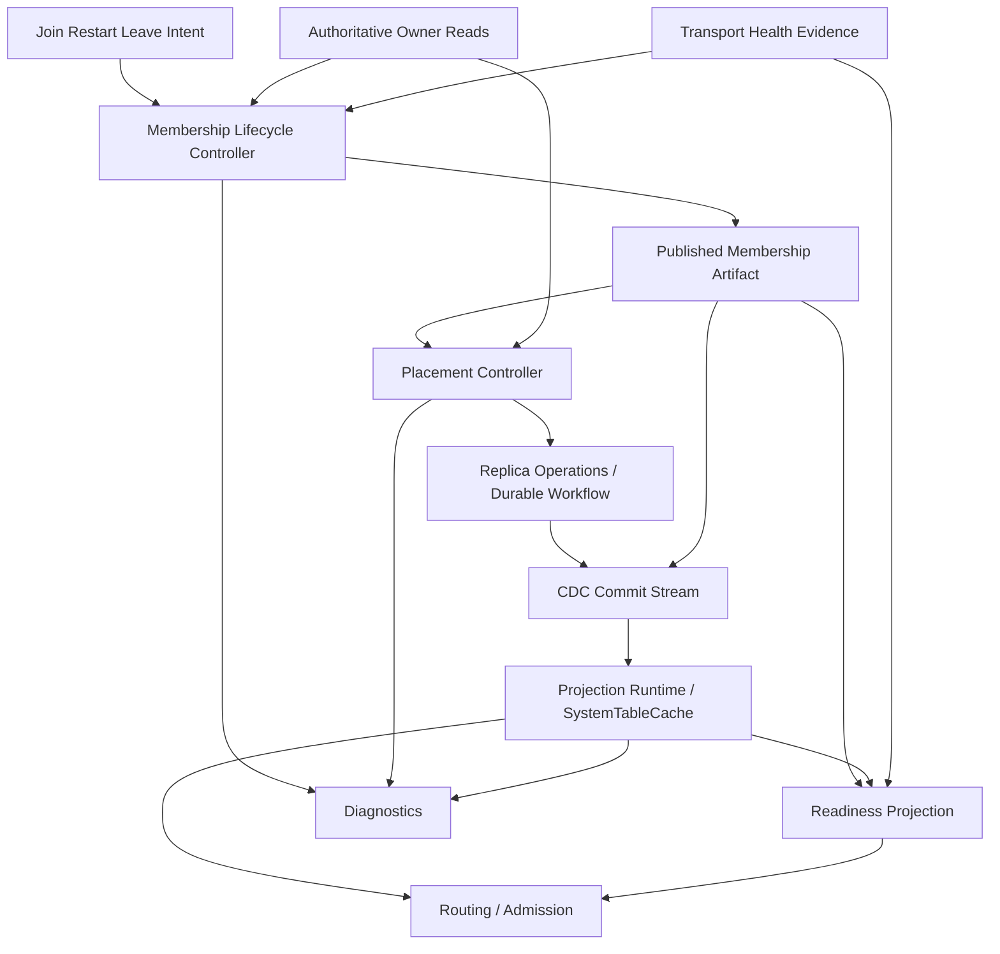

# Design Document: Membership Lifecycle And Placement Hard Cutover

## Overview

This design replaces the current porous control-plane boundary with a smaller,
deterministic architecture built around three owners and one projection:

1. `Membership_Lifecycle_Controller`
2. `Placement_Controller`
3. `Projection_Runtime`
4. `ControlPlaneReadinessService` as a derived read-only projection

The intent is not to add another framework. The repository already has the
right primitives:

1. `MembershipPublicationCoordinator`
2. `OwnerKeyReconcileQueue`
3. `DurableWorkflowCoordinator`
4. `RebalanceCoordinator`
5. `MovePlanner`
6. `SystemTableCache`
7. `ControlPlaneSystemTableGateway`

The issue is not missing machinery. The issue is that too many components still
participate in the same semantic workflow. This design narrows each concern to
one owner and explicitly demotes the rest to inputs, projections, or adapters.

## Design Reasoning

### Why A Hard Cutover Instead Of More Narrow Fixes

Recent restart work already closed two real bugs:

1. strict local metadata ingress was being dropped in the async selection path
2. priority rebalance budget reads were using background semantics

Both fixes were correct, both changed the distributed failure shape, and both
still left the scenario red. That is the signature of a porous boundary. The
boundary is wrong, not just one line of code.

The clustered symptoms all point to the same architectural mismatch:

1. lifecycle truth is partly publication, partly readiness, partly transport,
   partly bootstrap/join routing behavior
2. placement truth is partly published topology, partly readiness phase, partly
   pressure policy, partly runtime transport availability
3. metadata dissemination is partly projection and partly progression control

If another narrow fix is applied without changing those boundaries, a new late
failure mode will keep replacing the previous one.

### Why The Target Model Is Minimal

The minimal correct model is:

1. one machine decides who is in
2. one machine decides where replicas go
3. one runtime projects metadata changes locally
4. one projection explains readiness

Every extra owner above that is suspect unless it is just a thin adapter.

This model satisfies the doctrine directly:

1. one semantic owner per concern
2. one read ingress per semantic decision
3. one dissemination path for shared metadata
4. phase code hands off completely

## Goals

1. Make published membership the only active-set authority.
2. Model join, restart, and leave in one lifecycle owner.
3. Restrict placement to published membership, health, and authoritative
   replica state.
4. Make readiness read-only.
5. Make CDC and cache projection-only.
6. Remove phase-owned runtime progression semantics.
7. Replace mixed-source control decisions with explicit authoritative or
   projection read classes.
8. Remove all active legacy paths for the refactored concerns.

## Non-Goals

1. Preserve old and new lifecycle semantics side by side.
2. Introduce a parallel control-plane workflow framework.
3. Replace `SystemTableCache` as the steady-state read model.
4. Use longer timeouts as a substitute for ownership closure.
5. Solve unrelated placement, SQL, or service-runtime features outside this
   control-plane boundary.

## Decision Summary

| Decision ID | Decision |
| --- | --- |
| D1 | `MembershipPublicationCoordinator` evolves into the semantic center of the membership lifecycle owner rather than one signal among many. |
| D2 | Join, restart, and leave are modeled as lifecycle transitions of one durable member identity. |
| D3 | Published membership is the only authority for the canonical active-node set. |
| D4 | `UnifiedRebalancer` and `RebalanceCoordinator` consume published membership only and stop depending on phase-specific topology truth. |
| D5 | `ControlPlaneReadinessService` becomes read-only and stops owning repair side effects. |
| D6 | `SystemTableCache` and CDC remain the projection runtime and are forbidden from acting as a completion oracle. |
| D7 | `BootstrapService` and `NodeJoiningService` remain startup adapters only; they do not own steady-state membership truth. |
| D8 | Control-plane reads are reduced to one authoritative class and one projection class. |
| D9 | Hard cutover completion requires deletion of old runtime paths, not only introduction of new ones. |

## Target Architecture



## State Machines

### 1. Membership Lifecycle Machine

This is the semantic center of the design.

State model:

```text
ABSENT
  -> ADMITTED
  -> PROVISIONING
  -> CAUGHT_UP
  -> PUBLISH_PENDING
  -> PUBLISHED_ACTIVE
  -> DRAINING
  -> REMOVED
```

Restart is represented as:

```text
PUBLISHED_ACTIVE
  -> PROVISIONING
  -> CAUGHT_UP
  -> PUBLISH_PENDING
  -> PUBLISHED_ACTIVE
```

Key rules:

1. The member identity persists across restart.
2. The controller owns when a node becomes eligible for publication.
3. Publication is durable and epoch-bound.
4. No other component may promote a node to active outside published
   membership.

### 2. Placement Machine

This machine consumes the published membership epoch and authoritative replica
state. It never decides cluster membership.

State model:

```text
IDLE
  -> PLANNING
  -> RESERVED
  -> EXECUTING
  -> OBSERVING
  -> COMMITTED

any state -> INVALIDATED -> PLANNING
```

Key rules:

1. Every plan is bound to one published membership epoch.
2. Epoch change invalidates stale plans.
3. Priority control-plane spread is a first-class invariant.
4. Placement may slow under pressure, but it cannot switch to a second
   topology truth.

### 3. Projection Runtime

This machine is explicitly not a semantic owner of topology completion.

State model:

```text
EMPTY
  -> HYDRATED_SNAPSHOT
  -> REPLAYING
  -> CAUGHT_UP

CAUGHT_UP -> STALE -> REPAIRING -> CAUGHT_UP
```

Key rules:

1. Projection freshness is observable.
2. Projection lag is diagnosable.
3. Projection lag does not redefine membership or placement truth.

### 4. Readiness Projection

Readiness becomes a function, not a control loop.

It derives:

1. `repairEligible`
2. `serveEligible`
3. reason codes
4. freshness and disagreement diagnostics

It does not own:

1. lifecycle advancement
2. publication
3. placement completion
4. direct repair writes

## Ownership Map

| Concern | Target Owner | Allowed Inputs | Forbidden Inputs As Truth |
| --- | --- | --- | --- |
| Member lifecycle | Membership lifecycle controller | authoritative rows, transport health, durable checkpoints | cache visibility, phase completion, handler registration alone |
| Active-node set | published membership artifact | lifecycle controller output | cache rows, router connectivity, service rows |
| Desired placement | placement controller | published membership, health, authoritative replica state | bootstrap/join phase state, cache freshness as topology truth |
| Replica op progression | `RebalanceCoordinator` + durable workflow | placement decisions, explicit acknowledgements | cache timing, local executor memory alone |
| Readiness | `ControlPlaneReadinessService` | publication state, placement state, health, projection freshness | direct repair side effects |
| Projection | CDC + `SystemTableCache` | authoritative commits, bootstrap hydration | direct mutation outside canonical write path |

## Current-State Mapping

The target design is not a greenfield rewrite. It is a cutover of current
components into narrower roles.

| Current Component | Current Role | Target Role |
| --- | --- | --- |
| `MembershipPublicationCoordinator` | publication owner plus one signal in broader lifecycle | semantic center of membership lifecycle publication |
| `BootstrapService` | seed startup owner and partial lifecycle owner | startup adapter and runtime-owner composition root only |
| `NodeJoiningService` | join owner plus restart, ingress, hydration, readiness coordination | lifecycle intent ingress and phase runner only |
| `UnifiedRebalancer` | placement orchestration plus startup gating and special-case semantics | placement orchestration on published topology only |
| `RebalanceCoordinator` | durable operation owner | unchanged semantic owner, but consumes narrowed placement contract |
| `ControlPlaneReadinessService` | evaluator plus reconciliation and repair behavior | read-only readiness projection |
| `ControlPlaneSystemTableGateway` | mixed-source adapter compensating for boundary ambiguity | explicit projection read path and authoritative read path boundary |
| `SystemTableCache` | projection plus indirect progression influence | projection runtime only |
| message-group selection helpers | ingress/routing chooser participating in lifecycle completion | transport helper only; no lifecycle completion ownership |

## Current Design Defects To Remove

### 1. Lifecycle Truth Is Still Distributed

Today, membership-related progression depends on all of these in practice:

1. published membership
2. readiness dimensions
3. transport health
4. bootstrap/join phase completion
5. message-group ingress selection
6. cache freshness

That creates cycles where the same restart waits on metadata visibility, while
metadata visibility depends on the very runtime convergence the restart is
trying to complete.

### 2. Placement Still Consumes More Than Topology And Health

Priority spread currently intersects with:

1. startup traffic readiness
2. publication spread special cases
3. pressure-governed budget reads
4. router stability
5. cache visibility of operation state

The placement machine must be reduced to published topology plus health.

### 3. Readiness Is Too Powerful

The readiness service currently mixes:

1. diagnosis
2. cache-to-authoritative reconciliation
3. repair participation
4. traffic gating

This makes it impossible to reason about which owner advanced a system state.

### 4. Projection And Control Semantics Still Bleed Together

Strict local ingress, grouped CDC propagation, and bootstrap hydration are all
valid mechanisms. They become architectural problems only when lifecycle or
placement completion depends on them.

## Control-Plane Read Boundary

The future gateway contract is intentionally simple.

### Authoritative Read Path

Used for:

1. lifecycle decisions
2. publication derivation
3. placement planning and validation
4. workflow completion checks

Properties:

1. owner-routed
2. authoritative
3. explicit pressure semantics
4. no fallback to projection inside one semantic decision

### Projection Read Path

Used for:

1. local observation
2. steady-state routing convenience
3. diagnostics
4. subscriptions and watches

Properties:

1. local and cheap
2. freshness-visible
3. not a completion oracle

## Phase Ownership And Handoff

### Seed Bootstrap

`BootstrapService` remains responsible for:

1. bringing up node-local infrastructure
2. creating runtime owners
3. hydrating initial projection state
4. handing control to steady-state owners

It must stop owning:

1. steady-state lifecycle truth
2. steady-state placement semantics
3. phase-owned metadata dissemination bridges after handoff

### Join And Restart

`NodeJoiningService` remains responsible for:

1. contacting cluster ingress
2. obtaining the initial topology snapshot
3. bringing runtime owners online on the joining node
4. submitting lifecycle intent to the membership controller

It must stop owning:

1. final active-state truth
2. restart completion semantics
3. long-lived ingress-routing heuristics as lifecycle gates

## Migration Strategy

This refactor must proceed by delegation-first cutover followed by deletion.

### Phase 1: Lifecycle Authority Closure

1. define the full lifecycle state model
2. route join, restart, and leave intents through one owner
3. make publication the sole active-set output
4. convert all active-node consumers to publication

Exit gate:

1. no active runtime consumer derives cluster membership outside publication

### Phase 2: Placement Narrowing

1. bind placement plans to published membership epoch
2. remove startup-phase semantics from steady-state placement
3. elevate priority spread to an explicit invariant surface
4. make stale-plan invalidation explicit

Exit gate:

1. rebalance consumes only published membership, health, and authoritative
   replica state

### Phase 3: Readiness Demotion

1. move repair side effects out of readiness
2. leave readiness as pure projection
3. add explicit reason codes for disagreement and projection freshness

Exit gate:

1. readiness no longer advances lifecycle or repair state directly

### Phase 4: Projection Boundary Closure

1. classify control-plane reads as authoritative or projection
2. remove mixed-source control decisions
3. enforce that cache divergence only triggers owner-queue repair signals

Exit gate:

1. no semantic decision uses cache and authoritative fallback in one path

### Phase 5: Phase Handoff Closure

1. remove phase-owned runtime bridges that outlive phase completion
2. reduce bootstrap and join services to adapter/composition roles
3. prove runtime continuity after phase teardown

Exit gate:

1. phase completion leaves no unique live path required for steady-state
   control-plane correctness

### Phase 6: Deletion And Documentation Closure

1. remove old lifecycle progression branches
2. remove readiness-owned repair semantics
3. remove cache-as-proof control paths
4. update architecture and runbooks
5. verify deletion inventory

Exit gate:

1. no active runtime trace of the old design remains for the concerns covered
   by this spec

## Invariants

The following invariants define completion:

1. there is one published membership epoch and one published active-node set
2. restart re-entry is represented in the lifecycle owner, not inferred from
   startup heuristics
3. placement decisions are epoch-bound and invalidated on membership change
4. readiness is read-only
5. cache is observational, not proof of workflow completion
6. phase code hands off completely
7. transport can influence health but cannot redefine active membership

## Testing And Verification Strategy

### Deterministic Regressions

Required deterministic coverage:

1. publication is the only active-set authority
2. join, restart, and leave flow through one lifecycle owner
3. stale placement plans invalidate on published membership change
4. readiness does not perform repair writes
5. cache lag does not advance lifecycle or placement steps
6. phase teardown does not break runtime continuity

### Structural Guards

Required structural guards:

1. non-owner runtime code cannot import raw lifecycle mutation helpers
2. non-owner runtime code cannot treat cache and authoritative reads as one
   interchangeable control path
3. readiness code cannot own mutation helpers for lifecycle or placement

### Distributed Confirmation

Required harness confirmation:

1. rolling restart
2. node join under load
3. seed restart under load
4. transaction recovery under restart churn

Success means:

1. one published membership epoch cluster-wide
2. one published active-node set cluster-wide
3. priority control-plane partitions satisfy spread invariant
4. no late active-node disagreement remains

## Completion Criteria

This spec is complete only when all of the following are true:

1. the new ownership model is implemented
2. the old active runtime paths for the covered concerns are removed
3. deterministic tests lock in the new boundaries
4. distributed harness scenarios confirm the cutover under restart and join
   stress
5. architecture documentation no longer describes the old mixed-owner design

If any old path remains active as a fallback or alternate completion oracle,
the cutover is incomplete.