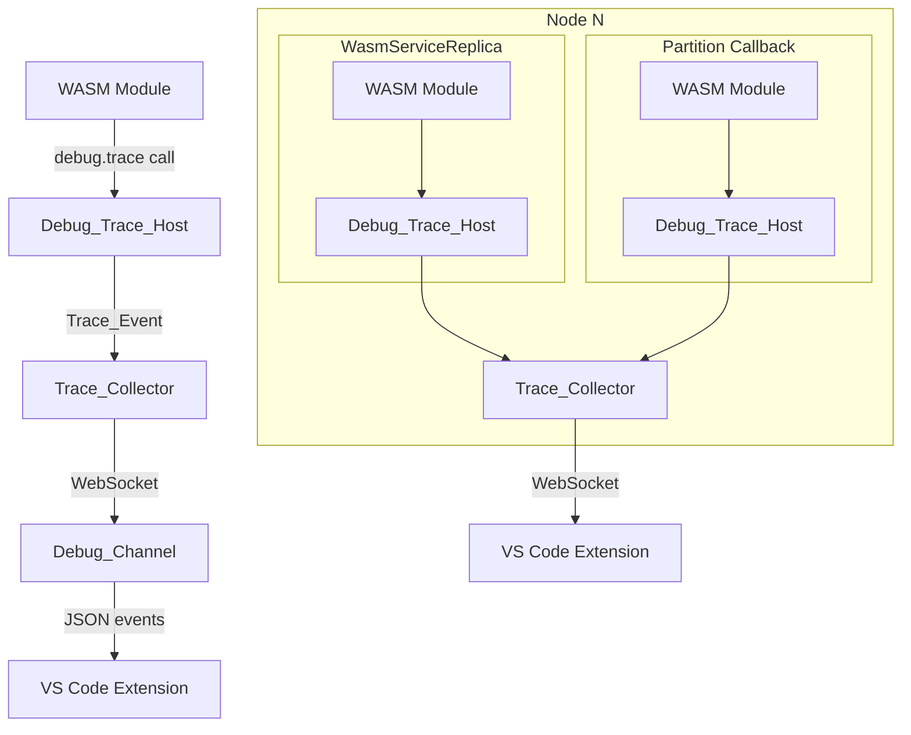
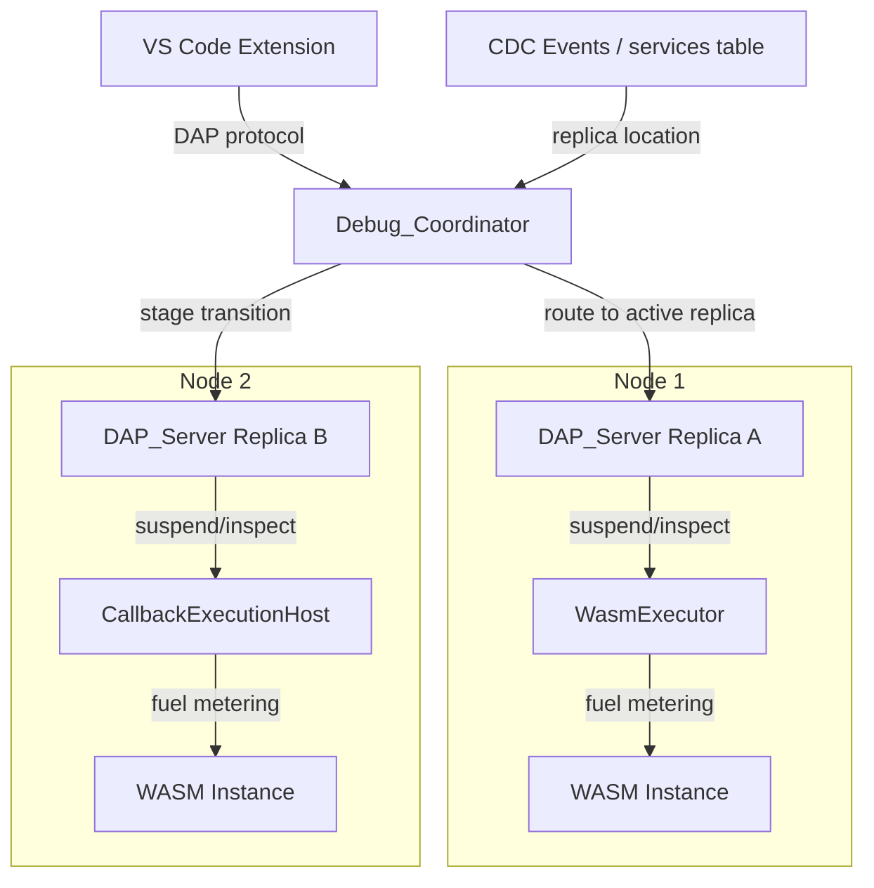
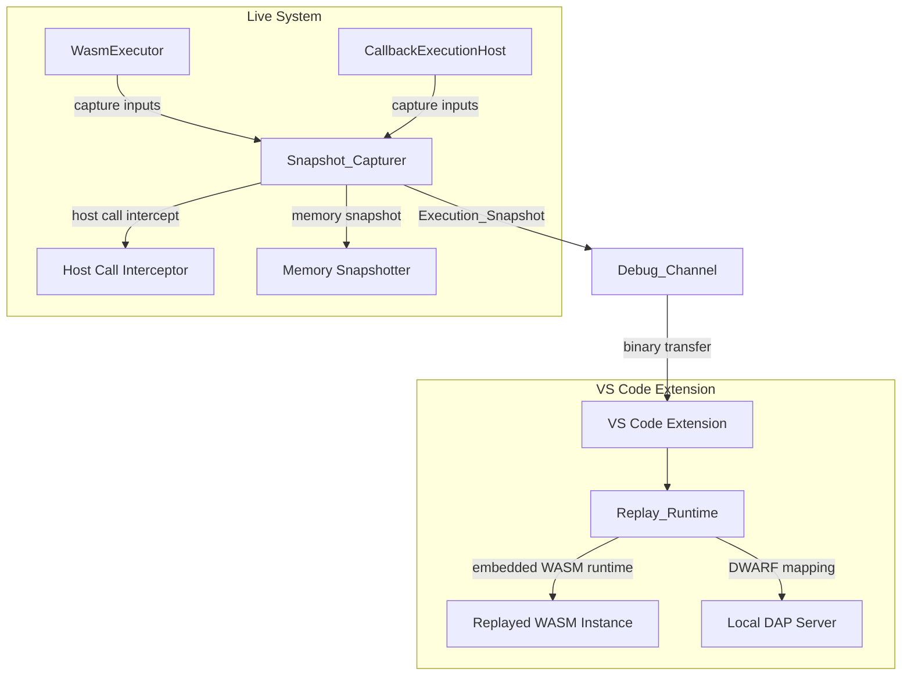

# Design Document: WASM Debugging

## Overview

This design adds debugging capabilities for WASM functions executing across the distributed database system. WASM functions run in two contexts: on WasmServiceReplica instances (via WasmExecutor) and on partition replicas during `ctx.call` callback stages (via CallbackExecutionHost). A single `ctx.call` chain can span multiple partition replicas across different nodes.

The feature is delivered in three phases, each building on the previous:

1. **Phase 1 — Structured Tracing**: A host-imported `debug.trace()` function that WASM modules call to emit structured diagnostic events. Events are correlated via existing lineage_id/stage_id tracking and forwarded to a VS Code extension over a WebSocket debug channel.

2. **Phase 2 — DAP Source-Level Debugging**: A Debug Adapter Protocol server per replica that enables breakpoints, stepping, and variable inspection using DWARF debug info. A distributed debug coordinator follows execution across nodes as callback stages move between replicas.

3. **Phase 3 — Snapshot + Replay Debugging**: Deterministic execution capture (inputs, host call results, memory snapshots) that can be replayed locally in the VS Code extension with full interactive debugging.

### Key Design Principles

- **Zero overhead when inactive**: Debug instrumentation is gated by capability declaration AND active debug session. No allocations, no function calls, no branching when debugging is off.
- **Single owner per concern**: Each debug component has exactly one owner. No parallel tracking, no duplicate state.
- **Reuse existing infrastructure**: Lineage tracking, CDC, MessageRouter, CapabilityPolicy, and the services system table are reused — not duplicated.
- **Constants, not literals**: All new strings and numbers go into dedicated constants files.

## Architecture

### Phase 1 Architecture (Structured Tracing)



### Phase 2 Architecture (DAP Debugging)



### Phase 3 Architecture (Snapshot + Replay)



## Components and Interfaces

### Debug Constants (`src/debug/debug-constants.js`)

Single source of truth for all debug-related constants. No magic strings or numbers anywhere in the debug subsystem.

```javascript
const DEBUG_CAPABILITY = Object.freeze({
  TRACE: 'debug.trace',
  BREAKPOINT: 'debug.breakpoint',
  SNAPSHOT: 'debug.snapshot',
});

const DEBUG_TRACE_LEVEL = Object.freeze({
  ERROR: 'error',
  WARN: 'warn',
  INFO: 'info',
  DEBUG: 'debug',
  TRACE: 'trace',
});

const DEBUG_TRACE_LEVEL_SET = new Set(
  Object.values(DEBUG_TRACE_LEVEL)
);

const DEBUG_SESSION_STATE = Object.freeze({
  ACTIVE: 'active',
  DETACHING: 'detaching',
  DETACHED: 'detached',
});

const DEBUG_CHANNEL_STATE = Object.freeze({
  CONNECTED: 'connected',
  DISCONNECTED: 'disconnected',
});

const DEBUG_SUBSYSTEM = Object.freeze({
  TRACE_HOST: 'debug-trace-host',
  TRACE_COLLECTOR: 'debug-trace-collector',
  DEBUG_SESSION: 'debug-session',
  DAP_SERVER: 'debug-dap-server',
  DEBUG_COORDINATOR: 'debug-coordinator',
  SNAPSHOT_CAPTURER: 'debug-snapshot-capturer',
  REPLAY_RUNTIME: 'debug-replay-runtime',
});

const DEBUG_ERROR_MSG = Object.freeze({
  INVALID_TRACE_LEVEL: 'Trace level must be one of: error, warn, info, debug, trace',
  SESSION_CAPABILITY_REQUIRED: 'Debug session requires declared capability',
  SESSION_NOT_FOUND: 'Debug session not found',
  DWARF_INFO_REQUIRED: 'Source-level debugging requires DWARF debug info',
  SNAPSHOT_NOT_ENABLED: 'Snapshot capture is not enabled for this execution',
  REPLAY_SNAPSHOT_INVALID: 'Execution snapshot is invalid or corrupted',
  MODULE_REF_REQUIRED: 'Module reference is required for debug session',
});

const DEBUG_LOG_MSG = Object.freeze({
  TRACE_EMITTED: 'Debug trace event emitted',
  TRACE_DISCARDED_NO_SESSION: 'Debug trace discarded: no active session',
  SESSION_ATTACHED: 'Debug session attached',
  SESSION_DETACHED: 'Debug session detached',
  CHANNEL_CONNECTED: 'Debug channel connected',
  CHANNEL_DISCONNECTED: 'Debug channel disconnected',
  DAP_SERVER_STARTED: 'DAP server started on replica',
  DAP_SERVER_STOPPED: 'DAP server stopped',
  COORDINATOR_STAGE_TRANSITION: 'Debug coordinator detected stage transition',
  SNAPSHOT_FRAME_CAPTURED: 'Execution snapshot frame captured',
  SNAPSHOT_COMPLETE: 'Execution snapshot capture complete',
});

const DEBUG_CHANNEL_PORT_DEFAULT = 9229;
const DEBUG_SNAPSHOT_MAX_MEMORY_BYTES = 67108864; // 64 MiB
const TRACE_EVENT_FIELD = Object.freeze({
  LEVEL: 'level',
  MESSAGE: 'message',
  CONTEXT: 'context',
  TIMESTAMP: 'timestamp',
  LINEAGE_ID: 'lineageId',
  STAGE_ID: 'stageId',
  PARTITION_ID: 'partitionId',
  NODE_ID: 'nodeId',
  SERVICE_DEFINITION_ID: 'serviceDefinitionId',
  REPLICA_ID: 'replicaId',
});
```

### Debug_Trace_Host (`src/debug/debug-trace-host.js`)

Implements the `debug.trace(level, message, context)` host import. Injected into WASM runtime only when the module declares `debug.trace` capability.

```javascript
class DebugTraceHost {
  constructor(options) {
    // options: { debugSession, lineageTracker, stageIndex,
    //            partitionId, nodeId, serviceDefinitionId, replicaId }
  }

  // The host-imported function called by WASM modules.
  // Returns immediately as no-op when session is inactive.
  trace(level, message, context) {
    // 1. Fast path: if no active session, return immediately (zero alloc)
    // 2. Validate level against DEBUG_TRACE_LEVEL_SET
    // 3. Build Trace_Event with lineage/stage/partition context
    // 4. Forward to Trace_Collector via debugSession.emitTrace()
  }
}
```

**Ownership**: Single owner of the `debug.trace` host import implementation. No other component creates trace events from WASM calls.

**Integration points**:
- Reads lineage_id from existing `LineageTracker` (no duplicate tracking)
- Reads stage_id from existing stage index (passed at construction)
- Forwards events to `DebugSession.emitTrace()` which delegates to `TraceCollector`

### Trace_Collector (`src/debug/trace-collector.js`)

Per-node singleton that receives Trace_Events from all local replicas and forwards to connected debug channels.

```javascript
class TraceCollector {
  constructor(options) {
    // options: { nodeId, port }
  }

  // Called by DebugTraceHost instances on this node
  emit(traceEvent) {
    // 1. If no connected channels, discard (no buffering)
    // 2. For each connected channel, check lineage filter
    // 3. Forward matching events as JSON
  }

  // Start WebSocket server for debug channel connections
  startServer(port) { }

  // Stop server and disconnect all channels
  stopServer() { }
}
```

**Ownership**: Single owner of trace event forwarding on a node. No other component forwards trace events to external clients.

### Debug_Session (`src/debug/debug-session.js`)

Stateful object attached to a WasmExecutor or CallbackExecutionHost instance.

```javascript
class DebugSession {
  constructor(options) {
    // options: { sessionId, serviceDefinitionId, lineageId,
    //            requiredCapabilities, traceCollector }
  }

  // Check if session is active (fast boolean check)
  isActive() { }

  // Forward trace event to collector
  emitTrace(traceEvent) { }

  // Attach to executor (sets debug hooks)
  attach(executor) { }

  // Detach from executor (removes all debug state)
  detach() { }

  // Gate check: does the module have the required capability?
  static validateCapabilities(manifest, requiredCapabilities) { }
}
```

**Ownership**: Single owner of debug state for a specific execution context. One DebugSession per active debug attachment.

### DAP_Server (`src/debug/dap-server.js`) — Phase 2

Per-replica DAP server that implements the Debug Adapter Protocol.

```javascript
class DapServer {
  constructor(options) {
    // options: { replicaId, nodeId, debugSession, dwarfInfo }
  }

  // DAP request handlers
  handleSetBreakpoints(args) { }
  handleContinue(args) { }
  handleNext(args) { }
  handleStepIn(args) { }
  handleStepOut(args) { }
  handleThreads(args) { }
  handleStackTrace(args) { }
  handleScopes(args) { }
  handleVariables(args) { }

  // Translate source location to WASM instruction offset
  sourceToOffset(source, line, column) { }

  // Suspend WASM execution at breakpoint
  suspendExecution(instructionOffset) { }

  // Read WASM linear memory and locals
  inspectMemory(address, length) { }
  inspectLocals(frameIndex) { }

  start(port) { }
  stop() { }
}
```

### Debug_Coordinator (`src/debug/debug-coordinator.js`) — Phase 2

Tracks execution across nodes for distributed ctx.call chains.

```javascript
class DebugCoordinator {
  constructor(options) {
    // options: { systemTableCache, messageRouter }
  }

  // Track active stage for a lineage_id
  trackStageTransition(lineageId, stageId, replicaId, nodeId) { }

  // Get current DAP server endpoint for a lineage_id
  getCurrentEndpoint(lineageId) { }

  // Notify VS Code extension of stage transition
  notifyStageTransition(lineageId, newEndpoint) { }
}
```

**Ownership**: Single owner of distributed debug routing. Uses existing CDC events and services table for replica discovery — no parallel discovery mechanism.

### Snapshot_Capturer (`src/debug/snapshot-capturer.js`) — Phase 3

Captures deterministic execution traces for replay.

```javascript
class SnapshotCapturer {
  constructor(options) {
    // options: { lineageId, stageId, maxMemoryBytes }
  }

  // Capture function inputs at stage start
  captureInputs(partitionId, rows, context) { }

  // Intercept and record host call result
  captureHostCallResult(callType, args, result) { }

  // Capture WASM linear memory at stage boundary
  captureMemorySnapshot(wasmInstance) { }

  // Finalize and serialize the snapshot
  finalize() { }
}
```

### Integration with Existing Components

#### WasmExecutor Integration

The existing `WasmExecutor.execute()` method gains an optional `debugSession` parameter. When present and active:
- `DebugTraceHost` is injected as a host import
- For Phase 2: fuel metering is enabled for breakpoint support
- For Phase 3: `SnapshotCapturer` wraps host calls

When `debugSession` is null or inactive, the execution path is identical to today — zero overhead.

#### CallbackExecutionHost Integration

The existing `CallbackExecutionHost._executeBatch()` method gains awareness of debug sessions. When a debug session is active for the current lineage_id:
- `DebugTraceHost` is constructed with the batch's partition context
- For Phase 2: the DAP_Server is started/attached for the batch execution
- For Phase 3: `SnapshotCapturer` captures per-batch state

The existing `onTelemetry` callback pattern is reused for debug event emission — no new event system.

#### CapabilityPolicy Integration

The existing `enforceCapabilityPolicy()` and `buildCapabilityImports()` functions in `src/wasm-service/capability-policy.js` already support arbitrary capability strings. The new `debug.trace`, `debug.breakpoint`, and `debug.snapshot` capabilities are simply new values in the capabilities array — no changes to the policy enforcement logic itself.

## Data Models

### Trace_Event

```javascript
{
  level: string,              // One of DEBUG_TRACE_LEVEL values
  message: string,            // Developer-provided message
  context: object | null,     // Optional structured context from WASM module
  timestamp: number,          // Date.now() at capture time
  lineageId: string | null,   // From LineageTracker (null for service-only traces)
  stageId: number | null,     // Stage index within ctx.call chain
  partitionId: string | null, // Partition ID (null for service replicas)
  nodeId: string,             // Node hosting the replica
  serviceDefinitionId: string,// Service definition ID
  replicaId: string,          // Replica ID
}
```

### Debug_Session Record (system table row)

```javascript
{
  session_id: string,              // Unique session identifier
  service_definition_id: string,   // Target service
  lineage_id: string | null,       // Optional: scope to specific ctx.call chain
  capabilities: string[],          // Required debug capabilities
  state: string,                   // One of DEBUG_SESSION_STATE values
  node_id: string,                 // Node where session is active
  replica_id: string,              // Replica where session is attached
  created_at: string,              // ISO timestamp
  updated_at: string,              // ISO timestamp
}
```

### Execution_Snapshot

```javascript
{
  snapshotId: string,              // Unique snapshot identifier
  lineageId: string,               // Lineage ID of the captured execution
  moduleRef: string,               // Module reference (for replay loading)
  frames: [                        // Ordered list of captured frames
    {
      stageId: number,             // Stage index
      partitionId: string,         // Partition ID
      nodeId: string,              // Node ID
      timestamp: number,           // Capture timestamp
      inputs: {                    // Function inputs
        rows: Array,               // Input rows for this stage
        context: object,           // Execution context snapshot
      },
      hostCalls: [                 // Ordered host call recordings
        {
          callType: string,        // e.g. 'lookup', 'emit', 'kv.get'
          args: object,            // Call arguments
          result: object,          // Call return value
        }
      ],
      memoryBefore: ArrayBuffer | null,  // Linear memory before execution
      memoryAfter: ArrayBuffer | null,   // Linear memory after execution
    }
  ],
}
```

### Debug Channel Message Protocol

Messages between Trace_Collector/DAP_Server and VS Code extension:

```javascript
// Trace event message (Phase 1)
{ type: 'trace', event: TraceEvent }

// Session lifecycle messages
{ type: 'sessionAttached', sessionId, serviceDefinitionId, replicaId }
{ type: 'sessionDetached', sessionId }

// Stage transition notification (Phase 2)
{ type: 'stageTransition', lineageId, stageId, nodeId, replicaId, dapPort }

// Snapshot transfer (Phase 3)
{ type: 'snapshot', snapshotId, data: ArrayBuffer }
```


## Correctness Properties

*A property is a characteristic or behavior that should hold true across all valid executions of a system — essentially, a formal statement about what the system should do. Properties serve as the bridge between human-readable specifications and machine-verifiable correctness guarantees.*

### Property 1: Debug capability policy enforcement

*For any* debug capability string (`debug.trace`, `debug.breakpoint`, `debug.snapshot`), any module manifest, and any capability policy, the capability is allowed if and only if it appears in both the manifest's capabilities array and the policy's allowlist.

**Validates: Requirements 1.1, 1.2, 1.3, 1.4**

### Property 2: Trace event field completeness

*For any* valid trace call (valid level, arbitrary message, arbitrary context) with an active debug session, the resulting Trace_Event SHALL contain all required fields (level, message, context, timestamp, lineage_id, stage_id, partition_id, node_id, service_definition_id, replica_id) and the level, message, and context fields SHALL match the input values.

**Validates: Requirements 2.1, 2.3**

### Property 3: Trace level validation

*For any* string value, calling `debug.trace(level, message, context)` succeeds if and only if the level string is a member of the valid trace level set (`error`, `warn`, `info`, `debug`, `trace`). Invalid levels produce a descriptive error.

**Validates: Requirements 2.4, 2.5**

### Property 4: No-session trace discard

*For any* trace call when no debug session is active, the Debug_Trace_Host SHALL produce zero Trace_Events and the Trace_Collector SHALL receive nothing.

**Validates: Requirements 2.2, 9.4**

### Property 5: Trace event ordering preservation

*For any* sequence of Trace_Events emitted by a single replica, the order in which they are received by a connected Debug_Channel SHALL match the emission order.

**Validates: Requirement 3.2**

### Property 6: No-channel discard without buffering

*For any* number of Trace_Events emitted when no Debug_Channel is connected, the Trace_Collector SHALL hold zero buffered events. Connecting a channel after events were emitted SHALL result in zero retroactive events.

**Validates: Requirement 3.3**

### Property 7: Lineage filter forwarding

*For any* set of Trace_Events with various lineage_ids and any lineage_id prefix filter on a connected Debug_Channel, only events whose lineage_id starts with the filter prefix SHALL be forwarded to that channel.

**Validates: Requirement 3.5**

### Property 8: Trace event JSON round-trip

*For any* valid Trace_Event, serializing it to JSON and parsing the JSON back SHALL produce an object with identical field values.

**Validates: Requirement 3.6**

### Property 9: Session attach/detach round-trip

*For any* debug session that is attached to an executor and then detached, the executor SHALL have no remaining debug state — equivalent to its state before attachment.

**Validates: Requirement 4.3**

### Property 10: Session capability gating

*For any* combination of requested debug capabilities and module-declared capabilities, a debug session SHALL be allowed if and only if every requested capability is present in the module's declared capabilities. Missing capabilities produce a descriptive error.

**Validates: Requirements 4.4, 4.5**

### Property 11: DWARF source-to-offset mapping (Phase 2)

*For any* valid source location that exists in the DWARF debug info, translating the source location to a WASM instruction offset and then mapping that offset back to a source location SHALL produce the original source location (or the nearest enclosing statement).

**Validates: Requirement 5.3**

### Property 12: Stage transition tracking (Phase 2)

*For any* sequence of stage transitions in a ctx.call chain, the Debug_Coordinator SHALL always report the most recently registered replica and node for a given lineage_id, and each transition to a different replica SHALL produce a notification containing the correct node address, replica_id, and DAP_Server port.

**Validates: Requirements 6.1, 6.2, 6.3**

### Property 13: Snapshot completeness (Phase 3)

*For any* execution with snapshot mode enabled that executes N stages with M total host calls, the resulting Execution_Snapshot SHALL contain exactly N frames, each with inputs, memory snapshots (before and after), and the correct count of host call records, plus lineage_id, stage_id, partition_id, node_id, and timestamp metadata.

**Validates: Requirements 7.1, 7.2, 7.3, 7.4**

### Property 14: Snapshot serialization round-trip (Phase 3)

*For any* valid Execution_Snapshot, serializing to the binary transfer format and deserializing back SHALL produce an equivalent Execution_Snapshot with identical frame data.

**Validates: Requirement 7.5**

### Property 15: Snapshot replay determinism (Phase 3)

*For any* valid Execution_Snapshot, serializing the snapshot twice SHALL produce byte-identical output.

**Validates: Requirement 8.4**

### Property 16: Debug import injection gating

*For any* combination of module capability declaration and debug session state, the `debug.trace` host import SHALL be injected into the WASM runtime if and only if the module declares `debug.trace` capability AND a debug session is active.

**Validates: Requirement 9.3**

## Error Handling

### Trace Errors

- Invalid trace level: `DebugTraceHost.trace()` throws with `DEBUG_ERROR_MSG.INVALID_TRACE_LEVEL`. The WASM module receives the error through the host import trap mechanism.
- Trace collector unavailable: `DebugTraceHost` silently discards the event (same behavior as no active session). No error propagated to WASM module — tracing is best-effort.

### Session Errors

- Missing capability: `DebugSession.validateCapabilities()` throws with `DEBUG_ERROR_MSG.SESSION_CAPABILITY_REQUIRED` listing the missing capabilities.
- Session not found: Operations on a non-existent session return `DEBUG_ERROR_MSG.SESSION_NOT_FOUND`.
- Module ref required: Session creation without a module reference throws `DEBUG_ERROR_MSG.MODULE_REF_REQUIRED`.

### DAP Errors (Phase 2)

- Missing DWARF info: `DapServer` returns a DAP error response with `DEBUG_ERROR_MSG.DWARF_INFO_REQUIRED` when source-level operations are attempted without debug info.
- Breakpoint in unmapped code: DAP `setBreakpoints` response marks the breakpoint as unverified with a reason message.

### Snapshot Errors (Phase 3)

- Snapshot not enabled: Attempting to capture when snapshot mode is off throws `DEBUG_ERROR_MSG.SNAPSHOT_NOT_ENABLED`.
- Memory limit exceeded: If linear memory exceeds `DEBUG_SNAPSHOT_MAX_MEMORY_BYTES`, the snapshot capturer skips the memory frame and logs a warning.
- Invalid snapshot: Deserializing a corrupted snapshot throws `DEBUG_ERROR_MSG.REPLAY_SNAPSHOT_INVALID`.

### General Principles

- Errors in debug subsystems MUST NOT crash or affect the WASM execution they are observing (except for explicit breakpoint suspension in Phase 2).
- All errors are logged via the existing `LoggingService` with the appropriate `DEBUG_SUBSYSTEM` identifier.
- No try/catch for control flow. Caught errors are re-thrown or logged per system guidelines.

## Testing Strategy

### Property-Based Testing

Property-based tests use `fast-check` with `{numRuns: 10}` per workspace testing guidelines. Each property test references its design document property number.

**Phase 1 Properties (Structured Tracing)**:
- Property 1: Generate random manifests and policies, verify capability enforcement matches set membership
- Property 2: Generate random (level, message, context) tuples with active session, verify all Trace_Event fields
- Property 3: Generate random strings, verify trace succeeds iff string is in valid level set
- Property 4: Generate random trace calls with no session, verify zero events emitted
- Property 5: Generate random event sequences from one replica, verify ordering preserved at channel
- Property 6: Generate random event counts with no channel, verify zero buffered
- Property 7: Generate random events with various lineage_ids and random prefix filters, verify filtering
- Property 8: Generate random Trace_Events, verify JSON serialize/deserialize round-trip
- Property 9: Attach then detach session, verify executor state restored
- Property 10: Generate random capability sets (requested vs declared), verify gating logic
- Property 16: Generate random (capability declared, session active) boolean pairs, verify injection decision

**Phase 2 Properties (DAP Debugging)**:
- Property 11: Generate valid source locations from DWARF info, verify round-trip mapping
- Property 12: Generate random stage transition sequences, verify coordinator tracking and notifications

**Phase 3 Properties (Snapshot + Replay)**:
- Property 13: Generate random execution traces with varying stage/host-call counts, verify snapshot completeness
- Property 14: Generate random snapshots, verify binary serialization round-trip
- Property 15: Serialize same snapshot twice, verify byte-identical output

### Unit Testing

Unit tests complement property tests for specific examples and edge cases:

- DebugTraceHost: test with null context, empty message, maximum-length message
- TraceCollector: test multiple simultaneous channels, channel disconnect during forwarding
- DebugSession: test double-attach, double-detach, attach to already-debugging executor
- DapServer: test each DAP request type with mock WASM instance
- SnapshotCapturer: test empty execution (zero stages), single-stage execution
- Debug constants: verify all constant values are frozen and no duplicates exist

### Test Organization

- All debug tests under `test/debug/` directory
- Property tests tagged with: `Feature: wasm-debugging, Property N: {property_text}`
- Tests must complete in under 2 seconds per workspace guidelines
- No skipped tests, no `eslint-disable` comments
