# Lagrange — Advanced Architecture Diagrams

This document extends the core diagram pack with the diagrams that are usually
most helpful when explaining a distributed database and compute-near-data
system to developers, contributors, and potential users.

These diagrams are written in **Mermaid**, so GitHub should render them
directly in the repository.

---

# 1. Partition Lifecycle

This shows how a table partition can move through its normal operational
lifecycle as load and data distribution change.

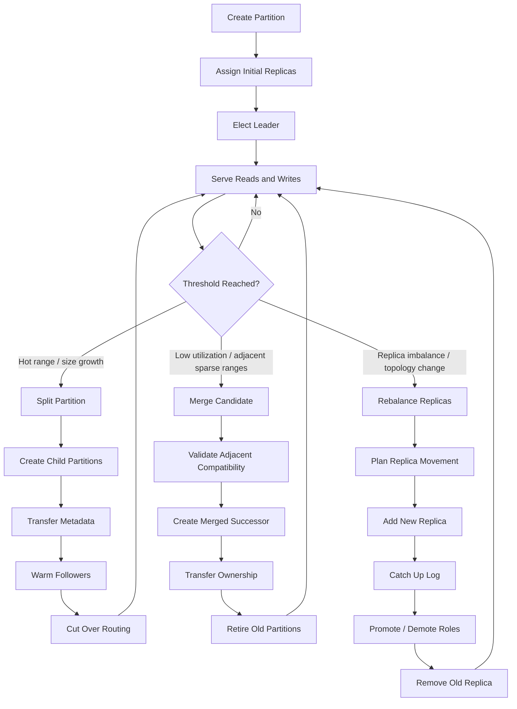

### What this communicates

- Partitions are not static; they adapt to workload and topology.
- Split, merge, and rebalance are explicit control-plane operations.
- Routing changes only after the new state is ready.

---

# 2. Partition Split Flow

This version focuses specifically on split mechanics.

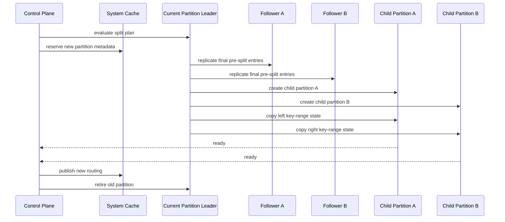

---

# 3. Distributed Execution Pipeline

This diagram shows the most important "developer mental model" for the runtime:
query selection, local execution, optional shuffle, and reduction.

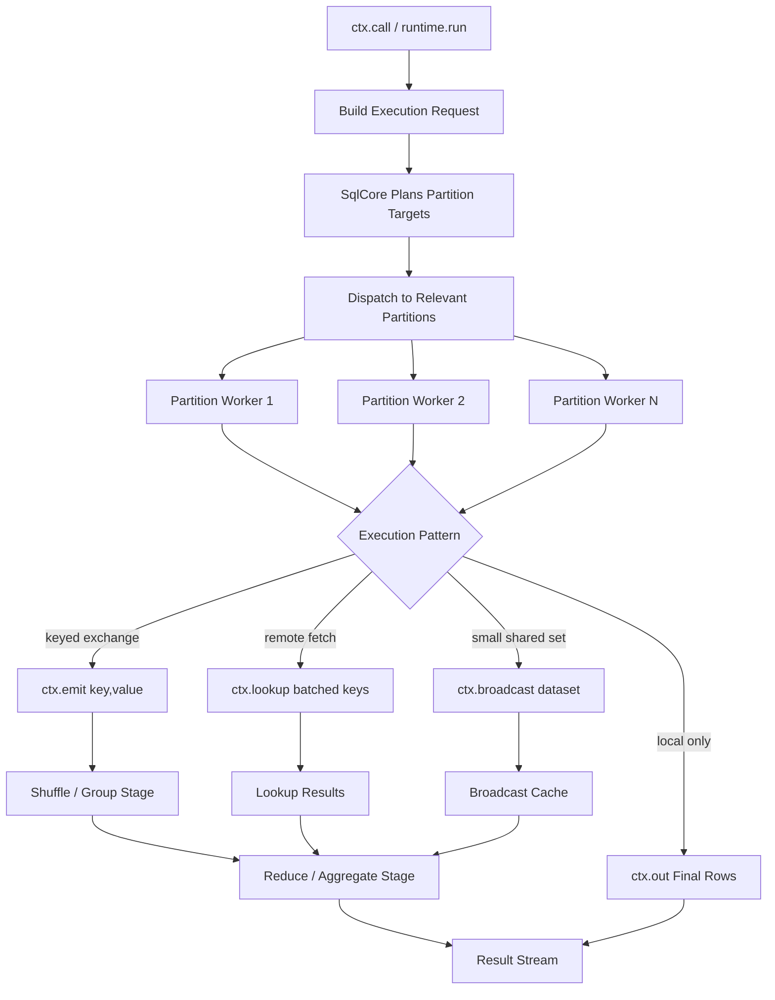

### What this communicates

- `ctx.call(...)` is the entry point, but the real behavior depends on plan shape.
- Exchange, lookup, and broadcast are first-class movement primitives.
- Reduce happens after local work, not before.

---

# 4. Stage Execution with Shuffle

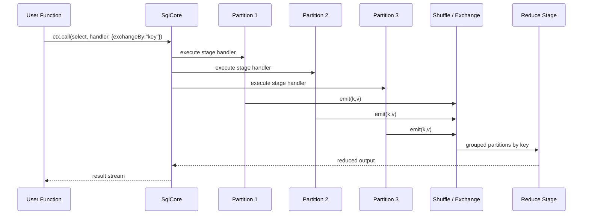

---

# 5. Query Routing and Metadata Resolution

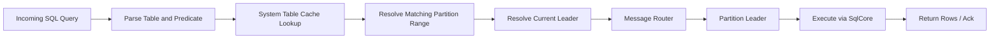

---

# 6. Bootstrap Process

This is one of the most useful diagrams for contributors, because it explains
how the system avoids the "empty metadata" problem during cluster formation.

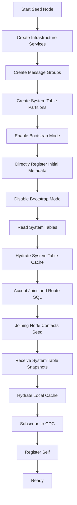

---

# 7. Seed Node Bootstrap Sequence

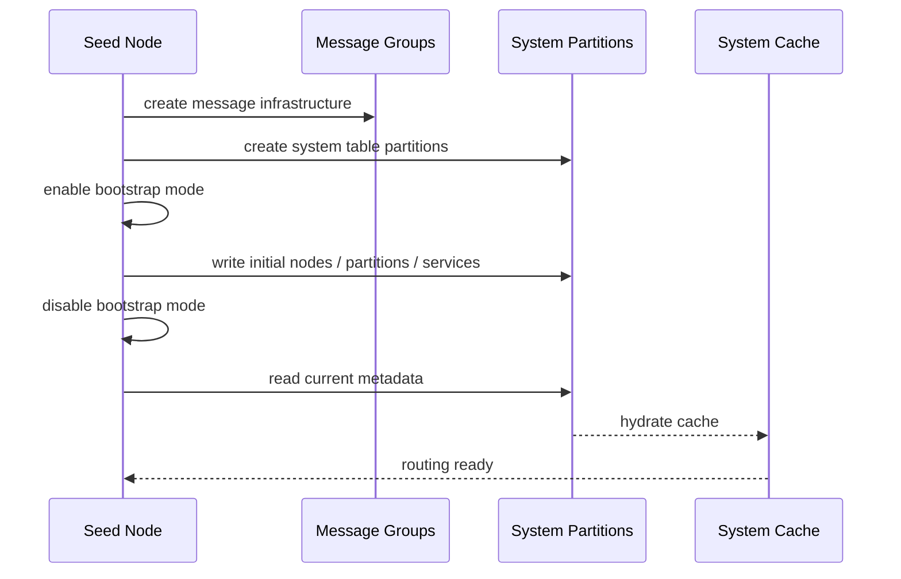

---

# 8. Joining Node Bootstrap Sequence

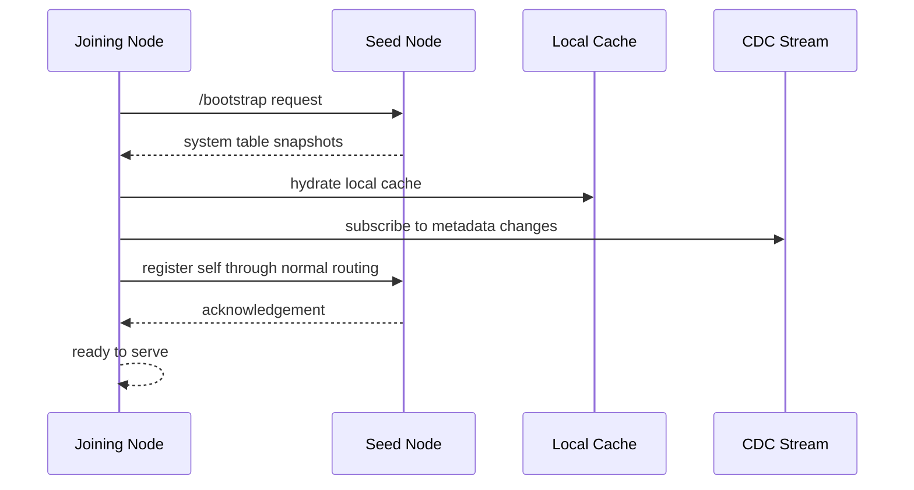

---

# 9. Metadata Propagation by CDC

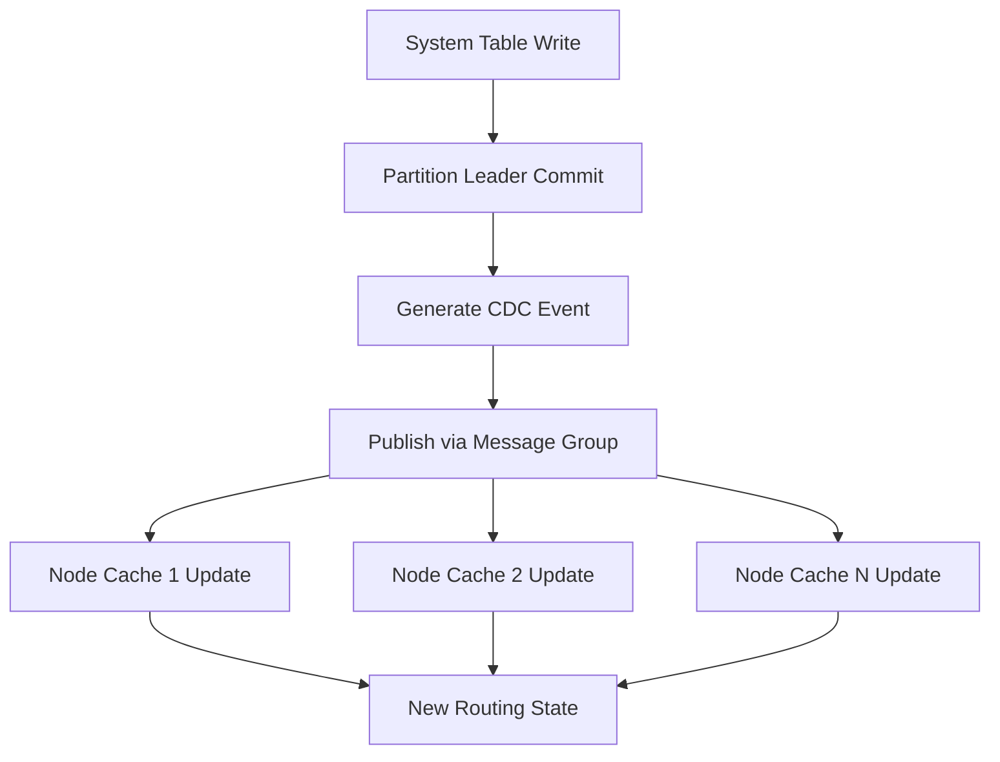

---

# 10. WASM Module Activation

This is helpful for explaining why the WASM runtime is safe and controlled.

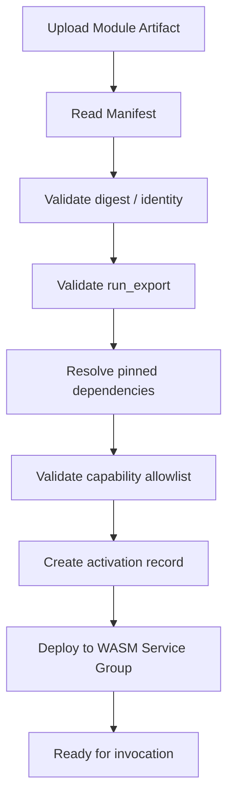

---

# 11. WASM Service Group Replication

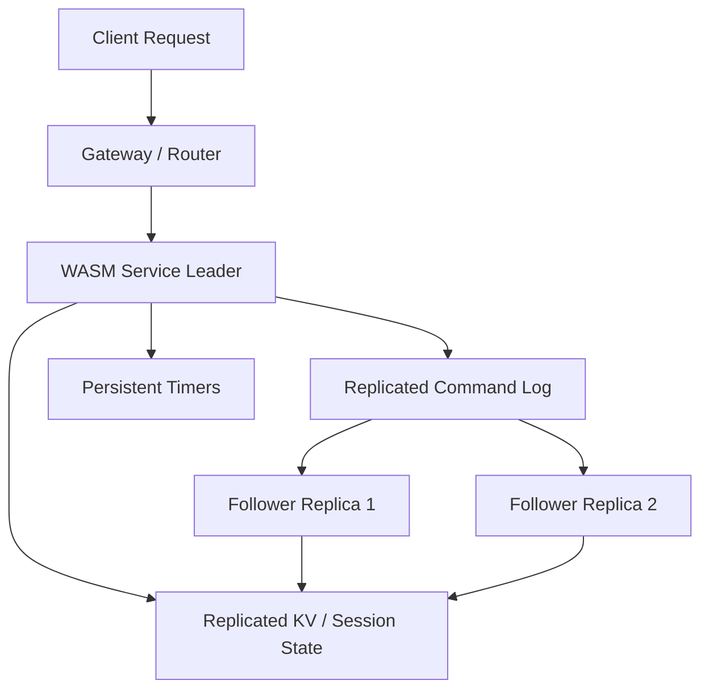

---

# 12. Suggested Repo Layout

```text
architecture/
  lagrange_architecture_diagrams.md
  lagrange_advanced_architecture_diagrams.md
```

---

# 13. Best Use Order for Documentation

For best comprehension, link the diagrams in this order:

1. High-level architecture
2. Compute-near-data model
3. Query routing
4. Distributed execution pipeline
5. Partition lifecycle
6. Bootstrap process
7. WASM activation / service groups

That gives new readers the shortest path from **"what is this?"** to
**"I understand how this works."**
