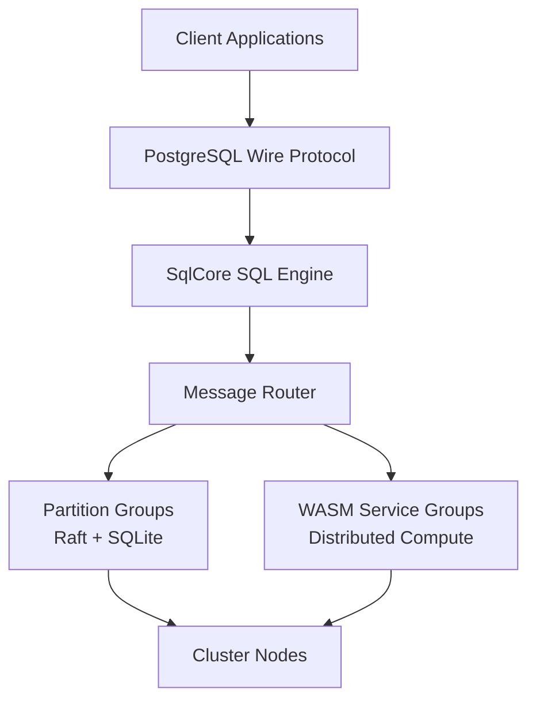
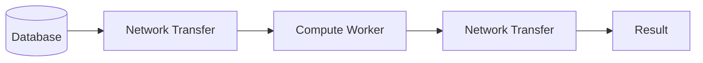
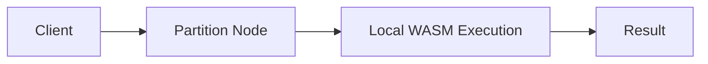
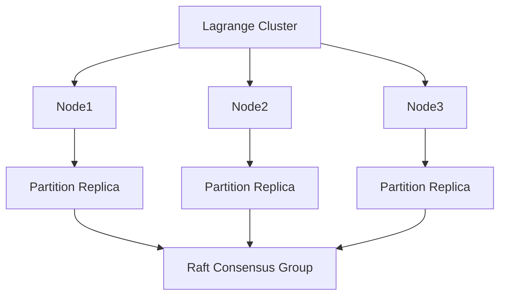
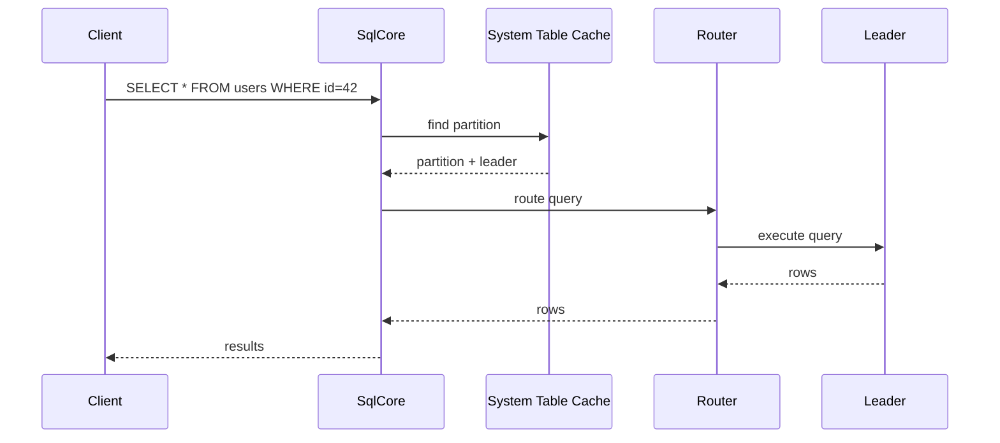
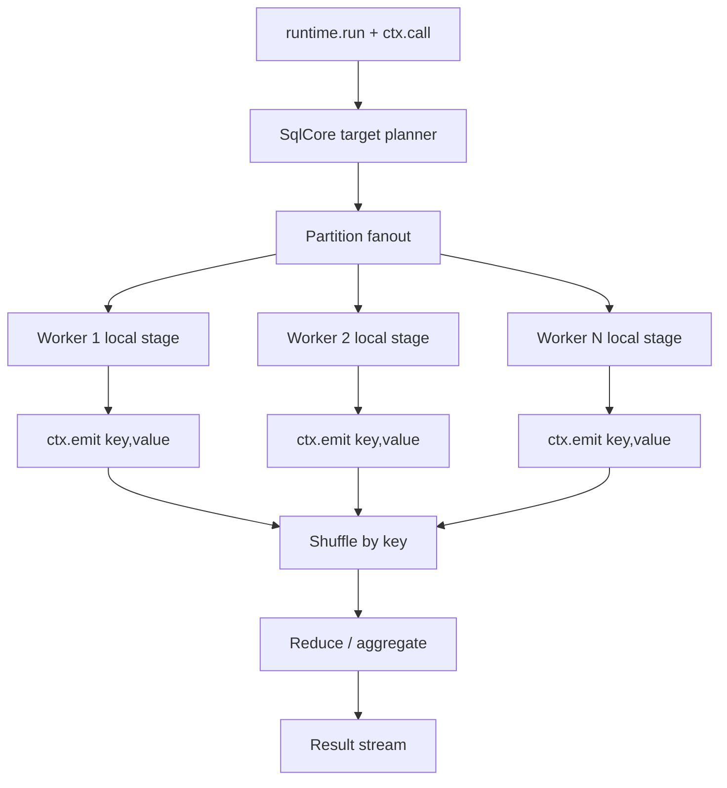
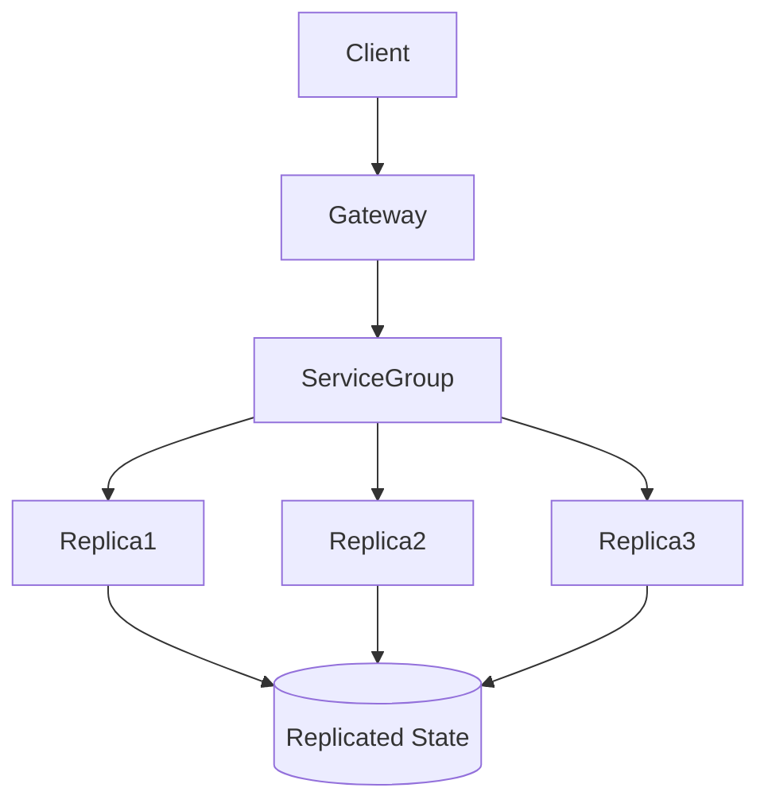
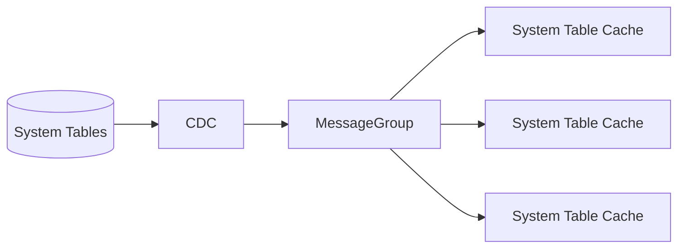
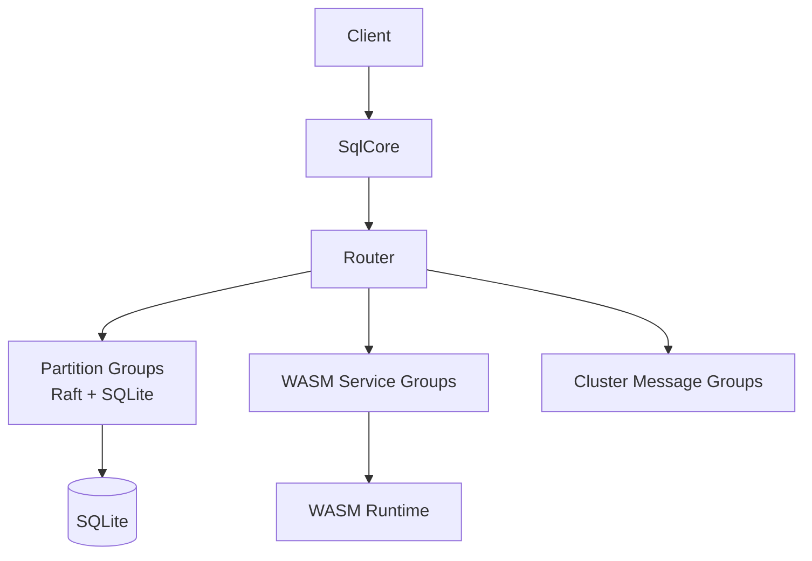

# Lagrange Architecture Diagrams

This document contains diagrams explaining the core concepts of the
Lagrange distributed database and execution platform.

GitHub supports **Mermaid diagrams**, so these will render automatically
when viewed in the repository.

------------------------------------------------------------------------

# 1. High Level Architecture

------------------------------------------------------------------------

# 2. Compute-Near-Data Model

Traditional distributed systems move data to compute.

Lagrange moves compute to the data.

------------------------------------------------------------------------

# 3. Cluster Structure

Each table is divided into partitions and replicated across nodes.

------------------------------------------------------------------------

# 4. Query Routing

------------------------------------------------------------------------

# 5. Distributed Execution

------------------------------------------------------------------------

# 6. WASM Service Groups

Services run inside replicated Raft groups.

------------------------------------------------------------------------

# 7. System Metadata Flow

Metadata changes propagate through CDC events.

------------------------------------------------------------------------

# 8. Full System Overview

------------------------------------------------------------------------

# Usage

You can reference these diagrams from the README:

    See architecture/lagrange_architecture_diagrams.md for system diagrams.

Or embed them directly into documentation pages.
