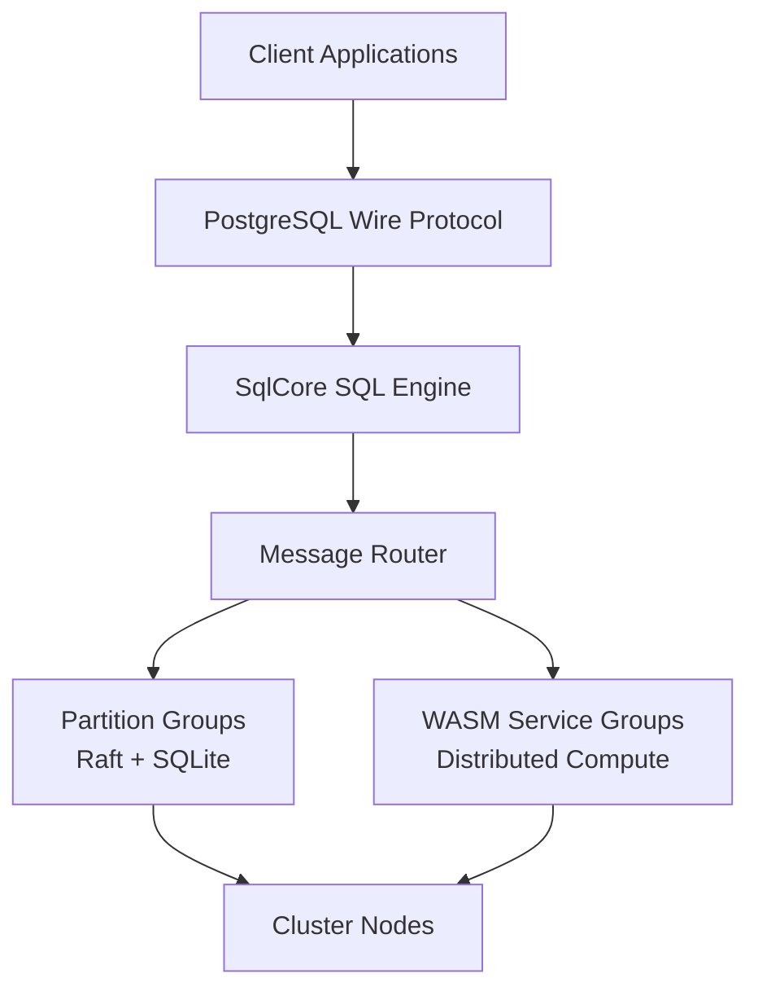

# Lagrange

### Distributed SQL + Compute-Near-Data Runtime

Lagrange is an experimental distributed database that **combines storage
and execution in one system**.

Instead of building architectures around databases, job systems, queues,
stream processors, and serverless platforms, Lagrange explores a different
model:

> **Run compute directly on the nodes that store the data.**

Queries and distributed functions execute on the partitions that own the
data, dramatically reducing network traffic and coordination overhead.

---

## The Problem

Distributed systems typically shuffle data across the network just to
process it:

    app -> fetch rows from DB -> send to worker -> process -> write back

Every hop adds latency, failure modes, and infrastructure to manage.

Lagrange skips the shuffle. Your code runs on the nodes that already hold
the data — no extra hops, no separate worker fleet, no glue between
storage and compute.

---

## Quick Example

```javascript
runtime.run(async (ctx) => {
  for await (const row of ctx.call("SELECT * FROM users")) {
    ctx.out(row);
  }
});
```

The system automatically:

1. Finds the partitions containing `users`
2. Executes the function on those nodes
3. Streams results back

No distributed orchestration required by the developer.

---

## How It Works

1. SQL or runtime calls enter through a single execution engine (`SqlCore`)
2. Metadata routing resolves the relevant partitions
3. Work is dispatched to the nodes that own the data
4. Optional primitives (`lookup`, `emit`, `broadcast`) move only the data
   that must move
5. Results stream back to the caller

---

## Architecture at a Glance

Lagrange combines three core replicated building blocks:

- **Partition Groups** — table storage (Raft + SQLite)
- **Message Groups** — cluster communication
- **WASM Service Groups** — distributed compute



Each node contains:

- SQL engine (`SqlCore`)
- Message router
- Worker thread pool
- System metadata cache (CDC-fed)

See [architecture/lagrange_architecture_diagrams.md](architecture/lagrange_architecture_diagrams.md)
and [architecture/lagrange_advanced_architecture_diagrams.md](architecture/lagrange_advanced_architecture_diagrams.md)
for the full diagram collection.

---

## Core Capabilities

### Distributed SQL Database

Tables automatically partition, replicate via Raft, and elect leaders for
writes. Each partition is a Raft consensus group storing data in SQLite,
giving strong consistency, automatic failover, and horizontal scaling.

### One SQL Engine

All SQL flows through a single execution engine (`SqlCore`), regardless of
entry point: PostgreSQL client, internal system query, or distributed runtime
call. Every request becomes a canonical `SqlRequest` — one planner, one
optimizer, one execution path.

### Distributed Compute Runtime

Code executes across partitions using a small set of distributed primitives:

| Primitive | Usage | Purpose |
|-----------|-------|---------|
| `ctx.lookup(table, keys[])` | Batched fetch | Efficient reads from other partitions |
| `ctx.emit(key, value)` | Shuffle | Redistribute intermediate data |
| `ctx.broadcast(ref, dataset)` | Replicate | Share small datasets to all nodes |

### WASM Execution

Distributed functions run as WebAssembly modules: language-agnostic,
sandboxed, deterministic, and portable. Each module declares its entry
function, dependency digests, and capability requirements.

---

## Comparison

| Capability | Lagrange | CockroachDB | Spark | Serverless |
|------------|----------|-------------|-------|------------|
| Distributed SQL | yes | yes | partial | no |
| Compute near data | yes | no | partial | no |
| WASM execution | yes | no | no | partial |
| Automatic partitioning | yes | yes | no | no |
| Unified runtime | yes | no | no | no |

---

## Getting Started

### Requirements

- Node.js >= 22
- npm

### Install

```bash
npm install
```

### Configuration

Create `.env`:

```env
NODE_ID=node-1
SEED_NODE_ADDRESS=http://seed-node:8080
REST_API_PORT=8080

LOG_LEVEL=info
LOG_PRETTY_PRINT=false
```

### Run

Start a node:

```bash
npm start
```

Run tests:

```bash
npm test
```

---

## Development

Project structure:

```
src/
  config/
  logging/
  query/
  threading/
  wasm-service/
  index.js

test/
```

Guard commands:

```bash
# Validate staged files against system-guideline rules
npm run guard:guidelines:staged

# Validate distributed scenarios do not mutate table_policies outside the owner helper
npm run guard:scenario-policy:file
```

---

## Roadmap

Major development areas include deeper distributed execution primitives,
improved operational tooling, richer WASM runtime capabilities, and developer
ecosystem tools.

See [roadmap.md](roadmap.md) for details.

---

## License

AGPL v3
