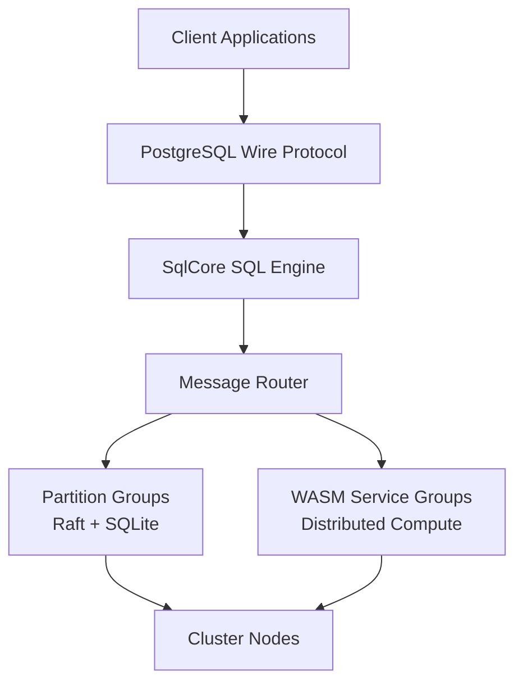

# Lagrange

### Distributed SQL + Compute-Near-Data Runtime

Lagrange is an experimental distributed database that **combines storage
and execution in one system**.

Instead of building architectures around:

-   databases
-   job systems
-   queues
-   stream processors
-   serverless platforms

Lagrange explores a different model:

> **Run compute directly on the nodes that store the data.**

Queries and distributed functions execute on the partitions that own the
data, dramatically reducing network traffic and coordination overhead.

------------------------------------------------------------------------

# Removing bottlnecks

Most distributed systems move enormous amounts of data across networks
just to process it.

Typical stack:

    App -> API -> Workers -> Queue -> Analytics Engine -> Database

Lagrange collapses these layers.

    Client
       v
    Distributed SQL Engine
       v
    Partition Execution (WASM)
       v
    Results

Instead of **moving data to compute**, Lagrange **moves compute to the
data**.

------------------------------------------------------------------------

# Quick Example

``` javascript
runtime.run(async (ctx) => {

  for await (const row of ctx.call("SELECT * FROM users")) {
      ctx.out(row)
  }

})
```

The system automatically:

1.  finds the partitions containing `users`
2.  executes the function on those nodes
3.  streams results back

No distributed orchestration required (by the developer).

------------------------------------------------------------------------

# Core Capabilities

## Distributed SQL Database

Tables automatically:

-   partition
-   replicate via **Raft**
-   elect leaders for writes

Each partition is a **Raft consensus group** storing data in SQLite.

This gives:

-   strong consistency
-   automatic failover
-   horizontal scaling

------------------------------------------------------------------------

## One SQL Engine

All SQL flows through a single execution engine:

    SqlCore

Regardless of entry point:

-   PostgreSQL client
-   internal system query
-   distributed runtime call

Every request becomes a canonical `SqlRequest`.

Result:

-   one planner
-   one optimizer
-   one execution path

------------------------------------------------------------------------

## Distributed Compute Runtime

Lagrange allows code to execute across partitions using a small set of
distributed primitives.

### Lookup

    ctx.lookup(table, keys[])

Efficient batched fetch from other partitions.

### Emit

    ctx.emit(key, value)

Shuffle intermediate data across partitions.

### Broadcast

    ctx.broadcast(ref, dataset)
    ctx.useBroadcast(ref)

Replicate small datasets to all nodes.

------------------------------------------------------------------------

## WASM Execution

Distributed functions run as **WebAssembly modules**.

Advantages:

-   language-agnostic
-   sandboxed
-   deterministic
-   portable artifacts

Each module declares:

-   entry function
-   dependency digests
-   capability requirements

------------------------------------------------------------------------

# Architecture at a Glance

Lagrange combines three core replicated building blocks:

- **Partition Groups** for table storage
- **Message Groups** for cluster communication
- **WASM Service Groups** for distributed compute



See **architecture/lagrange_architecture_diagrams.md** and
**architecture/lagrange_advanced_architecture_diagrams.md** for the full
diagram collection.

------------------------------------------------------------------------

# What's the difference?

Most distributed applications end up stitching together databases, queues,
workers, and analytics pipelines. Lagrange explores a different model:
store the data in partitions, then run code directly where the data lives.

That means less network movement, fewer infrastructure layers, and a much more
natural path to distributed execution.

------------------------------------------------------------------------

# How It Works

1. SQL or runtime calls enter through a single execution engine (`SqlCore`)
2. Metadata routing resolves the relevant partitions
3. Work is dispatched to the nodes that own the data
4. Optional primitives (`lookup`, `emit`, `broadcast`) move only the data
   that must move
5. Results stream back to the caller

------------------------------------------------------------------------

# System Architecture

High-level cluster view:

    Cluster
     │
     ├── Nodes
     │     │
     │     ├── Message Groups
     │     │     cluster communication
     │     │
     │     ├── Partition Groups
     │     │     distributed tables (Raft)
     │     │
     │     └── WASM Service Groups
     │           distributed compute services

Each node contains:

-   SQL engine (`SqlCore`)
-   message router
-   worker thread pool
-   system metadata cache
-   CDC replication

------------------------------------------------------------------------

# Compute-Near-Data Model

Traditional distributed processing:

    data -> network -> compute -> network -> results

Lagrange:

    compute -> data -> results

Benefits:

-   far less network traffic
-   lower latency
-   simpler application code

------------------------------------------------------------------------

# Comparison

  Capability               Lagrange   CockroachDB   Spark     Serverless
  ------------------------ ---------- ------------- --------- ------------
  Distributed SQL          ✓          ✓             partial   ✗
  Compute near data        ✓          ✗             partial   ✗
  WASM execution           ✓          ✗             ✗         partial
  Automatic partitioning   ✓          ✓             ✗         ✗
  Unified runtime          ✓          ✗             ✗         ✗

------------------------------------------------------------------------

# Getting Started

## Requirements

-   Node.js ≥ 22
-   npm

------------------------------------------------------------------------

## Install

    npm install

------------------------------------------------------------------------

## Configuration

Create `.env`:

    NODE_ID=node-1
    SEED_NODE_ADDRESS=http://seed-node:8080
    REST_API_PORT=8080

    LOG_LEVEL=info
    LOG_PRETTY_PRINT=false

------------------------------------------------------------------------

## Run

Start a node:

    npm start

Run tests:

    npm test

------------------------------------------------------------------------

# Development

Project structure:

    src/
      config/
      logging/
      query/
      threading/
      wasm-service/
      index.js

    test/

------------------------------------------------------------------------

# Roadmap

Major development areas include:

-   deeper distributed execution primitives
-   improved operational tooling
-   richer WASM runtime capabilities
-   developer ecosystem tools

See [roadmap.md](roadmap.md) for details.

------------------------------------------------------------------------

# License

AGPL v3
