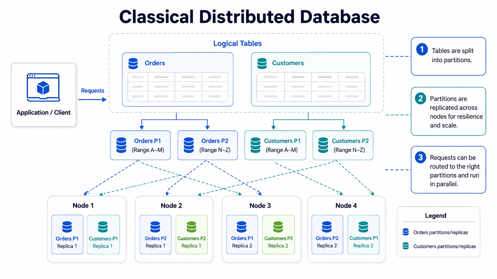
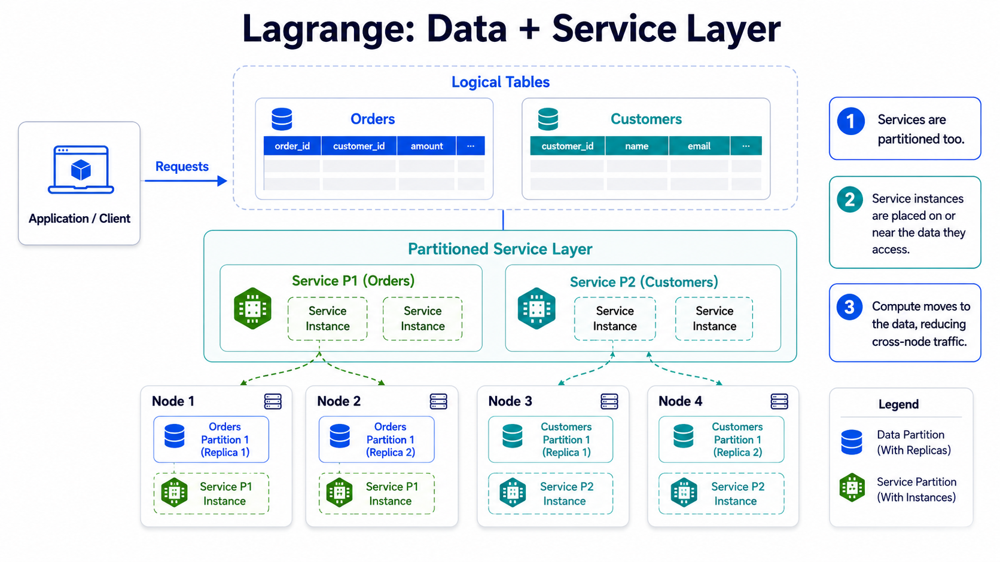
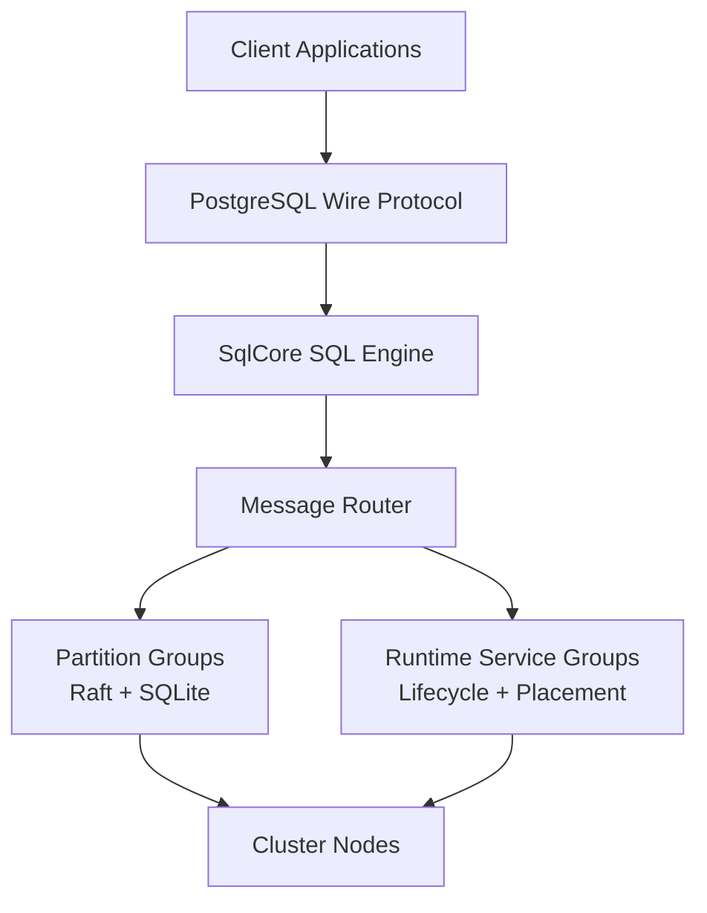

# Lagrange

### Distributed SQL database and compute-near-data runtime

Lagrange is an experimental distributed system that keeps storage, SQL
execution, and programmable compute in the same runtime.

The basic idea is simple: if the data already lives on a node, run the work
there first and move only the data that actually has to move.

That puts Lagrange somewhere between a distributed SQL database, a dataflow
runtime, and a service platform. Tables are split into partitions, every
partition is copied to several nodes, SQL goes through one execution engine,
and the cluster places service replicas on the nodes that store the data they
use.

This repo is for people interested in building or studying that model. It is
substantial, but still experimental.

---

## What Lagrange Is

Lagrange is trying to answer a specific question:

> What if a distributed database did not stop at storing and querying data,
> but also ran the application-side compute that normally sits beside it?

In practice that means:

- table data is split into partitions, each replicated across nodes with Raft
- SQL runs through a shared execution path
- distributed compute runs on the nodes that own the relevant partitions
- services are replicated too, and the cluster places each service replica on
  a node holding as many replicas of the partitions it accesses as possible —
  and re-places it as the data layout changes
- services can query tables without a separate data access stack

If you have ever built a system that looked like this:

```text
app -> database -> queue -> workers -> cache -> database
```

then the motivation should be familiar. Every arrow in that picture copies
data somewhere else before any useful work happens to it.

Lagrange explores a tighter loop:

```text
client -> cluster -> execute near the data -> return results
```

To be clear about where the novelty is: any distributed system can read
remote data over the network. What Lagrange adds is placement. Services are
replicated things, just like partitions, and the cluster continuously
positions each service replica so it sits as close as possible to as many
replicas of the data it reads and writes. Locality is something the cluster
produces and maintains for you, not something you engineer by hand and watch
decay as the data moves.

A classical distributed database splits tables into partitions, replicates
those partitions across nodes, and routes each request to the right one:



Lagrange keeps that data layer and adds a partitioned *service* layer on top of
it — service instances are placed on or near the data they access, so compute
moves to the data instead of the data moving to the compute:



---

## QA

### So Is This Just A Fancy Way To Implement Stored Procedures?

No. There is some overlap, but the shape of the problem is different.

Traditional stored procedures live inside one database engine instance and are
mostly about moving logic closer to SQL execution. Lagrange is trying to make
distributed execution itself part of the database runtime.

The differences in practice are:

- the unit of execution is distributed across partitions, not tied to one
  database process
- locality matters at the partition and cluster level, not just inside one
  node
- cross-partition work is explicit through primitives like `lookup`, `emit`,
  and `broadcast`
- replicated service descriptors and callback modules are first-class runtime
  metadata, not just SQL-side extension hooks; genuine component execution is
  still a planned cutover

If you only need some row-level logic near a single-node database, stored
procedures are the simpler tool. Lagrange is aiming at the point where the
problem is already distributed.

### How Is This Different From Kubernetes Plus A Distributed Database?

Kubernetes plus a database is the usual architecture: the database stores
state, and application compute lives outside it in a separate scheduler,
deployment system, and failure domain.

Lagrange is not mainly about replacing a container scheduler. The difference
is that compute placement is derived from data ownership: the cluster decides
where each service replica runs based on which nodes store the data it
touches, and keeps adjusting that placement as the data layout changes.

In practice that changes a few things:

- the runtime knows where the relevant partitions are before your code runs
- partition-local work can execute without first pulling rows into another
  service tier
- data movement becomes an explicit operation instead of something hidden in
  RPC calls, caches, and worker pipelines
- SQL, service logic, and distributed execution can share the same routing and
  metadata model

You can still run Lagrange on Kubernetes. The point is that Kubernetes does
not by itself give you data-local execution semantics. It schedules pods, not
work in terms of partition ownership.

### Why Not Just Keep The Compute In The Application Layer?

Sometimes that is the right answer.

The application layer is simpler when:

- the workload is small enough that data movement does not dominate
- compute needs are not tied to data locality
- operational separation is more important than runtime integration

Lagrange becomes interesting when the application layer mostly exists to
shuffle data between systems before doing work that could have happened near
the partitions in the first place.

### Is This Trying To Replace Spark, Flink, Or Serverless?

Not cleanly.

There is overlap, but Lagrange is coming from the database side rather than
from batch processing, stream processing, or generic function hosting.

The rough distinction is:

- Spark-style systems start from compute and attach to storage
- serverless starts from stateless function execution
- Lagrange starts from partitioned, replicated data and asks how much compute
  should live there too

If your problem is mostly external data lake processing or generic event
handlers, other tools may be a better fit. Lagrange is more interesting when
the core problem is already centered on operational data inside the cluster.

### Is The Goal To Eliminate Network Traffic?

No. Distributed systems do not get to opt out of the network.

The goal is to stop pretending that shipping data around is free. Lagrange
tries to do local work first, and only then pay for the communication that is
actually necessary.

That is why the runtime exposes explicit movement primitives instead of hiding
every cross-partition step behind a convenient abstraction.

### Does This Mean Everything Has To Be Written In WASM?

No.

WASM is a target execution format for externally installable services, not the
entire story. Today the repo contains built-in runtime services, regular systems
code, and a JavaScript-envelope lifecycle rehearsal. The README example is about
the execution model more than the packaging format.

WASM matters here because a genuine component can become a useful unit for
sandboxed, portable, replicable compute once the component runtime is delivered.
It is not the only way to think about the runtime.

### Is This A Database With Extra Compute, Or A Compute System With Storage?

The honest answer is: it is trying to be a database that takes compute
seriously enough to make it part of the runtime model.

That distinction matters because storage ownership, replication, transactions,
and routing still anchor the design. The compute side is built around those
constraints instead of pretending the data layer is just another service to
call.

---

## Good Fit

Lagrange makes sense if you care about any of these:

- workloads where the real cost is copying rows out of the database to
  wherever the compute runs — the win is running that compute where the rows
  already are
- distributed SQL workloads that also need custom compute
- service logic that should execute close to the tables it reads and writes
- experimenting with WASM-based distributed execution
- studying the mechanics of a database that treats compute as part of the
  runtime instead of an external layer

## Not A Good Fit

Lagrange is probably the wrong tool if you need:

- a boring, mature drop-in production database right now
- polished one-command deployment and operations workflows
- a general-purpose serverless platform
- a system where the database and compute tiers must stay separate

---

## What Exists Today

This repository already contains real distributed database machinery, not just
design notes.

Current building blocks include:

- partition groups (a partition plus its replicas, acting as one Raft group)
  storing their data in SQLite
- multi-partition transactions with recovery and timeout handling
- one SQL execution engine shared by every way a query can arrive: clients,
  services, and internal system queries
- distributed execution primitives such as `lookup`, `emit`, and `broadcast`
  (defined in the [Example](#example) section)
- WASM service lifecycle scaffolding, currently exercised by a JavaScript
  artifact envelope rather than compiled WebAssembly
- cluster diagnostics, health probes, live query support, and an admin CLI
- distributed failure and stress testing infrastructure

The current roadmap focus is less about proving the core model and more about
making it easier to run, inspect, and develop against.

See [roadmap.md](roadmap.md) for the canonical implementation roadmap.

---

## How You Deploy Code To Lagrange

There are three intended ways to get your code running on a Lagrange cluster —
a ladder ordered by how aware your code is of Lagrange. Each rung trades a
little more coupling for more efficiency.

1. **Bring your container (no code changes).** Package your existing
   PostgreSQL-talking application as an OCI container and let Lagrange run it
   as a managed, replicated service — placing each replica near the data it
   actually accesses, and re-placing it as the data layout changes. Your
   application keeps speaking the PostgreSQL wire protocol and never learns it
   moved. This is the expected most common early path.
   *Status: the PostgreSQL wire surface and the affinity placement machinery
   exist; external OCI service installation is not implemented yet (see the
   capability matrix below). The MovieLens affinity demo shows the placement
   behavior this rung buys, currently through an internal service rather than
   an installed container.*
2. **Callbacks (Lagrange-aware).** Write an async function against the `ctx`
   surface and hand it to the cluster, which ships it to the nodes owning the
   partitions it reads — compute moves to the data instead of the service
   merely sitting near it. Today this has two forms, embedded and uploaded
   (described in the mental model below); the design direction is one merged
   callback surface. Cross-replica state is planned to live in a **shared
   service context** — a redis-like store scoped to the service and shared
   across its replicas — rather than in captured closures.
   *Status: embedded and uploaded callbacks work today; the merged surface and
   the shared service context are design-stage.*
3. **WASM components (target).** The same callback shape as a portable,
   sandboxed, digest-pinned artifact installed through the same service
   surface. *Status: not yet — today's `wasm_component` path is a
   JavaScript-envelope lifecycle rehearsal, not genuine component execution.*

The plan of record for this ladder is the service-portability-ladder spec
([`solve/specs/service-portability-ladder/`](solve/specs/service-portability-ladder/requirements.md));
current runtime support is recorded in
[`docs/service-portability-capabilities.json`](docs/service-portability-capabilities.json).

---

## Small Mental Model

**Your code is a callback.** You write an async function that takes a context
object (`ctx`) and works with rows: `ctx.call(sql)` to read data, `ctx.out(row)`
to emit results, and the distribution primitives below when a step genuinely has
to cross partitions. That function is the unit Lagrange schedules — there is no
separate worker service to stand up.

**Two ways to hand that function to the cluster** (the two current forms of
ladder rung 2 above — the design direction is to merge them into one callback
surface):

Current runtime support is recorded in
[`docs/service-portability-capabilities.json`](docs/service-portability-capabilities.json).
**Service portability status:** the matrix is the current implementation claim;
architecture documents may describe later target contracts.
The uploaded `wasm_component` callback example is an internal lifecycle rehearsal:
its JavaScript source is serialized into `js_wasm_component_v1` and evaluated as
JavaScript. It is not a WebAssembly binary or component. External service
installation is not implemented yet, and `native_js` remains kernel-internal.

- **Embedded** — run the runtime inside your own Node process and call
  `runtime.run(fn)` directly (the [Example](#example) below). This is the
  quickest path for scripts, drivers, and tests: the runtime connects to the
  cluster, and your function executes against it.
- **Uploaded** — package the function as a callback module plus a small manifest
  (`example.manifest.json`: the entry file, the exported `run` function, its
  `runtimeKind` — `native_js` or `wasm_component` — and the `SELECT` that drives
  it). A runner stores the module inside the cluster and invokes it by that
  statement. This is how the
  [runnable examples](examples/distributed-sql/README.md) exercise the current
  callback lifecycle. They do not yet demonstrate an externally installable
  service artifact.

**Where state goes.** Treat the callback as stateless: it may be serialized,
shipped, and run on several nodes, so captured closure scope is not a place to
keep state. Durable state belongs in tables; cross-replica working state is
what the planned shared service context (ladder rung 2 above) is for.

**Where it runs.** The `SELECT` in your callback names a table. The cluster
resolves that table to the partitions that hold its rows, and the nodes that own
those partitions — then sends your callback *to those nodes* and runs it there,
against local data. You never name a host or assemble a worker topology; the
cluster already knows where the partitions live. Only rows that genuinely must
cross the network move, and results stream back to wherever you made the call.

Put together, a request goes through these steps:

1. a SQL query or a `runtime.run` callback enters the cluster
2. the cluster resolves the target table to its partitions and their owner nodes
3. your callback is sent to those nodes
4. local execution happens there first
5. only the rows that genuinely must cross the network are moved
6. results stream back to the caller

The important part is not the routing itself. The important part is the
order: local work first, network traffic only for what is left. Most stacks
are built the other way around — every step ships data somewhere else before
the work starts.

---

## Example

```javascript
runtime.run(async (ctx) => {
  for await (const row of ctx.call('SELECT * FROM users')) {
    ctx.out(row);
  }
});
```

This is the *embedded* form from the mental model above: the runtime lives in
your process and you call it directly. The interesting part is not the API
surface — it is what the runtime does for you:

1. it finds the partitions that own `users`
2. it sends this function to the nodes that own those partitions and runs it there
3. it streams rows back without asking you to assemble a worker topology

An *uploaded* callback module exports a similar `run(ctx, batch)` function and
works with the same `ctx` surface; the only difference is that the cluster
stores the module and drives it by the `SELECT` in its manifest instead of you
calling `runtime.run` in-process. See
[examples/distributed-sql](examples/distributed-sql/README.md) for runnable
versions.

For more complex cases, the runtime exposes a small set of explicit
distribution primitives:

| Primitive | Usage | Why it exists |
|-----------|-------|---------------|
| `ctx.lookup(table, keys[])` | Batched fetch | Read from other partitions without hand-rolling request fan-out |
| `ctx.emit(key, value)` | Shuffle | Redistribute intermediate data when it really must move |
| `ctx.broadcast(ref, dataset)` | Replicate | Send a small shared dataset to every node involved in the job |

---

## Getting Started

### Requirements

- Node.js >= 22
- npm

### Install

```bash
npm install
```

### Minimal Configuration

Create `.env` in the directory you start the node from (loaded at startup;
variables already set in your shell take precedence):

```env
REST_API_PORT=8080

LOG_LEVEL=info
LOG_PRETTY_PRINT=false
```

Leave `NODE_ID` unset — the node mints a UUID identity on first start and
persists it in its data directory, so the same identity survives restarts.

Leave `SEED_NODE_ADDRESS` unset for your first node. A node without a seed
address starts as the cluster seed; setting one makes the node try to join an
existing cluster and give up after a few minutes if that seed does not exist.

### Start A Node

```bash
npm start
```

The node opens three ports: `8080` (REST API), `8081` (admin websocket), and
`8082` (node-to-node transport).

### Run A Query

The admin CLI is an interactive terminal UI that connects to the admin port:

```bash
npm run cli            # connects to localhost:8081
```

Press `6` to open the SQL view, type a statement, and press `Ctrl+Enter` to
execute it:

```sql
CREATE TABLE users (id TEXT PRIMARY KEY)
```

### Add More Nodes

Additional nodes join the cluster by pointing `SEED_NODE_ADDRESS` at the
seed. Three things to know:

- leave `NODE_ID` unset on joining nodes — the seed admits joiners by a
  UUID identity, which the node generates and persists in its data
  directory on first start
- run each node on its own host or container: the admin websocket port is
  currently fixed at `8081`, so two nodes cannot share a network namespace
- every node must advertise an address other nodes can reach
  (`NODE_ADDRESS`, `NODE_ADVERTISED_WS_ADDRESS`) — the localhost default
  is rejected at join admission because it collides with the seed's

The easiest local multi-node setup is Docker, one container per node, using
the published release image (or `docker build -t lagrange .` for a local
build):

```bash
docker network create lagrange-net
docker pull psvensson/lagrange:latest

docker run -d --name seed --network lagrange-net \
  -e TRANSPORT_WS_HOST=0.0.0.0 \
  -e ADMIN_WEBSOCKET_HOST=0.0.0.0 \
  -e ADMIN_ALLOW_INSECURE_EXTERNAL_BIND=true \
  -e NODE_ADDRESS=seed:8080 \
  -e NODE_ADVERTISED_WS_ADDRESS=seed:8082 \
  psvensson/lagrange:latest

docker run -d --name node2 --network lagrange-net \
  -e TRANSPORT_WS_HOST=0.0.0.0 \
  -e ADMIN_WEBSOCKET_HOST=0.0.0.0 \
  -e ADMIN_ALLOW_INSECURE_EXTERNAL_BIND=true \
  -e NODE_ADDRESS=node2:8080 \
  -e NODE_ADVERTISED_WS_ADDRESS=node2:8082 \
  -e SEED_NODE_ADDRESS=http://seed:8080 \
  psvensson/lagrange:latest
```

For a real cluster, use the Helm chart below — it wires the same
name-first addressing per pod automatically.

### Docker And Kubernetes

Release images (distroless, amd64) are published to
[Docker Hub](https://hub.docker.com/r/psvensson/lagrange) — the primary
registry — and mirrored to the Codeberg container registry:

```bash
docker pull psvensson/lagrange:latest              # or a version tag, e.g. :0.1.0
docker pull codeberg.org/psvensson/lagrange:latest # mirror
```

The repo also ships the Dockerfile and a Helm chart:

```bash
# Single node in Docker
docker run --rm -e ADMIN_WEBSOCKET_HOST=0.0.0.0 \
  -e ADMIN_ALLOW_INSECURE_EXTERNAL_BIND=true \
  -p 8080:8080 -p 8081:8081 -p 8082:8082 psvensson/lagrange:latest

# Or build the image locally
docker build -t lagrange .

# Seed + joiner cluster on Kubernetes (defaults to the published image)
helm install lagrange charts/lagrange-node

# ... or point it at a local/private build
helm install lagrange charts/lagrange-node \
  --set image.repository=<your-registry>/lagrange --set image.tag=<tag>
```

See [charts/lagrange-node/README.md](charts/lagrange-node/README.md) for
values and topology details.

### Useful Commands

```bash
# Short, high-signal developer proof (normally a few seconds)
npm run test:smoke

# Quick test pass: unit and non-integration suites (a few minutes)
npm run test:fast

# Full sharded test suite: thousands of files, takes much longer, and runs
# a preflight audit gate first
npm test

# Open the admin CLI entrypoint
npm run cli -- --help

# Run static analysis and structural checks
npm run test:static

# Print common local workflows
npm run commands
```

Always run tests through the npm scripts above. Invoking `tap test/` directly
does not work — the argument list exceeds the OS limit (E2BIG) — so the
scripts shard and batch the suite for you.

If you are just passing through the repo, the fastest way to get oriented is:

1. read this README
2. skim the architecture walkthrough at [architecture/INDEX.md](architecture/INDEX.md)
3. inspect [roadmap.md](roadmap.md)
4. look at [src/index.js](src/index.js) and the directories under `src/`
5. run `npm run test:fast` if you want to see the project as executable code
   rather than only as documents (`npm test` is the full sharded suite and
   takes much longer)

If you are an LLM or are handing work to one, start with the compact handoff:

```bash
npm run quest:context
```

That command prints the active Quest, latest probe, findings, pending step,
useful commands, and dirty worktree summary. After that, start from the steering
entry point [AGENTS.md](AGENTS.md) and load the compact steering pack index
[docs/steering/llm/README.md](docs/steering/llm/README.md) instead of opening
every steering document by default.

---

## How It Is Put Together

Lagrange is built from replicated data, messaging, and runtime-service building
blocks:

- **Partition Groups**: table storage backed by Raft and SQLite
- **Message Groups**: cluster communication and routing
- **Runtime Service Groups**: replicated service lifecycle and placement; the
  current uploaded callback rehearsal executes JavaScript rather than a genuine
  WASM component



Each node contains the pieces needed to participate in both data storage and
execution:

- SQL engine (`SqlCore`)
- message router
- worker thread pool
- system metadata cache, kept up to date by change data capture (CDC) events

The deeper architecture docs live here:

- [architecture/INDEX.md](architecture/INDEX.md) (canonical entry point)
- [architecture/README.md](architecture/README.md)
- [architecture/lagrange_architecture_diagrams.md](architecture/lagrange_architecture_diagrams.md)
- [architecture/lagrange_advanced_architecture_diagrams.md](architecture/lagrange_advanced_architecture_diagrams.md)

---

## Core Capabilities

### Distributed SQL Database

Tables are partitioned and replicated. Each partition is a Raft group storing
its data in SQLite: one replica (the leader) accepts writes and replicates
them to the rest, a new leader is elected automatically when the current one
fails, and the result is a predictable consistency story rather than
best-effort eventual consistency.

### One SQL Engine

SQL does not splinter into separate code paths for clients, internal system
queries, and runtime calls. Requests converge on one execution engine and one
canonical request model.

### Distributed Compute Runtime

Compute can run on the nodes that already own the data it needs, with explicit
primitives for cross-partition work when locality is not enough.

### WASM Component Direction

The target runtime executes genuine WebAssembly components for a small,
portable deployment artifact. Today the `wasm_component` callback example is a
JavaScript-envelope lifecycle rehearsal; it does not yet provide component
sandboxing or language-neutral execution.

### Service Query Bridge

Services query tables through the same SQL path used elsewhere in the system.
They do not need a side-channel data access path or direct partition access.

---

## Project Layout

Some useful places to start:

```text
src/
  index.js               main entrypoint
  bootstrap/             cluster startup and join flow
  query/                 SQL engine and query execution
  partition/             partition lifecycle and ownership
  transport/             node-to-node communication
  wasm-service/          distributed service and WASM runtime pieces
  diagnostics/           operational visibility

test/                    automated coverage across unit and distributed paths
docs/                    runbooks, specs, and operational notes
architecture/            architectural overviews and diagrams
examples/                example workloads and supporting material
scripts/                 tooling, guards, scenario runners, and build helpers
```

The highest-traffic runtime directories include local owner cards. Read the
matching `src/<domain>/README.md` before editing that domain.

Guard commands that are useful while changing the codebase:

```bash
# Print common local workflows
npm run commands

# Inspect the active Quest, latest probe, findings, and pending step
npm run quest:context

# Enforce table_policies ownership rules in scenario SQL
npm run guard:scenario-policy:file
```

---

## Current Status

The system is past the "idea on a whiteboard" stage and well into "real code
with real failure modes" territory.

What is already here:

- database replication and partition ownership machinery
- transaction coordination
- cluster diagnostics and admin surfaces
- a large distributed test harness
- WASM and service runtime foundations

What is still being pushed forward:

- easier cluster deployment
- better developer inner-loop tooling
- more approachable service packaging and debugging workflows
- cleaner getting-started paths for new users

That status matters because this repo is best read as an active systems codebase,
not as a polished end-user product.

---

## Further Reading

- [architecture/INDEX.md](architecture/INDEX.md) for the main architecture walkthrough
- [roadmap.md](roadmap.md) for implementation status and scope
- [product-roadmap.md](product-roadmap.md) for cross-edition product phases
- [platform-doctrine.md](platform-doctrine.md) for the platform design doctrine
- [edition-matrix.md](edition-matrix.md) for edition ownership boundaries
- [DEBUGGING.md](DEBUGGING.md) for debugging notes
- [docs/](docs) for operational and feature-specific documents
- [examples/](examples) for example scenarios and workloads

---

## License

AGPL-3.0. See [LICENSE](LICENSE).

This project is open source but **closed to outside contributions**
("open-source, not open-contribution", like SQLite) — see
[CONTRIBUTING.md](CONTRIBUTING.md) for why. Bug reports are welcome; pull
requests are disabled.
