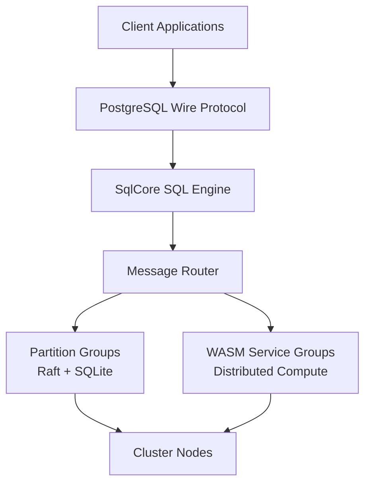

# Lagrange

### Distributed SQL database and compute-near-data runtime

Lagrange is an experimental distributed system that keeps storage, SQL
execution, and programmable compute in the same runtime.

The basic idea is simple: if the data already lives on a node, run the work
there first and move only the data that actually has to move.

That puts Lagrange somewhere between a distributed SQL database, a dataflow
runtime, and a service platform. Tables live in replicated partitions. SQL
goes through one execution engine. Distributed functions and services can run
close to the partitions that own the data.

This repo is for people interested in building or studying that model. It is
substantial, but still experimental.

---

## What Lagrange Is

Lagrange is trying to answer a specific question:

> What if a distributed database did not stop at storing and querying data,
> but also ran the application-side compute that normally sits beside it?

In practice that means:

- table data is partitioned and replicated with Raft
- SQL runs through a shared execution path
- distributed compute runs on the nodes that own the relevant partitions
- services can query tables without a separate data access stack
- data shuffles are explicit instead of being the default architecture

If you have ever built a system that looked like this:

```text
app -> database -> queue -> workers -> cache -> database
```

then the motivation should be familiar.

Lagrange explores a tighter loop:

```text
client -> cluster -> execute near the data -> return results
```

---

## Good Fit

Lagrange makes sense if you care about any of these:

- partition-local processing where shipping rows around is the main cost
- distributed SQL workloads that also need custom compute
- service logic that should execute close to the tables it reads and writes
- experimenting with WASM-based distributed execution
- studying the mechanics of a database that treats compute as part of the
  runtime instead of an external layer

## Not A Good Fit

Lagrange is probably the wrong tool if you need:

- a boring, mature drop-in production database right now
- polished one-command deployment and operations workflows
- a general-purpose serverless platform
- a system where the database and compute tiers must stay separate

---

## What Exists Today

This repository already contains real distributed database machinery, not just
design notes.

Current building blocks include:

- partition groups backed by SQLite and replicated with Raft
- multi-partition transactions with recovery and timeout handling
- a shared SQL execution engine used across entry points
- distributed execution primitives such as `lookup`, `emit`, and `broadcast`
- WASM service execution and service-to-table query paths
- cluster diagnostics, health probes, live query support, and an admin CLI
- distributed failure and stress testing infrastructure

The current roadmap focus is less about proving the core model and more about
making it easier to run, inspect, and develop against.

See [roadmap.md](roadmap.md) for the canonical implementation roadmap.

---

## Small Mental Model

At a high level, a request goes through these steps:

1. a SQL query or runtime call enters the cluster
2. metadata resolves which partitions own the relevant data
3. work is sent to those nodes
4. local execution happens there first
5. only required cross-partition traffic is performed
6. results stream back

The important part is not the routing itself. The important part is that data
movement is treated as a cost to minimize, not as the default programming
model.

---

## QA

### So Is This Just A Fancy Way To Implement Stored Procedures?

No. There is some overlap, but the shape of the problem is different.

Traditional stored procedures live inside one database engine instance and are
mostly about moving logic closer to SQL execution. Lagrange is trying to make
distributed execution itself part of the database runtime.

The differences in practice are:

- the unit of execution is distributed across partitions, not tied to one
  database process
- locality matters at the partition and cluster level, not just inside one
  node
- cross-partition work is explicit through primitives like `lookup`, `emit`,
  and `broadcast`
- services and WASM modules are first-class runtime pieces, not just SQL-side
  extension hooks

If you only need some row-level logic near a single-node database, stored
procedures are the simpler tool. Lagrange is aiming at the point where the
problem is already distributed.

### How Is This Different From Kubernetes Plus A Distributed Database?

Kubernetes plus a database is the usual architecture: the database stores
state, and application compute lives outside it in a separate scheduler,
deployment system, and failure domain.

Lagrange is not mainly about replacing a container scheduler. The difference
is that compute placement is derived from data ownership.

In practice that changes a few things:

- the runtime knows where the relevant partitions are before your code runs
- partition-local work can execute without first pulling rows into another
  service tier
- data movement becomes an explicit operation instead of something hidden in
  RPC calls, caches, and worker pipelines
- SQL, service logic, and distributed execution can share the same routing and
  metadata model

You can still run Lagrange on Kubernetes. The point is that Kubernetes does
not by itself give you data-local execution semantics. It schedules pods, not
work in terms of partition ownership.

### Why Not Just Keep The Compute In The Application Layer?

Sometimes that is the right answer.

The application layer is simpler when:

- the workload is small enough that data movement does not dominate
- compute needs are not tied to data locality
- operational separation is more important than runtime integration

Lagrange becomes interesting when the application layer mostly exists to
shuffle data between systems before doing work that could have happened near
the partitions in the first place.

### Is This Trying To Replace Spark, Flink, Or Serverless?

Not cleanly.

There is overlap, but Lagrange is coming from the database side rather than
from batch processing, stream processing, or generic function hosting.

The rough distinction is:

- Spark-style systems start from compute and attach to storage
- serverless starts from stateless function execution
- Lagrange starts from partitioned, replicated data and asks how much compute
  should live there too

If your problem is mostly external data lake processing or generic event
handlers, other tools may be a better fit. Lagrange is more interesting when
the core problem is already centered on operational data inside the cluster.

### Is The Goal To Eliminate Network Traffic?

No. Distributed systems do not get to opt out of the network.

The goal is to stop pretending that shipping data around is free. Lagrange
tries to do local work first, and only then pay for the communication that is
actually necessary.

That is why the runtime exposes explicit movement primitives instead of hiding
every cross-partition step behind a convenient abstraction.

### Does This Mean Everything Has To Be Written In WASM?

No.

WASM is one execution format in the system, not the entire story. The repo
already contains built-in runtime services and regular systems code, and the
README example is about the execution model more than the packaging format.

WASM matters here because it is a useful unit for sandboxed, portable,
replicable compute. It is not the only way to think about the runtime.

### Is This A Database With Extra Compute, Or A Compute System With Storage?

The honest answer is: it is trying to be a database that takes compute
seriously enough to make it part of the runtime model.

That distinction matters because storage ownership, replication, transactions,
and routing still anchor the design. The compute side is built around those
constraints instead of pretending the data layer is just another service to
call.

---

## Example

```javascript
runtime.run(async (ctx) => {
  for await (const row of ctx.call('SELECT * FROM users')) {
    ctx.out(row);
  }
});
```

The interesting part of this example is not the API surface. It is what the
runtime does for you:

1. it finds the partitions that own `users`
2. it runs the work on those nodes
3. it streams rows back without asking you to assemble a worker topology

For more complex cases, the runtime exposes a small set of explicit
distribution primitives:

| Primitive | Usage | Why it exists |
|-----------|-------|---------------|
| `ctx.lookup(table, keys[])` | Batched fetch | Read from other partitions without hand-rolling request fan-out |
| `ctx.emit(key, value)` | Shuffle | Redistribute intermediate data when it really must move |
| `ctx.broadcast(ref, dataset)` | Replicate | Send a small shared dataset to all nodes |

---

## Getting Started

### Requirements

- Node.js >= 22
- npm

### Install

```bash
npm install
```

### Minimal Configuration

Create `.env`:

```env
NODE_ID=node-1
SEED_NODE_ADDRESS=http://seed-node:8080
REST_API_PORT=8080

LOG_LEVEL=info
LOG_PRETTY_PRINT=false
```

### Start A Node

```bash
npm start
```

### Useful Commands

```bash
# Run the test suite
npm test

# Open the admin CLI entrypoint
npm run cli -- --help

# Run static analysis and structural checks
npm run test:static
```

If you are just passing through the repo, the fastest way to get oriented is:

1. read this README
2. skim [architecture.md](architecture.md)
3. inspect [roadmap.md](roadmap.md)
4. look at [src/index.js](src/index.js) and the directories under `src/`
5. run `npm test` if you want to see the project as executable code rather
   than only as documents

If you are an LLM or are handing work to one, start with the compact handoff:

```bash
npm run quest:context
```

That command prints the active Quest, latest probe, findings, pending step,
useful commands, and dirty worktree summary. After that, load the compact
steering pack from [.kiro/steering/llm/README.md](.kiro/steering/llm/README.md)
instead of opening every steering document by default.

---

## How It Is Put Together

Lagrange is built from three replicated building blocks:

- **Partition Groups**: table storage backed by Raft and SQLite
- **Message Groups**: cluster communication and routing
- **WASM Service Groups**: replicated distributed compute



Each node contains the pieces needed to participate in both data storage and
execution:

- SQL engine (`SqlCore`)
- message router
- worker thread pool
- system metadata cache fed from CDC

The deeper architecture docs live here:

- [architecture.md](architecture.md)
- [architecture/README.md](architecture/README.md)
- [architecture/lagrange_architecture_diagrams.md](architecture/lagrange_architecture_diagrams.md)
- [architecture/lagrange_advanced_architecture_diagrams.md](architecture/lagrange_advanced_architecture_diagrams.md)

---

## Core Capabilities

### Distributed SQL Database

Tables are partitioned and replicated. Each partition is a Raft group storing
data in SQLite, which gives leader-based writes, failover behavior, and a
clear consistency model.

### One SQL Engine

SQL does not splinter into separate code paths for clients, internal system
queries, and runtime calls. Requests converge on one execution engine and one
canonical request model.

### Distributed Compute Runtime

Compute can run on the nodes that already own the data it needs, with explicit
primitives for cross-partition work when locality is not enough.

### WASM Execution

Distributed functions run as WebAssembly modules. That keeps execution
sandboxed and portable while making language choice less central than the
runtime contract.

### Service Query Bridge

Services query tables through the same SQL path used elsewhere in the system.
They do not need a side-channel data access path or direct partition access.

---

## Project Layout

Some useful places to start:

```text
src/
  index.js               main entrypoint
  bootstrap/             cluster startup and join flow
  query/                 SQL engine and query execution
  partition/             partition lifecycle and ownership
  transport/             node-to-node communication
  wasm-service/          distributed service and WASM runtime pieces
  diagnostics/           operational visibility

test/                    automated coverage across unit and distributed paths
docs/                    runbooks, specs, and operational notes
architecture/            architectural overviews and diagrams
examples/                example workloads and supporting material
scripts/                 tooling, guards, scenario runners, and build helpers
```

The highest-traffic runtime directories include local owner cards. Read the
matching `src/<domain>/README.md` before editing that domain.

Guard commands that are useful while changing the codebase:

```bash
# Print common local workflows
npm run commands

# Inspect the active Quest, latest probe, findings, and pending step
npm run quest:context

# Enforce table_policies ownership rules in scenario SQL
npm run guard:scenario-policy:file
```

---

## Current Status

The system is past the "idea on a whiteboard" stage and well into "real code
with real failure modes" territory.

What is already here:

- database replication and partition ownership machinery
- transaction coordination
- cluster diagnostics and admin surfaces
- a large distributed test harness
- WASM and service runtime foundations

What is still being pushed forward:

- easier cluster deployment
- better developer inner-loop tooling
- more approachable service packaging and debugging workflows
- cleaner getting-started paths for new users

That status matters because this repo is best read as an active systems codebase,
not as a polished end-user product.

---

## Further Reading

- [architecture.md](architecture.md) for the main architecture walkthrough
- [roadmap.md](roadmap.md) for implementation status and scope
- [edition-matrix.md](edition-matrix.md) for edition ownership boundaries
- [DEBUGGING.md](DEBUGGING.md) for debugging notes
- [docs/](docs) for operational and feature-specific documents
- [examples/](examples) for example scenarios and workloads

---

## License

AGPL v3
