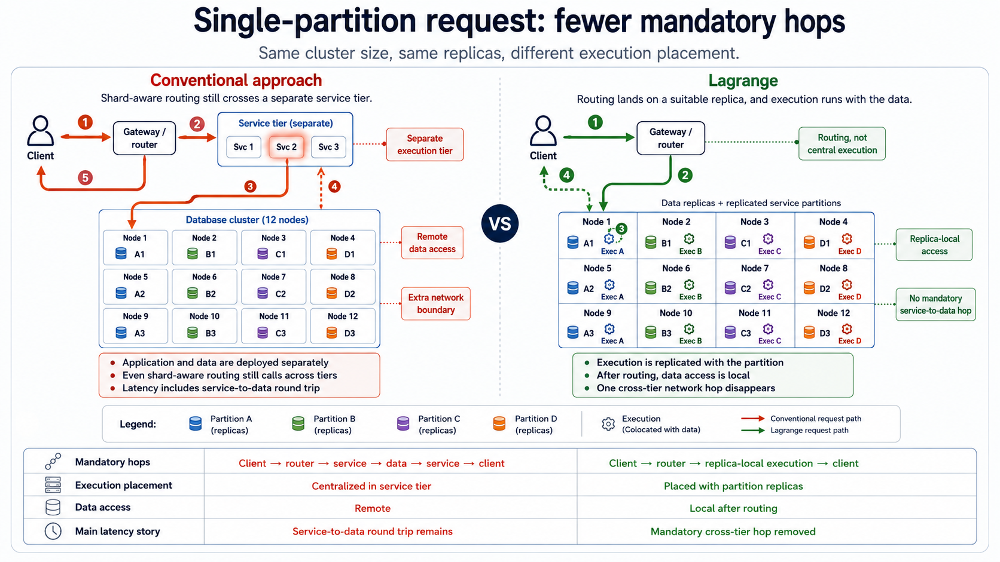
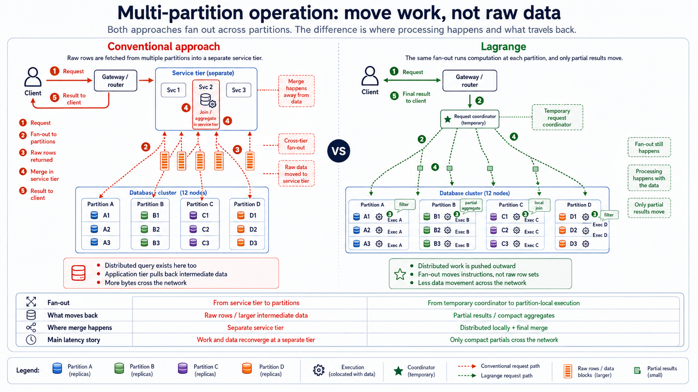
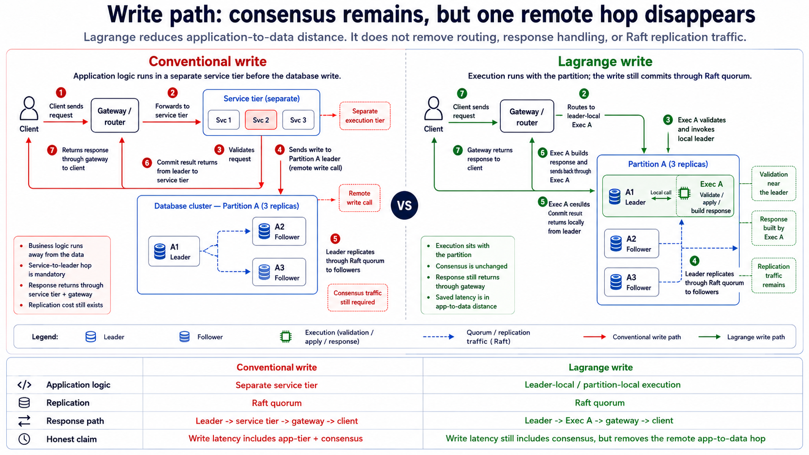
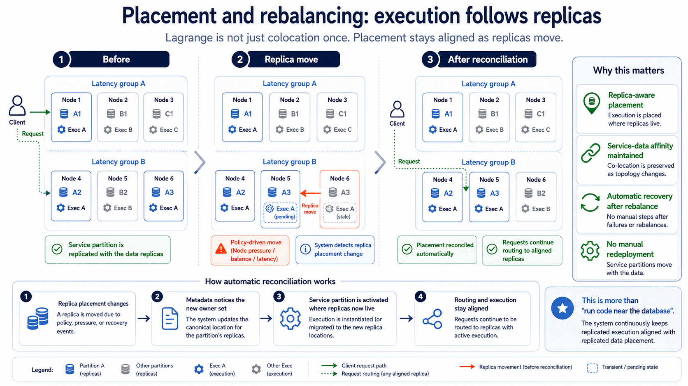
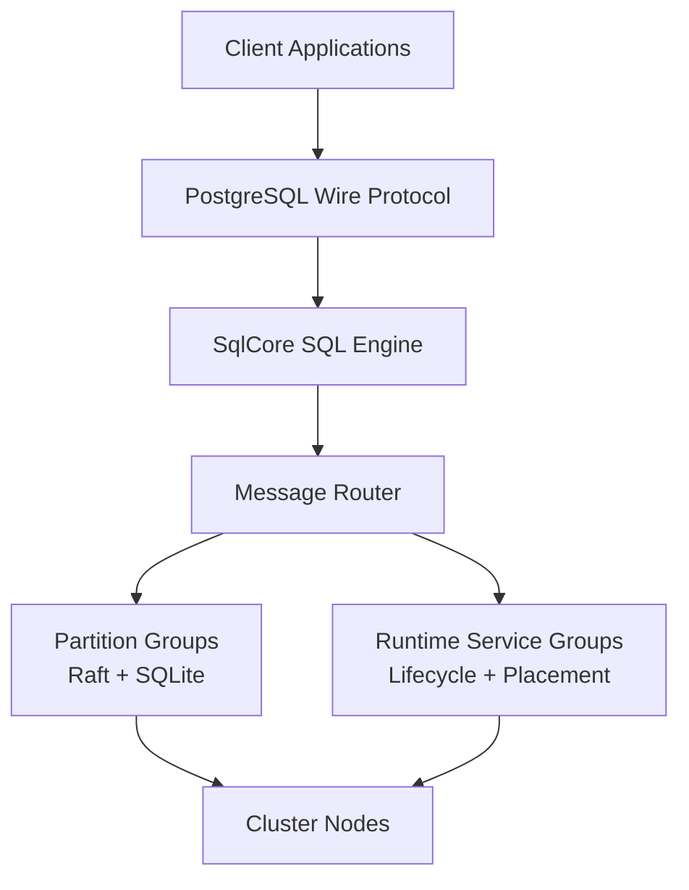

# Lagrange

### A distributed SQL database that deploys your services next to your data

Lagrange is a cluster runtime that combines a distributed SQL database with a
service deployment platform. You deploy services to it much as you would
deploy containers to Kubernetes — but where a container scheduler places
workloads by CPU and memory, Lagrange places each service replica on the
nodes that already store the data that service reads and writes.

It is meant to be run as a large cluster, and three ideas define how that
cluster behaves:

- **Data is partitioned and replicated according to usage.** Tables are split
  into partitions — a partition that gets hot splits — and every partition is
  replicated across several nodes with Raft, with replica placement balancing
  load, spread, and capacity across the cluster.
- **Services are replicated near the data they access.** A deployed service
  runs as replicated Cells, and once the cluster has observed which
  partitions the service actually uses, it pulls those Cells toward nodes
  holding replicas of that data.
- **Rebalancing is continuous, for data and services alike.** As usage
  changes — a partition outgrows its thresholds, a service's access pattern
  shifts, nodes join or leave — the cluster moves data replicas and service
  replicas to match, instead of leaving you to re-engineer the layout by hand
  and watch it decay.

Today a deployed service is packaged as a digest-pinned WASM (WASI)
component; OCI container execution is on the roadmap but not yet supported.

This repo is for people interested in building or studying that model. It is
substantial, but still experimental.

---

## What Lagrange Is

Most production architectures split one job across many separately deployed
systems:

```text
app -> database -> queue -> workers -> cache -> database
```

Every arrow in that picture copies data somewhere else before any useful work
happens to it, and every box is deployed, scaled, and monitored on its own.

Lagrange collapses that loop. You create tables and deploy services; the
cluster runs each service where its data already lives:

```text
client -> cluster -> service runs where the data lives -> results return
```

In practice that means:

- table data is split into partitions, each replicated across nodes with Raft
- SQL runs through a shared execution path
- deployed services are decomposed into placed Cells, and the cluster places
  each Cell on a node holding as many replicas of the partitions it accesses
  as possible — then re-places it as the data layout and usage change
- services query tables directly, without a separate data access stack

To be clear about where the novelty is: any distributed system can read remote
data over the network. What Lagrange adds is placement. Deployed services are
decomposed into placed Cells; unlike data partitions, they do not have a
per-service Raft log or replicate process-local state. Their durable state lives
in ordinary partitioned and replicated tables. The cluster continuously
positions each Cell so it sits as close as possible to the data replicas it
reads and writes. Locality is something the cluster produces and maintains for
you, not something you engineer by hand and watch decay as the data moves.

The distinction is easiest to see across four common paths. These diagrams
show Lagrange's placement model, not the disappearance of distributed-systems
costs: routing, networking, and Raft consensus still happen. Cells remain
disposable compute; durable state remains in replicated tables.

### Single-Partition Requests: Remove A Mandatory Hop



**USP: routing lands the work with the data.** Once the target partition is
known, execution can run beside a suitable replica instead of making a
mandatory round trip through a separately placed service tier.

### Multi-Partition Operations: Move Work, Not Raw Data



**USP: computation fans out to the partitions.** Filters, joins, and partial
aggregations happen near the rows; compact results move across the network
instead of every raw or intermediate row moving to an application tier.

### Writes: Keep Consensus, Shorten The Application Path



**USP: locality does not trade away durability.** The leader still commits
through a Raft quorum, while validation, application logic, and response
construction can run leader-local and avoid one remote application-to-data
hop.

### Placement And Rebalancing: Keep Locality Aligned



**USP: affinity is maintained, not configured once.** When replicas move
because of pressure, failures, or policy, Lagrange reconciles Cell placement
and routing so execution follows the data without a manual service
redeployment.

---

## QA

### So Is This Just A Fancy Way To Implement Stored Procedures?

No. There is some overlap, but the shape of the problem is different.

Traditional stored procedures live inside one database engine instance and are
mostly about moving logic closer to SQL execution. Lagrange is trying to make
distributed execution itself part of the database runtime.

The differences in practice are:

- the unit of execution is distributed across partitions, not tied to one
  database process
- locality matters at the partition and cluster level, not just inside one
  node
- cross-partition work is explicit through primitives like `lookup`, `emit`,
  and `broadcast`
- replicated service descriptors and callback modules are first-class runtime
  metadata, not just SQL-side extension hooks; deployed service Cells run
  as genuine WASI components on the Binding/Cell path

If you only need some row-level logic near a single-node database, stored
procedures are the simpler tool. Lagrange is aiming at the point where the
problem is already distributed.

### How Is This Different From Kubernetes Plus A Distributed Database?

Kubernetes plus a database is the usual architecture: the database stores
state, and your services live outside it in a separate scheduler, deployment
system, and failure domain.

Lagrange is not mainly about replacing a container scheduler. The difference
is that service placement is derived from data ownership: the cluster decides
where each service Cell runs based on which nodes store the data it touches,
and keeps adjusting that placement as the data layout and usage change.

In practice that changes a few things:

- the runtime knows where the relevant partitions are before your code runs
- partition-local work can execute without first pulling rows into another
  service tier
- data movement becomes an explicit operation instead of something hidden in
  RPC calls, caches, and worker pipelines
- SQL, service logic, and distributed execution share the same routing and
  metadata model
- rebalancing data and rebalancing services are one coordinated concern, not
  two systems that have to be tuned against each other

You can still run Lagrange on Kubernetes. The point is that Kubernetes does
not by itself give you data-local execution semantics. It schedules pods by
resource requests; it does not place a service on the node that stores the
rows that service is about to read.

### Why Not Just Keep The Services In A Separate Application Layer?

Sometimes that is the right answer.

A separate application tier is simpler when:

- the workload is small enough that data movement does not dominate
- the services' needs are not tied to data locality
- operational separation is more important than runtime integration

Lagrange becomes interesting when the application tier mostly exists to
shuffle data between systems before doing work that could have happened near
the partitions in the first place.

### Is This Trying To Replace Spark, Flink, Or Serverless?

Not cleanly.

There is overlap, but Lagrange is coming from the database side rather than
from batch processing, stream processing, or generic function hosting.

The rough distinction is:

- Spark-style systems start from compute and attach to storage
- serverless starts from stateless function execution
- Lagrange starts from partitioned, replicated data and asks how much compute
  should live there too

If your problem is mostly external data lake processing or generic event
handlers, other tools may be a better fit. Lagrange is more interesting when
the core problem is already centered on operational data inside the cluster.

### Is The Goal To Eliminate Network Traffic?

No. Distributed systems do not get to opt out of the network.

The goal is to stop pretending that shipping data around is free. Lagrange
tries to do local work first, and only then pay for the communication that is
actually necessary.

That is why the runtime exposes explicit movement primitives instead of hiding
every cross-partition step behind a convenient abstraction.

### Does This Mean Everything Has To Be Written In WASM?

No.

WASM is the execution format for externally installed services, not the
entire story. The repo contains built-in runtime services, regular systems
code, the Binding/Cell component runtime, and an older JavaScript-envelope
callback rehearsal that is retained for compatibility but is no longer part
of the public documentation. Services can be written in any language with a
WASI-component toolchain, including JavaScript; see the
[JavaScript request-binding example](examples/js-request-binding-deployment/README.md).

WASM matters here because a genuine component is a useful unit for sandboxed,
portable, replicable compute — that is what a Binding-derived Cell runs. It is
not the only way to think about the runtime.

### Is This A Database That Runs Services, Or A Service Platform With Storage?

The honest answer is: it is trying to be a database that takes service
execution seriously enough to make it part of the runtime model.

That distinction matters because storage ownership, replication, transactions,
and routing still anchor the design. The service side is built around those
constraints instead of pretending the data layer is just another service to
call.

---

## Good Fit

Lagrange makes sense if you care about any of these:

- workloads where the real cost is copying rows out of the database to
  wherever the services run — the win is running those services where the
  rows already are
- large clusters where data layout and service placement should follow usage
  instead of being engineered by hand
- distributed SQL workloads that also need custom service logic
- service logic that should execute close to the tables it reads and writes
- experimenting with WASM-based distributed execution
- studying the mechanics of a database that treats service execution as part
  of the runtime instead of an external layer

## Not A Good Fit

Lagrange is probably the wrong tool if you need:

- a boring, mature drop-in production database right now
- polished one-command deployment and operations workflows
- a general-purpose serverless platform
- deployment of unmodified OCI container images today (planned, not yet
  supported — services are deployed as WASM components)
- a system where the database and service tiers must stay separate

---

## What Exists Today

This repository already contains real distributed database machinery, not just
design notes.

Current building blocks include:

- partition groups (a partition plus its replicas, acting as one Raft group)
  storing their data in SQLite
- multi-partition transactions with recovery and timeout handling
- one SQL execution engine shared by every way a query can arrive: clients,
  services, and internal system queries
- distributed execution primitives such as `lookup`, `emit`, and `broadcast`
  on the legacy callback path
- genuine WASI component execution through the Artifact / Binding / Cell
  deployment surface, plus a separate legacy JavaScript-envelope callback path
- cluster diagnostics, health probes, live query support, and an admin CLI
- distributed failure and stress testing infrastructure

For what works now, what is partial, and what is unsupported, use the
[current capabilities and limitations](docs/current-capabilities-and-limitations.md)
page.

---

## How You Deploy Services To Lagrange

The supported external deployment surface is:

1. Install a digest-pinned **Artifact** with `INSTALL SERVICE`.
2. Declare immutable execution intent with `CREATE BINDING`.
3. Let the cluster derive and place ready **Cells**.

If you think in container terms: the Artifact is your image, the Binding is
your deployment spec, and Cells are the running replicas — except you never
pick a replica count or a node. The cluster chooses capacity and placement,
adds observed data affinity to its load-and-spread scoring, and re-places
Cells as usage changes.

Request Bindings currently run genuine WASI components with budget and
declared-table enforcement. Other accepted Binding source kinds are stored and
activated but do not yet have public invocation adapters. Managed OCI container
activation is unsupported. Start with the
[service deployment guide](docs/service-deployment-guide.md); the architecture
contract is [Minimal Deployment Surface](architecture/minimal-deployment-surface.md).
For a runnable end-to-end walkthrough, use the
[request-binding-deployment example](examples/request-binding-deployment/README.md),
or author the component in plain JavaScript with the
[js-request-binding-deployment example](examples/js-request-binding-deployment/README.md).

---

## Small Mental Model

**Tables hold durable state.** A table is split into partitions, and each
partition is replicated as a Raft group.

**Artifacts hold immutable code.** A Binding connects one Artifact export to a
source such as an HTTP request. A Cell is the ready, running actual derived from
that Binding.

**Cells are disposable compute, not miniature databases.** They have no
per-service Raft log. Durable service state belongs in ordinary tables, and the
placement system moves Cells near replicas of the data they use.

**SQL routing and Cell placement are related but different.** SQL predicates
select table partitions and route work to their leaders. Observed
service-to-partition access feeds the affinity scorer, which pulls Cells
toward nodes that already host relevant replicas. Requests then route to
ready Cells rather than asking the caller to choose a machine.

**Nothing is placed once and forgotten.** Rebalancing runs continuously on
both layers: data replicas move as nodes join, leave, or fill up, and service
Cells are re-placed to follow the data they are observed to use. The cluster
adjusts to changes in usage instead of freezing the first layout it chose.

The older embedded/uploaded callback runtime still demonstrates explicit
cross-partition movement with `lookup`, `emit`, and `broadcast`. It is a
compatibility and distributed-query learning surface, not another way to
install an Artifact.

---

## Getting Started

### Requirements

- Node.js >= 22
- npm

### Install

```bash
npm install
```

### Minimal Configuration

Create `.env` in the directory you start the node from (loaded at startup;
variables already set in your shell take precedence):

```env
REST_API_PORT=8080

LOG_LEVEL=info
LOG_PRETTY_PRINT=false
```

Leave `NODE_ID` unset — the node mints a UUID identity on first start and
persists it in its data directory, so the same identity survives restarts.

Leave `SEED_NODE_ADDRESS` unset for your first node. A node without a seed
address starts as the cluster seed; setting one makes the node try to join an
existing cluster and give up after a few minutes if that seed does not exist.

### Start A Node

```bash
npm start
```

By default the node opens `8080` (REST API), `8081` (admin WebSocket), and
`8082` (node-to-node transport). Changing `REST_API_PORT` moves both WebSocket
defaults; `ADMIN_WS_PORT` and `TRANSPORT_WS_PORT` can override them independently.

### Run A Query

The admin CLI is an interactive terminal UI that connects to the admin port:

```bash
npm run cli            # connects to localhost:8081
```

Press `6` to open the SQL view, type a statement, and press `Ctrl+Enter` to
execute it:

```sql
CREATE TABLE users (id TEXT PRIMARY KEY)
```

### Add More Nodes

Additional nodes join the cluster by pointing `SEED_NODE_ADDRESS` at the
seed. Three things to know:

- leave `NODE_ID` unset on joining nodes — the seed admits joiners by a
  UUID identity, which the node generates and persists in its data
  directory on first start
- give every node distinct REST, admin, and transport listener ports when
  several nodes share a network namespace
- every node must advertise an address other nodes can reach
  (`NODE_ADDRESS`, `NODE_ADVERTISED_WS_ADDRESS`) — the localhost default
  is rejected at join admission because it collides with the seed's

The easiest local multi-node setup is Docker, one container per node, using
the published release image (or `docker build -t lagrange .` for a local
build):

```bash
docker network create lagrange-net
docker pull psvensson/lagrange:latest

docker run -d --name seed --network lagrange-net \
  -e TRANSPORT_WS_HOST=0.0.0.0 \
  -e ADMIN_WS_HOST=0.0.0.0 \
  -e ADMIN_ALLOW_INSECURE_EXTERNAL_BIND=true \
  -e NODE_ADDRESS=seed:8080 \
  -e NODE_ADVERTISED_WS_ADDRESS=seed:8082 \
  psvensson/lagrange:latest

docker run -d --name node2 --network lagrange-net \
  -e TRANSPORT_WS_HOST=0.0.0.0 \
  -e ADMIN_WS_HOST=0.0.0.0 \
  -e ADMIN_ALLOW_INSECURE_EXTERNAL_BIND=true \
  -e NODE_ADDRESS=node2:8080 \
  -e NODE_ADVERTISED_WS_ADDRESS=node2:8082 \
  -e SEED_NODE_ADDRESS=http://seed:8080 \
  psvensson/lagrange:latest
```

Older setups may use the deprecated names `ADMIN_WEBSOCKET_HOST`,
`ADMIN_WEBSOCKET_PORT`, and `NODE_WS_PORT`; they still work (with a startup
warning) until their canonical replacements above are set.

For a real cluster, use the Helm chart below — it wires the same
name-first addressing per pod automatically.

### Docker And Kubernetes

Release images (distroless, amd64) are published to
[Docker Hub](https://hub.docker.com/r/psvensson/lagrange):

```bash
docker pull psvensson/lagrange:latest # or a version tag, e.g. :0.1.0
```

The repo also ships the Dockerfile and a Helm chart:

```bash
# Single node in Docker
docker run --rm -e ADMIN_WS_HOST=0.0.0.0 \
  -e ADMIN_ALLOW_INSECURE_EXTERNAL_BIND=true \
  -p 8080:8080 -p 8081:8081 -p 8082:8082 psvensson/lagrange:latest

# Or build the image locally
docker build -t lagrange .

# Seed + joiner cluster on Kubernetes (defaults to the published image)
helm install lagrange charts/lagrange-node

# ... or point it at a local/private build
helm install lagrange charts/lagrange-node \
  --set image.repository=<your-registry>/lagrange --set image.tag=<tag>
```

See [charts/lagrange-node/README.md](charts/lagrange-node/README.md) for
values and topology details.

If you are just passing through the repo, the fastest way to get oriented is:

1. read this README
2. choose a journey in [docs/start-here.md](docs/start-here.md)
3. check [current capabilities and limitations](docs/current-capabilities-and-limitations.md)
4. skim the [architecture walkthrough](architecture/INDEX.md)

Working on this codebase with an AI agent (or as one)? Start at the steering
entry point [AGENTS.md](AGENTS.md). Everything agent-facing hangs off that
single portal.

Changing Lagrange itself? The test, debugging, and release workflows begin at
[CONTRIBUTING.md](CONTRIBUTING.md).

---

## How It Is Put Together

Lagrange is built from replicated data, messaging, and runtime-service building
blocks:

- **Partition Groups**: table storage backed by Raft and SQLite
- **Message Groups**: cluster communication and routing
- **Runtime Service Cells**: shared lifecycle and placement for `native_js` and
  genuine `wasm_component` workloads; the older uploaded callback rehearsal is
  a separate JavaScript-envelope compatibility path



Each node contains the pieces needed to participate in both data storage and
execution:

- SQL engine (`SqlCore`)
- message router
- worker thread pool
- system metadata cache, kept up to date by change data capture (CDC) events

The deeper architecture docs live here:

- [architecture/INDEX.md](architecture/INDEX.md) (canonical entry point)
- [architecture/system-model.md](architecture/system-model.md) — the illustrated
  mental model, and the start of the five process walkthroughs (partitioning,
  replication, rebalancing, request routing, data affinity)
- [architecture/README.md](architecture/README.md)

---

## Core Capabilities

### Distributed SQL Database

Tables are partitioned and replicated. Each partition is a Raft group storing
its data in SQLite: one replica (the leader) accepts writes and replicates
them to the rest, a new leader is elected automatically when the current one
fails, and the result is a predictable consistency story rather than
best-effort eventual consistency.

### One SQL Engine

SQL does not splinter into separate code paths for clients, internal system
queries, and runtime calls. Requests converge on one execution engine and one
canonical request model.

### Data-Local Service Execution

Deployed services run on the nodes that already own the data they need, with
explicit primitives for cross-partition work when locality is not enough. As
usage shifts, rebalancing moves both data replicas and service Cells so the
layout keeps matching the access patterns.

### WASM Component Runtime

The Artifact / Binding / Cell path executes genuine WASI components with
budget and declared-table enforcement. Components can be authored in any
language with a WASI-component toolchain — including plain JavaScript via
ComponentizeJS, shown end to end in the
[js-request-binding-deployment example](examples/js-request-binding-deployment/README.md).
The separate legacy `wasm_component` callback example evaluates a JavaScript
envelope and must not be used as evidence for component execution.

### Service Query Bridge

Services query tables through the same SQL path used elsewhere in the system.
They do not need a side-channel data access path or direct partition access.

---

## Project Layout

Some useful places to start:

```text
src/
  index.js               main entrypoint
  bootstrap/             cluster startup and join flow
  query/                 SQL engine and query execution
  partition/             partition lifecycle and ownership
  transport/             node-to-node communication
  wasm-service/          distributed service and WASM runtime pieces
  diagnostics/           operational visibility

test/                    automated coverage across unit and distributed paths
docs/                    runbooks, specs, and operational notes
architecture/            architectural overviews and diagrams
examples/                example workloads and supporting material
scripts/                 tooling, guards, scenario runners, and build helpers
```

The highest-traffic runtime directories include local owner cards. Read the
matching `src/<domain>/README.md` before editing that domain.

Guard commands that are useful while changing the codebase:

```bash
# Print common local workflows
npm run commands

# Enforce table_policies ownership rules in scenario SQL
npm run guard:scenario-policy:file
```

---

## Current Status

The system is past the "idea on a whiteboard" stage and well into "real code
with real failure modes" territory.

What is already here:

- database replication and partition ownership machinery
- transaction coordination
- cluster diagnostics and admin surfaces
- a large distributed test harness
- WASM and service runtime foundations

What is still being pushed forward:

- easier cluster deployment
- better developer inner-loop tooling
- more approachable service packaging and debugging workflows
- cleaner getting-started paths for new users

That status matters because this repo is best read as an active systems codebase,
not as a polished end-user product.

---

## Further Reading

- [roadmap.md](roadmap.md) for the human-readable Now / Next / Later direction
- [architecture/INDEX.md](architecture/INDEX.md) for the main architecture walkthrough
- [docs/current-capabilities-and-limitations.md](docs/current-capabilities-and-limitations.md)
  for implementation status and important constraints
- [platform-doctrine.md](platform-doctrine.md) for the platform design doctrine
- [edition-matrix.md](edition-matrix.md) for edition ownership boundaries
- [docs/](docs) for operational and feature-specific documents
- [examples/](examples) for example scenarios and workloads

---

## License

AGPL-3.0. See [LICENSE](LICENSE).

This project is open source but **closed to outside contributions**
("open-source, not open-contribution", like SQLite) — see
[CONTRIBUTING.md](CONTRIBUTING.md) for why. Bug reports are welcome; pull
requests are disabled.
