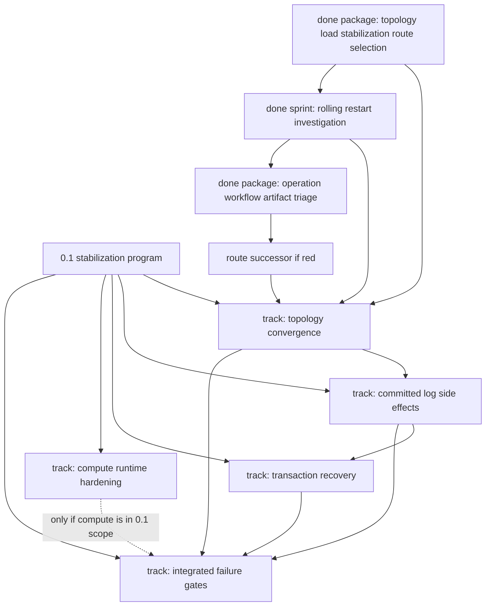

# 0.1 Dependency Map

## Document Role

This is the quick dependency view for the generic tracks consumed by the 0.1
stabilization program and the sprints that currently execute them.

It is a planning map only. It does not activate packages, close sprints, or
replace package metadata.

For a generated current track/sprint table, run `npm run work:tracks`. That
report reads this map alongside `work/tracks/` and the generated current-blocker
snapshot.

## Current Execution Attachment

| Execution item | Attached track | Depends on | Unblocks | Status |
| --- | --- | --- | --- | --- |
| `work/sprints/done-2026-q2-topology-convergence-complexity-reduction.md` | [`topology-convergence`](../tracks/topology-convergence.md) | handoff-contract implementation proof and reduced representative classification | committed side-effect work only after a successor blocker is opened and evidence names that track | done reduced |
| `work/packages/done-20260515-topology-publication-active-gate-handoff-contract-consolidation.md` | [`topology-convergence`](../tracks/topology-convergence.md) | subagent sequencing, owner-file proof, and end-to-end handoff contract cutover | topology track reduction to startup active-gate snapshot coverage owner reconcile | done handoff |
| `work/sprints/done-2026-q2-topology-rolling-restart-green-gate-closure.md` | [`topology-convergence`](../tracks/topology-convergence.md) | canonical frontier steering repair after rebalancer-handoff reduction | committed side-effect work only after rolling-restart is green or names a narrower blocker | done/superseded |
| `work/packages/done-20260515-rolling-restart-canonical-frontier-steering-repair.md` | [`topology-convergence`](../tracks/topology-convergence.md) | current-blocker, sprint, track, and release state aligned to `startup_active_gate_owner / snapshot_coverage` | next runtime package with real review subagent proof | done steering repair |
| `work/packages/done-20260515-publication-active-gate-reconcile-bridge-simplification.md` | [`topology-convergence`](../tracks/topology-convergence.md) | steering repair closed and handoff probe still requires `reconcile_owner_membership_publication` | focused startup active-gate bridge proof | done |
| `work/sprints/done-2026-q2-topology-convergence-theory-ladder.md` | [`topology-convergence`](../tracks/topology-convergence.md) | stale active tracker pointers repaired and operation-progress architecture package closed | fresh rolling-restart evidence chooses the next theory sprint or runtime owner-boundary package | done |
| `work/packages/done-20260521-rolling-restart-theory-baseline-probe.md` | [`topology-convergence`](../tracks/topology-convergence.md) | active theory-ladder sprint | first post-reset rolling-restart baseline classification | done same-frontier |
| `work/packages/done-20260521-topology-publication-reconcile-system-theory.md` | [`topology-convergence`](../tracks/topology-convergence.md) | baseline theory selected publication_ack_convergence / publication_convergence | holistic publication-reconcile theory before runtime promotion | done migrated |
| `work/packages/done-20260525-rolling-restart-operation-workflow-owner-workflow-progress.md` | [`topology-convergence`](../tracks/topology-convergence.md) | rolling-restart route selected `operation_workflow_owner / workflow_progress` | classified backpressure and priority-recovery residual route proof | done reduced |
| `work/packages/done-20260525-topology-load-convergence-discovery.md` | [`topology-convergence`](../tracks/topology-convergence.md) | heavy-load baseline route evidence | deferred startup readiness support route after load topology frontier clears | done migrated |
| `work/packages/done-20260525-topology-load-stabilization-route-selection.md` | [`topology-convergence`](../tracks/topology-convergence.md) | latest rolling-restart route, heavy-load falsifier, and prior load-readiness support evidence | successor package for `operation_workflow_owner / workflow_progress` with required priority residual split/proof | done route-selection |
| `work/sprints/done-2026-q2-rolling-restart-resume-activation.md` | [`topology-convergence`](../tracks/topology-convergence.md) | fresh rolling-restart evidence and active-gate owner-boundary migration proof | close the active-gate discriminator and queue workflow-progress causal-escalation proof | done |
| `work/sprints/done-2026-q2-rolling-restart-fully-green.md` | [`topology-convergence`](../tracks/topology-convergence.md) | resume-activation closed with priority recovery satisfied but representative still red | active rolling-restart investigation successor owns the current first frontier | done |
| `work/sprints/done-2026-q2-rolling-restart-investigation.md` | [`topology-convergence`](../tracks/topology-convergence.md) | fresh rolling-restart snapshot-freshness rerun selected `operation_workflow_owner / workflow_progress` | one bounded successor, representative green, or architecture experiment after workflow state repair | done |
| `work/packages/done-20260526-rolling-restart-operation-workflow-owner-workflow-progress.md` | [`topology-convergence`](../tracks/topology-convergence.md) | active investigation sprint and generated current-blocker snapshot | classify `priority_recovery_partition_progress` before runtime edits | done triage |

## Track Dependencies

| Track | Depends on | Unblocks | Current state |
| --- | --- | --- | --- |
| [`topology-convergence`](../tracks/topology-convergence.md) | latest rolling-restart route evidence plus heavy-load falsifier | committed-log side-effect investigation, or a narrower topology successor after workflow-progress backpressure clears | latest rolling-restart investigation sprint done; no active topology package |
| [`committed-log-side-effects`](../tracks/committed-log-side-effects.md) | topology no longer owns the active execution slot, or evidence names uncommitted side effects as the blocker | transaction recovery hardening and integrated failure gates | planned |
| [`transaction-recovery`](../tracks/transaction-recovery.md) | committed-entry side-effect ordering understood or explicitly unrelated | integrated failure gates | planned |
| [`compute-runtime-hardening`](../tracks/compute-runtime-hardening.md) | 0.1 product decision: compute in scope or explicitly scoped out | integrated failure gates only when compute is in scope | optional/planned |
| [`integrated-failure-gates`](../tracks/integrated-failure-gates.md) | topology, side effects, transaction recovery, and compute decision if applicable | 0.1 release confidence | planned |

## Graph

## Reading Rules

1. A dependency means "do not claim this downstream track is ready for release
   proof yet." It does not forbid exploratory read-only analysis.
2. A planned track becomes executable only through a work package.
3. If canonical evidence names a downstream track as the current blocker, update
   this map and the relevant track before opening the successor package.
4. If the active package migrates to a narrower owner boundary, attach the
   successor package to the track that owns that new boundary.
5. Do not add individual package-to-package edges here unless they affect track
   or release ordering.

## Update Triggers

Update this map when:

- the active sprint changes
- the active package changes
- a package migrates to another track
- a track becomes blocked, active, closed, or out of scope
- the compute-runtime track is declared in or out of 0.1 scope
