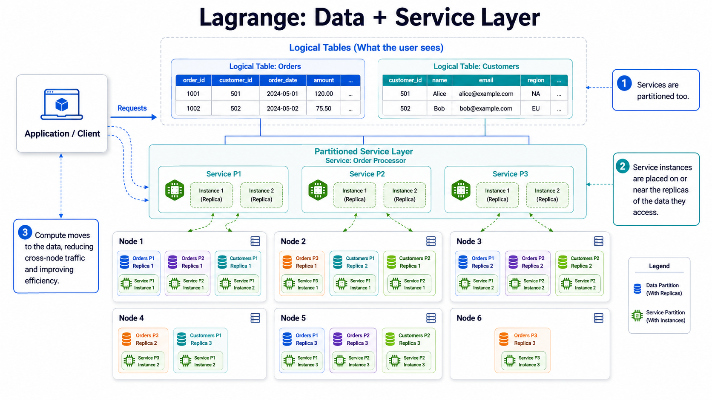

# Architecture Index

This is the canonical entrypoint for current system architecture. The former monolithic `../architecture.md` now points here for compatibility.

Use this index to choose the narrowest architecture domain file before reading implementation detail.

## Start Here

New to the system? Read in this order for the shortest path from "what is this?"
to "I understand how this works":

1. [Architecture Overview](overview.md) — what the system is and its ownership model
2. [Lagrange Architecture Diagrams](lagrange_architecture_diagrams.md) — the visual mental model
3. [Bootstrap And Data Flow](bootstrap.md) — how a cluster forms and routes queries
4. [Query Runtime Architecture](query-runtime.md) — the compute-near-data execution model
5. [Raft, Rebalancing, And Placement](rebalance.md) — consensus, placement, and read-locality routing

The domain-file list below is the full ordered tree.

## Visual Overview

The system starts from a classical distributed database — logical tables split
into partitions, each partition replicated across several nodes, with requests
routed to the right partition and executed in parallel:

Lagrange layers a partitioned service tier over that same data layout. Each
service is partitioned and replicated like the data, and the cluster places
every service instance on or near the replicas of the data it accesses so that
compute moves to the data and cross-node traffic is reduced:

## Domain Files

<!-- architecture-domain-files:start -->
- [Architecture Overview](overview.md) - Global architecture role, principles, and single-path ownership contract.
- [Runtime Lifecycle Architecture](runtime-lifecycle.md) - Runtime readiness, lifecycle ownership, runtime descriptors, and observability contracts.
- [Control Plane Architecture](control-plane.md) - Control-plane progression, system-table ownership, node state vocabulary, and configuration ownership.
- [Runtime Components](runtime-components.md) - Node-local components, replicated services, metadata services, and runtime service owners.
- [PostgreSQL Wire And SQL Compatibility](postgres-wire.md) - PostgreSQL wire service flow, endpoint discovery, SQL compatibility, and planned compatibility extensions.
- [Query Runtime Architecture](query-runtime.md) - Programmatic runtime, query bridge, execution-mode dispatch, callback execution, and movement primitives.
- [Bootstrap And Data Flow](bootstrap.md) - Seed and joining bootstrap, query routing, CDC continuity, and meta-service management flow.
- [Raft, Rebalancing, And Placement](rebalance.md) - Addressing, Raft consensus, rebalancing, storage placement, and message-group assignment.
- [Operational Appendices And Archived Patterns](archived-patterns.md) - Error handling, testing, endpoint sync, and discovery appendix material.
<!-- architecture-domain-files:end -->

## Supporting Documents

### Reference

- [Peer Address Resolution And Restart-With-New-IP Recovery](peer-address-resolution.md) - Logical-nodeId-vs-location identity, address resolution order, the three restart-with-new-IP recovery mechanisms, and name-first (hostname) addressing config.
- [Current Owner Maps](current-owner-maps.md) - Current concrete owner maps and subsystem ownership detail.
- [Readiness Gating & Owner-Contract Kernels](readiness-and-owner-contracts.md) - Readiness dimensions (repairEligible/serveEligible), membership-health guards, and the shared cross-layer owner-contract kernels.
- [Runtime Grammar Hierarchy](runtime-grammar-hierarchy.md) - Runtime grammar and boundary hierarchy reference.

### Service Platform

- [Minimal Deployment Surface](minimal-deployment-surface.md) - Selected Artifact / Binding / Cell contract and owner-aligned migration sequence.
- [Lagrange Kernel Platform API v0](lagrange-kernel-platform-api-v0.md) - Kernel platform API contract.
- [Service Control Transport](service-control-transport.md) - Authenticated lifecycle SQL ingress, security boundary, owner route, and rejected admin-RPC alternative.
- [OCI Runtime Host Contract](oci-runtime-host-contract.md) - Bounded Docker Compose host-agent provider, authenticated control envelope, production construction route, and downstream live-proof split.
- [Lagrange Service Manifest](lagrange-service-manifest.md) - Service manifest format and activation model.
- [Lagrange Service Registry](lagrange-service-registry.md) - Service registry architecture.

### Diagrams

- [Lagrange Architecture Diagrams](lagrange_architecture_diagrams.md) - Primary visual architecture references.
- [Lagrange Advanced Architecture Diagrams](lagrange_advanced_architecture_diagrams.md) - Advanced architecture diagrams.

### Contracts & Invariants

- [System Contract Records](contracts/) - Durable failure-class contracts that bind invariants to their owners, models, and runtime paths.
- [Invariant Registry](contracts/invariants.json) - Machine-readable owner-scoped safety/liveness invariants. **Tier 1** verifies each entry's `formalPredicate` against formal models (`npm run model:invariants` / `model:contracts`). **Tier 2 (live-evidence)** verifies an entry's optional `liveEvidence` predicate against the running system or a deterministic repro; a BREACHED status means the running system has diverged from this registry.
- [Core System Logic Contract](contracts/core-system-logic.md) - Low-resolution core owner-flow contract backed by an architecture-adjacent statechart.
- [Readiness Handoff Liveness Contract](contracts/readiness-handoff-liveness.md) - Startup readiness and handoff temporal contract backed by TLA+.
- [Rolling Restart Rebalancer Handoff Contract](contracts/rolling-restart-rebalancer-handoff.md) - Priority recovery handoff convergence contract and decision-table binding.
- [Active Gate Convergence Contract](contracts/active-gate-convergence.md) - Coupled active-gate/rebalancer invariant contract backed by TLA+ and fast-check models.
- [Quest Lifecycle Contract](contracts/quest-lifecycle.md) - Internal development-process contract (not system architecture): workflow statechart for the repository's unit of work.

### Models

- [Architecture Models](models/) - Architecture-owned executable and structured models that move with owner-boundary architecture changes.

## Future Architecture

- [Activation-Cost-Aware Placement](future/activation-cost-aware-placement.md) - Planned placement-cost architecture.
- [Native Artifact Store](future/native-artifact-store.md) - Planned native artifact store architecture.
- [Metastable Convergence Resilience](future/metastable-convergence-resilience.md) - Rolling-restart non-convergence reframed as metastable failure; three resilience directions + measurement gate.
