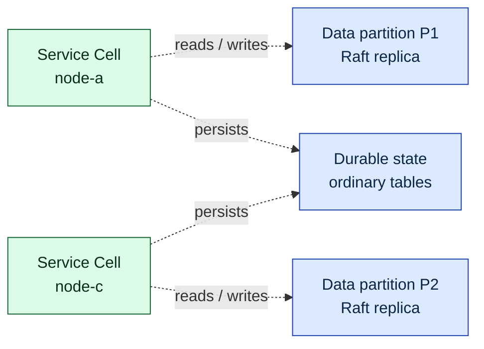

# Architecture Index

This is the canonical entrypoint for current system architecture. The former monolithic `../architecture.md` now points here for compatibility.

Use this index to choose the narrowest architecture domain file before reading implementation detail.

## Start Here

New to the system? Read in this order for the shortest path from "what is this?"
to "I understand how this works":

1. [The Lagrange System Model](system-model.md) — the mental model and diagram legend; start here
2. [Process: Partitioning](process-partitioning.md) — key ranges, query resolution, split and merge
3. [Process: Replication](process-replication.md) — the write path, CDC propagation, replica repair
4. [Process: Rebalancing](process-rebalancing.md) — placement scoring, admission, operation lifecycle
5. [Process: Request Routing](process-request-routing.md) — how SQL and service requests find their target
6. [Process: Data Affinity](process-data-affinity.md) — how compute is moved to its data
7. [Architecture Overview](overview.md) — the single-path ownership contract

The five process documents are the illustrated walkthrough of how the system
works. The domain-file list below is the full ordered tree.

## Visual Overview

Lagrange layers placed runtime-service Cells over a classical partitioned,
Raft-replicated data layout. Cells have no per-service Raft log; durable service
state remains in ordinary tables. The placement scorer keeps each Cell on or
near replicas of the data it accesses so that compute moves to the data:

[The Lagrange System Model](system-model.md) explains this picture and defines
the colour legend used by every process diagram.

## Domain Files

<!-- architecture-domain-files:start -->
- [The Lagrange System Model](system-model.md) - Storage stack, replicated group types, node anatomy, the control loop, and the shared diagram legend.
- [Process: Partitioning](process-partitioning.md) - Partition keys, key ranges, query-to-partition resolution, and the managed split/merge workflows.
- [Process: Replication](process-replication.md) - Raft groups, the write path, CDC propagation to read models, and replica loss and repair.
- [Process: Rebalancing](process-rebalancing.md) - Placement triggers, score dimensions, capacity admission, operation lifecycle, and movement safety guards.
- [Process: Request Routing](process-request-routing.md) - SQL ingress normalisation, replica candidate selection and retry, and service request routing through Bindings and Cells.
- [Process: Data Affinity](process-data-affinity.md) - Access attribution feed, affinity weights, placement pull, and read-locality routing.
- [Architecture Overview](overview.md) - Global architecture role, principles, and single-path ownership contract.
- [Runtime Lifecycle Architecture](runtime-lifecycle.md) - Runtime readiness, lifecycle ownership, runtime descriptors, and observability contracts.
- [Control Plane Architecture](control-plane.md) - Control-plane progression, system-table ownership, node state vocabulary, and configuration ownership.
- [Runtime Components](runtime-components.md) - Node-local components, replicated services, metadata services, and runtime service owners.
- [PostgreSQL Wire And SQL Compatibility](postgres-wire.md) - PostgreSQL wire service flow, endpoint discovery, and implemented SQL compatibility.
- [Query Runtime Architecture](query-runtime.md) - Programmatic runtime, query bridge, execution-mode dispatch, callback execution, and movement primitives.
- [Bootstrap And Data Flow](bootstrap.md) - Seed and joining bootstrap, query routing, CDC continuity, and meta-service management flow.
- [Raft, Rebalancing, And Placement](rebalance.md) - Addressing, Raft consensus, rebalancing, storage placement, and message-group assignment.
- [Operational Architecture Appendices](operational-appendices.md) - Error handling, testing, endpoint sync, and discovery architecture.
<!-- architecture-domain-files:end -->

## Supporting Documents

### Reference

- [Peer Address Resolution And Restart-With-New-IP Recovery](peer-address-resolution.md) - Logical-nodeId-vs-location identity, address resolution order, the three restart-with-new-IP recovery mechanisms, and name-first (hostname) addressing config.
- [Current Owner Maps](current-owner-maps.md) - Current concrete owner maps and subsystem ownership detail.
- [Readiness Gating & Owner-Contract Kernels](readiness-and-owner-contracts.md) - Readiness dimensions (repairEligible/serveEligible), membership-health guards, and the shared cross-layer owner-contract kernels.

### Service Platform

- [Minimal Deployment Surface](minimal-deployment-surface.md) - Current Artifact / Binding / Cell contract and owner map.
- [Service Control Transport](service-control-transport.md) - Authenticated lifecycle SQL ingress, security boundary, and owner route.
- [Lagrange Service Manifest](lagrange-service-manifest.md) - Service manifest format and activation model.
- [Lagrange Service Registry](lagrange-service-registry.md) - Service registry architecture.

### Contracts & Invariants

- [System Contract Records](contracts/) - Durable failure-class contracts that bind invariants to their owners, models, and runtime paths.
- [Invariant Registry](contracts/invariants.json) - Machine-readable owner-scoped safety/liveness invariants. **Tier 1** verifies each entry's `formalPredicate` against formal models (`npm run model:invariants` / `model:contracts`). **Tier 2 (live-evidence)** verifies an entry's optional `liveEvidence` predicate against the running system or a deterministic repro; a BREACHED status means the running system has diverged from this registry.
- [Core System Logic Contract](contracts/core-system-logic.md) - Low-resolution core owner-flow contract backed by an architecture-adjacent statechart.
- [Readiness Handoff Liveness Contract](contracts/readiness-handoff-liveness.md) - Startup readiness and handoff temporal contract backed by TLA+.
- [Rolling Restart Rebalancer Handoff Contract](contracts/rolling-restart-rebalancer-handoff.md) - Priority recovery handoff convergence contract and decision-table binding.
- [Active Gate Convergence Contract](contracts/active-gate-convergence.md) - Coupled active-gate/rebalancer invariant contract backed by TLA+ and fast-check models.
- [Quest Lifecycle Contract](contracts/quest-lifecycle.md) - Internal development-process contract (not system architecture): workflow statechart for the repository's unit of work.

### Models

- [Architecture Models](models/) - Architecture-owned executable and structured models that move with owner-boundary architecture changes.

Unimplemented designs live under `solve/specs/` and are linked from the
roadmap rather than from this current-architecture index.
