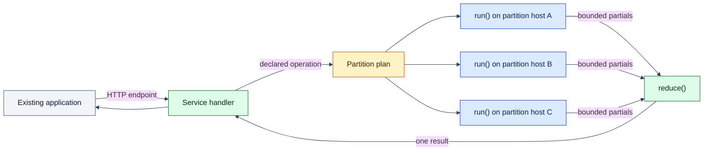

# Architecture

Start with the question you need answered. The architecture is layered from the
service contract down to storage and control-plane mechanisms.

## One picture

The rows selected for a shard are read from that host's local partition
replica. The exchange carries emitted partials and the final result. Writes
still use the partition leader and Raft quorum.

## Product architecture

Read these first:

1. [The Lagrange System Model](system-model.md) - tables, partitions, replicas,
   Artifacts, Bindings, Cells, and durable-state ownership.
2. [Process: Request Routing](process-request-routing.md) - how SQL and service
   work find the current target.
3. [Process: Data Affinity](process-data-affinity.md) - how observed access and
   activation leases pull compute toward data.
4. [Process: Replication](process-replication.md) - commit, propagation,
   snapshot recovery, and replica repair.
5. [Live Query Data Plane](live-query-data-plane.md) - target contract for
   push-backed query observation with no polling for distributed change
   detection.
6. [Process: Rebalancing](process-rebalancing.md) - continuous placement and
   movement safety.

For the developer-visible contract, read
[Execution Semantics](../docs/execution-semantics.md). For status rather than
architecture, read
[Current Capabilities And Limitations](../docs/current-capabilities-and-limitations.md).

## By question

| Question | Start here |
| --- | --- |
| What does the cluster store? | [System model](system-model.md) |
| How is a table divided? | [Partitioning](process-partitioning.md) |
| How does a write become durable? | [Replication](process-replication.md) |
| How are reads and writes routed? | [Request routing](process-request-routing.md) |
| How should a query result stay current after remote writes? | [Live query data plane](live-query-data-plane.md) |
| How does one service call fan out and reduce? | [Minimal deployment surface](minimal-deployment-surface.md) and [query runtime](query-runtime.md) |
| How is missing compute activated on a data host? | [Data affinity](process-data-affinity.md) |
| What moves after failures, splits, or load changes? | [Rebalancing](process-rebalancing.md) |
| How do nodes form a cluster? | [Bootstrap](bootstrap.md) |
| How does PostgreSQL-wire ingress work? | [PostgreSQL wire](postgres-wire.md) |
| Which runtime component owns a concern? | [Runtime components](runtime-components.md) |

## Important current boundaries

- Lagrange includes its own partitioned SQL storage. It does not inject service
  functions into an existing PostgreSQL cluster.
- The public service paths are HTTP request Bindings and distributed call
  Bindings.
- A call currently uses one literal single-table selector, one bounded row batch
  per shard, finite numeric partials, and one reducer.
- The generic push-backed live-query data plane is an approved Phase 0.3 target,
  not a current general application-data capability. Existing admin/cache-backed
  live-query pieces must not be read as proof of that broader contract.
- Managed OCI container activation is not a public service path.
- PostgreSQL compatibility is a measured subset, not an arbitrary ORM claim.
- Node-to-node transport assumes a trusted private network.
- Backup/PITR, a supported rolling-upgrade contract, and a public-path scale
  benchmark remain unavailable.

## Deeper reference

- [Architecture overview](overview.md) - implementation principles and owner
  boundaries.
- [Live query data plane](live-query-data-plane.md) - target live-observation
  ownership, CDC reuse, grouping, snapshot/frontier, and no-polling contract.
- [Runtime lifecycle](runtime-lifecycle.md) - runtime readiness and driver
  ownership.
- [Control plane](control-plane.md) - durable progression and metadata
  ownership.
- [Runtime components](runtime-components.md) - node-local and replicated
  components.
- [Query runtime](query-runtime.md) - SQL and programmatic execution internals.
- [Operational appendices](operational-appendices.md) - error, test, endpoint,
  and discovery details.

Compatibility scaffolds, legacy callback paths, source-file owner maps, and
machine-pinned contracts are deeper implementation material. They do not define
the recommended service-authoring path.
