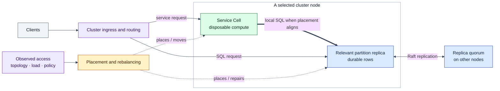

# Lagrange Architecture

This is the canonical human entry point for the implemented Lagrange
architecture. Start here for the map, continue to
[The Lagrange System Model](system-model.md) for the vocabulary, and then choose
the process document for the mechanism you need.

For an exact statement of what is implemented, partial, or unsupported, use
[current capabilities and limitations](../docs/current-capabilities-and-limitations.md).
The architecture documents explain how the system is intended to work; the
capability document defines what the checked-in implementation supports today.

## The idea in one picture

Lagrange combines partitioned, replicated SQL storage with placed service
execution. Durable state remains in tables. Disposable service Cells are placed
near the partitions they use, and both data and compute are continuously
reconciled as the cluster changes.

This picture does **not** mean that distributed-systems costs disappear. Reads
may still be remote, writes still require the partition leader and its quorum,
and cross-partition operations still communicate. The architectural advantage
is narrower: locality becomes something the cluster can create and maintain
instead of something application teams arrange manually.

## Five anchors

Keep these five statements in mind while reading the deeper documents:

1. **Tables hold durable state.** User data, service state, and cluster metadata
   all live in ordinary partitioned tables.
2. **Partitions are the unit of distribution.** A partition owns a primary-key
   range and is the unit of routing, replication, split, merge, and placement.
3. **Replicas provide durability; Cells provide compute.** Partition replicas
   are Raft members. Runtime-service Cells are disposable and have no
   per-service Raft log.
4. **Requests use shared routing and execution surfaces.** Protocol adapters and
   service calls converge on the same SQL engine, metadata model, and message
   router rather than creating independent execution paths.
5. **Nothing is placed once and forgotten.** Replica movement, Cell placement,
   partition changes, node changes, and observed access all feed continuous
   reconciliation.

## The four flows to understand

### 1. A request finds the relevant data

Ingress is normalised, predicates narrow the partition set where possible, and
routing chooses eligible replicas. Writes target the canonical partition
leader; reads can prefer nearby replicas.

Read: [Process: Request Routing](process-request-routing.md)

### 2. A write becomes durable

The leader appends the proposal, replicates it through Raft, applies it after a
majority commit, and emits CDC from the apply path. Service placement can
shorten the application path, but it does not weaken consensus.

Read: [Process: Replication](process-replication.md)

### 3. Work fans out instead of pulling all rows inward

A multi-partition operation routes work to the partitions, performs local work,
and merges compact partial results. The network is still involved, but raw and
intermediate data need not all move to a separately placed application tier.

Read: [Process: Request Routing](process-request-routing.md) and
[Query Runtime Architecture](query-runtime.md)

### 4. Locality follows changing usage

Real service-to-partition access becomes affinity evidence. Placement uses that
evidence alongside capacity, spread, failure, and policy constraints. If data
moves or partitions change, Cells can be replaced near the new layout.

Read: [Process: Data Affinity](process-data-affinity.md) and
[Process: Rebalancing](process-rebalancing.md)

## Choose a reading path

| Question | Start here |
| --- | --- |
| What objects exist, what owns state, and how do they relate? | [The Lagrange System Model](system-model.md) |
| How does a table become key ranges and how are queries narrowed? | [Process: Partitioning](process-partitioning.md) |
| How does a write commit and how is a replica recovered? | [Process: Replication](process-replication.md) |
| How does SQL or a service request find its target? | [Process: Request Routing](process-request-routing.md) |
| How does observed access pull compute toward data? | [Process: Data Affinity](process-data-affinity.md) |
| Why and how does the cluster move replicas and Cells? | [Process: Rebalancing](process-rebalancing.md) |
| How do Artifact, Binding, and Cell deployment work? | [Minimal Deployment Surface](minimal-deployment-surface.md) |
| How does a node or cluster start and join? | [Bootstrap And Data Flow](bootstrap.md) |
| Which component owns a specific runtime concern? | [Runtime Components](runtime-components.md) |
| Which claims are true in the current build? | [Current capabilities and limitations](../docs/current-capabilities-and-limitations.md) |

## Current boundaries

The architecture is easiest to understand when its boundaries are explicit:

- Lagrange is a substantial experimental system, not yet a mature drop-in
  production database.
- Request Bindings are the publicly invocable external service path today;
  other accepted Binding source kinds do not all have public adapters.
- Managed OCI container execution is not active; externally installed services
  currently run as genuine WASI components.
- PostgreSQL wire compatibility is a bounded measured slice, not a claim of
  arbitrary PostgreSQL or ORM compatibility.
- Query narrowing, indexes, snapshots, and learner promotion have important
  current limitations documented in the capability matrix.

These are implementation boundaries, not alternate architecture paths. Do not
infer a fallback system from code that is scaffolded, retained for compatibility,
or not production-invoked.

## Full architecture tree

The process documents are the recommended illustrated walkthrough. The domain
files below are the complete human architecture tree.

<!-- architecture-domain-files:start -->
- [The Lagrange System Model](system-model.md) - Storage stack, replicated group types, node anatomy, the control loop, and the shared diagram legend.
- [Process: Partitioning](process-partitioning.md) - Partition keys, key ranges, query-to-partition resolution, and the managed split/merge workflows.
- [Process: Replication](process-replication.md) - Raft groups, the write path, CDC propagation to read models, and replica loss and repair.
- [Process: Rebalancing](process-rebalancing.md) - Placement triggers, score dimensions, capacity admission, operation lifecycle, and movement safety guards.
- [Process: Request Routing](process-request-routing.md) - SQL ingress normalisation, replica candidate selection and retry, and service request routing through Bindings and Cells.
- [Process: Data Affinity](process-data-affinity.md) - Access attribution feed, affinity weights, placement pull, and read-locality routing.
- [Architecture Overview](overview.md) - Global architecture role, principles, and single-path ownership contract.
- [Runtime Lifecycle Architecture](runtime-lifecycle.md) - Runtime readiness, lifecycle ownership, runtime descriptors, and observability contracts.
- [Control Plane Architecture](control-plane.md) - Control-plane progression, system-table ownership, node state vocabulary, and configuration ownership.
- [Runtime Components](runtime-components.md) - Node-local components, replicated services, metadata services, and runtime service owners.
- [PostgreSQL Wire And SQL Compatibility](postgres-wire.md) - PostgreSQL wire service flow, endpoint discovery, and implemented SQL compatibility.
- [Query Runtime Architecture](query-runtime.md) - Programmatic runtime, query bridge, execution-mode dispatch, callback execution, and movement primitives.
- [Bootstrap And Data Flow](bootstrap.md) - Seed and joining bootstrap, query routing, CDC continuity, and meta-service management flow.
- [Raft, Rebalancing, And Placement](rebalance.md) - Addressing, Raft consensus, rebalancing, storage placement, and message-group assignment.
- [Operational Architecture Appendices](operational-appendices.md) - Error handling, testing, endpoint sync, and discovery architecture.
<!-- architecture-domain-files:end -->

## Supporting documents

### Reference

- [Peer Address Resolution And Restart-With-New-IP Recovery](peer-address-resolution.md) — logical node identity, address resolution, and restart recovery.
- [Readiness Gating And Owner-Contract Kernels](readiness-and-owner-contracts.md) — readiness dimensions, membership guards, and shared owner contracts.

### Service platform

- [Minimal Deployment Surface](minimal-deployment-surface.md) — current Artifact / Binding / Cell contract and owner map.
- [Service Control Transport](service-control-transport.md) — authenticated lifecycle SQL ingress and security boundary.
- [Lagrange Service Manifest](lagrange-service-manifest.md) — service manifest format and activation model.
- [Lagrange Service Registry](lagrange-service-registry.md) — service registry architecture.

Contributor-only owner ledgers, executable model records, workflow contracts,
and planning material are deliberately absent from this human index. This tree
describes the implemented system rather than the process used to change it.
