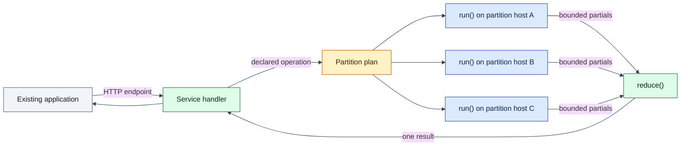

# Architecture

Start with the question you need answered. The architecture is layered from the
service contract down to storage and control-plane mechanisms.

## One picture

For a distributed call, a shard is one selected partition's task. Its `run()`
executes on the partition leader's host and reads that host's local SQLite
replica. Reduction runs on the holder of the invocation's reduce lease, not on
every data replica. The exchange carries emitted partials and the final result;
replication and coordination still generate their own network traffic.

This call path reads user tables; it does not make the service functions part
of Raft's replicated state-machine execution. Cells are disposable execution
instances, not per-service consensus groups. Durable service state belongs in
ordinary replicated tables. See [Vocabulary](../docs/vocabulary.md).

Do not conflate three mechanisms: distributed calls require leader-local input;
ordinary SQL reads may select other eligible replicas; placement affinity
changes where service instances live over time. The latter two do not replace
the call path's locality requirement.

## Current architecture

Start with the [programming model](../docs/native-programming-model.md) and
[execution semantics](../docs/execution-semantics.md) for what an application
can rely on. Then read the implementation in this order:

1. [The Lagrange System Model](system-model.md) - tables, partitions, replicas,
   Artifacts, Bindings, Cells, and durable-state ownership.
2. [Process: Request Routing](process-request-routing.md) - ordinary SQL,
   HTTP requests, and leader-local distributed calls.
3. [Process: Replication](process-replication.md) - commit, propagation,
   snapshot recovery, and replica repair.
4. [Process: Data Affinity](process-data-affinity.md) - observed-access
   placement, read preference, and call-host activation leases.
5. [Process: Rebalancing](process-rebalancing.md) - continuous placement and
   movement safety.

The [related-systems guide](../docs/related-systems.md) provides external
reference points. For implementation status rather than architecture, use
[Current Capabilities And Limitations](../docs/current-capabilities-and-limitations.md).

## Planned designs, not current guarantees

[PostgreSQL Locking Reads](postgres-locking-reads.md) describes the planned
Phase 0.3 `SELECT ... FOR UPDATE` contract. [Live Query Data Plane](live-query-data-plane.md)
describes the target for general push-backed query observation. Their presence
in this index does not mean those product contracts are already supported.

## By question

| Question | Start here |
| --- | --- |
| What does the cluster store? | [System model](system-model.md) |
| How is a table divided? | [Partitioning](process-partitioning.md) |
| How does a write become durable? | [Replication](process-replication.md) |
| How are reads and writes routed? | [Request routing](process-request-routing.md) |
| How will PostgreSQL `SELECT ... FOR UPDATE` become a real distributed locking read? | [PostgreSQL locking reads](postgres-locking-reads.md) |
| How should a query result stay current after remote writes? | [Live query data plane](live-query-data-plane.md) |
| How does one service call fan out and reduce? | [Execution semantics](../docs/execution-semantics.md), then [minimal deployment surface](minimal-deployment-surface.md) |
| How is missing compute activated on a data host? | [Data affinity](process-data-affinity.md) |
| What moves after failures, splits, or load changes? | [Rebalancing](process-rebalancing.md) |
| How do nodes form a cluster? | [Bootstrap](bootstrap.md) |
| How does PostgreSQL-wire ingress work? | [PostgreSQL wire](postgres-wire.md) |
| Which runtime component owns a concern? | [Runtime components](runtime-components.md) |

## Important current boundaries

- Lagrange includes its own partitioned SQL storage. It does not inject service
  functions into an existing PostgreSQL cluster.
- The public service paths are HTTP request Bindings and distributed call
  Bindings.
- A call currently uses one literal single-table selector, one bounded row batch
  per shard, finite numeric partials, and one reducer.
- PostgreSQL `SELECT ... FOR UPDATE` is a planned Phase 0.3 core capability, not
  a current locking-read claim. The current transaction model uses snapshot
  isolation plus first-committer-wins write-conflict detection.
- The generic push-backed live-query data plane is an approved Phase 0.3 target,
  not a current general application-data capability. Existing admin/cache-backed
  live-query pieces must not be read as proof of that broader contract.
- Managed OCI container activation is not a public service path.
- PostgreSQL compatibility is a measured subset, not an arbitrary ORM claim.
- Node-to-node transport assumes a trusted private network.
- Backup/PITR, a supported rolling-upgrade contract, and a public-path scale
  benchmark remain unavailable.

## Deeper reference

- [Architecture overview](overview.md) - implementation principles and owner
  boundaries.
- [PostgreSQL locking reads](postgres-locking-reads.md) - planned locking-read
  semantic, ownership, and proof boundary.
- [Live query data plane](live-query-data-plane.md) - target live-observation
  ownership, CDC reuse, grouping, snapshot/frontier, and no-polling contract.
- [Runtime lifecycle](runtime-lifecycle.md) - runtime readiness and driver
  ownership.
- [Control plane](control-plane.md) - durable progression and metadata
  ownership.
- [Runtime components](runtime-components.md) - node-local and replicated
  components.
- [Query runtime](query-runtime.md) - SQL and programmatic execution internals.
- [Operational appendices](operational-appendices.md) - error, test, endpoint,
  and discovery details.

Compatibility scaffolds, legacy callback paths, source-file owner maps, and
machine-pinned contracts are deeper implementation material. They do not define
the recommended service-authoring path.