# Lagrange — Advanced Architecture Diagrams

This document extends the core diagram pack with the diagrams that are usually
most helpful when explaining a distributed database and compute-near-data
system to developers, contributors, and potential users.

These diagrams are written in **Mermaid**, so GitHub should render them
directly in the repository.

---

# 1. Partition Lifecycle

This shows how a table partition can move through its normal operational
lifecycle as load and data distribution change.

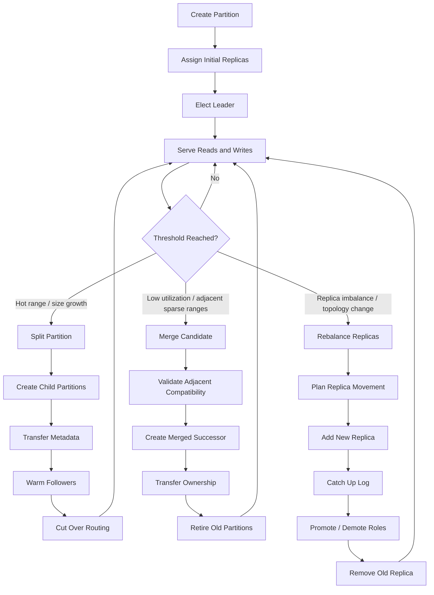

### What this communicates

- Partitions are not static; they adapt to workload and topology.
- Split, merge, and rebalance are explicit control-plane operations.
- Routing changes only after the new state is ready.

---

# 2. Partition Split Flow

This version focuses specifically on split mechanics.

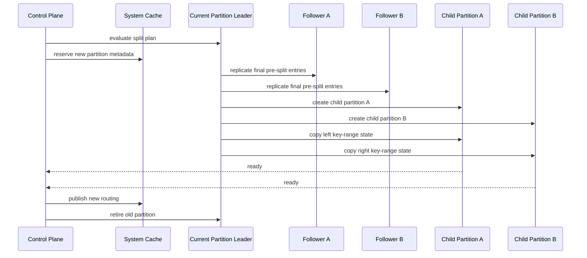

---

# 3. Distributed Execution Pipeline

This diagram shows the most important "developer mental model" for the runtime:
query selection, local execution, optional shuffle, and reduction.

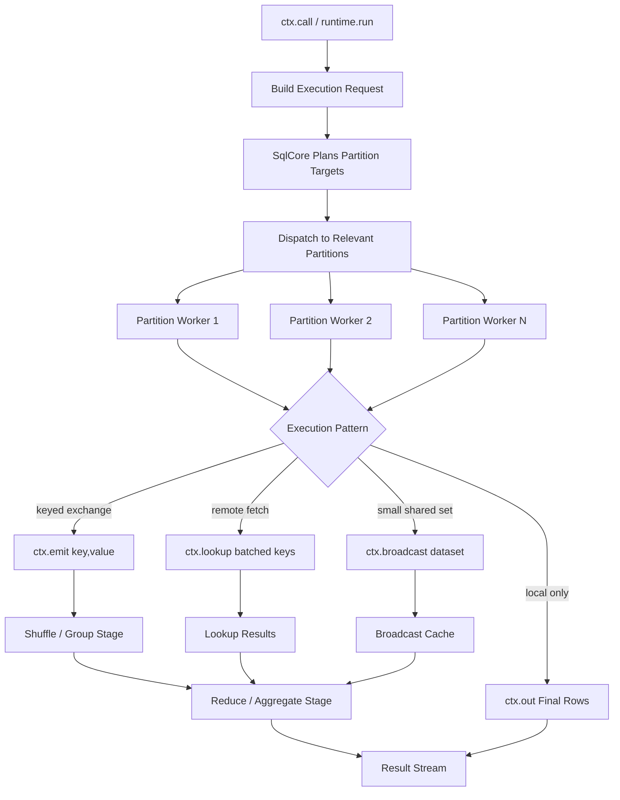

### What this communicates

- `ctx.call(...)` is the entry point, but the real behavior depends on plan shape.
- Exchange, lookup, and broadcast are first-class movement primitives.
- Reduce happens after local work, not before.

---

# 4. Stage Execution with Shuffle

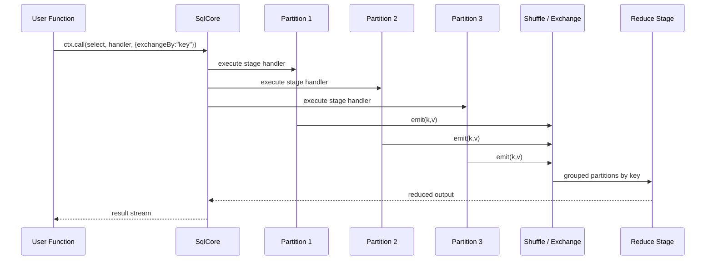

---

# 5. Query Routing and Metadata Resolution

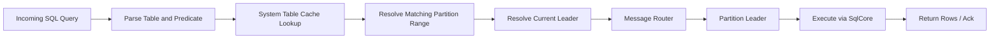

---

# 6. Bootstrap Process

This is one of the most useful diagrams for contributors, because it explains
how the system avoids the "empty metadata" problem during cluster formation.

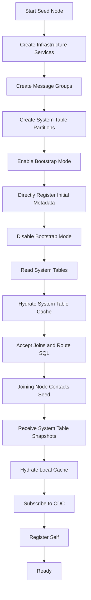

---

# 7. Seed Node Bootstrap Sequence

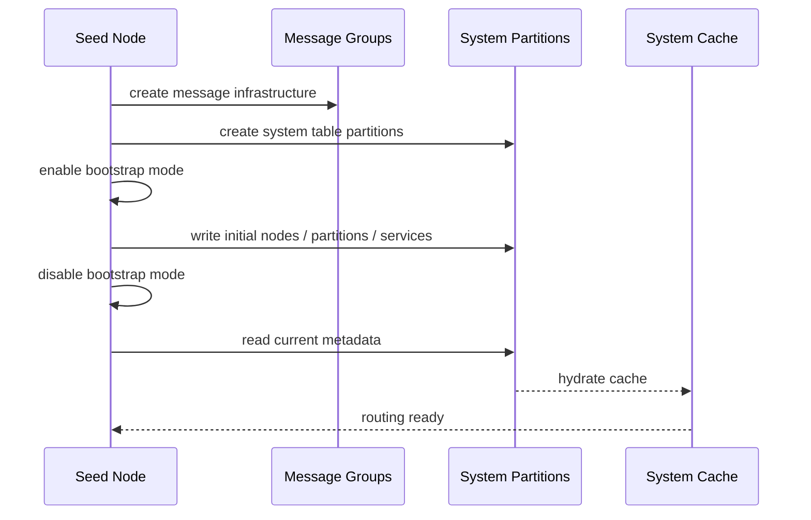

---

# 8. Joining Node Bootstrap Sequence

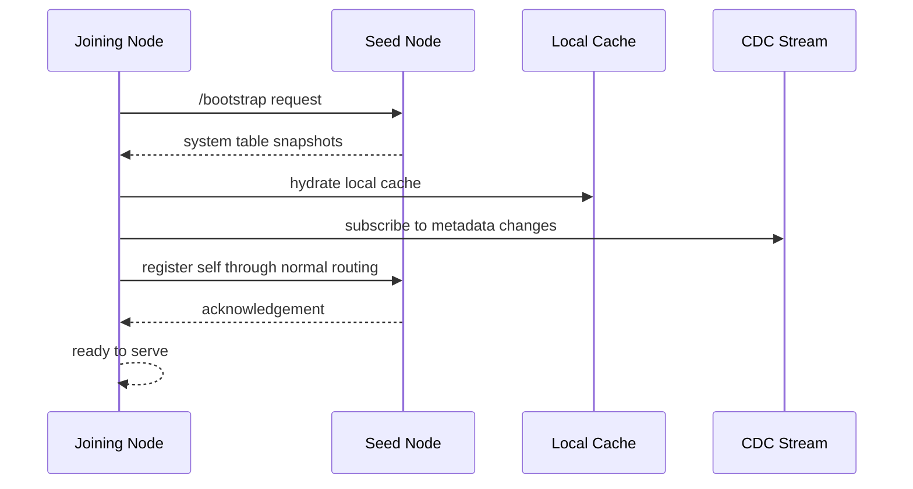

---

# 9. Metadata Propagation by CDC

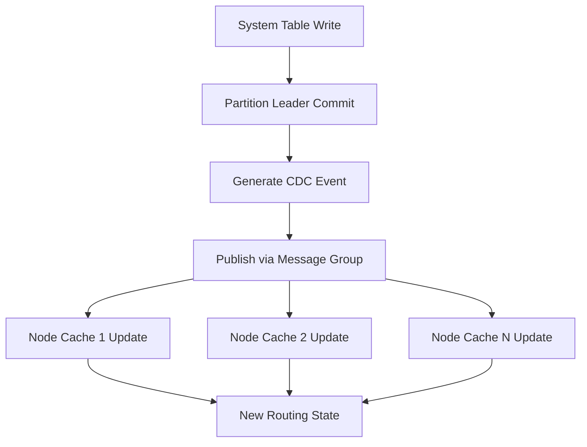

---

# 10. WASM Module Activation

This is helpful for explaining why the WASM runtime is safe and controlled.

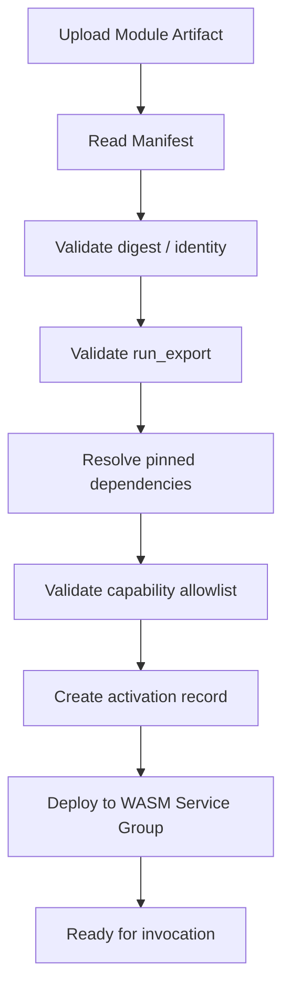

---

# 11. WASM Service Group Replication

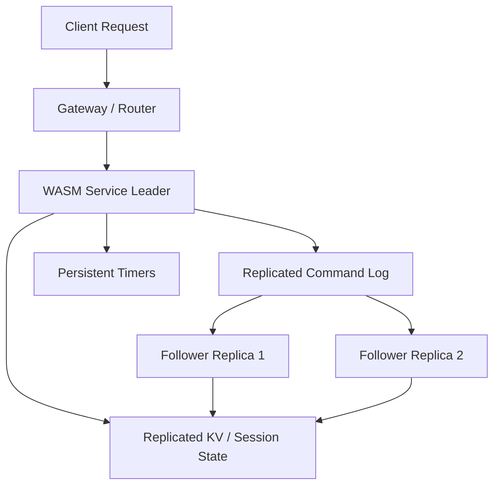

---

# 12. Service Platform — Definitions, Runtime Drivers, and Registry

Services are first-class: a partition is a service, and so are the SQL engine,
WASM services, and the admin/meta services. This diagram separates what is
**shipped** (the replicated service runtime driven by `service_definitions`) from
the **planned** installable-service registry (OCI packaging, manifest, kernel
capability model — designed in `lagrange-service-registry.md`,
`lagrange-service-manifest.md`, and `lagrange-kernel-platform-api-v0.md`, not yet
in code).

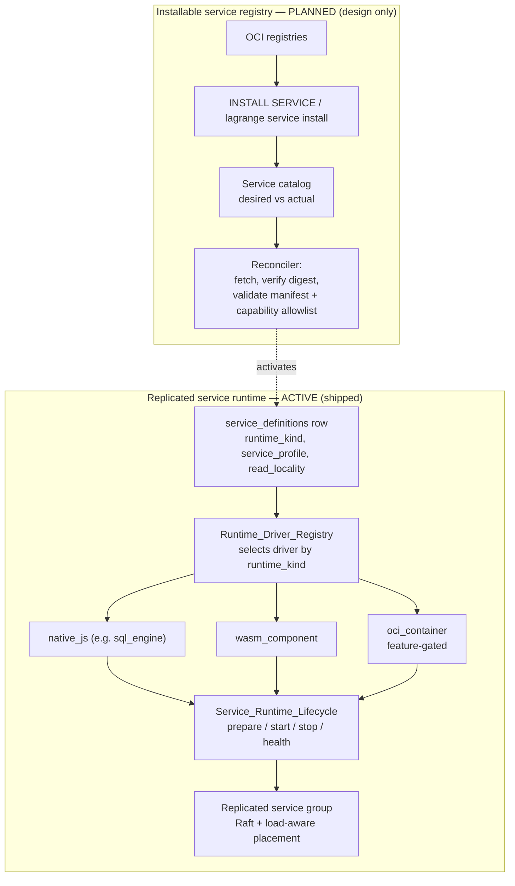

### What this communicates

- One `service_definitions` row + `Runtime_Driver_Registry` selects the runtime
  driver; `Service_Runtime_Lifecycle` owns prepare/start/stop/health for every
  runtime kind — no per-kind lifecycle fork.
- The OCI registry / manifest / kernel-API layer is designed but not yet built;
  it feeds `service_definitions` when it lands.

---

# 13. Placement, Rebalancing, and Read-Locality Routing

Placement (where replicas live, write/topology-time) and read-locality routing
(which replica a read is sent to, read-time) are **two distinct layers** that are
easy to conflate. Both service↔data placement affinity and read-locality routing
are active; activation-cost scoring remains future.

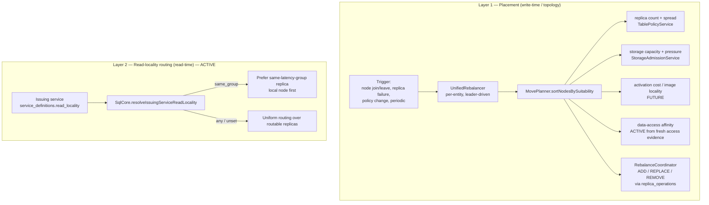

### What this communicates

- `UnifiedRebalancer` + the single `MovePlanner` own placement. Production
  scoring composes replica spread, storage, incumbent movement cost, and
  data-access affinity derived from fresh `service_partition_access` evidence.
  Activation-cost remains a planned placement dimension (see
  `future/activation-cost-aware-placement.md`).
- **Read-locality is a separate, shipped routing policy:** a service with
  `read_locality = same_group` has its reads steered to its own latency group
  (local node first); `any` keeps uniform load-spreading. This is resolved
  per-query from the node-local CDC cache — no placement move required.

---

# Coverage and Intentional Gaps

These two packs cover the query/execution/WASM/CDC/bootstrap core, the service
platform, and placement/read-locality. Not yet diagrammed (tracked, not
forgotten): control-plane readiness progression and the owner-contract kernels
(see [`readiness-and-owner-contracts.md`](readiness-and-owner-contracts.md)), and
the PostgreSQL wire/endpoint-discovery path (see [`postgres-wire.md`](postgres-wire.md)).

For the recommended reading order, start at [INDEX.md](INDEX.md).
