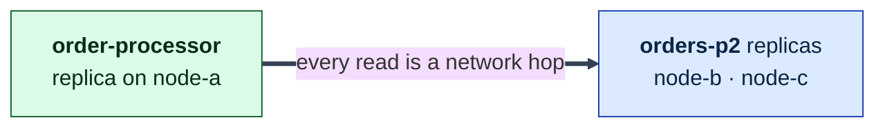
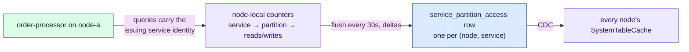
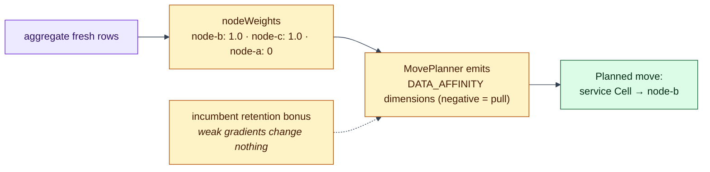
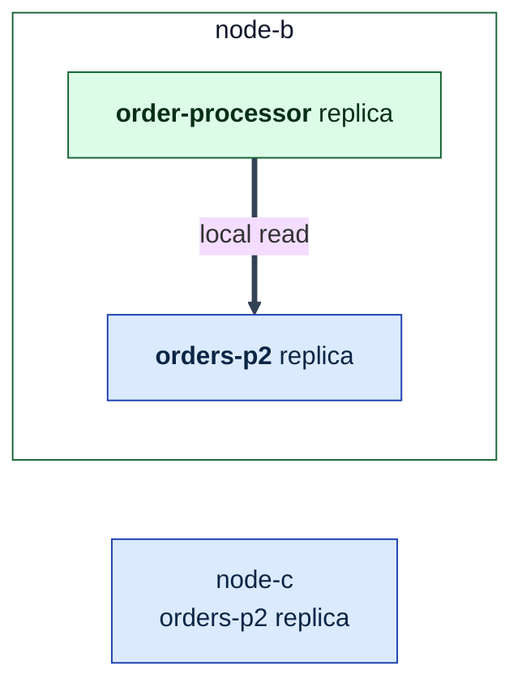
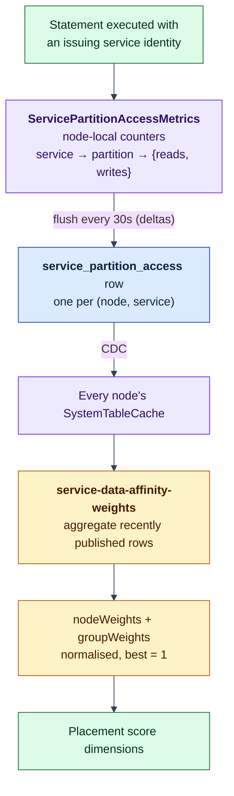
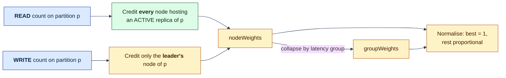
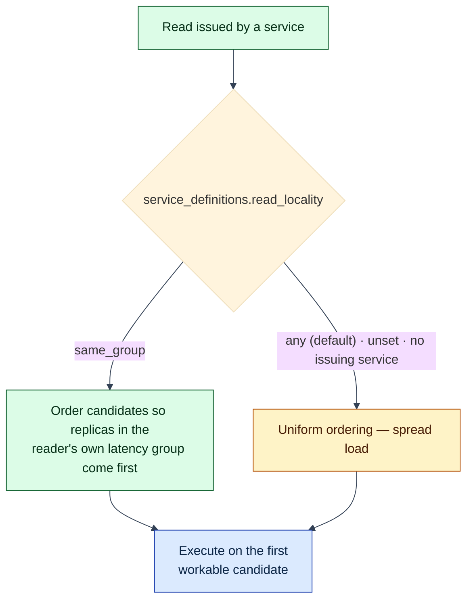

# Process: Data Affinity

How Lagrange learns which service uses which data, and the two independent ways
it acts on that knowledge. This is the mechanism behind "compute moves to the
data".

Prerequisite: [The Lagrange System Model](system-model.md) — including its
[diagram legend](system-model.md#diagram-legend). The scorer that consumes the
placement side is in [rebalancing](process-rebalancing.md); the routing path
that consumes the read side is in [request routing](process-request-routing.md).

## Two layers, easily confused

```mermaid
%%{init: {'theme':'base','themeVariables':{'background':'#ffffff','lineColor':'#334155','textColor':'#0f172a'}}}%%
flowchart TB
  subgraph L1["Layer 1 — Placement affinity · topology time · slow"]
    direction LR
    E1["Observed access evidence"]:::move --> W["Affinity weights<br/>per node and per latency group"]:::ctrl
    W --> S["MovePlanner score dimension"]:::ctrl
    S --> M["Replica moves:<br/>the service ends up near its data"]:::good
  end
  subgraph L2["Layer 2 — Read-locality routing · query time · fast"]
    direction LR
    D["service_definitions.read_locality"]:::svc --> O["Candidate ordering for reads"]:::ctrl
    O --> P["This read is served<br/>by a nearby replica"]:::good
  end

  style L1 fill:#ffffff,stroke:#94a3b8,color:#0f172a
  style L2 fill:#ffffff,stroke:#94a3b8,color:#0f172a
  classDef svc fill:#dcfce7,stroke:#166534,color:#052e16
  classDef ctrl fill:#fef3c7,stroke:#b45309,color:#451a03
  classDef move fill:#ede9fe,stroke:#6d28d9,color:#2e1065
  classDef good fill:#dcfce7,stroke:#166534,color:#052e16
```

They answer different questions, and neither implies the other:

| | Placement affinity | Read-locality routing |
| --- | --- | --- |
| Question | Where should replicas *live*? | Which replica serves *this* read? |
| Input | Aggregated, decaying access evidence | A per-service policy column |
| Acts on | Topology change | Every query |
| Cost of being wrong | A replica move | One slower read |

A service can benefit from read-locality routing immediately, with no placement
change at all. Placement affinity is the slower, structural counterpart.

## Layer 1 in motion: a service drifts toward its data

Four stages of the same cluster. This is the whole point of the system, so it is
worth following closely.

### Stage 1 — Placed on load and spread alone; every read crosses the network

Nothing is wrong here — the placement is simply uninformed. No access evidence
exists yet, so the affinity dimensions are not even emitted.

### Stage 2 — Evidence accumulates from real traffic

### Stage 3 — Weights turn evidence into a placement gradient

### Stage 4 — Co-located; the read no longer leaves the node

## The evidence feed in detail

Affinity is derived from what actually happened, not from declarations.

Four properties of this feed are deliberate and worth not breaking:

- **Only service-issued statements are attributed.** A query with no issuing
  service — an external SQL client, an operator session — is never recorded.
  Affinity describes deployed workloads, not humans poking the cluster.
- **It is a delta feed with loss recovery.** Each flush publishes the counts from
  the window just drained; a failed publish merges those counts back into the
  accumulator so they survive to the next attempt.
- **Evidence expires.** Rows older than a bounded staleness window are ignored
  entirely, so a departed or wedged node's counts age out instead of steering
  placement forever.
- **It rides the ordinary control plane.** These are CDC-propagated system-table
  rows published as coalesced background work — not a side channel.

Two attribution details that change how you read the numbers: recording is
gated on statement success, so failed statements produce no evidence at all; and
a SELECT records the partitions it actually *executed* against, including join
fan-out, not just the partitions of the root table.

### How counts become weights

The join from "this service read partition p" to "this service should be on node
n" is where the semantics live:

The asymmetry is the interesting part, and it follows from the replication
model: a **read** can be served by any replica, so every node holding one is a
place where that read would never leave the node; a **write** must reach the
leader, so only the leader's node offers the same saving.

Node weights are the primary nearness coordinate — "code on its data" within a
latency group. Group weights are the coarse outer term, expressing "don't cross
a latency domain" for clusters spanning several.

### How the scorer uses them

The affinity dimensions only exist when both an explicit `preferDataAffinity`
constraint and usable evidence are present; absent either, the scorer emits
nothing and behaves exactly as it did before affinity existed. When they are
present, three dimensions are added: a node-affinity pull, a group-affinity
pull, and an incumbent-retention bonus that charges movement cost against the
gradient. Without that hysteresis, affinity coupled to load oscillates — the
system chases its own placement.

**Nobody configures `preferDataAffinity`; the rebalancer sets it on itself.**
There is no operator switch. While resolving its runtime-service policy, the
rebalancer checks whether the freshness window yields any non-empty weight map,
and if so attaches the weights and sets the constraint. The exact condition is:

> the entity is a **runtime service**, *and* at least one non-empty node or group
> weight map exists from recent `service_partition_access` evidence.

Partitions, message groups, and the inactive legacy `wasm_service` placement
entity kind never receive the constraint. Current externally installed
`wasm_component` workloads run as Binding-derived `runtime_service` Cells, so
they can receive affinity when recent access evidence exists. Affinity today
steers **runtime-service placement only** — it does not pull data toward
compute. It is also deliberately independent of `read_locality`; the two are
not coupled.

## Layer 2: read-locality routing

This is resolved per query from the node-local cache: the engine looks up the
issuing service's definition and, for `same_group`, sets the preference that
reorders the partition's routable replicas. It applies to reads only — writes
must reach the canonical leader regardless of locality, so the preference is
ignored on the write path.

The ordering is genuinely local-node-first: candidates rank as local node,
then same latency group, then everything else. Two conditions gate it:

- **It is inert without latency groups.** If the local node has no
  `latency_group_id`, the ordering is skipped entirely and `same_group` has no
  effect. Latency groups are not configured by hand — they are derived by
  periodic latency measurement against group representatives, and that topology
  is the substrate both this layer and the placement weights sit on.
- **Leader preference can override it.** A read that asks for the leader —
  which system-table reads do by default — takes leader-first ordering instead.

The trade-off is explicit rather than automatic. `same_group` buys latency by
concentrating reads on nearby replicas; `any` buys even load spreading. Neither
is right for every service, which is why it is a per-service column and not a
cluster-wide mode.

## Putting both layers to work

To get a service placed near its data and reading locally:

1. **Let the service issue its queries through its own identity** — use the
   injected `replicaContext.queryExecutor` rather than any path that loses the
   issuing service. Unattributed traffic generates no evidence, and no evidence
   means no affinity.
2. **Give the workload time.** Weights are built from published windows within a
   bounded freshness horizon; a burst shorter than a publish window may never
   appear as evidence at all.
3. **Set `read_locality` deliberately.** `same_group` for latency-sensitive read
   paths; leave it `any` where spreading load matters more.
4. **Read the score, don't guess it.** Placement decisions are emitted as
   individual named dimensions, so "why did it land there" is answerable from
   the decision record.

## What this means when you build on it

- **Observation is never authority.** Access evidence may move placement and
  improve locality; it must never create or promote manifests, Bindings, or
  access-policy rows. What runs where is declared; what is *near* what is
  observed.
- **Keep the two layers separate.** A change that makes read routing depend on
  placement evidence, or placement depend on per-query routing state, collapses
  a fast decision and a slow one into a feedback loop.
- **Gate any new evidence-driven behaviour off by default.** The affinity work is
  the template: no constraint plus no evidence must reproduce the previous
  behaviour exactly.
