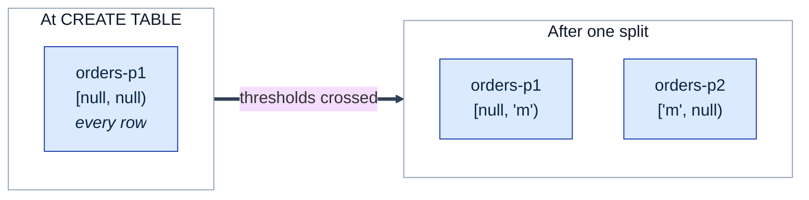
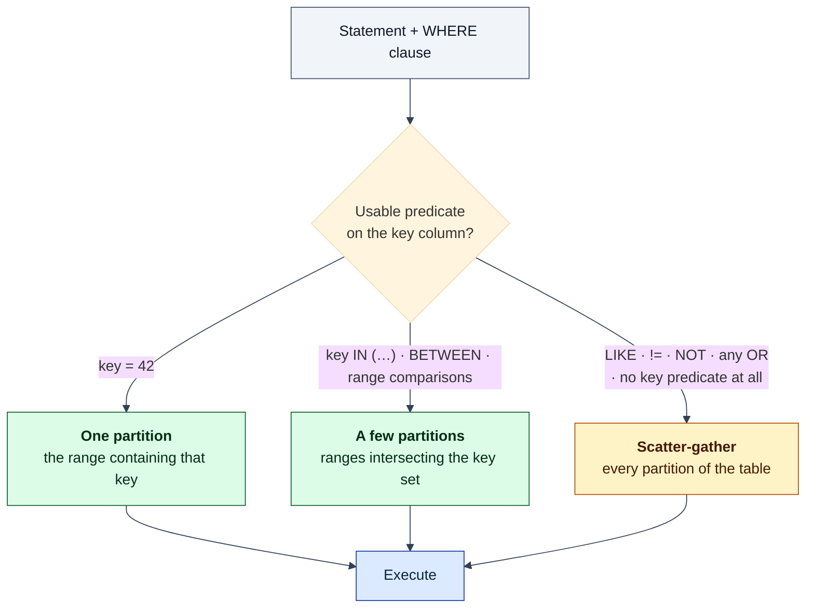
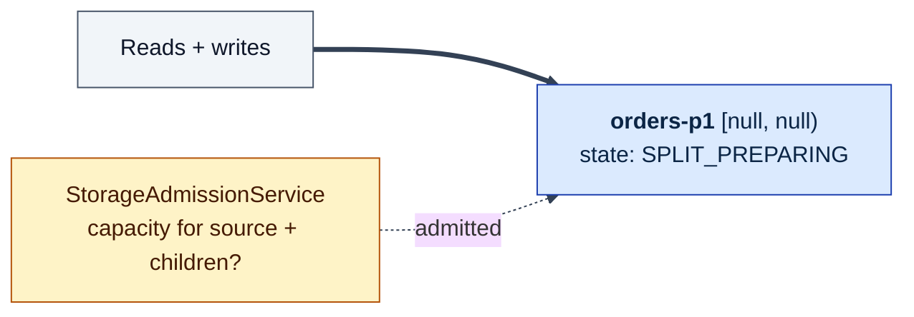
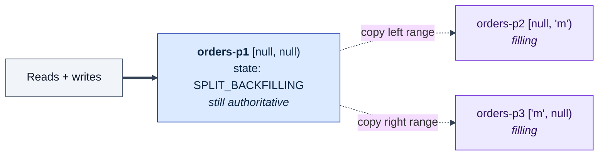
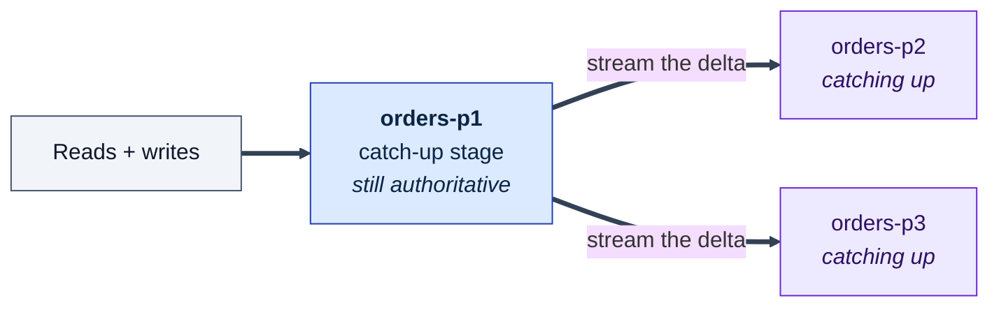
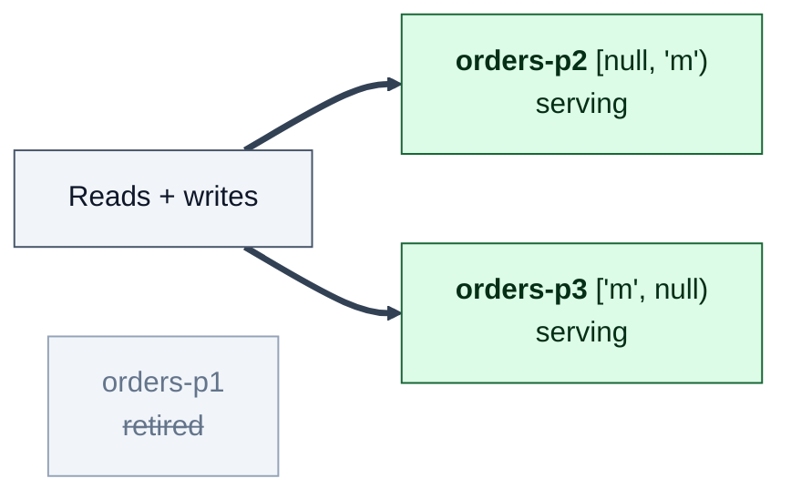
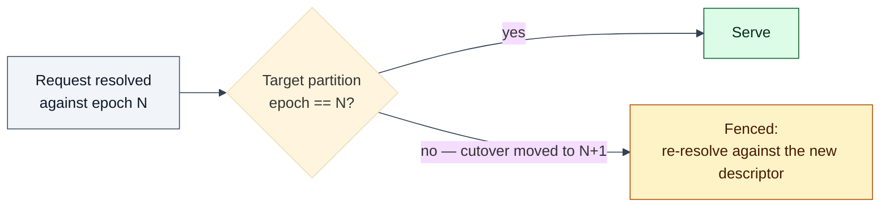
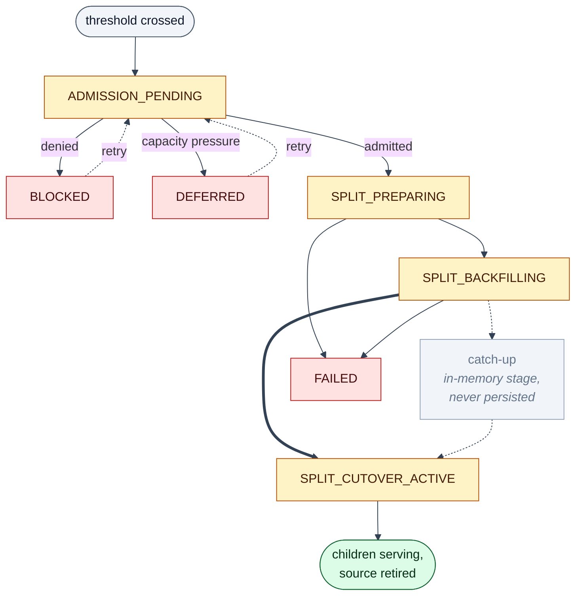

# Process: Partitioning

How a table becomes a set of key ranges, how a query is narrowed to a subset of
them, and how that set changes over time through split and merge.

Prerequisite: [The Lagrange System Model](system-model.md) — including its
[diagram legend](system-model.md#diagram-legend). Where the resulting partitions
are *placed* is [rebalancing](process-rebalancing.md); how each one stays
durable is [replication](process-replication.md).

## The partition key

A table's partition key is derived from its `PRIMARY KEY` at `CREATE TABLE`
time and stored in `tables.partition_key`. Partitioning is **range-based over
that key** — there is no hash partitioning anywhere in the system. Two
consequences follow immediately:

- Rows adjacent in primary-key order live together, so range scans over the key
  touch few partitions.
- A monotonically increasing primary key (a timestamp, a sequence) concentrates
  all new writes on the last partition. That is the classic range-partitioning
  hot spot, and Lagrange does not hide it from you.

## A table starts as one partition

`CREATE TABLE` provisions exactly one partition, `<tableId>-p1`, whose range is
unbounded at both ends (`partition_key_start` and `partition_key_end` are
`NULL`), replicated across the configured replica count. Partition count is not
a `CREATE TABLE` parameter — the table grows into more partitions as the split
evaluator sees it exceed its thresholds.

Ranges are half-open `[start, end)`: start inclusive, end exclusive, `NULL`
meaning unbounded on that side. Every possible key therefore maps to exactly one
partition. That contiguity is maintained by the row writes the split and merge
workflows perform — note that the `KeyRangeManager` validator in
`src/partition/key-range-manager.js` is not wired into the runtime, so do not
read it as the enforcer; only its `KeyRange` class is used elsewhere.

The replica count comes from the `partition.defaultReplicaCount` config (default
3, minimum 3). A `replicaCount` supplied in a `CREATE TABLE` policy is currently
not honoured — the service default is applied unconditionally.

## Resolving a query to partitions

`PartitionResolver` (`src/query/partition-resolver.js`) reads the WHERE clause
and decides how much of the table the statement can possibly touch.

This is the single most important performance fact in the system for
application developers: **a predicate the resolver cannot use does not fail, it
fans out.** `AND` recurses and accumulates conditions; a single `OR` anywhere
scatters. The resolver records what it decided (predicate-shape diagnostics) so
EXPLAIN and query telemetry can show whether a statement narrowed or scattered.

Three limitations to know before you rely on narrowing:

- **Resolution keys on a column named `id` in practice.** The resolver looks for
  key columns on the table record, but the `tables` system table stores only
  `partition_key` — there is no primary-key column and no production caller
  supplies key columns — so it falls back to the default `id`. A table whose
  primary key is named anything else scatter-gathers on every statement. The
  composite-key resolution path exists in the code but is unreachable for the
  same reason.
- **Range comparison is string-based.** Keys are compared with
  `String#localeCompare`, so numeric keys stored as strings order
  lexicographically (`"10" < "9"`).
- **Conflicting `AND` conditions are last-writer-wins** on condition type, so
  `pk > 10 AND pk = 5` can resolve differently from its reverse.

There is also no secondary index support at all today. `CREATE INDEX` parses,
but the statement dispatcher has no case for it and rejects it as an
unsupported statement; the subsystem that would build a SQLite index on every
partition (`src/index-management/`) exists but is not wired into the runtime.
Even once wired, a local index only speeds up the per-partition scan — it does
nothing to narrow the partition set, so a query filtered on an indexed non-key
column still touches every partition. Taken together with the `id` limitation
above, this is the dominant factor in query cost on a large table.

## Growing: the managed split, stage by stage

Splits are a durable, resumable control-plane workflow, not an in-place edit.
`PartitionSplitMergeManager` evaluates partitions against storage and traffic
thresholds; `ManagedSplitWorkflow` owns every phase transition from admission
through cutover, persisting the current phase in the
`partition_transition_state` column of the `tables` system table.

A split always produces **exactly two children** — a left and a right range.
"Grow a table to N partitions" therefore means N−1 successive splits, not one
N-way operation. Priority control-plane partitions are excluded from splitting
outright.

Evaluation is threshold-driven and fires when **either** dimension is exceeded:

| Setting | Default | Meaning |
| --- | --- | --- |
| `partition.splitThresholdBytes` | 10 GiB | size at which a partition becomes a split candidate |
| `partition.splitThresholdQpm` | 1000 | queries per minute at which it becomes one |
| `partition.mergeThresholdBytes` | 2 GiB | size below which it becomes a merge candidate |
| `partition.mergeThresholdQpm` | 200 | traffic below which it becomes one |
| `partition.evaluationIntervalMs` | 300000 | how often candidates are evaluated |

Per-table policy overrides the cluster-level config, and `SPLIT AT <bytes>` in
DDL sets that per-table policy field.

The four pictures below are the same partition at four points in that workflow.
Watch what serves traffic: **the source keeps serving until the very last
step.**

### Stage 1 — Admitted, nothing moved yet

Admission runs first because a split temporarily needs room for both the source
and its children. A denial here is `BLOCKED` or `DEFERRED`, not a failure.

### Stage 2 — Children provisioned, bulk copy running

Children exist as Raft groups and are being backfilled from the source's key
range. No client traffic reaches them.

### Stage 3 — Catch-up on writes that landed during the copy

The backfill was a moving target — clients kept writing. Catch-up closes that
gap so the children are equivalent to the source before anything switches.

Note for anyone tracing a split from durable state: catch-up is a real stage of
the work but **not a persisted phase on the split path**. It is tracked in
memory on the source partition service, so a split observed from the `tables`
row appears to go from `split_backfilling` straight to `split_cutover_active`.
The merge path is asymmetric here — it does durably persist `merge_catchup`.

### Stage 4 — Cutover, source retired

Routing switches to the children and the source retires. `SPLIT_CUTOVER_ACTIVE`
is the phase where that switch is made durable — and only
`ManagedSplitWorkflow` may write it. Participants report typed
acknowledgements; they do not advance the phase themselves.

The split point itself is the median key of the source partition, so children
are balanced by key distribution rather than by an arbitrary midpoint of the
range.

### What makes cutover safe: partition epochs

The mechanism that stops an in-flight query from reading a partition that has
just been replaced is **descriptor epoch fencing**. A table carries
`active_partition_version` and `pending_partition_version`; each partition row
carries its own `partition_version`. Routing requires an **exact epoch match**
between the descriptor a request resolved against and the partition it reaches.

Without this, a request that resolved a partition id just before cutover could
execute against a retired partition and silently lose a write. It is also why
the routing layer's retry-and-re-resolve behaviour
(see [request routing](process-request-routing.md)) is a correctness mechanism
and not merely a robustness one.

### The whole workflow as one state machine

A split that dies mid-way is resumed from its persisted phase rather than
restarted.

## Shrinking: merge

Merge is the mirror image, owned by `ManagedMergeWorkflow` with matching
`MERGE_PREPARING → MERGE_BACKFILLING → MERGE_CATCHUP → MERGE_CUTOVER_ACTIVE`
phases and the same admission gate. It applies to adjacent, range-compatible
partitions that have fallen below their thresholds, and it reclaims the
per-partition Raft-group overhead a table no longer needs.

## After a split: replicas still have to be placed

A split creates children whose replicas initially sit wherever provisioning put
them. Split completion therefore feeds the rebalancer: the composition root
resets each child rebalancer's stabilization timer on `SPLIT_COMPLETED` so
replica spread is re-evaluated once the cluster settles. Partitioning decides
*how many* groups exist and *what key range each owns*; placement of their
replicas is a separate decision covered in
[rebalancing](process-rebalancing.md).

## What this means when you build on it

- **Pick primary keys that spread writes.** Range partitioning rewards keys
  with natural dispersion and punishes monotonic ones.
- **Filter on the primary key when you can.** It is the difference between one
  partition and all of them.
- **Do not assume partition identity is stable.** Splits create new partition
  ids and retire old ones; anything caching a partition id must tolerate it
  disappearing.
