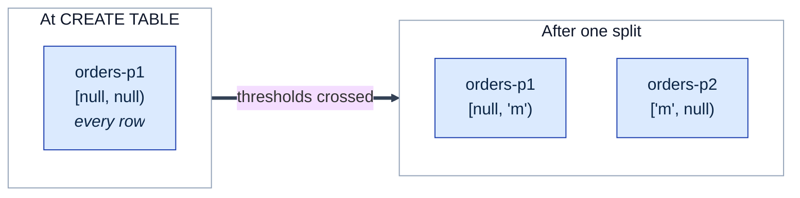
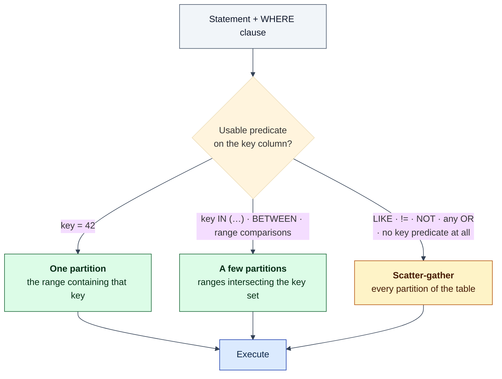
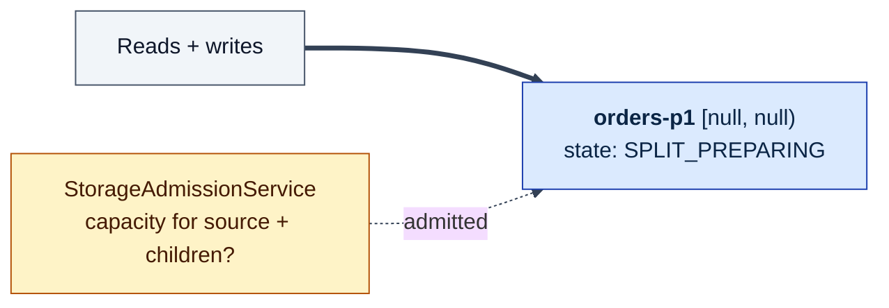
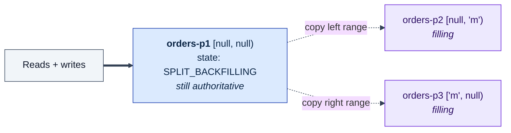
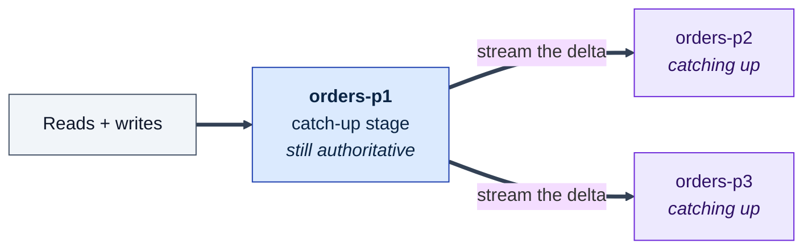
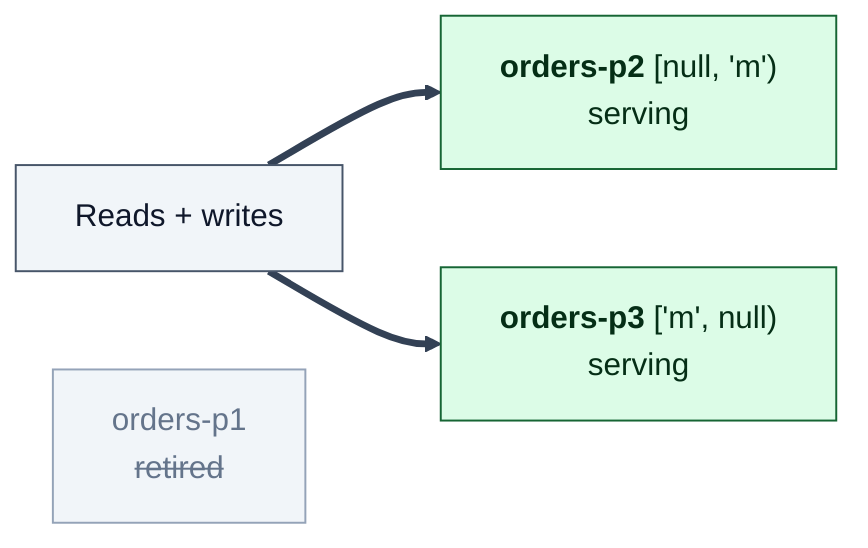
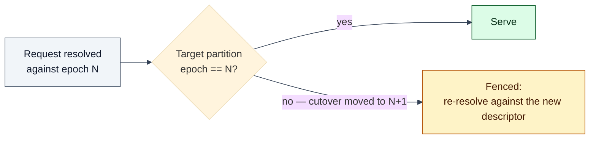
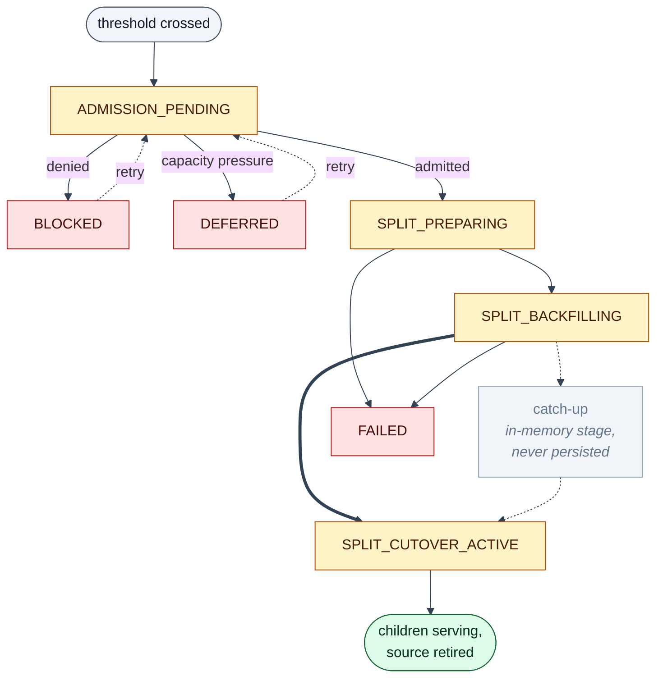

# Process: Partitioning

How a table becomes a set of key ranges, how a query is narrowed to a subset of
them, and how that set changes over time through split and merge.

Prerequisite: [The Lagrange System Model](system-model.md) — including its
[diagram legend](system-model.md#diagram-legend). Where the resulting partitions
are *placed* is [rebalancing](process-rebalancing.md); how each one stays
durable is [replication](process-replication.md).

## The partition key

A table's partition key is derived from its `PRIMARY KEY` at `CREATE TABLE`
time and stored in `tables.partition_key`. Partitioning is **range-based over
that key** — there is no hash partitioning anywhere in the system. Two
consequences follow immediately:

- Rows adjacent in primary-key order live together, so range scans over the key
  touch few partitions.
- A monotonically increasing primary key (a timestamp, a sequence) concentrates
  all new writes on the last partition. That is the classic range-partitioning
  hot spot, and Lagrange does not hide it from you.

## A table starts as one partition

`CREATE TABLE` provisions exactly one partition, `<tableId>-p1`, whose range is
unbounded at both ends (`partition_key_start` and `partition_key_end` are
`NULL`), replicated across the configured replica count. Partition count is not
a `CREATE TABLE` parameter — the table grows into more partitions as the split
evaluator sees it exceed its thresholds.

```mermaid
%%{init: {'theme':'base','themeVariables':{'background':'#ffffff','lineColor':'#334155','textColor':'#0f172a'}}}%%
flowchart LR
  subgraph T0["At CREATE TABLE"]
    P0["orders-p1<br/>[null, null)<br/><i>every row</i>"]:::data
  end
  subgraph T1["After one split"]
    PA["orders-p1<br/>[null, 'm')"]:::data
    PB["orders-p2<br/>['m', null)"]:::data
  end
  T0 ==>|"thresholds crossed"| T1

  style T0 fill:#ffffff,stroke:#94a3b8,color:#0f172a
  style T1 fill:#ffffff,stroke:#94a3b8,color:#0f172a
  classDef data fill:#dbeafe,stroke:#1e40af,color:#0b2545
```

Ranges are half-open `[start, end)`: start inclusive, end exclusive, `NULL`
meaning unbounded on that side. Every possible key therefore maps to exactly one
partition. That contiguity is maintained by the row writes the split and merge
workflows perform — note that the `KeyRangeManager` validator in
`src/partition/key-range-manager.js` is not wired into the runtime, so do not
read it as the enforcer; only its `KeyRange` class is used elsewhere.

The replica count comes from the `partition.defaultReplicaCount` config (default
3, minimum 3). A `replicaCount` supplied in a `CREATE TABLE` policy is currently
not honoured — the service default is applied unconditionally.

## Resolving a query to partitions

`PartitionResolver` (`src/query/partition-resolver.js`) reads the WHERE clause
and decides how much of the table the statement can possibly touch.

```mermaid
%%{init: {'theme':'base','themeVariables':{'background':'#ffffff','lineColor':'#334155','textColor':'#0f172a'}}}%%
flowchart TD
  Q["Statement + WHERE clause"]:::ext --> K{"Usable predicate<br/>on the key column?"}
  K -->|"key = 42"| ONE["<b>One partition</b><br/>the range containing that key"]:::good
  K -->|"key IN (…) · BETWEEN · range comparisons"| FEW["<b>A few partitions</b><br/>ranges intersecting the key set"]:::good
  K -->|"LIKE · != · NOT · any OR<br/>· no key predicate at all"| ALL["<b>Scatter-gather</b><br/>every partition of the table"]:::warn
  ONE --> EX["Execute"]:::data
  FEW --> EX
  ALL --> EX

  classDef data fill:#dbeafe,stroke:#1e40af,color:#0b2545
  classDef good fill:#dcfce7,stroke:#166534,color:#052e16
  classDef warn fill:#fef3c7,stroke:#b45309,color:#451a03
  classDef ext fill:#f1f5f9,stroke:#475569,color:#0f172a
```

This is the single most important performance fact in the system for
application developers: **a predicate the resolver cannot use does not fail, it
fans out.** `AND` recurses and accumulates conditions; a single `OR` anywhere
scatters. The resolver records what it decided (predicate-shape diagnostics) so
EXPLAIN and query telemetry can show whether a statement narrowed or scattered.

Three limitations to know before you rely on narrowing:

- **Resolution keys on a column named `id` in practice.** The resolver looks for
  key columns on the table record, but the `tables` system table stores only
  `partition_key` — there is no primary-key column and no production caller
  supplies key columns — so it falls back to the default `id`. A table whose
  primary key is named anything else scatter-gathers on every statement. The
  composite-key resolution path exists in the code but is unreachable for the
  same reason.
- **Range comparison is string-based.** Keys are compared with
  `String#localeCompare`, so numeric keys stored as strings order
  lexicographically (`"10" < "9"`).
- **Conflicting `AND` conditions are last-writer-wins** on condition type, so
  `pk > 10 AND pk = 5` can resolve differently from its reverse.

There is also no secondary index support at all today. `CREATE INDEX` parses,
but the statement dispatcher has no case for it and rejects it as an
unsupported statement; the subsystem that would build a SQLite index on every
partition (`src/index-management/`) exists but is not wired into the runtime.
Even once wired, a local index only speeds up the per-partition scan — it does
nothing to narrow the partition set, so a query filtered on an indexed non-key
column still touches every partition. Taken together with the `id` limitation
above, this is the dominant factor in query cost on a large table.

## Growing: the managed split, stage by stage

Splits are a durable, resumable control-plane workflow, not an in-place edit.
`PartitionSplitMergeManager` evaluates partitions against storage and traffic
thresholds; `ManagedSplitWorkflow` owns every phase transition from admission
through cutover, persisting the current phase in the
`partition_transition_state` column of the `tables` system table.

A split always produces **exactly two children** — a left and a right range.
"Grow a table to N partitions" therefore means N−1 successive splits, not one
N-way operation. Priority control-plane partitions are excluded from splitting
outright.

Evaluation is threshold-driven and fires when **either** dimension is exceeded:

| Setting | Default | Meaning |
| --- | --- | --- |
| `partition.splitThresholdBytes` | 10 GiB | size at which a partition becomes a split candidate |
| `partition.splitThresholdQpm` | 1000 | queries per minute at which it becomes one |
| `partition.mergeThresholdBytes` | 2 GiB | size below which it becomes a merge candidate |
| `partition.mergeThresholdQpm` | 200 | traffic below which it becomes one |
| `partition.trafficWindowMs` | 60000 | window queries per minute are measured over |
| `partition.mergeMinimumAgeMs` | 600000 | minimum durable partition age before an automatic merge |
| `partition.evaluationIntervalMs` | 300000 | how often candidates are evaluated |

Writes also request an evaluation (debounced to one per second) on the
node that coordinates the write when that node also leads a target
partition. A leader whose writes are coordinated elsewhere evaluates when a
partition's size changes (checked every `partition.sizeUpdateIntervalMs`,
60 s by default) and on the periodic timer, and a node whose partitions take
no writes evaluates only every `partition.evaluationIntervalMs`. The traffic signal is therefore defined
independently of how often evaluation runs. Queries per minute for a
partition is **the average write rate (the local leader's CDC write
counter) over the most recent span of at least one
`partition.trafficWindowMs` during which this node continuously led the
partition**: one leadership tenure, one counter instance, no counter
regression. The span runs from the newest stored sample that is at least one
window old (and inside the retention horizon below) to the moment of the
reading. The tenure is a token the replica's leadership edge mints on every
election and on every new term it observes while leading, and ends on
demotion and shutdown. Reading it is a field read: the measurement never
calls into the consensus port, so it costs no consensus work and cannot
change consensus state.

The node stores samples on its own fixed cadence (one twelfth of the window,
5 s by default), whoever asks and however often, and keeps at most 13 per
partition. Extra evaluations add no samples, so the window stays one window
however many evaluations run; with an evaluation at least every few seconds
the span exceeds the window by less than one cadence step plus the gap
between two evaluations. When evaluations are sparse the span is longer: on
a node that only runs the periodic evaluation, a partition has a signal from
its second periodic evaluation on, averaged over the interval between the
two. Samples are kept for the longer of two windows and one evaluation
interval plus one window. A longer span is still an average over at least
one window. For a merge that is the stated criterion, so it is safe; for a
split it can only delay a split on a recent burst.

The write counter is the CDC pipeline's generated-event counter. Tables on
the default policy count every committed write, whether or not anything
subscribes. A table whose policy sets `externalCdcAllowed: false` generates
no CDC events while it has no subscriber, so its counter stays at zero and
it reads a valid **0 queries per minute** forever: it can never split on
traffic, and the traffic criterion of a merge always holds for it, so it
splits and merges on size alone. The merge-under-load scenario's
configuration opts out this way, so its traffic gate always passes. Counting
committed writes at the partition apply path instead of the CDC counter is
recorded as follow-up work.

Until such a span exists, the partition has **no traffic signal** (not zero
traffic). That is the case after it is created, after a leader change or a
restart of its partition service, and on a node that does not lead it. With
no traffic signal it cannot split on traffic and cannot merge. A size split
needs no window. The window and the evaluation interval take effect at
restart. One validator resolves them for both the measurement and the
policy.

Per-table policy overrides the cluster-level config, and `SPLIT AT <bytes>` in
DDL sets that per-table policy field.

The four pictures below are the same partition at four points in that workflow.
Watch what serves traffic: **the source keeps serving until the very last
step.**

### Stage 1 — Admitted, nothing moved yet

```mermaid
%%{init: {'theme':'base','themeVariables':{'background':'#ffffff','lineColor':'#334155','textColor':'#0f172a'}}}%%
flowchart LR
  C["Reads + writes"]:::ext ==> S["<b>orders-p1</b> [null, null)<br/>state: SPLIT_PREPARING"]:::data
  A["StorageAdmissionService<br/>capacity for source + children?"]:::ctrl -.->|"admitted"| S

  classDef data fill:#dbeafe,stroke:#1e40af,color:#0b2545
  classDef ctrl fill:#fef3c7,stroke:#b45309,color:#451a03
  classDef ext fill:#f1f5f9,stroke:#475569,color:#0f172a
```

Admission runs first because a split temporarily needs room for both the source
and its children. A denial here is `BLOCKED` or `DEFERRED`, not a failure.

### Stage 2 — Children provisioned, bulk copy running

```mermaid
%%{init: {'theme':'base','themeVariables':{'background':'#ffffff','lineColor':'#334155','textColor':'#0f172a'}}}%%
flowchart LR
  C["Reads + writes"]:::ext ==> S["<b>orders-p1</b> [null, null)<br/>state: SPLIT_BACKFILLING<br/><i>still authoritative</i>"]:::data
  S -.->|"copy left range"| L["orders-p2 [null, 'm')<br/><i>filling</i>"]:::pend
  S -.->|"copy right range"| R["orders-p3 ['m', null)<br/><i>filling</i>"]:::pend

  classDef data fill:#dbeafe,stroke:#1e40af,color:#0b2545
  classDef pend fill:#ede9fe,stroke:#6d28d9,color:#2e1065
  classDef ext fill:#f1f5f9,stroke:#475569,color:#0f172a
```

Children exist as Raft groups and are being backfilled from the source's key
range. No client traffic reaches them.

### Stage 3 — Catch-up on writes that landed during the copy

```mermaid
%%{init: {'theme':'base','themeVariables':{'background':'#ffffff','lineColor':'#334155','textColor':'#0f172a'}}}%%
flowchart LR
  C["Reads + writes"]:::ext ==> S["<b>orders-p1</b><br/>catch-up stage<br/><i>still authoritative</i>"]:::data
  S ==>|"stream the delta"| L["orders-p2<br/><i>catching up</i>"]:::pend
  S ==>|"stream the delta"| R["orders-p3<br/><i>catching up</i>"]:::pend

  classDef data fill:#dbeafe,stroke:#1e40af,color:#0b2545
  classDef pend fill:#ede9fe,stroke:#6d28d9,color:#2e1065
  classDef ext fill:#f1f5f9,stroke:#475569,color:#0f172a
```

The backfill was a moving target — clients kept writing. Catch-up closes that
gap so the children are equivalent to the source before anything switches.

Note for anyone tracing a split from durable state: catch-up is a real stage of
the work but **not a persisted phase on the split path**. It is tracked in
memory on the source partition service, so a split observed from the `tables`
row appears to go from `split_backfilling` straight to `split_cutover_active`.
The merge path is asymmetric here — it does durably persist `merge_catchup`.

### Stage 4 — Cutover, source retired

```mermaid
%%{init: {'theme':'base','themeVariables':{'background':'#ffffff','lineColor':'#334155','textColor':'#0f172a'}}}%%
flowchart LR
  C["Reads + writes"]:::ext ==> L["<b>orders-p2</b> [null, 'm')<br/>serving"]:::good
  C ==> R["<b>orders-p3</b> ['m', null)<br/>serving"]:::good
  S["orders-p1<br/><s>retired</s>"]:::gone

  classDef good fill:#dcfce7,stroke:#166534,color:#052e16
  classDef gone fill:#f1f5f9,stroke:#94a3b8,color:#64748b
  classDef ext fill:#f1f5f9,stroke:#475569,color:#0f172a
```

Routing switches to the children and the source retires. `SPLIT_CUTOVER_ACTIVE`
is the phase where that switch is made durable — and only
`ManagedSplitWorkflow` may write it. Participants report typed
acknowledgements; they do not advance the phase themselves.

The split point itself is the median key of the source partition, so children
are balanced by key distribution rather than by an arbitrary midpoint of the
range.

### What makes cutover safe: partition epochs

The mechanism that stops an in-flight query from reading a partition that has
just been replaced is **descriptor epoch fencing**. A table carries
`active_partition_version` and `pending_partition_version`; each partition row
carries its own `partition_version`. Routing requires an **exact epoch match**
between the descriptor a request resolved against and the partition it reaches.

```mermaid
%%{init: {'theme':'base','themeVariables':{'background':'#ffffff','lineColor':'#334155','textColor':'#0f172a'}}}%%
flowchart LR
  Q["Request resolved<br/>against epoch N"]:::ext --> P{"Target partition<br/>epoch == N?"}
  P -->|"yes"| SERVE["Serve"]:::good
  P -->|"no — cutover moved to N+1"| FENCE["Fenced:<br/>re-resolve against the new descriptor"]:::warn

  classDef good fill:#dcfce7,stroke:#166534,color:#052e16
  classDef warn fill:#fef3c7,stroke:#b45309,color:#451a03
  classDef ext fill:#f1f5f9,stroke:#475569,color:#0f172a
```

Without this, a request that resolved a partition id just before cutover could
execute against a retired partition and silently lose a write. It is also why
the routing layer's retry-and-re-resolve behaviour
(see [request routing](process-request-routing.md)) is a correctness mechanism
and not merely a robustness one.

### The whole workflow as one state machine

```mermaid
%%{init: {'theme':'base','themeVariables':{'background':'#ffffff','lineColor':'#334155','textColor':'#0f172a'}}}%%
flowchart TD
  ST(["threshold crossed"]):::ext --> AP["ADMISSION_PENDING"]:::ctrl
  AP -->|"denied"| BL["BLOCKED"]:::bad
  AP -->|"capacity pressure"| DF["DEFERRED"]:::bad
  BL -.->|"retry"| AP
  DF -.->|"retry"| AP
  AP -->|"admitted"| PR["SPLIT_PREPARING"]:::ctrl
  PR --> BF["SPLIT_BACKFILLING"]:::ctrl
  BF ==> CO["SPLIT_CUTOVER_ACTIVE"]:::ctrl
  BF -.-> CU["catch-up<br/><i>in-memory stage,<br/>never persisted</i>"]:::ghost
  CU -.-> CO
  CO --> DONE(["children serving,<br/>source retired"]):::good
  PR --> FA["FAILED"]:::bad
  BF --> FA

  classDef ctrl fill:#fef3c7,stroke:#b45309,color:#451a03
  classDef good fill:#dcfce7,stroke:#166534,color:#052e16
  classDef bad fill:#fee2e2,stroke:#b91c1c,color:#450a0a
  classDef ghost fill:#f1f5f9,stroke:#94a3b8,color:#64748b
  classDef ext fill:#f1f5f9,stroke:#475569,color:#0f172a
```

A split that dies mid-way is resumed from its persisted phase rather than
restarted.

## Shrinking: merge

Merge is the mirror image, owned by `ManagedMergeWorkflow` with matching
`MERGE_PREPARING → MERGE_BACKFILLING → MERGE_CATCHUP → MERGE_CUTOVER_ACTIVE`
phases and the same admission gate. It applies to adjacent, range-compatible
partitions that have fallen below their thresholds, and it reclaims the
per-partition Raft-group overhead a table no longer needs.

A merge must never undo a split it would immediately re-create, so an
adjacent pair is merged only when all of these hold, checked in this order:

1. **Minimum age.** Both partitions are at least
   `partition.mergeMinimumAgeMs` old (default 10 minutes, never below two
   traffic windows), measured from the durable `partitions.created_at` the
   split or merge workflow stamps when it writes the child row. The age
   survives a manager restart or a leader change; an unknown age is not
   eligible. One split-merge cycle costs two full membership workflows with
   group retirement, so this caps a key range at one such cycle per
   10 minutes, and every merge decision rests on at least ten full traffic
   windows.
2. **A traffic signal.** Both partitions have one full window of
   observations (see above); no signal is never read as low load.
3. **A recent span.** Both rates were measured over at most two traffic
   windows plus one sampling cadence step. On a node that evaluates only
   every `partition.evaluationIntervalMs` the span is the whole interval,
   and a burst that started seconds before the evaluation would be averaged
   down to "idle". Such a pair is deferred, and the manager evaluates once
   more one window plus one cadence step later, when the span is about one
   window. This happens at most once per pair per periodic evaluation. An
   idle pair on such a node therefore merges one window plus one cadence
   step after the first periodic evaluation past the minimum age.
4. **Hysteresis thresholds.** Combined size and combined queries per minute
   are at or below the merge thresholds, each clamped to at most half of
   the split threshold of the same dimension, so the merged partition is
   below half its split threshold on both and does not qualify to split on
   the measurement that merged it. The defaults (2 GiB / 200 QPM against
   10 GiB / 1000 QPM) are already a fifth; the clamp only bites when a
   policy configures merge thresholds close to or above the split ones.

The minimum age applies to every split, including one requested explicitly
through the engine: nothing durable distinguishes an explicit split's
children from an automatic split's once the split has completed, so an
explicit split is protected for the minimum age, not indefinitely.

A split that admission refuses (`blocked` / `deferred`, for example
`source_quorum_not_routable` right after `CREATE TABLE`) is not dropped: the
refusal is persisted on the `tables` row with its retry schedule, and the
split/merge manager on the source partition's leader re-drives every such
outstanding split when its retry falls due. A split the manager itself
proposed on the thresholds during this process lifetime is re-driven only
while the thresholds still qualify it. Every other outstanding split
(explicit, or proposed before a restart: the durable record does not say
who requested it) is re-driven independent of the split thresholds. A write of that row and any change to the source partition's row wake
the manager. After 10 attempts the manager stops and reports a
`wait_bound_spent` line naming the split admission it waited for and the
last blocking reasons; the refusal stays visible on the `tables` row.

## After a split: replicas still have to be placed

A split creates children whose replicas initially sit wherever provisioning put
them. Split completion therefore feeds the rebalancer: the composition root
resets each child rebalancer's stabilization timer on `SPLIT_COMPLETED` so
replica spread is re-evaluated once the cluster settles. Partitioning decides
*how many* groups exist and *what key range each owns*; placement of their
replicas is a separate decision covered in
[rebalancing](process-rebalancing.md).

## What this means when you build on it

- **Pick primary keys that spread writes.** Range partitioning rewards keys
  with natural dispersion and punishes monotonic ones.
- **Filter on the primary key when you can.** It is the difference between one
  partition and all of them.
- **Do not assume partition identity is stable.** Splits create new partition
  ids and retire old ones; anything caching a partition id must tolerate it
  disappearing.
