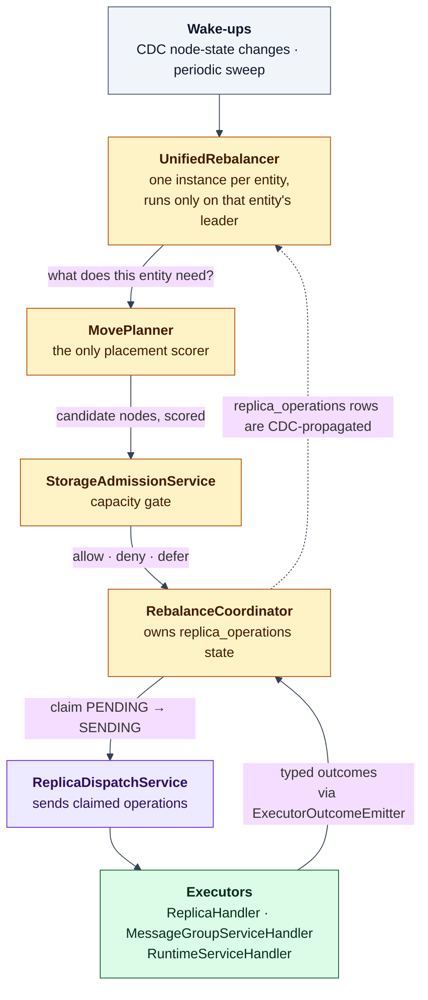
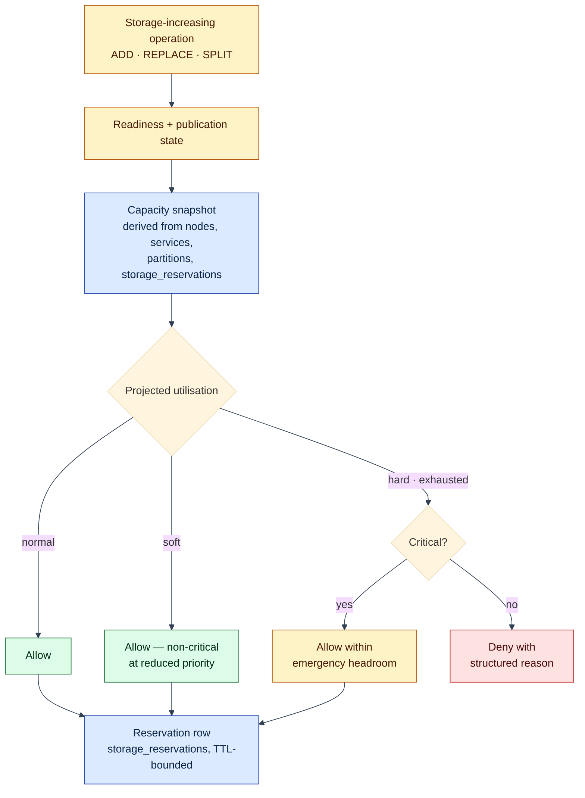
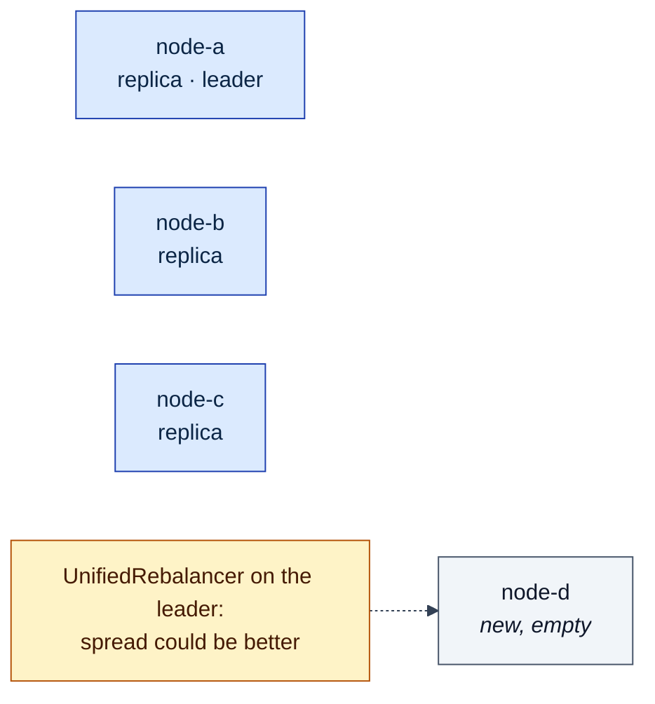
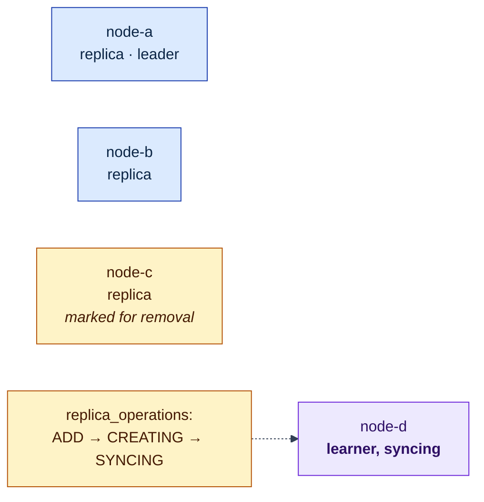
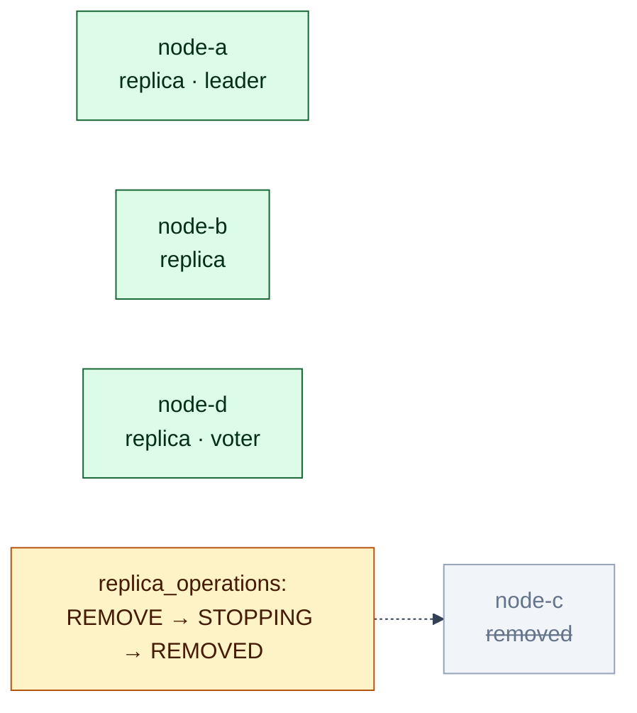
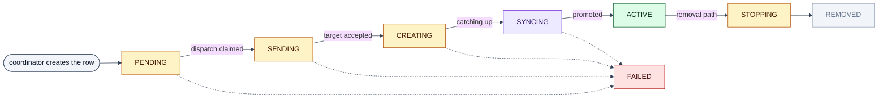

# Process: Rebalancing

How the cluster decides that a replica should live somewhere else, and how it
executes that decision without losing availability or over-committing a node.

Prerequisite: [The Lagrange System Model](system-model.md) — including its
[diagram legend](system-model.md#diagram-legend). The affinity dimension of the
placement score has its own document:
[data affinity](process-data-affinity.md).

## One loop, four owners

Rebalancing is a level-triggered control loop, and each stage has exactly one
owner. Working out which owner you are looking at is most of the work of
debugging it.



Two structural properties fall out of this diagram:

- **Decisions are distributed, not centralised.** There is no cluster-wide
  balancer process. Each rebalanced entity runs its own rebalancer and decides
  only about itself; global balance is an emergent property of many local
  decisions converging. Rebalancer instances are created for three entity types
  — partitions, message groups, and runtime services. (`wasm_service` survives as
  an enum value and a default policy, but no rebalancer is constructed for it.)
  The leader gate is also not uniform: a partition or message-group rebalancer
  runs on that entity's own Raft leader, whereas a runtime-service rebalancer is
  gated on leadership of the `service_definitions` partition.
- **Executors never write operation state.** They emit typed outcomes; only
  `RebalanceCoordinator` writes the owner-managed fields of
  `replica_operations` (`status`, `workflow_step`, `completed_at`,
  `error_message`, `steps_history`). That is what makes the operation row a
  trustworthy single account of what happened.

## Deciding: how a node is scored

`MovePlanner` sorts candidate nodes by suitability. The score is a sum of
independent dimensions, emitted individually so a placement decision can be
explained rather than guessed at.

```mermaid
%%{init: {'theme':'base','themeVariables':{'background':'#ffffff','lineColor':'#334155','textColor':'#0f172a'}}}%%
flowchart LR
  subgraph Dims["Score dimensions, summed per candidate node"]
    direction TB
    LOAD["<b>Load</b> — cost, positive<br/>cpu_load · memory_load · disk_load"]:::warn
    TOPO["<b>Latency topology</b><br/>same_latency_group<br/>latency_group_diversity"]:::ctrl
    AFF["<b>Data affinity</b> — pull, negative<br/>data_affinity_node · data_affinity<br/>data_affinity_incumbent_retention"]:::svc
    TIE["<b>disk_tie_breaker</b><br/>excluded from the primary sum"]:::ext
  end
  Dims ==> SUM["Total score per candidate"]:::ctrl
  SUM ==> PICK["<b>Lowest</b> total score wins"]:::good

  style Dims fill:#ffffff,stroke:#94a3b8,color:#0f172a
  classDef ctrl fill:#fef3c7,stroke:#b45309,color:#451a03
  classDef svc fill:#dcfce7,stroke:#166534,color:#052e16
  classDef warn fill:#fef3c7,stroke:#b45309,color:#451a03
  classDef good fill:#dcfce7,stroke:#166534,color:#052e16
  classDef ext fill:#f1f5f9,stroke:#475569,color:#0f172a
```



Notes that repeatedly matter:

- **Lowest score wins.** Candidates sort ascending on the summed score, then on
  the disk tie-breaker, then stably by ordinal.
- **Affinity contributes negative values** — pulling a candidate toward the data
  it accesses — while load contributes positive cost. Read the sign, not just
  the magnitude.
- **There is no "spread" scoring dimension.** Replica spread is real, but it is
  enforced in the planner's target-state logic, not as a term in this score. The
  nine dimensions above are the complete set.
- **Incumbents get a retention bonus.** A candidate already hosting the replica
  carries an in-score movement cost, so a weak affinity gradient does not churn
  the placement. This hysteresis is deliberate: affinity coupled to load without
  it limit-cycles.
- **The affinity family is gated off unless there is evidence.** Without the
  `preferDataAffinity` constraint *and* usable access evidence, no affinity
  dimension is emitted and the score is byte-identical to the pre-affinity
  scorer.

## Capacity admission

Placement can be right and still unsafe: adding a replica, replacing one, or
splitting a partition all *increase* stored bytes on a target node.
`StorageAdmissionService` is the single gate in front of those operations.



Reservations exist because the accounting has to include work that is *in
flight*, not just bytes already on disk — otherwise several concurrent adds each
look affordable in isolation and collectively overrun the node. Reservations are
TTL-bounded (default 300 s) and their lifecycle is owned by
`RebalanceCoordinator`, not by the admission service.

Two things qualify the phrase "single gate":

- **It can be turned off.** `rebalancer.storageAdmissionMode` defaults to
  `enforce`, but in `observe` mode every denial is converted into an admit and
  only recorded. A cluster that "ignores admission" is usually in observe mode,
  not broken.
- **It is not the only capacity check.** `StoragePressureBehavior` is a second,
  independent pressure gate consulted by the planner. The admission service
  itself reads only the hard threshold.

## Executing a move, stage by stage

The rule that shapes every move: **add before remove.** The cluster is never
allowed to dip below its replica target to make room for a better placement.
Here is a spread-optimising move after a new node joins.

### Stage 1 — A node joins; the group is unbalanced



### Stage 2 — ADD first: four replicas, temporarily



Durability goes *up* during the move, never down. The non-critical REMOVE is
deliberately deferred until the ADD completes.

### Stage 3 — REMOVE after the new replica is a voter



## The operation lifecycle



Every transition is monotonic, idempotent, and persisted through
`DurableWorkflowCoordinator.transitionStep()` with its previous step, next step,
reason, timestamp, and owner key. That is what makes an interrupted rebalance
resumable: recovery replays from the durable row rather than re-deriving intent.

## Not moving: the safety machinery

Most of the rebalancer's code is about *declining* to act. The mechanisms worth
knowing by name:

| Guard | What it prevents |
| --- | --- |
| Stabilization window | Thrash during a burst of topology change; `rebalancer.stabilizationPeriodMs` defaults to 1000 ms, clamped to [1000, 10000], and resets on state changes |
| Move budget | Unbounded concurrent movement — see the formula below |
| ADD-before-REMOVE ordering | Availability loss; adds execute first, non-critical removes wait until adds complete |
| Readiness gating | Acting on an incomplete view; internal topology consumers gate on `repairEligible`, routing on `serveEligible` |
| Timeout budget tree | Runaway operations; every top-level operation starts from one canonical budget and sub-operations derive from what remains |

The budget available in a cycle is:

```text
availableMoves = min(5, effectiveBudget − inFlightCount − reservedPriorityRecoverySlots)
```

with a configured budget of 10 by default and a hard-coded ×2 multiplier for
critical work. "Critical" is broader than under-replication: it also covers
message-group local-access gaps and replica concentration that spread should
cure. When the budget is exhausted, two bypasses still force a single move
through rather than stalling completely.

Control-plane and system partitions additionally run through a **priority
recovery lane** with its own serial planner and move precedence, and it reserves
slots that the ordinary lane must subtract — which is the term in the formula
above that most often explains "why did only one move happen?".

## Reading a rebalance in production

The durable state *is* the explanation. Start from the `replica_operations` rows
for the entity: `workflow_step` says how far it got, `steps_history` says how it
got there, `error_message` says why it stopped. The `partitions` /
`message_groups` owner rows say who the leader is. The `storage_reservations`
table says what capacity is already spoken for. Log lines are supporting
evidence, not the account of record.

## What this means when you build on it

- **Do not add a second planner or a second writer of operation state.** The
  single-path contract in [overview.md](overview.md) exists because two planners
  disagreeing is unrecoverable at runtime.
- **New placement inputs belong as a scoring dimension,** gated on explicit
  evidence and constraint — that is how data affinity was added without changing
  behaviour for clusters that have no evidence.
- **Expect deferral, not failure.** Blocked, deferred, and admission-pending are
  normal outcomes with retry paths; code that treats them as errors will
  misreport a healthy cluster.
