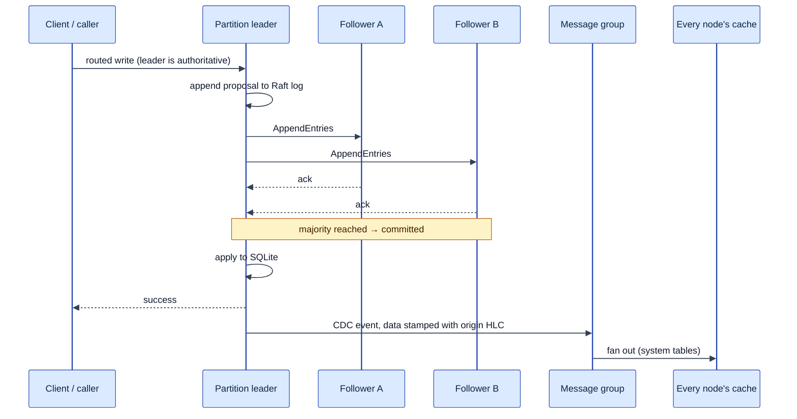
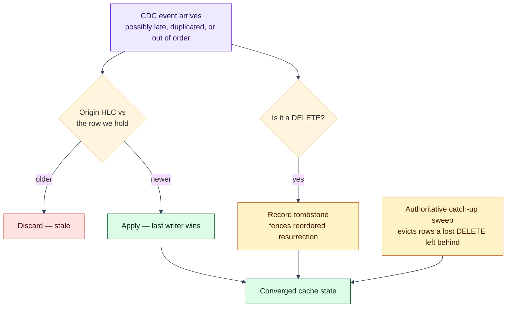
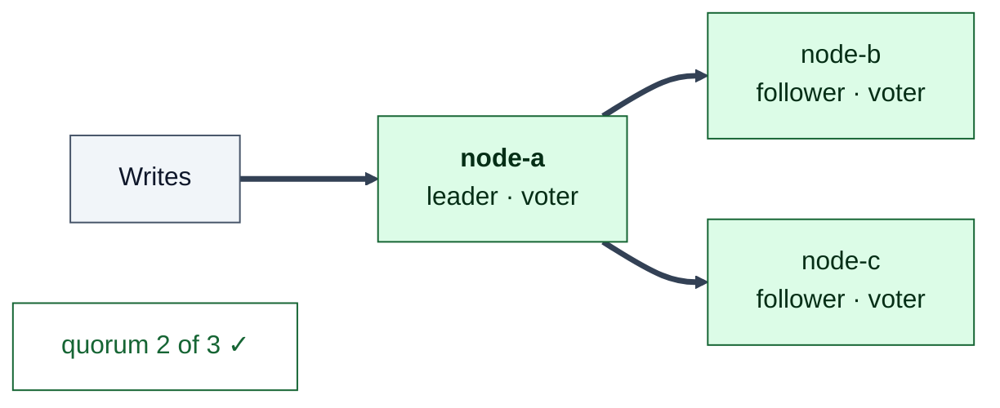
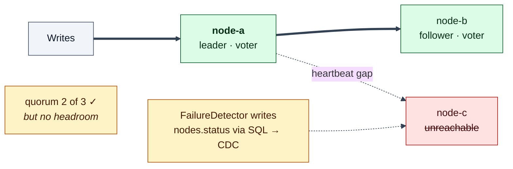
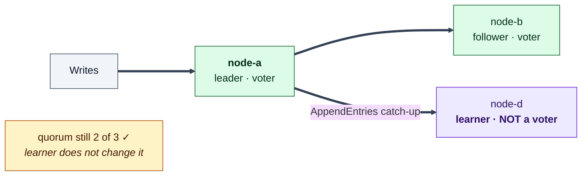
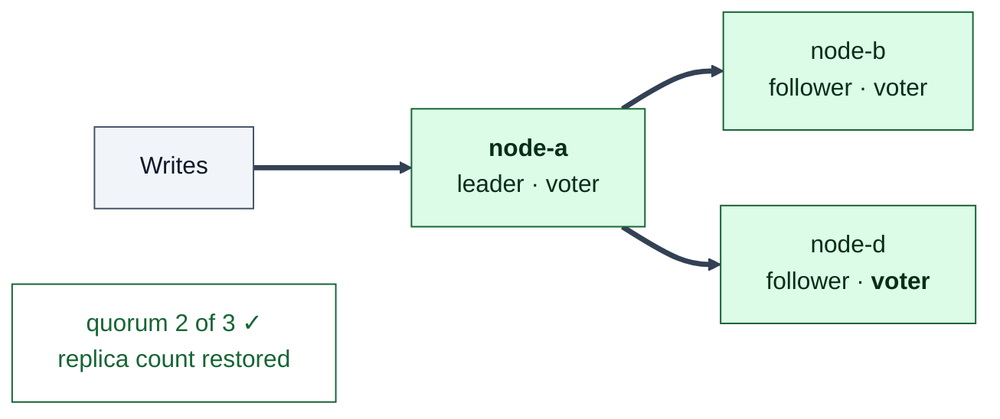
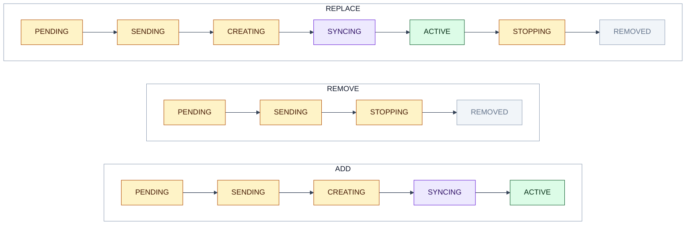

# Process: Replication

How a write becomes durable, how it reaches every node's read model, and how a
replica that is added or lost is brought back to full membership.

Prerequisite: [The Lagrange System Model](system-model.md) — including its
[diagram legend](system-model.md#diagram-legend). Which nodes a group's replicas
land on is [rebalancing](process-rebalancing.md).

## The unit of replication

Every partition is a Raft consensus group. Current placement policy uses odd
replica counts (three by default, with its minimum floor from
`POLICY_DEFAULT.MIN_REPLICA_COUNT`) so an added voter improves failure tolerance
instead of only raising the write quorum. Consensus runs on a local wrapper
around a fork of liferaft (`@markwylde/liferaft`, wrapped by
`src/raft/liferaft.js`) which adds catch-up batching and a committed-entry write
guard.

The active entity kinds share replica-operation accounting, but they do not all
replicate state through Raft:

| Group type | State | Raft log | Consensus today |
| --- | --- | --- | --- |
| Partition | SQLite rows | SQLite, persistent | Yes |
| Message group | transport only | in-memory | Yes, but log state is ephemeral across a full-group restart |
| Runtime-service Cell (`runtime_service`) | disposable process-local execution state; durable application state remains in tables | — | No; Cells are placed and repaired through `replica_operations`, not a service-state Raft group |
| Legacy WASM scaffold (`wasm_service`) | `WasmServiceReplica` exposes session/KV, safety-interval, and timer classes | — | Not active; production startup constructs neither a `wasm_service` rebalancer nor its Raft instance |

Current WASI component execution uses Binding-derived `runtime_service` Cells.
The `wasm_service` enum and replica classes remain compatibility/scaffold code;
they are not evidence of an active replicated service-state path.

### SQLite partition logs are bounded by production snapshotting

The Raft snapshot protocol (create / atomic install / bulk transfer /
compacted-follower catch-up / proof-gated retention-compaction) exists for
file-backed SQLite partition replicas (`src/raft/snapshot-*.js`, quests
S1-S6 of `solve/specs/raft-snapshot-transfer-install/`, ladder complete) and
is now WIRED INTO PRODUCTION. A leader-only checkpoint cadence
(`src/partition/partition-snapshot-cadence.js`) rides the 1s
prepared-state-hold sweep; on fire it seals a generation and proof-gate-
compacts the committed prefix past it. Explicit proofless compaction still
returns the typed `snapshot_protocol_unavailable` no-op; proof-gated
compaction requires a durable local checkpoint whose term-anchored descriptor
covers the removed prefix. The only truncation on the live path besides
snapshot compaction is conflict truncation, clamped so it can never reach the
committed prefix. S6 certified this live on a five-node docker cluster: a
wiped follower rebuilds ACTIVE via snapshot install under continuous
foreground writes with zero lost acknowledged writes (N=15 window ABOVE_BAR).

Operational consequences by adapter:

- **SQLite partition logs are bounded** — the leader cadence compacts the
  committed prefix behind a sealed, durably-proven checkpoint, so log growth
  is capped rather than unbounded for the group lifetime.
- **A lagging or from-scratch SQLite follower is caught up by snapshot
  install**, not full log replay, once its required prefix has been compacted
  away — this is the production recovery path the learner-promotion code was
  written to accommodate.
- **In-memory message-group logs still grow without bound** — that adapter's
  weaker durability contract forbids deleting committed entries while it is
  live, so it retains its full prefix and relies on full replay.

## The write path

Three details that matter when reading the code or a trace:

- **Writes are leader-only.** Write routing consults the canonical owner row
  (`partitions.leader_node_id`), not the `services` table, which carries only
  supporting replica detail. A non-leader replica is transport toward the
  leader, never a write target.
- **Commit mode is a decision with three outcomes,** resolved per write by the
  write kernel:

  | Mode | Condition | Effect |
  | --- | --- | --- |
  | `RAFT` | more than one replica **and** local Raft state is leader | replicate, commit on majority, apply |
  | `DIRECT` | one replica or fewer **and** no known remote leader | apply locally without consensus |
  | `REJECTED` | anything else | write is not committed here; it is forwarded to the leader |

- **CDC is emitted from the apply callback, not the propose path,** and only when
  the local replica is the leader. The leader stamps `updated_at_hlc` onto the
  event's `data` at generation time, and that stamp rides unchanged to every
  receiver — which is what makes the cache merge skew-immune. It is cache-only:
  the durable write path filters it out, so it is a cache-visible field, not a
  persisted column.

## Propagation to read models

Replication makes a write durable inside its group. CDC is what makes a
*system-table* write visible to every node's `SystemTableCache`, the read model
that routing, placement, and admission decisions run on.

Because delivery is point-in-time with no global ordering, the apply path is
convergent rather than ordered:

The practical rule: **the cache converges, but it is not a completion oracle.**
Never read "the row is not in my cache yet" as "the operation did not happen".

## Losing and repairing a replica, stage by stage

This is the sequence to have in your head when a node dies. The same three-node
group is shown at each stage; watch the voter count, because that is what
determines whether the group can still commit.

### Stage 1 — Healthy

### Stage 2 — One replica lost; the group still commits

Under-replication is classified as *critical*, so the repair gets a multiplied
rebalance budget rather than queueing behind ordinary spread optimisation.

### Stage 3 — Replacement joins as a learner

The learner phase is the point of the design: a fresh, far-behind replica
receives log entries without voting, so adding it can neither block a quorum nor
trigger an election while it catches up.

### Stage 4 — Promoted; group healthy again

Promotion is **time-based, not progress-based** — the detail most likely to
mislead you when reading this code. The promotion check waits a fixed delay
(30 s; 5 s for priority control-plane partitions, re-polled every second) and
then requires only a discovered leader plus voter-count safety arithmetic: no
overflow past the target replica count, and no even voter count. It does **not**
compare the learner's log index against the leader's. Even though SQLite
partitions now have a production snapshot-install catch-up path (a far-behind
follower can be rebuilt by install rather than long replay), promotion timing
is unchanged and still does not check the index — so a learner that has not
finished catching up can in principle be promoted before it is genuinely
current.

Learner mode is not universal either: replicas created during fresh bootstrap,
or when no viable leader row is visible, start as voters and skip the learner
phase entirely.

### The same sequence as operation state

Those stages correspond to the `workflow_step` values recorded on the
`replica_operations` row, which is why a stalled repair can be read off the row
instead of inferred from logs. There are three distinct chains, one per
operation type — `ADD`, `REMOVE`, and `REPLACE` are the only types the
coordinator creates:

`FAILED` is a `workflow_step` value but is not part of any of the three chains —
it is the out-of-band error terminal. (`MOVE_ASSIGNMENT` rows also appear in
this table; they are bootstrap-owned join reservations, deliberately outside
coordinator logic, and there is no `MOVE` operation type.)

The operation lifecycle itself is owned by `RebalanceCoordinator`; see
[rebalancing](process-rebalancing.md).

## Reads and consistency

- Reads may be served by any routable replica of the partition; writes may not.
- Partitions implement epoch-based snapshot isolation: reads see writes
  committed before the epoch, plus your own writes, and write conflicts are
  detected first-committer-wins at prepare time.
- Distributed transactions add participant enlistment and 1PC/2PC phases on top,
  owned by `DistributedTransactionCoordinator`. A partition's prepared state is
  a durable `PREPARE_TRANSACTION` Raft entry, so prepared writes survive leader
  failover.

## What this means when you build on it

- **Replica count is a durability/latency trade, and it must stay odd.**
- **A write is acknowledged after majority commit,** so a minority partition
  cannot accept writes — intended behaviour, not something to route around.
- **Do not build a second notification channel.** A component that needs to know
  about a metadata change should observe the CDC-fed cache, not receive a
  bespoke message.
