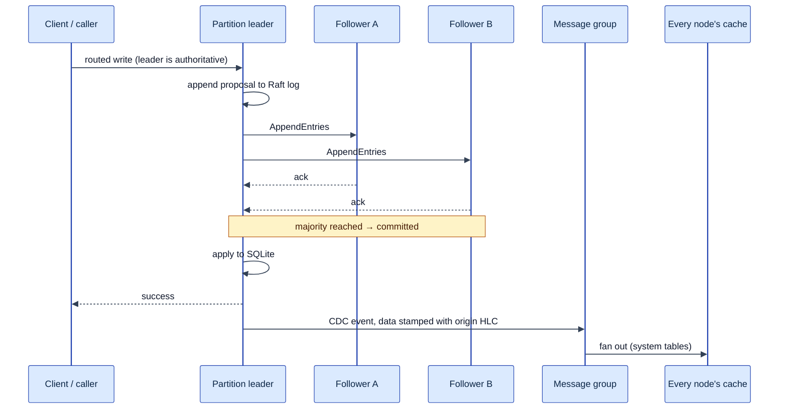
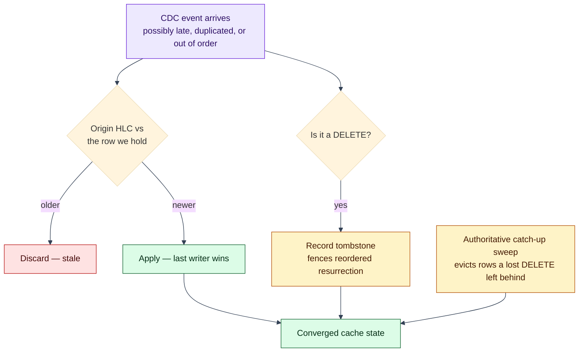
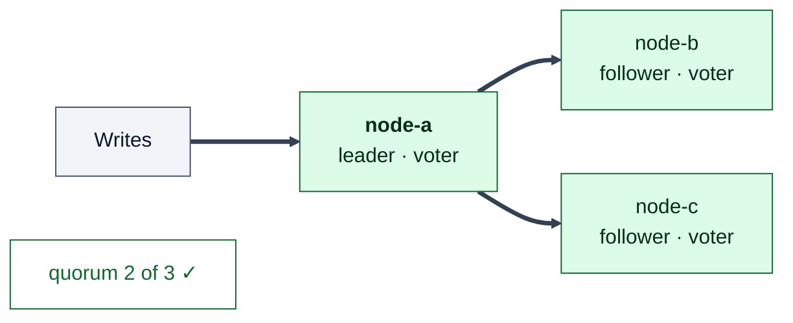
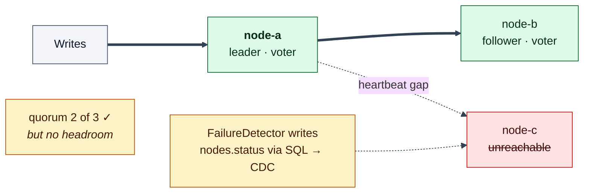
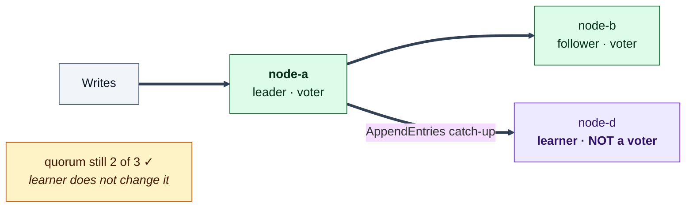
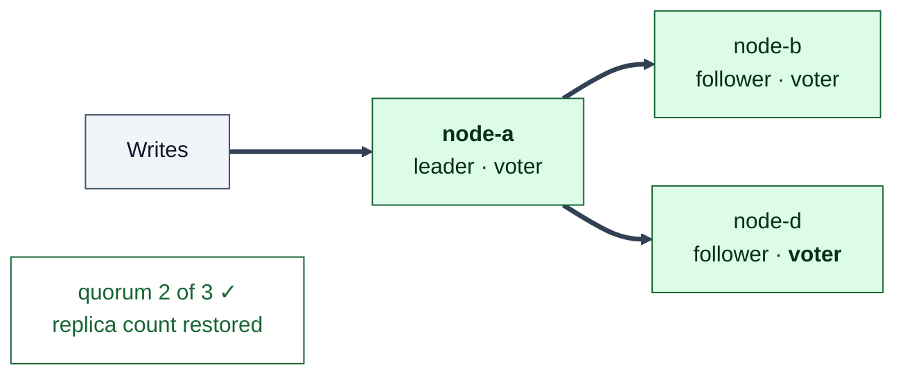
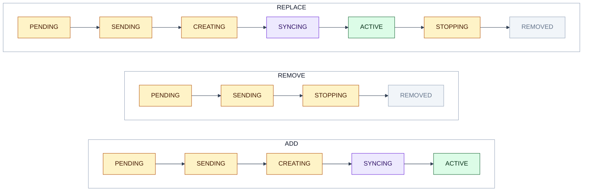

# Process: Replication

How a write becomes durable, how it reaches every node's read model, and how a
replica that is added or lost is brought back to full membership.

Prerequisite: [The Lagrange System Model](system-model.md) — including its
[diagram legend](system-model.md#diagram-legend). Which nodes a group's replicas
land on is [rebalancing](process-rebalancing.md).

## The unit of replication

Every partition is a Raft consensus group. Current placement policy uses odd
replica counts (three by default, with its minimum floor from
`POLICY_DEFAULT.MIN_REPLICA_COUNT`) so an added voter improves failure tolerance
instead of only raising the write quorum. Consensus runs through the semantic Raft operation port backed by the vendored
raft-rs/WASM runtime. Each consensus-owning replica keeps its durable Raft state
in its owned SQLite database; committed membership comes from raft-rs
`ConfState`, not service/cache projections.

The active entity kinds share replica-operation accounting, but they do not all
replicate state through Raft:

| Group type | State | Raft log | Consensus today |
| --- | --- | --- | --- |
| Partition | SQLite rows | SQLite, persistent | Yes |
| Message group | replicated transport/application commands | SQLite, persistent | Yes, through the raft-rs operation port |
| Runtime-service Cell (`runtime_service`) | disposable process-local execution state; durable application state remains in tables | — | No; Cells are placed and repaired through `replica_operations`, not a service-state Raft group |
| WASM service consensus path (`wasm_service`) | session/KV, safety-interval, timer and service-state commands | SQLite, persistent | raft-rs when placement supplies an explicit canonical replica set; otherwise startup fails closed |

Current WASI component execution continues to use Binding-derived
`runtime_service` Cells for placed service execution. The `wasm_service`
consensus lifecycle is a separate state-replication path and does not invent
membership locally: it requires placement/topology to supply the founding
replica set.

### What a replica's disk keeps: process crash versus power loss

Every consensus-owning replica database (partition, message group and WASM
service alike) runs SQLite in WAL mode with `synchronous = NORMAL`. A NORMAL
commit survives a process crash, but SQLite does not sync the WAL on commit,
so a power loss or an OS crash can lose the commits made since the last sync.

What Raft promises to its peers is therefore synced to disk before any message
that depends on it is sent (owner decision O4, 2026-10-05). raft-rs says which
Ready must be synced (`Ready::must_sync`: a changed term or vote, appended log
entries, or a snapshot); the durable store commits that Ready's transaction
with `synchronous = FULL`, so SQLite fsyncs the WAL as part of the COMMIT, and
the runtime hands the Ready's messages to the transport only afterwards. A
granted vote, an acknowledged append and a leader's own appended entries are
synced to disk before they are sent and survive a power loss. The replica's
lifecycle row (retired, or held for reseed) is synced the same way, because
the open-time refusal reads it.

Everything else keeps NORMAL: a hard state whose only change is its commit
index, the applied index and configuration it carries, and the application's
own rows. After a power loss these can roll back to an earlier point, and the
replica re-applies the committed entries from its synced log. Because the WAL
is append-only, a synced commit also makes every earlier commit of the same
file durable.

The guarantee assumes the disk honours a flush. A device or virtualisation
layer that acknowledges a flush while the data is still in a volatile write
cache without power-loss protection voids it. On Linux SQLite issues `fsync`
on the WAL (and on its directory when the WAL is created); `PRAGMA fullfsync`
only applies to macOS.

### A replica held for reseed

A raft-rs replica whose own log is proven shorter than what its group's leader
holds it to have acknowledged has lost history. The proof is a heartbeat from a
member of the replica's own configuration, at a term not below its own, whose
commit lies beyond the replica's persisted log. Such a replica would otherwise
vote and campaign on an empty or short log. The runtime holds it for reseed:
it never steps, ticks, votes or campaigns again, and every operation on it is
refused with `reseed-required`. Other groups on the node keep running.

What an operator sees:

- one ERROR line `raft-rs inbound step refused` (subsystem `raft-rs`, reason
  `peer-commit-beyond-local-log`) naming the group, the replica, the sender,
  the message's term and commit, and the replica's persisted last index;
- the replica's lifecycle row in `_raft_rs_replica_lifecycle`, in the
  replica's own SQLite database: `state = 'retired'`,
  `reason = 'reseed-required'`. Find held replicas on a node with
  `SELECT group_id, replica_identity, changed_at FROM _raft_rs_replica_lifecycle
  WHERE reason = 'reseed-required'` against each replica database. No admin or
  diagnostics endpoint reports this row today;
- if the row could not be written (for example `SQLITE_BUSY`), one ERROR line
  `raft-rs reseed hold not yet durable`. The hold stays in force in memory,
  and the replica's next operation or delivery writes the row again.

The hold is permanent. There is no reseed procedure and no release: the
replica stays out of consensus, also across restarts, and its group runs on
its other replicas. Restoring the group's replica count needs a
fresh-replica-identity ADD path for that group kind, which does not exist yet
for message groups.

Message group mg-1 currently keeps all of its replicas on the seed node. Its
committed state therefore lives only on the seed's disk: losing that disk loses
mg-1's committed state, and there is no recovery path. A joining node hosts only
its own message group.

### SQLite partition logs are bounded by production snapshotting

The Raft snapshot protocol (create / atomic install / bulk transfer /
compacted-follower catch-up / proof-gated retention-compaction) exists for
file-backed SQLite partition replicas (`src/raft/snapshot-*.js`; certified
through the six-stage snapshot-transfer-install ladder, now complete) and
is now WIRED INTO PRODUCTION. A leader-only checkpoint cadence
(`src/partition/partition-snapshot-cadence.js`) rides the 1s
prepared-state-hold sweep; on fire it seals a generation and proof-gate-
compacts the committed prefix past it. Explicit proofless compaction still
returns the typed `snapshot_protocol_unavailable` no-op; proof-gated
compaction requires a durable local checkpoint whose term-anchored descriptor
covers the removed prefix. The only truncation on the live path besides
snapshot compaction is conflict truncation, clamped so it can never reach the
committed prefix. S6 certified this live on a five-node docker cluster: a
wiped follower rebuilds ACTIVE via snapshot install under continuous
foreground writes with zero lost acknowledged writes (N=15 window ABOVE_BAR).

Operational consequences by adapter:

- **SQLite partition logs are bounded** — the leader cadence compacts the
  committed prefix behind a sealed, durably-proven checkpoint, so log growth
  is capped rather than unbounded for the group lifetime.
- **A lagging or from-scratch SQLite follower is caught up by snapshot
  install**, not full log replay, once its required prefix has been compacted
  away — this is the production recovery path the learner-promotion code was
  written to accommodate.
- **In-memory message-group logs still grow without bound** — that adapter's
  weaker durability contract forbids deleting committed entries while it is
  live, so it retains its full prefix and relies on full replay.

## The write path

```mermaid
%%{init: {'theme':'base','themeVariables':{'background':'#ffffff','actorBkg':'#dbeafe','actorBorder':'#1e40af','actorTextColor':'#0b2545','signalColor':'#334155','signalTextColor':'#0f172a','noteBkgColor':'#fef3c7','noteBorderColor':'#b45309','noteTextColor':'#451a03'}}}%%
sequenceDiagram
  participant C as Client / caller
  participant L as Partition leader
  participant F1 as Follower A
  participant F2 as Follower B
  participant MG as Message group
  participant N as Every node's cache

  C->>L: routed write (leader is authoritative)
  L->>L: append proposal to Raft log
  L->>F1: AppendEntries
  L->>F2: AppendEntries
  F1-->>L: ack
  F2-->>L: ack
  Note over L,F2: majority reached → committed
  L->>L: apply to SQLite
  L-->>C: success
  L->>MG: CDC event, data stamped with origin HLC
  MG->>N: fan out (system tables)
```

Three details that matter when reading the code or a trace:

- **Writes are leader-only.** Write routing consults the canonical owner row
  (`partitions.leader_node_id`), not the `services` table, which carries only
  supporting replica detail. A non-leader replica is transport toward the
  leader, never a write target.
- **Commit mode is a decision with three outcomes,** resolved per write by the
  write kernel:

  | Mode | Condition | Effect |
  | --- | --- | --- |
  | `RAFT` | more than one replica **and** local Raft state is leader | replicate, commit on majority, apply |
  | `DIRECT` | one replica or fewer **and** no known remote leader | apply locally without consensus |
  | `REJECTED` | anything else | write is not committed here; it is forwarded to the leader |

- **CDC is emitted from the apply callback, not the propose path,** and only when
  the local replica is the leader. The leader stamps `updated_at_hlc` onto the
  event's `data` at generation time, and that stamp rides unchanged to every
  receiver — which is what makes the cache merge skew-immune. It is cache-only:
  the durable write path filters it out, so it is a cache-visible field, not a
  persisted column.

## Propagation to read models

Replication makes a write durable inside its group. CDC is what makes a
*system-table* write visible to every node's `SystemTableCache`, the read model
that routing, placement, and admission decisions run on.

Because delivery is point-in-time with no global ordering, the apply path is
convergent rather than ordered:

```mermaid
%%{init: {'theme':'base','themeVariables':{'background':'#ffffff','lineColor':'#334155','textColor':'#0f172a'}}}%%
flowchart TD
  E["CDC event arrives<br/>possibly late, duplicated, or out of order"]:::move --> H{"Origin HLC vs<br/>the row we hold"}
  H -->|"older"| DROP["Discard — stale"]:::bad
  H -->|"newer"| APPLY["Apply — last writer wins"]:::good
  E --> D{"Is it a DELETE?"}
  D -->|"yes"| TOMB["Record tombstone<br/>fences reordered resurrection"]:::ctrl
  APPLY --> CONV["Converged cache state"]:::good
  TOMB --> CONV
  SWEEP["Authoritative catch-up sweep<br/>evicts rows a lost DELETE left behind"]:::ctrl --> CONV

  classDef move fill:#ede9fe,stroke:#6d28d9,color:#2e1065
  classDef ctrl fill:#fef3c7,stroke:#b45309,color:#451a03
  classDef good fill:#dcfce7,stroke:#166534,color:#052e16
  classDef bad fill:#fee2e2,stroke:#b91c1c,color:#450a0a
```

The practical rule: **the cache converges, but it is not a completion oracle.**
Never read "the row is not in my cache yet" as "the operation did not happen".

## Losing and repairing a replica, stage by stage

This is the sequence to have in your head when a node dies. The same three-node
group is shown at each stage; watch the voter count, because that is what
determines whether the group can still commit.

### Stage 1 — Healthy

```mermaid
%%{init: {'theme':'base','themeVariables':{'background':'#ffffff','lineColor':'#334155','textColor':'#0f172a'}}}%%
flowchart LR
  W["Writes"]:::ext ==> A["<b>node-a</b><br/>leader · voter"]:::good
  A ==> B["node-b<br/>follower · voter"]:::good
  A ==> C["node-c<br/>follower · voter"]:::good
  Q["quorum 2 of 3 ✓"]:::ok

  classDef good fill:#dcfce7,stroke:#166534,color:#052e16
  classDef ok fill:#ffffff,stroke:#166534,color:#166534
  classDef ext fill:#f1f5f9,stroke:#475569,color:#0f172a
```

### Stage 2 — One replica lost; the group still commits

```mermaid
%%{init: {'theme':'base','themeVariables':{'background':'#ffffff','lineColor':'#334155','textColor':'#0f172a'}}}%%
flowchart LR
  W["Writes"]:::ext ==> A["<b>node-a</b><br/>leader · voter"]:::good
  A ==> B["node-b<br/>follower · voter"]:::good
  A -.->|"heartbeat gap"| C["node-c<br/><s>unreachable</s>"]:::bad
  Q["quorum 2 of 3 ✓<br/><i>but no headroom</i>"]:::warn
  FD["FailureDetector writes<br/>nodes.status via SQL → CDC"]:::ctrl -.-> C

  classDef good fill:#dcfce7,stroke:#166534,color:#052e16
  classDef bad fill:#fee2e2,stroke:#b91c1c,color:#450a0a
  classDef warn fill:#fef3c7,stroke:#b45309,color:#451a03
  classDef ctrl fill:#fef3c7,stroke:#b45309,color:#451a03
  classDef ext fill:#f1f5f9,stroke:#475569,color:#0f172a
```

Under-replication is classified as *critical*, so the repair gets a multiplied
rebalance budget rather than queueing behind ordinary spread optimisation.

### Stage 3 — Replacement joins as a learner

```mermaid
%%{init: {'theme':'base','themeVariables':{'background':'#ffffff','lineColor':'#334155','textColor':'#0f172a'}}}%%
flowchart LR
  W["Writes"]:::ext ==> A["<b>node-a</b><br/>leader · voter"]:::good
  A ==> B["node-b<br/>follower · voter"]:::good
  A ==>|"AppendEntries catch-up"| D["node-d<br/><b>learner · NOT a voter</b>"]:::pend
  Q["quorum still 2 of 3 ✓<br/><i>learner does not change it</i>"]:::warn

  classDef good fill:#dcfce7,stroke:#166534,color:#052e16
  classDef pend fill:#ede9fe,stroke:#6d28d9,color:#2e1065
  classDef warn fill:#fef3c7,stroke:#b45309,color:#451a03
  classDef ext fill:#f1f5f9,stroke:#475569,color:#0f172a
```

The learner phase is the point of the design: a fresh, far-behind replica
receives log entries without voting, so adding it can neither block a quorum nor
trigger an election while it catches up.

### Stage 4 — Promoted; group healthy again

Promotion is **time-based, not progress-based** — the detail most likely to
mislead you when reading this code. The promotion check waits a fixed delay
(30 s; 5 s for priority control-plane partitions, re-polled every second) and
then requires only a discovered leader plus voter-count safety arithmetic: no
overflow past the target replica count, and no even voter count. It does **not**
compare the learner's log index against the leader's. Even though SQLite
partitions now have a production snapshot-install catch-up path (a far-behind
follower can be rebuilt by install rather than long replay), promotion timing
is unchanged and still does not check the index — so a learner that has not
finished catching up can in principle be promoted before it is genuinely
current.

Learner mode is not universal either: replicas created during fresh bootstrap,
or when no viable leader row is visible, start as voters and skip the learner
phase entirely.

```mermaid
%%{init: {'theme':'base','themeVariables':{'background':'#ffffff','lineColor':'#334155','textColor':'#0f172a'}}}%%
flowchart LR
  W["Writes"]:::ext ==> A["<b>node-a</b><br/>leader · voter"]:::good
  A ==> B["node-b<br/>follower · voter"]:::good
  A ==> D["node-d<br/>follower · <b>voter</b>"]:::good
  Q["quorum 2 of 3 ✓<br/>replica count restored"]:::ok

  classDef good fill:#dcfce7,stroke:#166534,color:#052e16
  classDef ok fill:#ffffff,stroke:#166534,color:#166534
  classDef ext fill:#f1f5f9,stroke:#475569,color:#0f172a
```

### The same sequence as operation state

Those stages correspond to the `workflow_step` values recorded on the
`replica_operations` row, which is why a stalled repair can be read off the row
instead of inferred from logs. There are three distinct chains, one per
operation type — `ADD`, `REMOVE`, and `REPLACE` are the only types the
coordinator creates:

```mermaid
%%{init: {'theme':'base','themeVariables':{'background':'#ffffff','lineColor':'#334155','textColor':'#0f172a'}}}%%
flowchart LR
  subgraph ADD["ADD"]
    direction LR
    P1["PENDING"]:::ctrl --> S1["SENDING"]:::ctrl --> C1["CREATING"]:::ctrl --> Y1["SYNCING"]:::move --> A1["ACTIVE"]:::good
  end
  subgraph REM["REMOVE"]
    direction LR
    P2["PENDING"]:::ctrl --> S2["SENDING"]:::ctrl --> T2["STOPPING"]:::ctrl --> R2["REMOVED"]:::gone
  end
  subgraph REP["REPLACE"]
    direction LR
    P3["PENDING"]:::ctrl --> S3["SENDING"]:::ctrl --> C3["CREATING"]:::ctrl --> Y3["SYNCING"]:::move --> A3["ACTIVE"]:::good --> T3["STOPPING"]:::ctrl --> R3["REMOVED"]:::gone
  end

  style ADD fill:#ffffff,stroke:#94a3b8,color:#0f172a
  style REM fill:#ffffff,stroke:#94a3b8,color:#0f172a
  style REP fill:#ffffff,stroke:#94a3b8,color:#0f172a
  classDef ctrl fill:#fef3c7,stroke:#b45309,color:#451a03
  classDef move fill:#ede9fe,stroke:#6d28d9,color:#2e1065
  classDef good fill:#dcfce7,stroke:#166534,color:#052e16
  classDef gone fill:#f1f5f9,stroke:#94a3b8,color:#64748b
```

`FAILED` is a `workflow_step` value but is not part of any of the three chains —
it is the out-of-band error terminal. (`MOVE_ASSIGNMENT` rows also appear in
this table; they are bootstrap-owned join reservations, deliberately outside
coordinator logic, and there is no `MOVE` operation type.)

The operation lifecycle itself is owned by `RebalanceCoordinator`; see
[rebalancing](process-rebalancing.md).

## Reads and consistency

- Reads may be served by any routable replica of the partition; writes may not.
- Partitions implement epoch-based snapshot isolation: reads see writes
  committed before the epoch, plus your own writes, and write conflicts are
  detected first-committer-wins at prepare time.
- Distributed transactions add participant enlistment and 1PC/2PC phases on top,
  owned by `DistributedTransactionCoordinator`. A partition's prepared state is
  a durable `PREPARE_TRANSACTION` Raft entry, so prepared writes survive leader
  failover.

## What this means when you build on it

- **Replica count is a durability/latency trade, and it must stay odd.**
- **A write is acknowledged after majority commit,** so a minority partition
  cannot accept writes — intended behaviour, not something to route around.
- **Do not build a second notification channel.** A component that needs to know
  about a metadata change should observe the CDC-fed cache, not receive a
  bespoke message.
