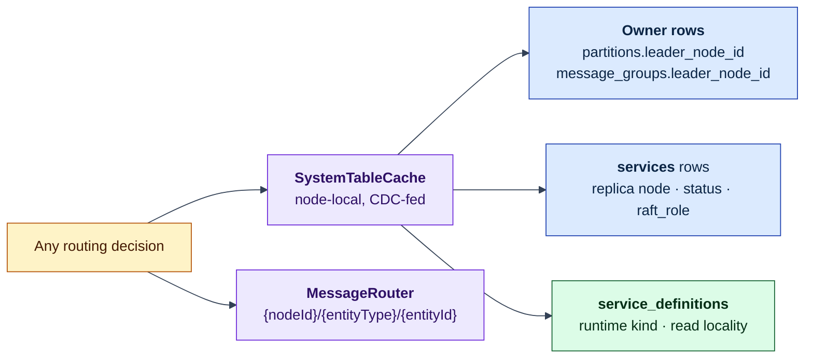
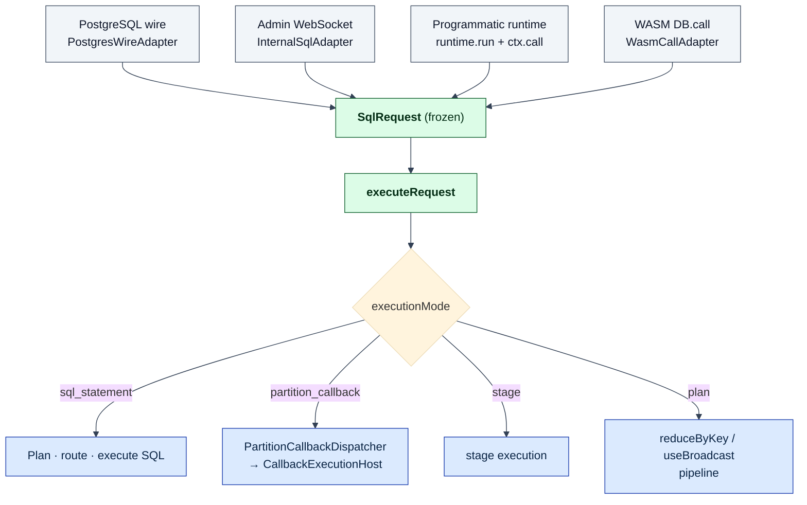
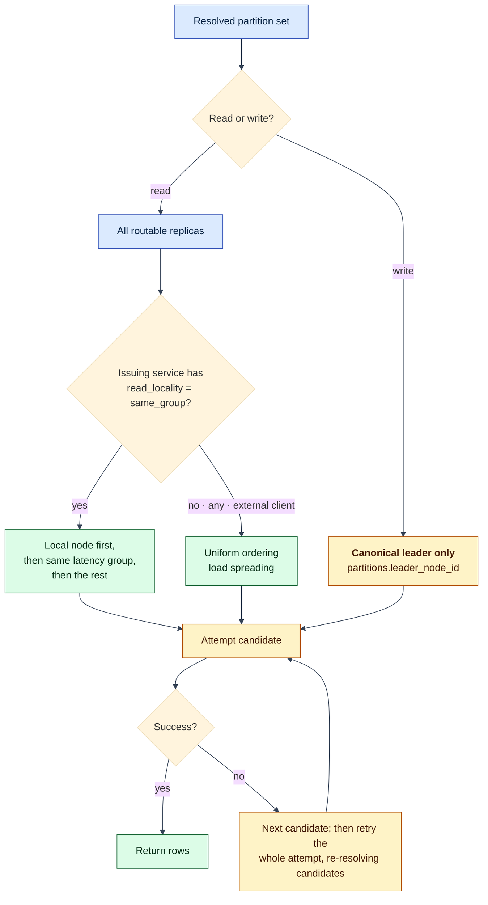
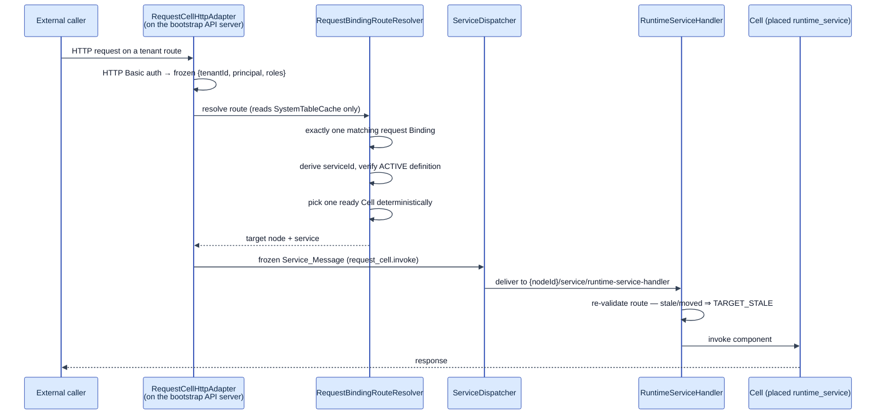
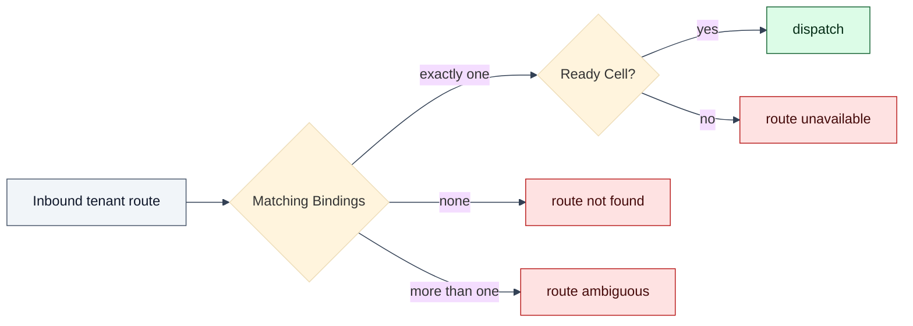

# Process: Request Routing

How a request finds the node that can answer it — for SQL statements, and for
calls into deployed services.

Prerequisite: [The Lagrange System Model](system-model.md) — including its
[diagram legend](system-model.md#diagram-legend). Which replica is *preferred*
when several are eligible is [data affinity](process-data-affinity.md).

## The routing substrate

All routing decisions share one substrate, and it is local:

No request-time lookup RPC exists. A node routes from its own cache, and the
cache is correct because CDC keeps it converging.

Resolving "who is the leader" is a four-level ladder, not a single column, and
it is worth knowing the order because the fallbacks show up in incident traces:

1. the bootstrap-topology owner;
2. `partitions.leader_node_id` — the canonical owner row;
3. the retained runtime leader, for control-plane partitions only;
4. a **unique** `services` row with `raft_role = leader` and `status = active` —
   several such witnesses means ambiguous, and the leader resolves to null.

So the `services` table is a documented fallback authority rather than merely
supporting detail. "Writes must reach the leader" likewise has three explicit
widenings: fresh bootstrap-leader services, recovery-candidate widening, and
leader-address quarantine.

## SQL statements

External entrypoints normalise into a frozen `SqlRequest` and delegate to one
engine. There is no second planner, no fallback executor, and no
protocol-specific execution path.

Two caveats before you rely on `SqlRequest` as a universal seam: many in-process
callers (cache hydration, live queries, CDC owner reads) call `executeQuery`
directly and never construct a request object; and `stage` and `plan` are
declared execution modes that the current request constructor cannot actually
produce, since it drops the fields they need.

### Choosing the target replicas

The retry structure exists because routing has to survive topology change.
During a split, a leader election, or a replica move, a candidate list can go
stale between resolution and delivery — and partition epoch fencing (see
[partitioning](process-partitioning.md#what-makes-cutover-safe-partition-epochs))
will reject a stale target rather than serve it. Reads therefore iterate
candidates within an attempt and re-resolve across attempts, up to
`query.readRetryAttempts` (default 3), rather than hard-failing on the first
transient error. Timeouts on this path are classified as query-plane timeouts,
distinct from control-plane remote-call timeouts — a distinction worth
preserving when adding diagnostics.

### Fan-out and merge

When a statement resolves to several partitions, `ParallelQueryCoordinator`
schedules the fan-out with deterministic chunking (partitions are never silently
truncated), and `DistributedMergeEngine` owns global semantics — `DISTINCT`,
`GROUP`/`HAVING`, `ORDER`, `LIMIT`, set-operation merges. Local partition
results are partial by construction; the merge stage is what makes them a
correct global answer.

## Service requests

Deployed services are reached through a different front door, but the same
transport and the same cache-driven target resolution.

There is no separate gateway process: the same Fastify **bootstrap API** server
carries a catch-all route that hands every request to the adapter. The adapter
authenticates against the PG-wire credential verifier and rejects any
client-supplied authority headers, so tenant and principal are established
before routing, not by the caller.

The nouns are worth learning, because they are the deployment surface:

- An **Artifact** is the immutable executable declaration — the installed
  package plus the digest of its canonical manifest.
- A **Binding** is the durable user declaration of execution intent: the only
  place a route-to-artifact mapping is stated, and immutable once written. The
  service id is *derived* from the binding version, not chosen.
- A **Cell** is a running actual of that Binding — concretely, an ACTIVE
  `runtime_service` replica row in `services` belonging to the binding-compiled
  definition. One is selected deterministically by hashing the invocation id
  across the sorted ready actuals, and the receiving handler re-validates the
  choice before invoking, so a Cell that moved between resolution and delivery
  fails as `TARGET_STALE` rather than serving.

Ambiguity is an error, not a heuristic. Each failure mode is a distinct typed
classification so a caller can tell "misconfigured" from "not yet available":

### Service-to-table access

Service code does not get its own query path. `ServiceRuntimeLifecycle` injects
a service-scoped executor into the replica context during `start()`; that
closure routes through the same `SQLQueryEngine.executeQuery()` as everything
else. The service identity it carries is what makes the statement attributable —
which is the input to [data affinity](process-data-affinity.md).

## Ingress endpoints

Clients discover where to connect from published endpoint rows rather than fixed
topology:

| Surface | Discovery | Note |
| --- | --- | --- |
| PostgreSQL wire | `service_endpoints` rows with `protocol = postgresql` | `sys-postgres-wire` is a replicated runtime service; its replica count is cluster-global and placed by the rebalancer |
| Admin API | fixed WebSocket port on every node | compatibility adapter; mutations delegate to `sys-admin-meta` / `sys-wasm-meta` |
| Service requests | Binding routes → ready Cells | see above |

Because the PG wire is an ordinary replicated service, scaling it is a placement
decision, and session state stays replica-local by design — clients scale out by
discovering endpoints and reconnecting, not by session migration.

## What this means when you build on it

- **Route from the cache, never by asking a peer.** A new request-time lookup
  RPC would reintroduce the coupling the CDC read model exists to remove.
- **Treat candidate lists as perishable.** Anything holding a resolved replica
  across an await needs to tolerate it having moved.
- **Give routing failures typed classifications.** "No route", "ambiguous
  route", and "no ready target" are operationally different problems and should
  never collapse into one error.
