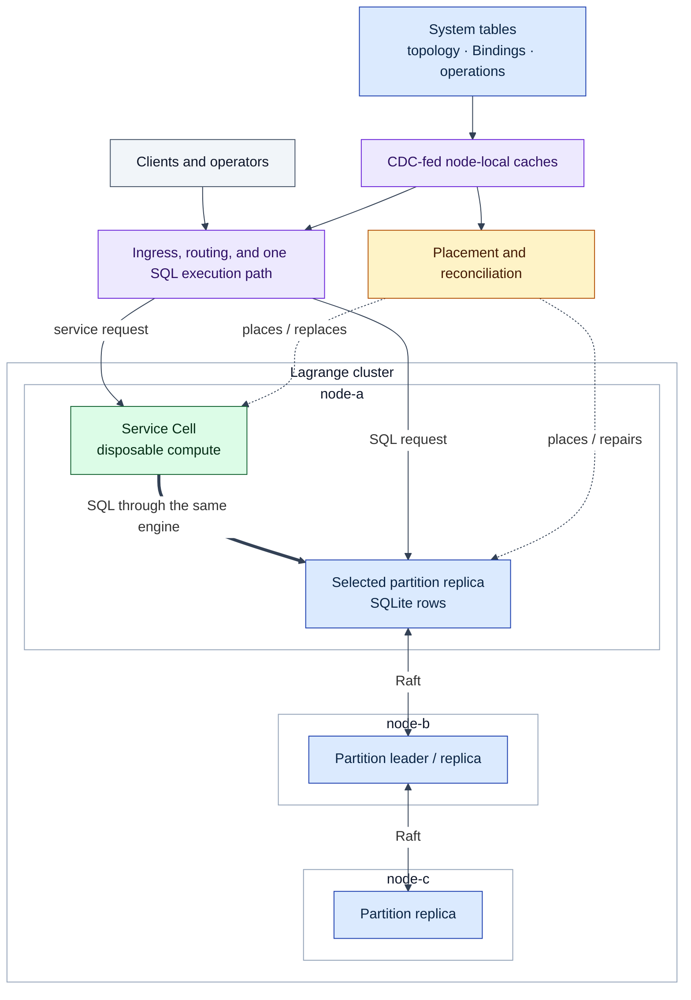
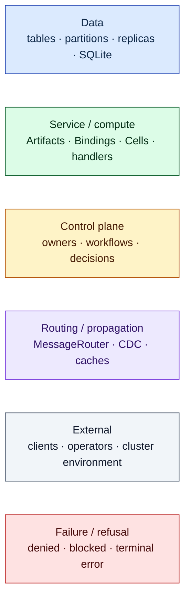
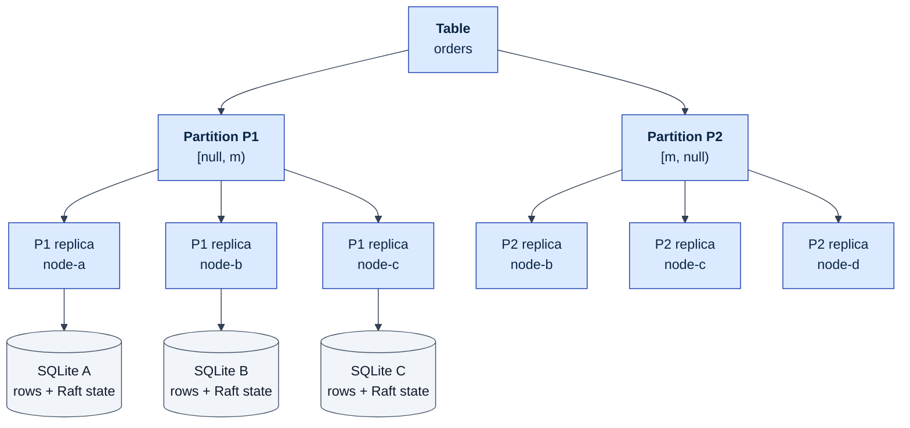
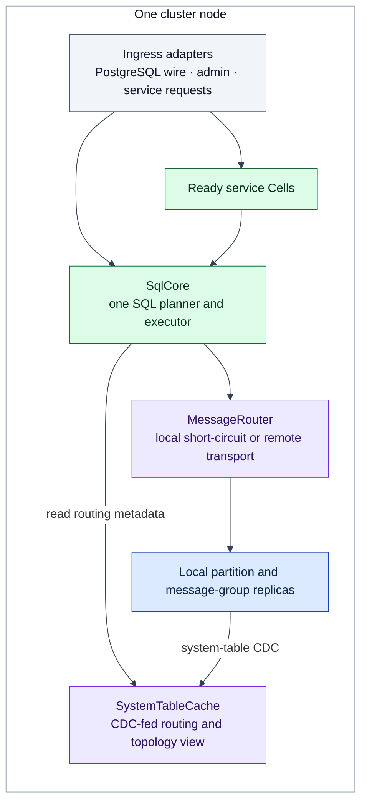
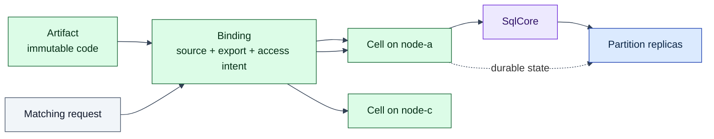
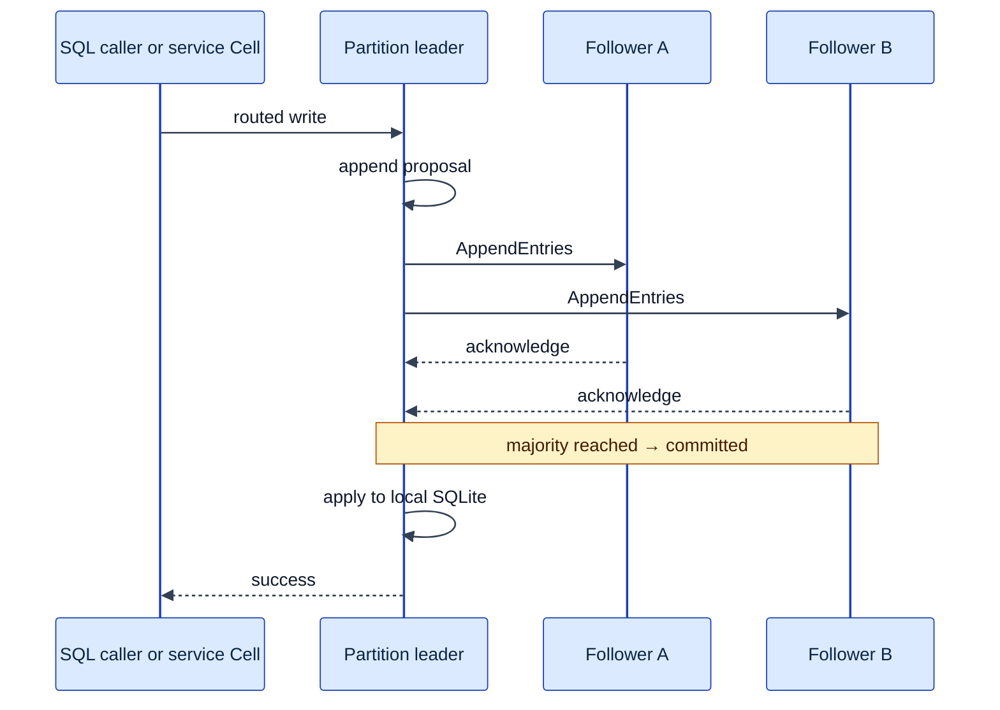
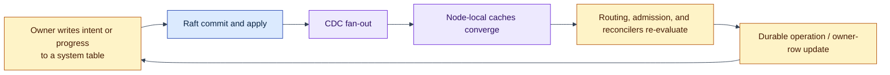

# The Lagrange System Model

This document defines the mental model used by the rest of the architecture
documentation: what owns durable state, what is distributed, what is placed,
and how requests and topology changes move through the cluster.

It is deliberately not a component inventory. Start here, then follow the
process document for the mechanism you need:
[partitioning](process-partitioning.md),
[replication](process-replication.md),
[request routing](process-request-routing.md),
[data affinity](process-data-affinity.md), or
[rebalancing](process-rebalancing.md).

## One sentence

Lagrange is a distributed SQL database whose tables are split into
Raft-replicated partitions and whose disposable service Cells are continuously
placed near the data they use.

## The system in one picture

The diagram is intentionally simplified. A partition normally has the
configured replica count, requests may enter any node, and locality is an
optimisation constrained by durability, capacity, spread, policy, and current
cluster state. Lagrange does not remove networking or consensus; it makes data
location part of where service execution is placed and how reads are routed.

## Six anchors

These statements are the stable vocabulary behind the deeper documents:

1. **Tables hold durable state.** User rows, service state, and cluster metadata
   all live in ordinary tables.
2. **Partitions are the distribution unit.** A partition owns a contiguous key
   range and is the unit of routing, replication, placement, split, and merge.
3. **Replicas are durable members.** Each partition replica stores its own rows
   and Raft state and participates in failure recovery.
4. **Cells are disposable compute.** A runtime-service Cell runs code but has no
   per-service consensus log; durable application state belongs in tables.
5. **Routing decisions are local views of durable truth.** Each node uses a
   CDC-fed cache of system tables rather than performing a request-time global
   lookup.
6. **Placement is continuous.** The cluster repeatedly reconciles declared
   intent, observed access, topology, capacity, and failures.

## Diagram legend

Every process document uses the same colour vocabulary. Colour is only a
reading aid; labels and arrows carry the meaning.

## 1. The objects that matter

| Object | What it represents | Durable state ownership |
| --- | --- | --- |
| **Table** | A logical SQL-visible relation | Its partitions |
| **Partition** | A contiguous primary-key range and routing target | Its Raft group |
| **Replica** | One physical member of a partition group on one node | Its own SQLite rows and Raft state |
| **Artifact** | Immutable, digest-pinned service code | Artifact metadata and content records |
| **Binding** | Immutable execution intent connecting an Artifact export to a source | Binding and access-policy rows |
| **Cell** | A ready running instance derived from a Binding | None locally; durable service state remains in tables |
| **Message group** | CDC transport and fan-out | Its group log, with a different durability boundary from partition storage |
| **Operation row** | Durable progress and outcome for a topology workflow | The owning system table |

### The storage hierarchy

A table is logical; each replica is physical. Replicas do not share one SQLite
file.

System tables such as `nodes`, `partitions`, `services`,
`service_definitions`, Bindings, and operation records use this same storage
model. There is no separate metadata database outside the cluster.

Read [Process: Partitioning](process-partitioning.md) for key ranges and
split/merge, and [Process: Replication](process-replication.md) for consensus and
repair.

## 2. What runs on a node

Every node can accept requests, participate in storage, run placed Cells, and
make routing decisions from its local metadata view.

Two consequences explain much of the runtime behaviour:

- **There is no request-time topology service.** A node chooses targets from its
  local `SystemTableCache`. CDC is the normal propagation path, while bootstrap,
  join hydration, reconciliation, and bounded owner-local truth seeds cover
  specific recovery windows.
- **There is one addressing surface.** `MessageRouter` addresses local and
  remote entities consistently. A registered local destination short-circuits
  in process; a remote destination uses transport.

The local cache is a read model of durable system-table truth. It is useful for
routing and decisions, but it is not itself the authority that completes a
workflow.

## 3. Requests use shared paths

### SQL requests

Protocol adapters and internal callers do not own separate planners. The public
request path normalises into `SqlRequest` and delegates to `SqlCore`.

A predicate the partition resolver cannot use generally widens the target set
rather than failing. Multi-partition execution fans work out, performs local
work, and merges results. Read
[Process: Request Routing](process-request-routing.md) for the candidate and
retry rules and [Process: Partitioning](process-partitioning.md) for current
narrowing behaviour.

### Service requests

Artifact, Binding, and Cell describe code, execution intent, and the resulting
placed runtime instance. They do not create another durable-state model.

Cells are replaceable. Their capacity and placement are cluster decisions, not
application-selected node assignments. Request Bindings are the publicly
invocable external path today; see
[Minimal Deployment Surface](minimal-deployment-surface.md) and the
[service deployment guide](../docs/service-deployment-guide.md).

## 4. A write keeps the database durability model

Data-local service execution can remove an avoidable application-to-database
hop, but the partition leader and its quorum still decide durability.

Writes are leader-owned. Read-locality and Cell placement can influence which
network boundaries are crossed before the write reaches the leader, but they do
not turn followers into write authorities. The exact write modes, CDC emission,
snapshot behaviour, and repair path are in
[Process: Replication](process-replication.md).

## 5. Placement and routing act on two timescales

The phrase “compute moves to the data” covers two separate mechanisms.

| Mechanism | Question | Timescale |
| --- | --- | --- |
| **Placement affinity** | Where should this service's Cells live? | Topology time: slower, structural |
| **Read-locality routing** | Which eligible replica should serve this read? | Request time: fast, per query |

Placement affinity learns from actual service-to-partition access. That evidence
is combined with load, capacity, spread, failure, and policy constraints.

```mermaid
%%{init: {'theme':'base','darkMode':false,'themeCSS':'svg { background-color: #ffffff !important; }','themeVariables':{'background':'#ffffff','clusterBkg':'#ffffff','clusterBorder':'#94a3b8','edgeLabelBackground':'#ffffff','lineColor':'#334155','textColor':'#0f172a'}}}%%
flowchart LR
  TRAFFIC["Real service traffic"]:::ext --> OBS["Service → partition access evidence"]:::move
  OBS --> CACHE["CDC-fed cluster view"]:::move
  CACHE --> SCORE["Affinity + load + capacity + policy"]:::ctrl
  SCORE --> PLAN["Placement plan and durable operation"]:::ctrl
  PLAN --> PLACE["Cells and replicas reconciled"]:::svc
  PLACE --> LOCAL["More local execution when constraints allow"]:::data
  LOCAL --> TRAFFIC

  classDef data fill:#dbeafe,stroke:#1e40af,color:#0b2545
  classDef svc fill:#dcfce7,stroke:#166534,color:#052e16
  classDef ctrl fill:#fef3c7,stroke:#b45309,color:#451a03
  classDef move fill:#ede9fe,stroke:#6d28d9,color:#2e1065
  classDef ext fill:#f1f5f9,stroke:#475569,color:#0f172a
```

Locality is an outcome, not an unconditional promise. A healthy placement may
remain remote because quorum spread, available capacity, latency-group policy,
incumbent stability, or another safety constraint wins.

Read [Process: Data Affinity](process-data-affinity.md) for the evidence feed and
[Process: Rebalancing](process-rebalancing.md) for movement decisions and
operation safety.

## 6. The metadata control loop

Topology changes are not coordinated through ad-hoc broadcasts. Owners write
intent and progress to system tables, those writes become durable through the
normal partition path, and CDC updates every node's local read model.

Three debugging rules follow:

- **A cache observation is not a completion oracle.** The durable owner or
  operation row defines whether a workflow is complete.
- **Absence in one cache proves little.** The relevant event may not have
  arrived yet, or reconciliation may still be in progress.
- **Apply must tolerate reordering.** Origin HLC comparison, tombstones, and
  authoritative reconciliation protect convergence when CDC delivery is not a
  global total order.

Read [Control Plane Architecture](control-plane.md) and
[Bootstrap And Data Flow](bootstrap.md) for owner progression, hydration, and
recovery detail.

## 7. Active group types and their boundaries

The placement machinery handles entities with different state contracts. Shared
operation accounting does not mean shared consensus semantics.

| Entity | Primary role | Consensus and durable-state boundary |
| --- | --- | --- |
| **Partition group** | Stores one table key range | Persistent SQLite rows and Raft state; consensus active |
| **Message group** | Carries CDC and cluster propagation | Raft-backed in-memory transport log with a weaker restart boundary than partition storage |
| **Runtime-service Cell** | Runs Binding-derived service code | No per-service Raft state; durable application state remains in tables |

Scaffold or compatibility code must not be read as another active production
path. In particular, current externally installed WASI workloads use
Binding-derived `runtime_service` Cells; legacy `wasm_service` classes are not a
fourth active placement and consensus model.

## 8. Invariants that organise the code

The architecture is easier to navigate when these contracts are treated as
hard boundaries:

- **One owner per concern.** Durable intent and state transitions have a
  canonical owner rather than several competing writers.
- **One SQL planner and executor.** Entry adapters converge instead of creating
  protocol-specific semantics.
- **One routing substrate.** Local and remote delivery share addressing and
  metadata, with local short-circuit as an optimisation.
- **No hidden durable state in Cells.** Replaceable compute cannot become an
  accidental second database.
- **Writes reach the partition leader.** Locality does not create alternate
  write authorities.
- **System-table truth drives reconciliation.** Cache views may lag, but owners
  and operation rows remain durable evidence.
- **No silent fallback path.** Unsupported or incomplete behaviour should be
  explicit rather than switching to a second implementation with different
  semantics.

The detailed single-path ownership contract is in
[Architecture Overview](overview.md).

## Where to go next

| To understand… | Read |
| --- | --- |
| How key ranges are created, narrowed, split, and merged | [Process: Partitioning](process-partitioning.md) |
| How writes commit, CDC is emitted, and replicas recover | [Process: Replication](process-replication.md) |
| How SQL and service requests select their targets | [Process: Request Routing](process-request-routing.md) |
| How observed access affects placement and reads | [Process: Data Affinity](process-data-affinity.md) |
| How moves are scored, admitted, executed, and repaired | [Process: Rebalancing](process-rebalancing.md) |
| How Artifact, Binding, and Cell lifecycle is owned | [Minimal Deployment Surface](minimal-deployment-surface.md) |
| How nodes form and hydrate a cluster | [Bootstrap And Data Flow](bootstrap.md) |
| Which component owns a runtime responsibility | [Runtime Components](runtime-components.md) |
| What the current implementation actually supports | [Current capabilities and limitations](../docs/current-capabilities-and-limitations.md) |
