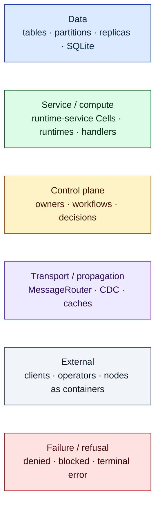
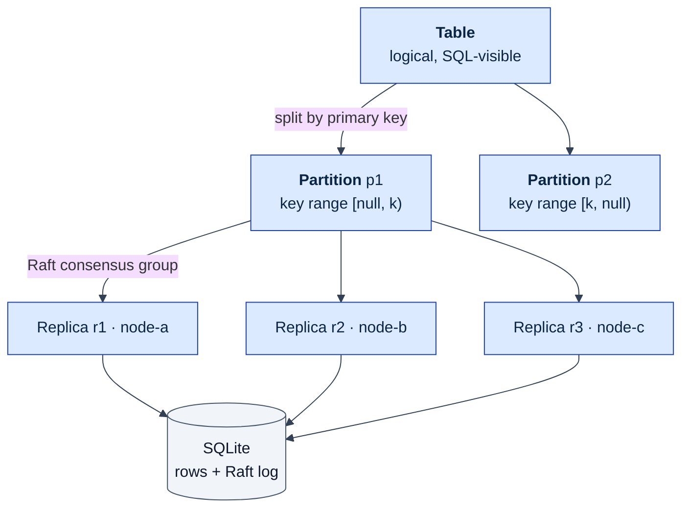
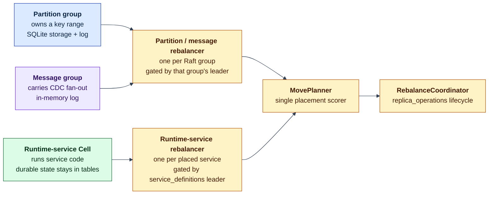
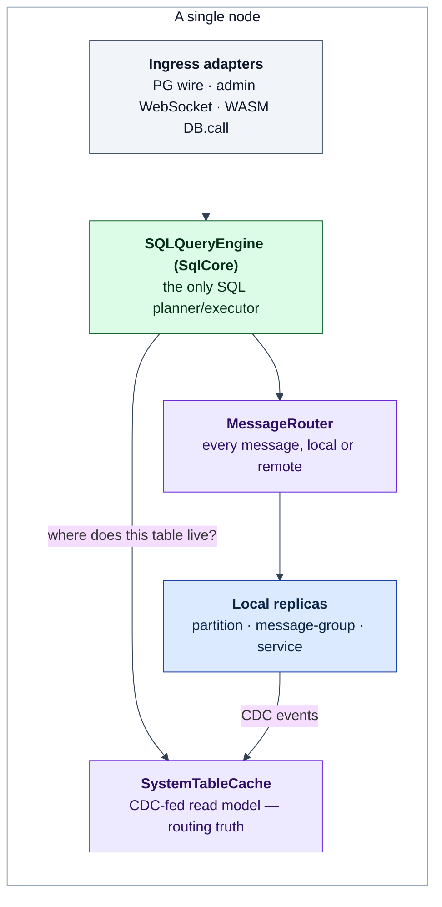
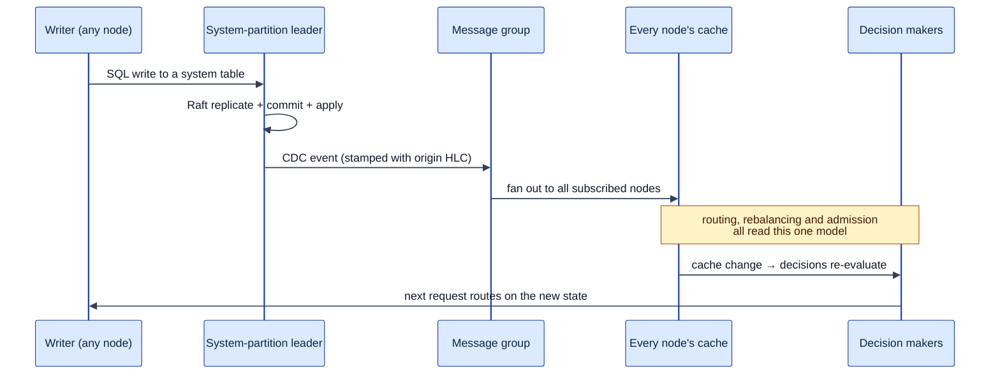
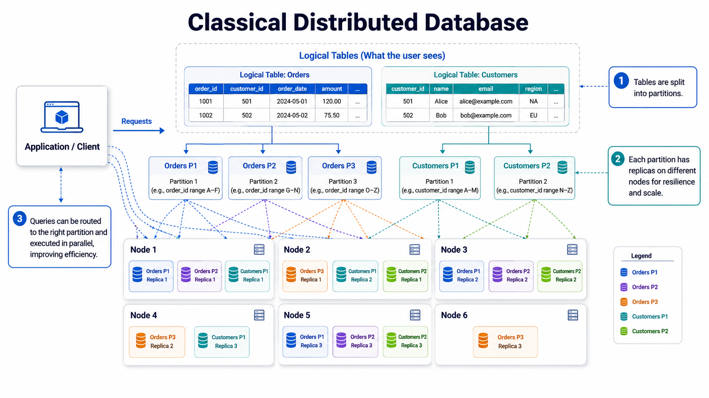
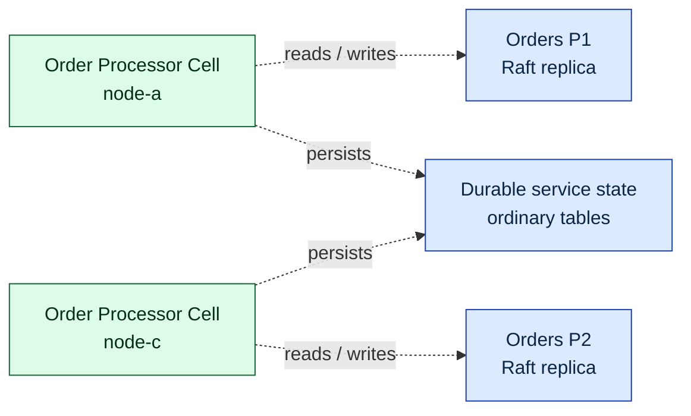

# The Lagrange System Model

The mental model a developer needs before reading any other architecture
document: what Lagrange stores, what it replicates, what it places, and how a
request finds its data.

Read this first, then the process document for whatever you are working on:
[partitioning](process-partitioning.md), [replication](process-replication.md),
[rebalancing](process-rebalancing.md),
[request routing](process-request-routing.md), or
[data affinity](process-data-affinity.md).

## One sentence

Lagrange is a distributed SQL database whose data is partitioned and
Raft-replicated, while service Cells reuse the same placement and repair
workflow so application code can run near the rows it reads.

## Diagram legend

Every diagram in the architecture process documents uses one colour vocabulary.
Colours are always dark text on a light fill so the diagrams stay readable in
light and dark themes and in print.

## 1. The storage stack

Four levels, no exceptions. Every persistent thing in the cluster — user rows
and the cluster's own metadata alike — sits somewhere in this stack.

- A **table** is logical. It never exists as a single physical object.
- A **partition** owns a contiguous primary-key range and is the unit of
  routing, placement, and split/merge.
- A **replica** is one member of the partition's Raft group and is the unit of
  failure and repair.
- Storage is **SQLite** — both the rows and the partition's Raft log.

System tables (`nodes`, `partitions`, `services`, `service_definitions`, …) are
ordinary tables in this same stack. There is no separate metadata store.

## 2. Two consensus-group kinds plus placed runtime services

Lagrange actively places three entity kinds: partitions, message groups, and
runtime services. The first two are Raft consensus groups. Runtime-service
Cells reuse placement, repair, and operation accounting without claiming
Raft-replicated process-local state.

This is why "a partition is a service" is more than a slogan: partitions,
message groups, and runtime services are rows in `services`, use the same
planner, and are repaired through the same `replica_operations` workflow. See
[rebalancing](process-rebalancing.md).

The legacy `wasm_service` enum and `WasmServiceReplica` classes are not a fourth
active placement path: production startup constructs no rebalancer for that
entity kind. Current WASI component workloads run as Binding-derived
`runtime_service` Cells. See
[replication](process-replication.md#the-unit-of-replication).

## 3. What runs on one node

Two things about this picture carry most of the system's behaviour:

- **`SystemTableCache` is the routing brain and is read-only to its ordinary
  consumers.** Nothing decides where to send a request by asking a peer at
  request time; it reads the local cache. CDC is the primary writer, but not the
  only one — bootstrap and join hydration, authoritative reconciliation and
  repair, and a small set of owner-local truth seeds also write to it during
  normal operation. Treat "CDC-only" as the design intent and the sanctioned
  writer list as the actual contract.
- **`MessageRouter` is the single addressing surface,** using
  `{nodeId}/{entityType}/{entityId}`. It is not, however, a single *transport*:
  a message addressed to the local node short-circuits to an in-process handler
  call with no socket and no serialization. The node's WebSocket connection to
  itself is the fallback for local addresses with no registered handler.

## 4. The control loop

Metadata changes are not broadcast as ad-hoc notifications. They are *writes to
system tables*, which means they go through the same Raft path as user data and
arrive everywhere as CDC events.

Consequences worth internalising before debugging anything:

- **Convergence, not ordering.** CDC delivery is point-in-time with no global
  order, so the cache apply path is order-insensitive: an origin write HLC
  drives a last-writer-wins compare, DELETE tombstones fence reordered
  resurrections, and an authoritative sweep removes rows a lost DELETE left
  behind.
- **The cache is an observational read model, not a completion oracle.** A
  topology workflow is finished when its owner row says so, not when your local
  cache happens to show the result.
- **Absence proves nothing.** A row missing from your local cache may be a row
  that has not arrived yet.

## 5. A request, end to end

```mermaid
%%{init: {'theme':'base','themeVariables':{'background':'#ffffff','lineColor':'#334155','textColor':'#0f172a'}}}%%
flowchart LR
  C["Client"]:::ext --> I["Ingress adapter"]:::ext
  I --> RQ["SqlRequest<br/>frozen"]:::svc
  RQ --> E["SqlCore.executeRequest"]:::svc
  E --> PR["Resolve partitions<br/>from primary-key predicates"]:::ctrl
  PR --> CS["Pick replicas per partition<br/>leader for writes"]:::ctrl
  CS --> MR["MessageRouter"]:::move
  MR --> PX["Partition replicas<br/>execute locally"]:::data
  PX --> AG["Merge / aggregate"]:::svc
  AG --> C

  classDef data fill:#dbeafe,stroke:#1e40af,color:#0b2545
  classDef svc fill:#dcfce7,stroke:#166534,color:#052e16
  classDef ctrl fill:#fef3c7,stroke:#b45309,color:#451a03
  classDef move fill:#ede9fe,stroke:#6d28d9,color:#2e1065
  classDef ext fill:#f1f5f9,stroke:#475569,color:#0f172a
```

Every entrypoint — PostgreSQL wire, admin API, the programmatic runtime,
WASM `DB.call` — normalises into a frozen `SqlRequest` and delegates to one
engine. There is no second planner and no fallback executor. The detail of each
step is in [request routing](process-request-routing.md).

## 6. Why the services layer exists

A classical distributed database splits tables into partitions, replicates each
partition, and routes queries to the right one:

Lagrange adds a *service* tier over the data layout. A runtime service is
decomposed into placed Cells; it does not gain a per-service Raft log or
replicate process-local state like a data partition. Its durable state remains
in ordinary partitioned and replicated tables. The placement scorer pulls each
Cell toward the nodes already holding the partitions that service reads and
writes:

Compute moving to data instead of data moving to compute is the point of the
whole design, and it is implemented as two independent mechanisms that are easy
to confuse:

| Layer | Question it answers | When it acts |
| --- | --- | --- |
| Placement affinity | *Where should this service's Cells live?* | Topology change (slow) |
| Read-locality routing | *Which data replica should serve this read?* | Every query (fast) |

Both are covered in [data affinity](process-data-affinity.md).

## Where to go next

| To understand… | Read |
| --- | --- |
| How key ranges are chosen, resolved, split and merged | [process-partitioning.md](process-partitioning.md) |
| How a write becomes durable and how a lost replica is rebuilt | [process-replication.md](process-replication.md) |
| How the cluster decides to move a replica, and how it executes safely | [process-rebalancing.md](process-rebalancing.md) |
| How SQL and service requests find their target | [process-request-routing.md](process-request-routing.md) |
| How access evidence steers placement and reads | [process-data-affinity.md](process-data-affinity.md) |
| Component-by-component ownership | [runtime-components.md](runtime-components.md) |
| How a cluster forms from nothing | [bootstrap.md](bootstrap.md) |
