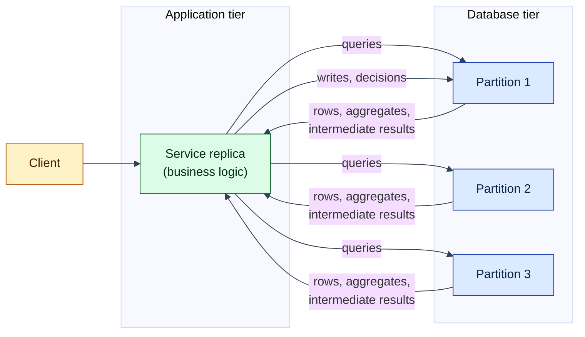
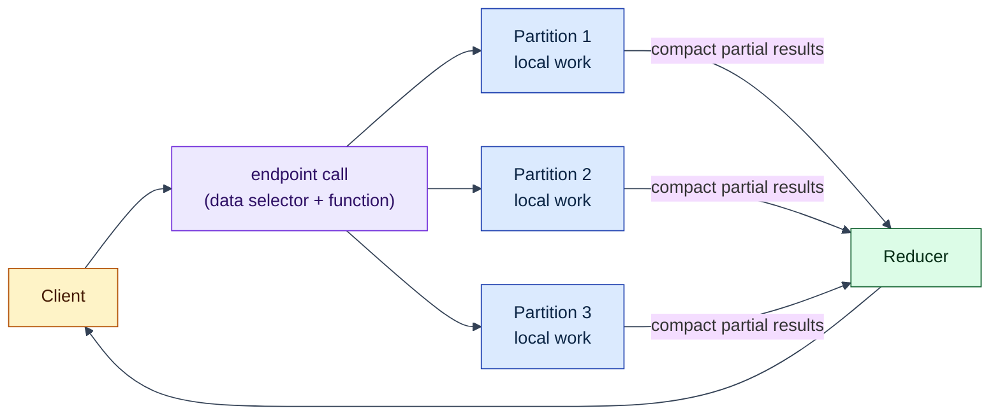
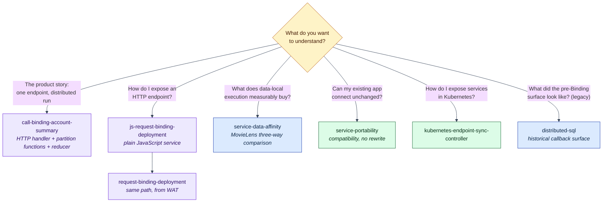

# Examples

Seven runnable examples, ordered story-first: the distributed call path
leads, the service front doors follow, then the measured comparison
study, the compatibility and operations rungs, and finally the legacy
callback surface kept as a historical artifact. Each directory has its
own README with step-by-step commands, a plain-language introduction to
the problem it addresses, and references for every concept beyond basic
programming.

## The Problem Lagrange Works On

Most applications keep code and data in different places. The application tier
runs on one set of machines; the database runs on another. Every piece of
business logic that needs data must pull that data across the network, work on
it, and often push results back:



That round-tripping is often the dominant cost of a data-heavy operation: rows
cross the network only to be filtered, scored, or aggregated and mostly thrown
away.

**Lagrange is a distributed runtime for data-intensive services.** A developer
writes one service - endpoint, partition functions, and reducer together -
deploys it as WASM, and existing applications call it like any other service.
When an endpoint runs, Lagrange executes each partition function on the
database nodes holding the relevant data and combines the results:



> Logically one ordinary service. Physically distributed across the data.

The overview of this idea, its current status, and honest limits is the
top-level [project README](../README.md). The conceptual deep-dive is
[The Lagrange Native Programming Model](../docs/native-programming-model.md),
and the complete before-and-after walkthrough is
[Rewrite A Hot Path For Lagrange](../docs/tutorials/rewrite-a-hot-path.md).

## Where WebAssembly Fits (a two-minute primer)

Running someone's code *inside* a database cluster raises an obvious question:
how do you do that safely, for more than one programming language?

Lagrange's answer is [WebAssembly](https://webassembly.org/) (**WASM**): a
small, portable binary format that many languages (Rust, C, JavaScript, Go,
and others) can compile to. WASM was originally built so browsers could run
non-JavaScript code safely; the same properties make it attractive on servers:

- **Sandboxed by default.** A WASM module cannot open files, sockets, or
  processes. It can only call functions the host explicitly hands it.
- **Portable.** The same binary runs on any machine with a WASM runtime,
  regardless of OS or CPU.
- **Language-neutral.** The host does not care what language produced the
  binary.

Two related terms appear throughout these examples:

- [**WASI**](https://wasi.dev/) - a standard set of interfaces for running
  WASM *outside* a browser.
- The [**Component Model**](https://component-model.bytecodealliance.org/) - a
  packaging standard on top of WASM. A *component* declares typed imports
  (functions it needs from the host) and exports (functions it offers), in an
  interface language called
  [WIT](https://component-model.bytecodealliance.org/design/wit.html). This is
  what lets Lagrange hand a service a tiny, explicit host surface - `read`,
  `write`, `capability` for request Cells; `emit` for call Cells - and
  nothing else.

For Lagrange this sandbox is not a detail; it is the security model. A
deployed service receives *declared capabilities* instead of database
credentials and open network access. If the code tries to touch a table it did
not declare, the call fails at the component boundary.

## Choosing An Example



Deployment always goes through the Artifact / Binding / Cell surface:
`INSTALL SERVICE` and `CREATE BINDING` statements sent over the SQL ingress.
The design is specified in
[`architecture/minimal-deployment-surface.md`](../architecture/minimal-deployment-surface.md)
and the operator flow in the
[Service Deployment Guide](../docs/service-deployment-guide.md). Three terms
recur everywhere:

- **Artifact** - immutable, digest-pinned service code plus its manifest.
- **Binding** - an immutable declaration connecting one Artifact export to an
  invocation source: an HTTP request route (`request`) or a callable
  distributed entry point with a declared data selector (`call`).
- **Cell** - a ready, running, replaceable instance derived from a Binding.
  The cluster - not the author - decides where Cells run.

## The Examples

### [call-binding-account-summary/](call-binding-account-summary/README.md)

**Start here.** The full story on the composed service: a
plain-JavaScript service whose HTTP handler, partition function, and
reducer are authored together, compiled to one WASM component, deployed
behind a request Binding and a call Binding, and invoked with one
authenticated `POST /accounts/summary` (the direct `CALL BINDING`
surface stays covered too). Lagrange exposes the endpoint and runs the
function on each partition of a genuinely split table - rows stay on
their nodes - and returns one reduced account summary as the HTTP
response.

Answers: **what does "build one service, run it across the data" look
like end to end, today?**

- **You'll need**: Node.js 22.12+ and repository dependencies; no
  `wasm-tools` binary is required.

### [js-request-binding-deployment/](js-request-binding-deployment/README.md)

The service front door for existing HTTP applications: the same
Artifact / Binding / Cell deployment, but the Binding maps an HTTP route
to a plain-JavaScript component compiled with
[ComponentizeJS](https://github.com/bytecodealliance/ComponentizeJS).
The service imports only:

```js
import {read, write} from 'lagrange:cell/context';
```

No connection string, no node addresses, no shard awareness. **The best
introduction to authoring request-shaped endpoints.**

- **You'll need**: Node.js 22.12+ and repository dependencies; no `wasm-tools`
  binary is required.

### [request-binding-deployment/](request-binding-deployment/README.md)

The same public deployment path built from committed
[WebAssembly text](https://developer.mozilla.org/en-US/docs/WebAssembly/Guides/Understanding_the_text_format)
source, so you can read exactly what is deployed. Shows matched, denied, and
unmatched HTTP requests behaving against a ready Cell - including an
undeclared table access denied at the component boundary.

Answers: **how is a sandboxed Artifact installed and invoked, and what happens
when it oversteps its declared access?**

- **You'll need**: Node.js 22.12+, repository dependencies, and
  [`wasm-tools`](https://github.com/bytecodealliance/wasm-tools) on `PATH`.

### [service-data-affinity/](service-data-affinity/README.md)

The measured comparison study. Computes the same
[MovieLens 100k](https://grouplens.org/datasets/movielens/100k/) top-ten
ranking three ways - PostgreSQL grouped SQL, Lagrange distributed grouped SQL,
and a replicated Lagrange service applying shard-local ranking policy with
bounded top-N reduction - and shows placement converging toward the data.

Answers: **what can disappear when a hot path is rewritten for partition-local
work and bounded reduction?** Its honest boundary: the demo drives a
kernel-internal `native_js` query-loop module through scaffolding. The
public successor to that internal module is the call path shown in
[call-binding-account-summary](call-binding-account-summary/README.md).

- **You'll need**: Docker for PostgreSQL and internet access for the first
  dataset download; Lagrange nodes run as local processes.

### [service-portability/](service-portability/README.md)

Runs one ordinary Node.js/[`pg`](https://node-postgres.com/) application image
unchanged against stock PostgreSQL and against Lagrange's PostgreSQL
wire-protocol listener: exact result parity, password authentication, verified
TLS, and fail-closed credential attacks.

Answers: **can an existing PostgreSQL application talk to Lagrange without a
rewrite?** This is deliberately the compatibility path - no WASM involved.

- **You'll need**: Docker and Node.js 20+.

### [kubernetes-endpoint-sync-controller/](kubernetes-endpoint-sync-controller/README.md)

Operations: a small controller that mirrors Lagrange's canonical
service-endpoint metadata into Kubernetes
[`Service` + `EndpointSlice`](https://kubernetes.io/docs/concepts/services-networking/endpoint-slices/)
objects, with a [Helm](https://helm.sh/docs/) chart. For operators connecting
a Lagrange cluster to Kubernetes-native networking.

- **You'll need**: nothing for rendering the chart (`helm template`); a
  running Lagrange node plus Kubernetes credentials for the live modes.

### [distributed-sql/](distributed-sql/README.md) - legacy

The **legacy callback surface**, kept deliberately as a historical
artifact (compatibility-and-internals territory - read it after the
examples above, not before). Copyable `partition_callback` modules run
against a live node by a manifest-driven runner. It predates Artifacts
and Bindings; its partition-local mechanics are worth studying, but
services are not deployed this way today, and its sixth example is a
JavaScript-envelope lifecycle rehearsal, *not* a real WebAssembly
component.
[Current Capabilities And Limitations](../docs/current-capabilities-and-limitations.md)
is the status authority.

- **You'll need**: a running Lagrange node (`npm start` from the repository
  root).
- The per-example `index.js` files are callback modules loaded by the runner,
  not standalone programs; `node index.js` does nothing on its own.
