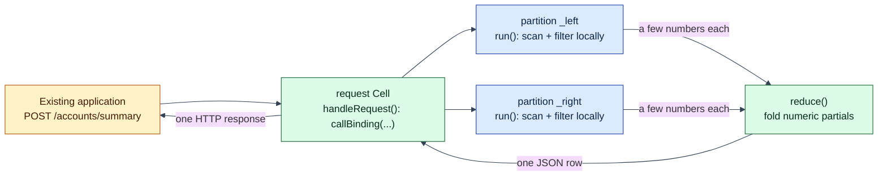

# Account summary: one HTTP endpoint, distributed across partitions

## The problem this example addresses

An existing application wants one number set: "summarize account 202's
transactions." The transaction rows live in a table Lagrange has split
across partitions. The conventional answer pulls every candidate row
across the network into an application tier, filters, sums, and throws
most of the bytes away.

This example does it the Lagrange way, on the real public surfaces:

1. The application makes **one authenticated HTTP POST** and gets **one
   small JSON result**.
2. The service is **authored as one unit** - HTTP handler, partition
   function, reducer - one JavaScript file, compiled into one WASM
   component, installed as one immutable Artifact.
3. Lagrange exposes the endpoint, and the handler asks the host for the
   named distributed operation. The partition function runs **on each
   relevant partition**, next to that partition's replica. The rows
   never leave their node; only a handful of numeric partials do.

> Logically one ordinary service. Physically distributed across the data.

## The service: one file, two Bindings

**Piece 1 - the HTTP handler** (`handleRequest` in
[`service.js`](service.js)): parses the request, invokes the inner
distributed operation by Binding name, and owns its endpoint's HTTP
mapping - including honest statuses for typed failures:

`summarize-account-activity` is the name of a deployed Call Binding, not
a JavaScript export; the handler reaches it through an ordinary-looking
domain function that owns the deployment name:

```js
import {callBinding} from 'lagrange:cell/context';

function summarizeAccountActivity(accountId) {
  return callBinding(
    'summarize-account-activity',
    JSON.stringify({accountId}),
  );
}

export function handleRequest(requestJson) {
  const request = JSON.parse(requestJson);
  const result = summarizeAccountActivity(request.body.accountId);
  return JSON.stringify({
    status: 200,
    headers: [['content-type', 'application/json']],
    body: result,
  });
}
```

The handler never names a node, partition, replica, package, digest, or
SQL statement. It names one **declared, authorized Binding** and passes
bounded JSON arguments.

**Piece 2 - the partition function** (`run`, same file): receives one
typed batch of rows from one partition, filters to the requested
account, and emits a few numeric partials.

**Piece 3 - the reducer** (`reduce`, same file): folds every shard's
partials into the final summary.

All three compile together against the canonical committed
[`wit/world.wit`](../../wit/world.wit) world `service-cell` by
[ComponentizeJS](https://github.com/bytecodealliance/ComponentizeJS).

**The deployment declarations** (built in
[`call-binding-example-contract.js`](call-binding-example-contract.js)):
ONE manifest declares both exports of the one Artifact:

```js
exports: [
  {name: 'handle-request', interface: 'request_v1'},
  {name: 'run', interface: 'call_v1'},
]
```

and TWO Bindings target the same package and manifest digest:

- the **request Binding** `account-summary-http`
  (`POST /accounts/summary` -> export `handle-request`);
- the **call Binding** `summarize-account-activity` (the data selector
  `SELECT ... FROM account_activity` -> export `run`).

Finally, one **service access policy** (schema v2) durably authorizes
the HTTP Binding's only outbound call:

```js
{
  schema_version: 2,
  binding_name: 'account-summary-http',
  tables: [],
  calls: [{binding: 'summarize-account-activity'}],
}
```

Absent policy or an undeclared target fails closed, before dispatch.

## Run it

Prerequisites: Node.js 22.12+ and `npm install` (ComponentizeJS is a
repository dependency; no extra tools needed).

```sh
node examples/call-binding-account-summary/run-call-binding-account-summary.js
```

One command: builds the component, boots a disposable local node, seeds
150 transaction rows for three accounts, splits the table so the data
genuinely spans two partitions, deploys the service over SQL (INSTALL,
both CREATE BINDINGs, CONFIGURE SERVICE ACCESS), invokes the HTTP
endpoint and the direct CALL BINDING surface, proves the refusal and
replay paths, prints a JSON report, and cleans up. A full run typically
takes under a minute; progress lines go to stderr.

## What the application sees

One authenticated HTTP request:

```text
POST /accounts/summary
Authorization: Basic ...
Content-Type: application/json

{"accountId": 202}
```

and one JSON response:

```json
{
  "accountId": 202,
  "transactions": 50,
  "totalCents": 535775,
  "largestCents": 17991,
  "meanCents": 10716,
  "flagged": 12,
  "contributingShards": 2
}
```

The direct SQL surface stays covered too - the runner still invokes
`CALL BINDING "summarize-account-activity"` over an authenticated pgwire
session holding `pgwire.binding.call` and checks the identical summary,
and proves a session without that action is refused before any
dispatch.

## What runs where

```text
POST /accounts/summary {accountId: 202}
  │  (request Binding, authenticated ingress)
  ▼
handleRequest() in the request Cell
  │  callBinding("summarize-account-activity", {accountId})
  │  (host-validated against the durable outbound-call policy)
  ▼
the distributed call runtime
  ├─ run() on partition …_left    ids 1..75 - scanned in place
  │     └─ emits count:1, total:1, largest:1, flagged:1   (4 numbers)
  ├─ run() on partition …_right   ids 76..150 - scanned in place
  │     └─ emits count:77, total:77, largest:77, flagged:77
  └─ reduce() on a lease-holding replica
        └─ one JSON summary → handleRequest → one HTTP response
```



Each shard's rows are read on the node that hosts that partition's
replica (`run` receives the batch built locally there), each shard
publishes its emitted partials under a coordination lease, and `reduce`
executes exactly once over the complete, disjoint partial set. The
two-node integration tests in `test/integration/` prove the raw rows
never cross the network on this path - the wire carries the partials -
and that shard runs genuinely overlap when partitions live on separate
nodes.

## The refusal probe and the replay proof

The runner proves two guarantees on the live endpoint:

- **Undeclared target -> 403 before dispatch.** The example guest
  accepts an optional `body.target` override so the runner can request
  a Binding name the access policy never declared. This is a demo
  probe, not an escape hatch: the HOST validates every target against
  the durable outbound-call policy before anything is dispatched, and
  the guest merely maps the typed `target_not_allowed` refusal to 403.
- **Replay executes the inner call once.** The runner sends the same
  POST twice with the same `Idempotency-Key`. The second response is
  byte-identical (served from the durable invocation journal), and the
  coordination table holds exactly ONE result row for the system-owned
  child identity `<outer invocation id>#call-1` - the distributed call
  never re-ran.

## Why move the function, not the data

The mechanics, not a slogan: here every shard reduces its share of the
table to four numbers, so the network carries eight numbers plus one
result row instead of 150 rows. Scale the same shape up - millions of
rows per partition, a summary of a few hundred bytes - and the ratio

```text
data scanned ≫ result returned
```

is where the latency, egress, and coordinator-CPU wins live. Workloads
without that ratio gain little; see
[Estimating Performance, Throughput, And Network Cost](../../docs/performance-and-cost-estimation.md).

## Under the hood

Deployment is the same lifecycle SQL as the request-binding examples,
over one authenticated pgwire session:

```sql
INSTALL SERVICE $1;           -- immutable, digest-pinned artifact + manifest
CREATE BINDING $1;            -- kind 'call': the data selector -> run
CREATE BINDING $1;            -- kind 'request': POST /accounts/summary -> handle-request
CONFIGURE SERVICE ACCESS $1;  -- v2: calls allowlist for the request Binding
```

The two Bindings compile into two Cells of the same immutable Artifact.
Each Cell's invocation mode restricts which host imports are live: the
request invocation gets `callBinding` (bridged to the one
`CallCellInvoker` over a worker-to-parent protocol that never blocks
the parent thread), the call invocation gets `emit` - the other
surface fails closed with a typed error in each mode. The nested call
runs under the caller's own frozen security context and the tighter of
the outer and inner deadlines. The invocation, coordination (reduce
slots, leases, atomic snapshot), and typed failure surface are
specified in
[`architecture/minimal-deployment-surface.md`](../../architecture/minimal-deployment-surface.md).

## Honest limits and demo scaffolding

Current call-path limits (of the platform, stated plainly):

- **One nested call per request.** A request invocation may invoke at
  most one Call Binding (`<outer>#call-1`); deeper chains
  (HTTP -> call -> call) are refused by the identity grammar.
- **Numeric partials only.** Each emitted partial must be a finite
  number keyed by a string; structured partials are not accepted by the
  reduce gate yet. Group keys must be disjoint across shards - this
  example namespaces its keys by a shard-local row id.
- **Bounded parallel shard dispatch.** Up to 8 shards run concurrently
  (deployment-tunable); shards on the same host node serialize, so this
  single-node demo executes its two shards one after the other.
- **Single-table SELECT.** The Binding-declared statement must be a
  SELECT over one table.

Demo scaffolding in the runner (not the composed path):

- It sets the table's replica count to 1 and forces one managed
  partition split, because a single-node demo cannot satisfy the
  replicated split quorum a real cluster uses. Production tables split
  by policy (`split_storage_threshold`) as they grow.
- It raises the HTTP ingress deadline to 30s so the composed
  distributed call fits comfortably inside the outer request budget.
- Everything from the HTTP POST inward - authentication, request
  routing, the bridged `callBinding`, per-shard batch build, WASM
  execution, reduce coordination - is the production path, the same
  one exercised by the live integration tests.

## Continue

- [The Lagrange Native Programming Model](../../docs/native-programming-model.md)
  - the authoring model this example instantiates.
- [js-request-binding-deployment](../js-request-binding-deployment/README.md)
  - the request-shaped front door on its own (HTTP endpoint → one Cell).
- [service-data-affinity](../service-data-affinity/README.md) - measured
  comparison study of the same execution shape at MovieLens scale.
