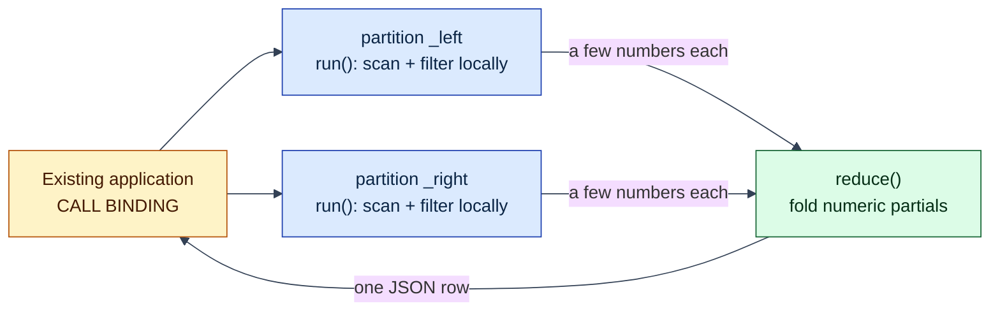

# Account summary across partitions (call Binding)

## The problem this example addresses

An existing application wants one number set: "summarize account 202's
transactions." The transaction rows live in a table Lagrange has split
across partitions. The conventional answer pulls every candidate row
across the network into an application tier, filters, sums, and throws
most of the bytes away.

This example does it the Lagrange way, on the real public call path:

1. The application makes **one call** and gets **one small JSON result**.
2. The service is **authored as one unit** - partition function, reducer,
   and the call declaration live together and deploy together.
3. Lagrange runs the partition function **on each relevant partition**,
   next to that partition's replica. The rows never leave their node;
   only a handful of numeric partials do.

> Logically one ordinary service. Physically distributed across the data.

This is the successor to the internal query-loop mechanics that the
[service-data-affinity](../service-data-affinity/README.md) study proves
out: the same shard-local-work-plus-bounded-reduction shape, but on the
public Artifact / Binding / Cell surface, invocable by any authenticated
client today.

## The service: three pieces, authored together

**Piece 1 - the partition function** (`run` in
[`service.js`](service.js)): receives one typed batch of rows from one
partition, filters to the requested account, and emits a few numeric
partials. Plain JavaScript, compiled to a WASM component by
[ComponentizeJS](https://github.com/bytecodealliance/ComponentizeJS)
against the committed [`wit/world.wit`](wit/world.wit).

```js
export function run(batch, argumentsJson) {
  const {accountId} = JSON.parse(argumentsJson);
  // scan this shard's local rows, keep the account's rows ...
  emit(`count:${shardKey}`, JSON.stringify(matched));
  emit(`total:${shardKey}`, JSON.stringify(totalCents));
  // ...
}
```

**Piece 2 - the reducer** (`reduce`, same file): folds every shard's
partials into the final summary.

```js
export function reduce(partials, argumentsJson) {
  // sum counts and totals, max the largest, derive the mean ...
  return JSON.stringify({transactions, totalCents, largestCents, ...});
}
```

**Piece 3 - the call declaration** (the call Binding, built in
[`call-binding-example-contract.js`](call-binding-example-contract.js)):
names the callable entry point and declares which data it runs over:

```js
source: {
  kind: 'call',
  name: 'account-summary',
  statement: 'SELECT id, account_id, amount_cents, flagged FROM account_activity',
}
```

The statement is the data selector. Lagrange parses it, resolves which
partitions hold matching rows, and dispatches `run` to each partition's
host node - where the node executes the statement against its **own**
replica and feeds the rows straight into the component. No fan-out code,
no shard map, no connection strings anywhere in the service.

## Run it

Prerequisites: Node.js 22.12+ and `npm install` (ComponentizeJS is a
repository dependency; no extra tools needed).

```sh
node examples/call-binding-account-summary/run-call-binding-account-summary.js
```

One command: builds the component, boots a disposable local node, seeds
150 transaction rows for three accounts, splits the table so the data
genuinely spans two partitions, deploys the service over SQL, invokes it
twice, checks the denied-session path, prints a JSON report, and cleans
up. A full run typically takes under a minute; progress lines go to
stderr.

## What the application sees

The caller opens one authenticated session and sends one statement:

```sql
CALL BINDING $1
-- $1 = {"schema_version": 2, "name": "account-summary",
--       "arguments": {"accountId": 202}}
```

and receives one row back:

```json
{
  "accountId": 202,
  "transactions": 50,
  "totalCents": 535775,
  "largestCents": 17991,
  "meanCents": 10716,
  "flagged": 12,
  "contributingShards": 2
}
```

No partitions, replicas, or placement appear in the caller's view - and a
session without the `pgwire.binding.call` action is refused before any
dispatch (the runner proves this too).

## What runs where

```text
CALL BINDING "account-summary" {accountId: 202}
  │
  ├─ run() on partition …_left    ids 1..75 - scanned in place
  │     └─ emits count:1, total:1, largest:1, flagged:1   (4 numbers)
  ├─ run() on partition …_right   ids 76..150 - scanned in place
  │     └─ emits count:77, total:77, largest:77, flagged:77
  └─ reduce() on a lease-holding replica
        └─ one JSON summary → the caller
```



Each shard's rows are read on the node that hosts that partition's
replica (`run` receives the batch built locally there), each shard
publishes its emitted partials under a coordination lease, and `reduce`
executes exactly once over the complete, disjoint partial set. The
two-node integration tests in `test/integration/` prove the raw rows
never cross the network on this path - the wire carries the partials.

## Why move the function, not the data

The mechanics, not a slogan: here every shard reduces its share of the
table to four numbers, so the network carries eight numbers plus one
result row instead of 150 rows. Scale the same shape up - millions of
rows per partition, a summary of a few hundred bytes - and the ratio

```text
data scanned ≫ result returned
```

is where the latency, egress, and coordinator-CPU wins live. Workloads
without that ratio gain little; see
[Estimating Performance, Throughput, And Network Cost](../../docs/performance-and-cost-estimation.md).

## Under the hood

Deployment is the same lifecycle SQL as the request-binding examples,
over one authenticated pgwire session:

```sql
INSTALL SERVICE $1;   -- immutable, digest-pinned artifact + manifest
CREATE BINDING $1;    -- kind 'call', name, and the declared statement
CALL BINDING $1;      -- the invocation (separate session, binding.call)
```

The manifest exports `run` under the `call_v1` interface with
`runtime.kind = wasm_component`. The `reduce` export is the second export
of the same component - one artifact carries both halves of the service.
The invocation, coordination (reduce slots, leases, atomic snapshot),
and typed failure surface are specified in
[`architecture/minimal-deployment-surface.md`](../../architecture/minimal-deployment-surface.md).

## Honest limits and demo scaffolding

Current call-path limits (of the platform, stated plainly):

- **pgwire-only ingress.** `CALL BINDING` is the invocation surface;
  there is no HTTP route or JS client for call Bindings yet. It requires
  a password-authenticated session holding `pgwire.binding.call` (the
  action is not in the trust-mode set).
- **Numeric partials only.** Each emitted partial must be a finite
  number keyed by a string; structured partials are not accepted by the
  reduce gate yet. Group keys must be disjoint across shards - this
  example namespaces its keys by a shard-local row id.
- **Bounded parallel shard dispatch.** Up to 8 shards run concurrently
  (deployment-tunable); shards on the same host node serialize, so this
  single-node demo executes its two shards one after the other.
- **Single-table SELECT.** The Binding-declared statement must be a
  SELECT over one table.

Demo scaffolding in the runner (not the call path):

- It sets the table's replica count to 1 and forces one managed
  partition split, because a single-node demo cannot satisfy the
  replicated split quorum a real cluster uses. Production tables split
  by policy (`split_storage_threshold`) as they grow.
- Everything from `CALL BINDING` inward - routing, per-shard batch
  build, WASM execution, reduce coordination - is the production path,
  the same one exercised by the live integration tests.

## Continue

- [The Lagrange Native Programming Model](../../docs/native-programming-model.md)
  - the authoring model this example instantiates.
- [js-request-binding-deployment](../js-request-binding-deployment/README.md)
  - the request-shaped front door (HTTP endpoint → one Cell).
- [service-data-affinity](../service-data-affinity/README.md) - measured
  comparison study of the same execution shape at MovieLens scale.
