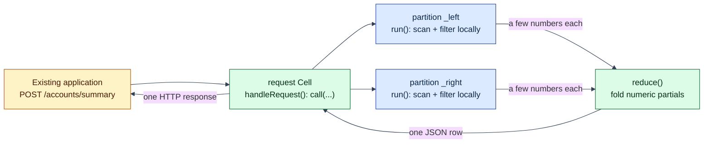

# Account summary: one HTTP endpoint, distributed across partitions

## The problem this example addresses

An existing application wants one number set: "summarize account 202's
transactions." The transaction rows live in a table Lagrange has split
across partitions. The conventional answer pulls every candidate row
across the network into an application tier, filters, sums, and throws
most of the bytes away.

This example does it the Lagrange way, on the real public surfaces:

1. The application makes **one authenticated HTTP POST** and gets **one
   small JSON result**.
2. The service is **authored as one code-first unit** -
   [`lagrange.service.js`](lagrange.service.js) - declaring one
   distributed operation and two HTTP routes with the guest-safe
   authoring library. The compiler derives everything else.
3. Lagrange exposes the endpoints, and a handler invokes the declared
   distributed operation. The partition function runs **on each relevant
   partition**, next to that partition's replica. The rows never leave
   their node; only a handful of numeric partials do.

> Logically one ordinary service. Physically distributed across the data.

## Code-first: one authored file, everything else generated

The developer writes exactly one file,
[`lagrange.service.js`](lagrange.service.js), with the guest-safe
authoring library ([`src/authoring/`](../../src/authoring)). It declares
data and behavior, **never deployment wiring** - there is no Binding-name
string, package id, digest, or manifest anywhere in it:

```js
import {defineService} from '../../src/authoring/define-service.js';
import {distributed} from '../../src/authoring/distributed-operation.js';
import {http} from '../../src/authoring/request-handler.js';
import {sql} from '../../src/authoring/sql-template.js';

const summarizeAccountActivity = distributed({
  statement: sql`SELECT id, account_id, amount_cents, flagged FROM account_activity`,
  run: summarizeRun,     // partition-local scan -> numeric partials
  reduce: summarizeReduce, // fold every shard's partials into one summary
});

export default defineService({
  name: 'account-summary',
  version: '1.0.0',
  operations: {summarizeAccountActivity},
  handlers: {
    accountSummary: http.post('/accounts/summary', {
      calls: [summarizeAccountActivity], // referenced by descriptor, not name
      handle: handleAccountSummary,
    }),
    accountHealth: http.get('/accounts/health', {handle: handleAccountHealth}),
  },
});
```

An HTTP handler invokes the operation through the per-handler context's
`call(descriptor, args)` - by **descriptor identity**, never by a durable
name. The operation's identity is its explicit object key
(`summarizeAccountActivity`); the compiler mints the durable Binding
names from those keys.

**The generated entry** ([`generated-entry.js`](generated-entry.js)) is
compiler output, not a hand-authored surface. It statically imports the
developer module and adapts the sealed `service-cell` world's fixed
exports (`handle-request`, `run`, `reduce`) onto the descriptor tables:
`handle-request` dispatches by method+path, and `call(descriptor)` routes
to the canonical `lagrange:cell/context` call-binding host import under
the deterministically generated name.

**The deployment records** come from
[`buildDeploymentRecords`](../../src/service/service-deployment-record-generator.js),
which derives - and validates through the real deployment-contract owners
- one manifest (both exports of the one Artifact), one call Binding, one
request Binding per route, and one outbound-call access policy per handler
that declares calls. The durable names follow a fixed grammar:

- the **request Bindings** `account-summary--request--account-summary`
  (`POST /accounts/summary` -> `handle-request`) and
  `account-summary--request--account-health`
  (`GET /accounts/health` -> `handle-request`);
- the **call Binding** `account-summary--call--summarize-account-activity`
  (the data selector `SELECT ... FROM account_activity` -> `run`).

The generated access policy (schema v2) durably authorizes the summary
request Binding's one outbound call:

```js
{
  schema_version: 2,
  binding_name: 'account-summary--request--account-summary',
  tables: [],
  calls: [{binding: 'account-summary--call--summarize-account-activity'}],
}
```

The health route declares no calls, so the compiler emits **no policy**
for it. Absent policy or an undeclared target fails closed, before
dispatch.

All of this compiles together against the canonical committed
[`wit/world.wit`](../../wit/world.wit) world `service-cell` through the
single shared componentize owner
([`src/service/service-component-build.js`](../../src/service/service-component-build.js))
by [ComponentizeJS](https://github.com/bytecodealliance/ComponentizeJS).

## Run it

Prerequisites: Node.js 22.12+ and `npm install` (ComponentizeJS is a
repository dependency; no extra tools needed).

```sh
node examples/call-binding-account-summary/run-call-binding-account-summary.js
```

One command: componentizes the generated entry, generates the deployment
records from `lagrange.service.js`, boots a disposable local node, seeds
150 transaction rows for three accounts, splits the table so the data
genuinely spans two partitions, deploys the **generated** records over SQL
(INSTALL, one CREATE BINDING per generated binding, CONFIGURE SERVICE
ACCESS per generated policy), invokes both HTTP routes and the direct CALL
BINDING surface, proves the refusal and replay paths, prints a JSON
report, and cleans up. A full run typically takes under a minute; progress
lines go to stderr.

## What the application sees

One authenticated HTTP request:

```text
POST /accounts/summary
Authorization: Basic ...
Content-Type: application/json

{"accountId": 202}
```

and one JSON response:

```json
{
  "accountId": 202,
  "transactions": 50,
  "totalCents": 535775,
  "largestCents": 17991,
  "meanCents": 10716,
  "flagged": 12,
  "contributingShards": 2
}
```

The second route, `GET /accounts/health`, is served by the **same**
component via method+path dispatch and returns a static
`{"service":"account-summary","status":"ok"}` - it declares no outbound
call, so no access policy gates it.

The direct SQL surface stays covered too - the runner still invokes the
generated call Binding over an authenticated pgwire session holding
`pgwire.binding.call`, checks the identical summary, and proves a session
without that action is refused before any dispatch.

## What runs where

```text
POST /accounts/summary {accountId: 202}
  │  (request Binding, authenticated ingress)
  ▼
handleRequest() in the request Cell
  │  call(summarizeAccountActivity, {accountId})
  │  (host-validated against the durable outbound-call policy)
  ▼
the distributed call runtime
  ├─ run() on partition …_left    ids 1..75 - scanned in place
  │     └─ emits count, total, largest, flagged   (4 numbers)
  ├─ run() on partition …_right   ids 76..150 - scanned in place
  │     └─ emits count, total, largest, flagged
  └─ reduce() on a lease-holding replica
        └─ one JSON summary → handleRequest → one HTTP response
```



Each shard's rows are read on the node that hosts that partition's
replica (`run` receives the batch built locally there), each shard
publishes its emitted partials under a coordination lease, and `reduce`
executes exactly once over the complete, disjoint partial set. The
two-node integration tests in `test/integration/` prove the raw rows
never cross the network on this path - the wire carries the partials -
and that shard runs genuinely overlap when partitions live on separate
nodes.

## The refusal probe and the replay proof

The runner proves two guarantees on the live endpoint:

- **Undeclared target -> 403 before dispatch.** The authored handler
  accepts an optional `body.target` override so the runner can request a
  Binding name the generated access policy never declared. This is a demo
  probe, not an escape hatch: the HOST validates every target against the
  durable outbound-call policy before anything is dispatched, and the
  handler merely maps the typed `target_not_allowed` refusal to 403.
- **Replay executes the inner call once.** The runner sends the same POST
  twice with the same `Idempotency-Key`. The second response is
  byte-identical (served from the durable invocation journal), and the
  coordination table holds exactly ONE result row for the system-owned
  child identity `<outer invocation id>#call-1` - the distributed call
  never re-ran.

## Why move the function, not the data

The mechanics, not a slogan: here every shard reduces its share of the
table to four numbers, so the network carries eight numbers plus one
result row instead of 150 rows. Scale the same shape up - millions of
rows per partition, a summary of a few hundred bytes - and the ratio

```text
data scanned ≫ result returned
```

is where the latency, egress, and coordinator-CPU wins live. Workloads
without that ratio gain little; see
[Estimating Performance, Throughput, And Network Cost](../../docs/performance-and-cost-estimation.md).

## Under the hood

Deployment is the same lifecycle SQL as the request-binding examples,
over one authenticated pgwire session - the runner replays the
**generated** records, one statement each:

```sql
INSTALL SERVICE $1;           -- immutable, digest-pinned artifact + manifest
CREATE BINDING $1;            -- kind 'call': the data selector -> run
CREATE BINDING $1;            -- kind 'request': POST /accounts/summary -> handle-request
CREATE BINDING $1;            -- kind 'request': GET /accounts/health -> handle-request
CONFIGURE SERVICE ACCESS $1;  -- v2: calls allowlist for the summary request Binding
```

The Bindings compile into Cells of the same immutable Artifact. Each
Cell's invocation mode restricts which host imports are live: the request
invocation gets `callBinding` (bridged to the one `CallCellInvoker` over a
worker-to-parent protocol that never blocks the parent thread), the call
invocation gets `emit` - the other surface fails closed with a typed error
in each mode. The nested call runs under the caller's own frozen security
context and the tighter of the outer and inner deadlines. The invocation,
coordination (reduce slots, leases, atomic snapshot), and typed failure
surface are specified in
[`architecture/minimal-deployment-surface.md`](../../architecture/minimal-deployment-surface.md).

## Honest limits and demo scaffolding

Current call-path limits (of the platform, stated plainly):

- **One nested call per request.** A request invocation may invoke at
  most one Call Binding (`<outer>#call-1`); deeper chains
  (HTTP -> call -> call) are refused by the identity grammar.
- **Numeric partials only.** Each emitted partial must be a finite
  number keyed by a string; structured partials are not accepted by the
  reduce gate yet. Group keys must be disjoint across shards - this
  example namespaces its keys by a shard-local row id.
- **Bounded parallel shard dispatch.** Up to 8 shards run concurrently
  (deployment-tunable); shards on the same host node serialize, so this
  single-node demo executes its two shards one after the other.
- **Single-table SELECT.** The Binding-declared statement must be a
  SELECT over one table.
- **One distributed operation per service.** The pre-v2 bridge compiles
  exactly one distributed operation per component.

Demo scaffolding in the runner (not the composed path):

- It sets the table's replica count to 1 and forces one managed
  partition split, because a single-node demo cannot satisfy the
  replicated split quorum a real cluster uses. Production tables split
  by policy (`split_storage_threshold`) as they grow.
- It raises the HTTP ingress deadline to 30s so the composed
  distributed call fits comfortably inside the outer request budget.
- Everything from the HTTP POST inward - authentication, request
  routing, the bridged `callBinding`, per-shard batch build, WASM
  execution, reduce coordination - is the production path, the same
  one exercised by the live integration tests.

## Continue

- [The Lagrange Native Programming Model](../../docs/native-programming-model.md)
  - the authoring model this example instantiates.
- [js-request-binding-deployment](../js-request-binding-deployment/README.md)
  - the request-shaped front door on its own (HTTP endpoint → one Cell).
- [service-data-affinity](../service-data-affinity/README.md) - measured
  comparison study of the same execution shape at MovieLens scale.
