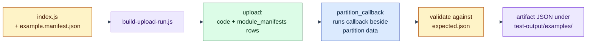

# Distributed SQL Callback Examples

## The problem this example addresses

Lagrange's central move is running application logic *next to* each data
partition instead of pulling rows out to an application tier (see the
[examples overview](../README.md)). Before the current Artifact / Binding /
Cell deployment surface existed, Lagrange had an earlier way to do this:
upload a JavaScript **callback module** and execute it through the
`partition_callback` mechanism, which runs the callback against partition data
on a live node.

This directory demonstrates that **older callback surface**. It is worth
studying to understand partition-local execution mechanics — how a statement
plus a callback fan out over partition rows, batch stages, and reduce by key —
but it predates Bindings and is not how services are deployed today. The
runnable [request-binding examples](../request-binding-deployment/README.md)
show the current deployment surface with genuine WASI components, and
[Current Capabilities And Limitations](../../docs/current-capabilities-and-limitations.md)
is the status authority.

## What's inside

Six copyable examples, ordered from basic to advanced:

1. `01-basic-iterator` — iterate partition rows in a callback.
2. `02-stage-batching` — process rows in bounded batches.
3. `03-plan-reduce-by-key` — a plan stage plus per-key reduction.
4. `04-nested-bounded-call` — a callback issuing a bounded nested call.
5. `05-guardrail-failure` — what happens when a callback exceeds its limits.
6. `06-wasm-remote-replica` — a JavaScript-envelope **lifecycle rehearsal**
   (see the capability notes below — this is *not* a real WebAssembly
   component).

Each example directory contains:

- `index.js`: callback module source
- `example.manifest.json`: runtime + execution metadata
- `expected.json`: output contract used by runner and harness

## Run it

1. Start a node if one is not already running (from the repo root):

   ```bash
   npm start
   ```

2. In another terminal, point the runner at the node's admin websocket:

   ```bash
   node scripts/examples/build-upload-run.js \
     --target ws://127.0.0.1:8081/api/admin/stream
   ```

To run a subset, pass `--include`:

```bash
node scripts/examples/build-upload-run.js \
  --target ws://127.0.0.1:8081/api/admin/stream \
  --include 01-basic-iterator,03-plan-reduce-by-key
```

Useful flags:

- `--include <id1,id2>`: only run selected examples.
- `--exclude <id1,id2>`: skip selected examples.
- `--examplesDir <path>`: use a custom examples directory.
- `--out <path>`: write artifact to a specific file.

Note: the per-example `index.js` files are callback modules loaded by the
runner, not standalone programs; `node index.js` does nothing on its own.

## What to expect

Each example uploads, executes through `partition_callback`, is validated
against `expected.json`, and leaves an artifact under `test-output/examples/`.



## Capability notes — read before drawing conclusions

The authoritative status is
[Current Capabilities And Limitations](../../docs/current-capabilities-and-limitations.md).
A few notes:

- This directory demonstrates the **legacy callback path**, not the deployment
  surface. Service deployment is declared through `INSTALL SERVICE` and
  `CREATE BINDING` (see
  [`architecture/minimal-deployment-surface.md`](../../architecture/minimal-deployment-surface.md));
  the callback path here predates it.
- Managed [OCI](https://opencontainers.org/) container execution is not
  implemented yet. `native_js` is kernel-internal, and OCI callback invocation
  remains unsupported.
- The sixth example exercises the current `wasm_component` routing and
  lifecycle scaffolding, **but its input is JavaScript, not a
  [WebAssembly](https://webassembly.org/) binary or component**. The runtime
  later evaluates the source as JavaScript. Do not use it for deployment-size
  or WASM-performance claims. For genuine WASI components, use the
  [request-binding examples](../request-binding-deployment/README.md).

## Under the hood

The runner (`scripts/examples/build-upload-run.js`) supports two runtime
kinds:

- `native_js`: uploads raw JS source as `code.code_blob`.
- `wasm_component`: for the internal rehearsal only, packages JS into a
  serialized artifact envelope (`js_wasm_component_v1`) and uploads that
  artifact as `code.code_blob`.

For `wasm_component`, the packaging step:

1. Reads `index.js` from the example directory.
2. Verifies the configured callback export exists (for example, `run`).
3. Builds a `js_wasm_component_v1` blob that includes:
   - original source (`source`)
   - encoded wasm bytes field (`wasmBytesBase64`)
   - run export metadata (`runExport`, `exports`)
4. Selects executor type `wasm_service`.

Again: this construction does **not** compile JavaScript to WASM. A genuine
component engine, component ABI, OCI installation path, and public invocation
contract are separate cutovers — the real compile-JS-to-component path exists
today in
[`js-request-binding-deployment`](../js-request-binding-deployment/README.md),
which uses
[ComponentizeJS](https://github.com/bytecodealliance/ComponentizeJS).

For each packaged example, the runner then performs:

1. `INSERT OR REPLACE INTO code`:
   - `function_id`, `function_name`, `executor_type`, `code_blob`, signature,
     timestamps.
2. `INSERT OR REPLACE INTO module_manifests`:
   - namespace/name/version/digest, `run_export`, `exports`, and artifact
     pointer.
3. Executes `partition_callback` with:
   - `statement` from manifest
   - `callbackModuleRef` = uploaded `function_id`
   - `callbackExport`
   - `runtimeKind`
4. Validates output using `expected.json` (`shape`, `minRows`, `firstRow`
   contract).
5. Writes artifact JSON under `test-output/examples/` (or `--out`).

The distributed scenario `test/distributed/scenarios/examples-catalog.js` runs
the same runner (`runExamplesCatalog`), so the examples you copy from here are
also exercised as regression tests.
