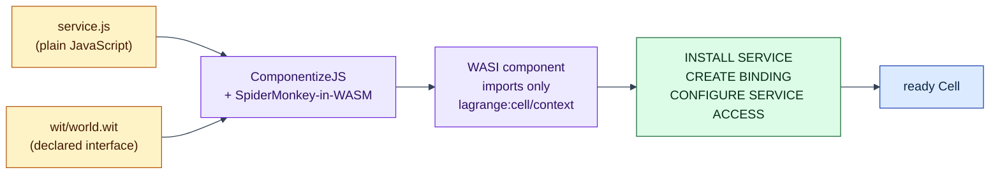
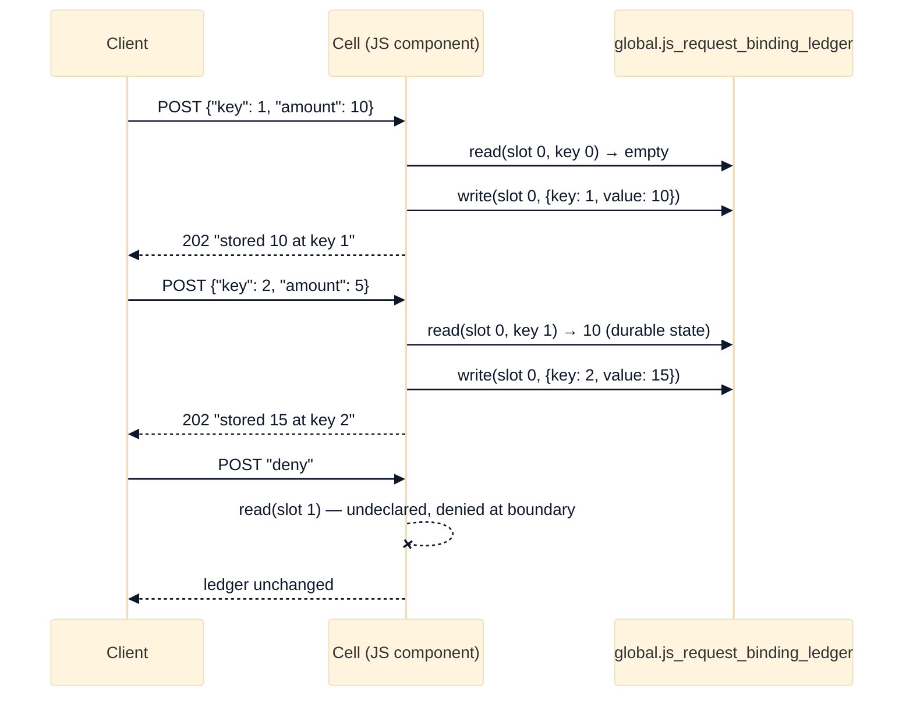

# JavaScript service as a WASI component

## The problem this example addresses

Lagrange runs application code inside the database cluster, sandboxed as
[WebAssembly](https://webassembly.org/) (see the
[examples overview](../README.md) for the full introduction). But most service
authors do not write WebAssembly — they write JavaScript, and they are used to
services that carry connection strings, host lists, and shard-routing logic.

This example shows both halves of the answer:

1. **You keep writing plain JavaScript.** A build step compiles
   [`service.js`](service.js) into a genuine WebAssembly component — no
   WebAssembly knowledge required.
2. **The service code contains no topology.** It imports exactly two host
   functions, `read` and `write`. No database endpoint, no connection pool,
   no node selection, no shard map. Where the data lives, and where the code
   runs, is the cluster's problem — that separation is what later lets
   Lagrange place code next to its data.

One command builds the component, boots a local seed node, runs the
deployment SQL, sends authenticated requests, and shuts everything down.

## How plain JavaScript becomes a sandboxed component

Three tools and terms, briefly:

- A **WASM component** is a portable, sandboxed binary that declares typed
  imports (functions it needs) and exports (functions it offers). See the
  [Component Model book](https://component-model.bytecodealliance.org/).
- [**ComponentizeJS**](https://github.com/bytecodealliance/ComponentizeJS)
  (a [Bytecode Alliance](https://bytecodealliance.org/) project) compiles a
  JavaScript module into such a component by embedding your source together
  with a WebAssembly build of the
  [SpiderMonkey](https://spidermonkey.dev/) JavaScript engine — the same
  engine Firefox uses.
- [**WIT**](https://component-model.bytecodealliance.org/design/wit.html) is
  the interface language in which the component's imports and exports are
  declared. This example commits its interface as
  [`wit/world.wit`](wit/world.wit).



Unlike the older JavaScript-envelope callback rehearsal in
[`distributed-sql`](../distributed-sql/README.md), the artifact deployed here
is a real WebAssembly component: the node executes it exactly as it executes
the WAT-built component in
[`request-binding-deployment`](../request-binding-deployment/README.md).

[`service.js`](service.js) imports the host interface directly:

```js
import {read, write} from 'lagrange:cell/context';

export function run(request) { /* ... */ }
```

The world it targets — `lagrange:cell/context` providing `read`, `write`, and
`capability`, with the component exporting
`run: func(request: string) -> string` — is the entire surface between your
code and the outside world. The build step calls `componentize()` with
`random`, `stdio`, `clocks`, `http`, and `fetch-event` disabled, so the
produced component imports **nothing except `lagrange:cell/context`** — the
same import surface the Cell runtime provides to every request component. If
the code tries anything else, there is simply no function to call: this is
[capability-based security](https://en.wikipedia.org/wiki/Capability-based_security)
enforced by the component boundary rather than by convention.

## Prerequisites

- Node.js 22.12 or newer; and
- repository dependencies installed with `npm install` (this pulls in
  `@bytecodealliance/componentize-js`; no `wasm-tools` binary is needed).

## Run it

From the repository root:

```sh
node examples/js-request-binding-deployment/run-js-request-binding-deployment.js
```

The command prints a JSON report and exits non-zero if any check fails. It
uses a temporary data directory and OCI image layout, so no generated
component binary or opaque image is committed or left behind.

## What to expect

The service keeps a running-total ledger in an ordinary durable table — not in
process memory, because Cells are replaceable and durable state belongs in
tables ([native programming model](../../docs/native-programming-model.md)).
Each request posts `{"key": <n>, "amount": <m>}`; the component reads the
previous request's row, adds the new amount, and records the total under the
request's own key. (Request Cell writes are inserts of new keys — the effect
writer issues `INSERT` statements — so each request writes a fresh row instead
of updating a prior one.)



- `POST /examples/js-request-binding` with `{"key": 1, "amount": 10}` returns
  status `202`, header `x-lagrange-cell: js-request-binding-example`, and body
  `stored 10 at key 1`; the write lands in
  `global.js_request_binding_ledger` as `{key: 1, value: 10}`.
- A second request with `{"key": 2, "amount": 5}` reads the committed first
  row through slot 0 and returns `stored 15 at key 2` — the JavaScript
  observed durable state written by the previous invocation.
- A request whose body is `"deny"` makes the component read undeclared slot 1;
  the read is denied at the component boundary and the ledger is unchanged.

## Under the hood

The deployment is identical to the WAT example — the runtime does not know or
care that the component was produced from JavaScript:

```sql
INSTALL SERVICE $1;
CREATE BINDING $1;
CONFIGURE SERVICE ACCESS $1;
```

The install payload points at the reproducible
[OCI layout](https://github.com/opencontainers/image-spec/blob/main/image-layout.md)
built during the run. `INSTALL SERVICE` returns the immutable `package_id`;
the Binding pins that value with the canonical `manifest_digest` and the `run`
export. The access declaration grants slot 0 read/write on
`table:global.js_request_binding_ledger`. The deployment surface is specified
in
[`architecture/minimal-deployment-surface.md`](../../architecture/minimal-deployment-surface.md)
with the operator flow in the
[Service Deployment Guide](../../docs/service-deployment-guide.md).

Scope: one request Binding, one local seed node. The example does not claim
dynamic routes, a complete PostgreSQL compatibility surface, or multi-node
placement behavior.

## Continue

- [The Lagrange Native Programming Model](../../docs/native-programming-model.md)
  — what this small `read`/`write` API already enables (attribution,
  placement, locality) and where the richer native `call` surface is headed.
- [service-data-affinity](../service-data-affinity/README.md) — what
  data-local execution looks like when it fans out and reduces.
