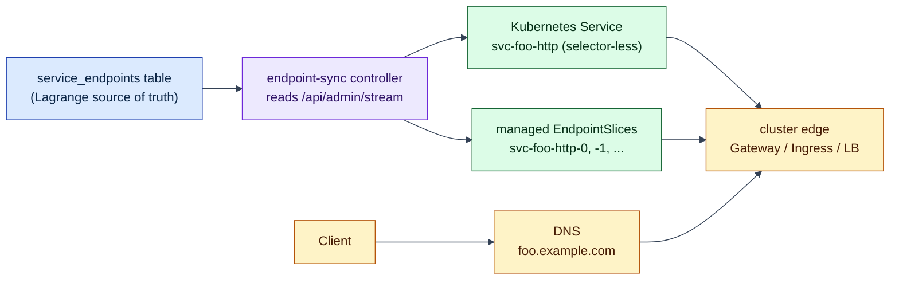

# Kubernetes Endpoint Sync Controller Example

## The problem this example addresses

Lagrange decides for itself where its services run: its rebalancer places
service replicas near the data they use, and the cluster's canonical
`service_endpoints` table records where every service is actually reachable
(see the [examples overview](../README.md) for why placement is
Lagrange-owned). [Kubernetes](https://kubernetes.io/docs/concepts/overview/),
however, discovers endpoints its own way — by selecting Pods with labels — and
that mechanism cannot see Lagrange's placement decisions.

So how does traffic from a Kubernetes cluster (an ingress, a gateway, a load
balancer) reach the right Lagrange replicas as they move?

This example bridges the two worlds with a small **controller** — a process
that continuously reconciles the desired state into Kubernetes, the standard
[controller pattern](https://kubernetes.io/docs/concepts/architecture/controller/).
It reads Lagrange's `service_endpoints` rows and projects them into
selector-less Kubernetes
[`Service`](https://kubernetes.io/docs/concepts/services-networking/service/) +
[`EndpointSlice`](https://kubernetes.io/docs/concepts/services-networking/endpoint-slices/)
objects ("selector-less" means Kubernetes does not compute the endpoints from
Pod labels — the controller supplies them explicitly). A
[Helm](https://helm.sh/docs/) chart packages the deployment. Use it as a
starting point for your own deployment.



## Kubernetes vs Lagrange (key differences)

Lagrange and Kubernetes solve different ownership problems:

| Concern | Kubernetes Standard Model | Lagrange Model |
| --- | --- | --- |
| Workload unit | Pod/Deployment is the app unit | Replicated service is the app unit |
| Placement owner | Kubernetes scheduler | Lagrange rebalancer/runtime lifecycle |
| Endpoint source | Pod selectors + kube endpoints | Canonical `service_endpoints` table |
| Service discovery objects | Kubernetes builds from Pod labels | Endpoint sync controller projects from Lagrange metadata |
| Control-plane mutations | Kubernetes-native APIs | Lagrange SQL/CDC and internal control-plane services |

In practice:

- Kubernetes is still the infrastructure/orchestration layer.
- Lagrange remains source-of-truth for service placement and endpoint intent.
- Endpoint sync is the bridge: it publishes Lagrange endpoint intent into
  native Kubernetes `Service`/`EndpointSlice` objects.

## What's inside

- `helm/lagrange-endpoint-sync-controller/`: sample Helm chart

## Services you should expect to see

These are the core replicated system services in a standard Lagrange
deployment:

| Service ID | Purpose | Typical External Use |
| --- | --- | --- |
| `sys-admin-meta` | Admin control-plane commands | Internal admin/API ops |
| `sys-wasm-meta` | WASM meta/lifecycle commands | Internal control-plane ops |
| `sys-postgres-wire` | PostgreSQL wire ingress | Client database traffic |

With default values (`sync.protocolAllowList=[postgresql]`), the main exported
service is usually `sys-postgres-wire` — the listener that speaks the
[PostgreSQL wire protocol](https://www.postgresql.org/docs/current/protocol.html),
demonstrated in [service-portability](../service-portability/README.md).

Public internet exposure should normally use user services, not `sys-*`
internal control-plane services.

## Names you will see (user service example)

Assume a user service `foo` that publishes endpoint rows with protocol `http`.

- User service ID: `foo`
- Logical service name (default fallback): `foo`
- Projected Kubernetes Service name (default prefix `svc`): `svc-foo-http`
- Projected EndpointSlice names: `svc-foo-http-0`, `...-1`, etc.

The projected name comes from:

- `<serviceNamePrefix>-<logicalServiceName>-<protocol>`
- Example: `svc-foo-http`

## Render the chart

Rendering needs no cluster at all —
[`helm template`](https://helm.sh/docs/helm/helm_template/) just prints the
Kubernetes manifests the chart would produce:

```bash
helm template endpoint-sync \
  examples/kubernetes-endpoint-sync-controller/helm/lagrange-endpoint-sync-controller
```

## Quick start (local process)

Run one controller process from this repo with in-cluster Kubernetes API auth:

```bash
ENDPOINT_SYNC_ADMIN_STREAM_URL=ws://my-node:8081/api/admin/stream \
ENDPOINT_SYNC_TARGET_NAMESPACE=endpoint-sync \
ENDPOINT_SYNC_LEASE_NAMESPACE=endpoint-sync \
npm run start:endpoint-sync
```

Good to know:

- The runner uses `scripts/start-endpoint-sync-controller.js`.
- Kubernetes API credentials are read from
  [in-cluster service account files](https://kubernetes.io/docs/tasks/run-application/access-api-from-pod/).
- If `ENDPOINT_SYNC_TARGET_NAMESPACE` is omitted, it falls back to the service
  account namespace.

## Verify chart scenarios

Run the deterministic render/lint checks for default and override scenarios:

```bash
npm run test:chart:endpoint-sync
```

## Install the chart

```bash
helm upgrade --install endpoint-sync \
  examples/kubernetes-endpoint-sync-controller/helm/lagrange-endpoint-sync-controller \
  --namespace endpoint-sync \
  --create-namespace \
  --set source.adminStreamUrl=ws://my-node:8081/api/admin/stream \
  --set sync.protocolAllowList[0]=http \
  --set sync.serviceIdAllowList[0]=foo \
  --set source.auth.existingSecret.name=endpoint-sync-auth \
  --set source.auth.existingSecret.tokenKey=token
```

## Key values

- `source.adminStreamUrl`: Admin WebSocket URL (`/api/admin/stream`)
- `source.query.timeoutMs`: source query timeout per fetch cycle
- `source.query.maxRetries`: source query retry count
- `source.query.retryDelayMs`: base delay between source query retries
- `sync.protocolAllowList`: protocols to export (default: `postgresql`)
- `sync.serviceIdAllowList`: optional service-id allowlist
- `sync.strictPortMode`: enforce one port per logical service (default: true)
- `sync.unhealthyPolicy`: `exclude` or `not_ready`
- `leaderElection.enabled`: lease-based single-writer mode (uses Kubernetes
  [Lease objects](https://kubernetes.io/docs/concepts/architecture/leases/) so
  only one controller replica writes at a time)
- `controller.command` / `controller.args`: optional container command override

## End-to-end path to a public domain

Example target domain: `foo.example.com`

1. Runtime replicas publish canonical endpoint rows in
   `service_endpoints` for `service_id=foo`.
2. Endpoint sync controller queries `/api/admin/stream` and reads those rows.
3. Controller reconciles Kubernetes resources in the target namespace:
   `Service` (`svc-foo-http`) + managed `EndpointSlice`.
4. Your Kubernetes edge component (for example:
   [Gateway](https://kubernetes.io/docs/concepts/services-networking/gateway/),
   [ingress controller](https://kubernetes.io/docs/concepts/services-networking/ingress/),
   or cloud TCP load balancer integration) routes traffic to `svc-foo-http`.
5. External DNS maps `foo.example.com` to the edge public address.
6. Client connects to `https://foo.example.com` (or `http://foo.example.com`)
   and traffic reaches healthy runtime replicas through controller-managed
   EndpointSlices.

Data flow summary:

`service_endpoints` -> endpoint-sync controller -> Kubernetes Service/EndpointSlice
-> cluster edge/LB -> DNS (`foo.example.com`) -> client

If you also export HTTP-like protocols, the same projection model applies,
and your Ingress/Gateway hostname could be something like `api.example.com`.

## Notes

- The controller is projection-only and does not manage runtime placement.
- In strict port mode, mixed ports for one logical service are rejected per
  reconcile cycle.
- The controller runtime entrypoint is
  `scripts/start-endpoint-sync-controller.js`.
- Update `image.repository` and `image.tag` to your published controller
  image.
