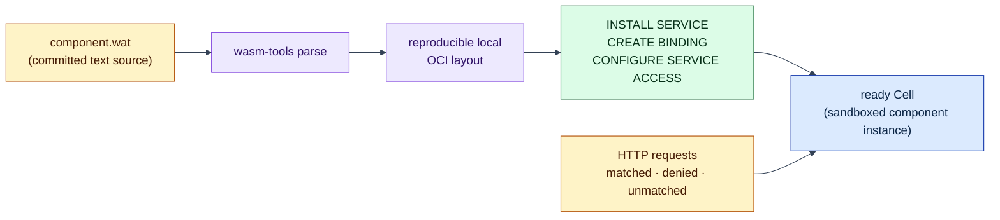

# Request Binding deployment

## The problem this example addresses

Lagrange's core idea is to run application code *inside* the database cluster,
next to the data it uses (see the [examples overview](../README.md) for the
full introduction). That immediately raises two questions this example
answers concretely:

1. **How does code get into the cluster?** Not by copying files to a machine -
   by installing an immutable, digest-pinned **Artifact** and declaring how it
   may be invoked, all through SQL statements.
2. **How is that code kept safe?** The code is a
   [WebAssembly](https://webassembly.org/) component: a sandboxed binary that
   can only call the functions the host explicitly provides. Here it gets
   exactly one table slot - and you will watch an undeclared access get
   denied.

One command builds the committed [`component.wat`](component.wat) source into
a real component, boots a disposable local node, runs the deployment SQL,
sends authenticated HTTP requests, and shuts everything down.

## WebAssembly terms used here

If WASM is new to you, three terms are enough for this example:

- **WASM module/component** - a portable, sandboxed binary. It has no
  ambient access to files, network, or environment; every capability is an
  explicit import. See [webassembly.org](https://webassembly.org/) and the
  [Component Model book](https://component-model.bytecodealliance.org/).
- **WAT** - the human-readable *text format* of WebAssembly, roughly what
  assembly language is to machine code. [`component.wat`](component.wat) is
  committed as text so you can read exactly what the example deploys. See the
  [text-format guide](https://developer.mozilla.org/en-US/docs/WebAssembly/Guides/Understanding_the_text_format).
- **[`wasm-tools`](https://github.com/bytecodealliance/wasm-tools)** - the
  Bytecode Alliance toolbox; the runner uses `wasm-tools parse` to turn the
  WAT text into the deployable binary.

The component imports only Lagrange's public context interface -
`read`, `write`, and `capability` - and exports one function, `run`. That
interface is defined in [WIT](https://component-model.bytecodealliance.org/design/wit.html),
the component model's interface language; the
[JavaScript variant of this example](../js-request-binding-deployment/README.md)
commits the same world as readable `wit/world.wit`.

## What happens when you run it



An [OCI layout](https://github.com/opencontainers/image-spec/blob/main/image-layout.md)
is the same on-disk packaging standard container tools use - Lagrange installs
Artifacts from it, pinned by digest, so what you deploy is exactly what was
built.

## Prerequisites

- Node.js 22.12 or newer;
- repository dependencies installed with `npm install`; and
- [`wasm-tools`](https://github.com/bytecodealliance/wasm-tools) on `PATH`
  (the runner uses `wasm-tools parse` to build the committed WAT source).

## Run it

From the repository root:

```sh
node examples/request-binding-deployment/run-request-binding-deployment.js
```

The command prints a JSON report and exits non-zero if any check fails. It
uses a temporary data directory and OCI image layout, so no generated
component binary or opaque image is committed or left behind.

## What to expect

- A matching `POST /examples/request-binding` request reaches the genuine
  component and returns status `202`, header
  `x-lagrange-cell: request-binding-example`, and body
  `component wrote audit key 7`.
- The component reads its declared table context and writes `{key: 7,
  value: 42}` through slot 0.
- A second matched request that reads undeclared slot 1 is **denied at the
  component boundary** and cannot change the declared table. This is the WASM
  capability sandbox doing its job: the host simply never granted that slot.
- An unmatched static path returns `404` with `invoked: false`, produces no
  table effect, and records zero component invocations.

## Under the hood

The deployment goes through the authenticated PostgreSQL adapter and uses the
same parameterized lifecycle statements you would send from any PostgreSQL
client:

```sql
INSTALL SERVICE $1;
CREATE BINDING $1;
CONFIGURE SERVICE ACCESS $1;
```

Each statement maps to one of the three deployment concepts
([`architecture/minimal-deployment-surface.md`](../../architecture/minimal-deployment-surface.md),
[Service Deployment Guide](../../docs/service-deployment-guide.md)):

- `INSTALL SERVICE` registers the **Artifact**: the install payload points at
  the reproducible OCI layout built during the run, and the statement returns
  the immutable `package_id`.
- `CREATE BINDING` declares the **Binding**: it pins that `package_id` with
  the canonical `manifest_digest` and the `run` export, and connects it to the
  HTTP request route. Note what it does *not* say: no node names, no replica
  counts - placement belongs to the cluster.
- `CONFIGURE SERVICE ACCESS` declares the capability grant: slot 0 read/write
  on `table:global.request_binding_audit`, and nothing else.

The runner boots the real seed owners and an HTTP listener on an ephemeral
loopback port. Lifecycle SQL runs through the production authenticated
PostgreSQL adapter in-process - no separate PostgreSQL TCP listener is opened.
The HTTP requests do cross the live node's REST listener and route only to a
ready **Cell** (a running, replaceable component instance).

Scope: one request Binding, one local seed node. The example does not claim
dynamic routes, a complete PostgreSQL compatibility surface, or multi-node
placement behavior.

## Continue

- [js-request-binding-deployment](../js-request-binding-deployment/README.md)
  - the same path written in plain JavaScript instead of WAT.
- [call-binding-account-summary](../call-binding-account-summary/README.md)
  - the distributed call: the same deployment surface driving partition
  functions and a reducer across a split table.
- [The Lagrange Native Programming Model](../../docs/native-programming-model.md)
  - why deployment is the entry path, not the end state.
