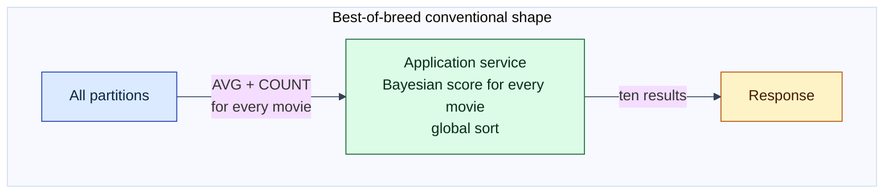
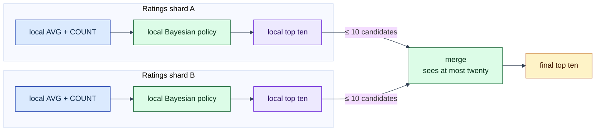
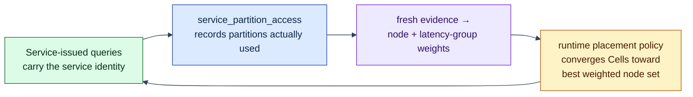

# MovieLens: distributed SQL and data-local application policy

## The problem this example addresses

Picture a familiar architecture: a database cluster holds the data, and a
separate application service holds the business logic. Every request makes the
service query the database, wait for results to cross the network, apply its
logic, and respond. For data-heavy operations — rank everything, score
everything, aggregate everything — **the network boundary between application
and data becomes the product's bottleneck**: most of what crosses it is
discarded moments later.

This is the specific problem Lagrange exists to attack (see the
[examples overview](../README.md)): instead of moving data to the code, move
the code to the data, run it beside every shard in parallel, and exchange only
small partial results.

This example makes that concrete — and honest. It computes the same
[MovieLens 100k](https://grouplens.org/datasets/movielens/100k/) top-ten movie
ranking (100,000 real movie ratings, a standard public research dataset) three
ways:

1. **PostgreSQL grouped SQL** — a primary with two synchronous streaming
   replicas executes `AVG` and `COUNT` per movie.
2. **Lagrange distributed grouped SQL** — the same grouped query runs across
   Lagrange partitions.
3. **A replicated Lagrange service** — two service replicas apply a
   confidence-adjusted Bayesian ranking on disjoint movie-id shards. Each
   publishes at most ten candidates; one replica merges at most twenty.

All three paths use the same ranking formula and return the same ordered top
ten.

For a line-by-line before-and-after application walkthrough, read
[Rewrite A Hot Path For Lagrange](../../docs/tutorials/rewrite-a-hot-path.md).
For the runnable public call path this demo's shape graduated into, see
[call-binding-account-summary](../call-binding-account-summary/README.md);
for the authoring model, read
[The Lagrange Native Programming Model](../../docs/native-programming-model.md).

## Why This Is A Fair Baseline

The comparison does not make the conventional service pull every raw rating
into application memory. PostgreSQL groups first and returns one aggregate per
movie. That is a sensible best-of-breed implementation — the strongest
conventional shape, not a strawman.

Even so, the boundary remains: *every* movie's aggregate must cross into the
application process, because the scoring policy lives there.



The Lagrange service changes the execution shape — the policy runs *before*
the exchange, beside each shard, and only bounded top-ten lists cross:



The win is not that code has been packaged differently. The win is that policy
which previously ran after all grouped results crossed into an application
process now runs before the exchange, beside each shard.

## Why A Service, Not Just More SQL?

An average and count are natural SQL. The ranking formula is application
policy — a
[Bayesian average](https://en.wikipedia.org/wiki/Bayesian_average) with a
confidence penalty, so a movie with three perfect ratings does not outrank a
movie with three thousand very good ones:

```text
bayesianMean = (average × count + priorMean × priorWeight)
               / (count + priorWeight)
score = bayesianMean - confidencePenalty / sqrt(count)
```

It combines observed rating quality, amount of support, a prior mean, and a
confidence penalty. This is the kind of logic teams often want to:

- keep in normal source control;
- unit test as application code;
- version independently;
- share with other application paths; and
- change without growing a stored-procedure surface.

Lagrange's native model is not "replace SQL with functions." The useful
combination is:

1. SQL performs relational scans and grouping locally;
2. application code applies policy locally; and
3. reduction exchanges only bounded candidates.

## What Was Rewritten

The outer request and result contract do not need to change. Only the ranking
hot path changes.

A conventional service would execute grouped SQL, receive every movie
aggregate, score all candidates, sort, and keep ten.

The data-local service instead gives each replica responsibility for a
disjoint movie-id shard. Each replica:

1. executes its grouped scan;
2. computes the Bayesian score in application code;
3. retains only its local top ten;
4. publishes the bounded partial under a lease; and
5. participates in producing an atomic final snapshot.

The generic runtime pieces are:

- `src/runtime/sql-query-loop-runtime-module.js`
- `src/runtime/sql-query-loop-parallel-reduce.js`

The demo-specific formula and orchestration remain in this example directory.

## Transfer Shape

The report keeps unlike measurements separate:

| Path | Database result crossing its boundary | Additional service exchange |
| --- | ---: | ---: |
| PostgreSQL grouped SQL | one aggregate per movie | none |
| Lagrange grouped SQL | one aggregate per movie | none |
| Lagrange replicated service | shard scans remain behind service executors | at most `replicas × topN` candidates |

For this run, `replicas = 2` and `topN = 10`, so the service merge receives at
most twenty candidates.

This bound matters as data grows. Let:

- `N` be matching raw rows;
- `M` be grouped movies;
- `R` be participating shards; and
- `K` be the requested result count.

Then the relevant boundary shapes are approximately:

| Strategy | Boundary volume |
| --- | ---: |
| Application aggregation | `N` rows |
| Strong grouped-SQL baseline | `M` aggregates |
| Shard-local policy and bounded reduction | at most `R × K` candidates |

With MovieLens 100k, `N` is 100,000 ratings and `M` is about 1,700 movies —
but `R × K` stays at twenty no matter how many ratings or movies exist. The
bound grows with shard count and requested results, not with the data.

The demo verifies this shape and result parity. It does not claim that every
workload should be rewritten or that every native function will be faster.

## Placement Is Part Of The Result

The second half of the demo answers a different question: **who decides where
the ranking code runs?** In a conventional stack, a human (or a generic
scheduler that cannot see database access) does. In Lagrange, observed access
does.

The service starts wherever ordinary placement chooses because no access
history exists yet. Then a feedback loop takes over:



Two separate mechanisms are visible:

- **placement affinity** is a slow topology decision that moves service Cells
  toward replicas they use; and
- **read locality** is a fast query-routing decision that orders suitable
  replicas for an individual read.

`read_locality` does not switch placement affinity on. Placement is lifted
from observed access when fresh evidence exists.

Useful queries while Lagrange runs:

```sql
SELECT node_id, latency_group_id FROM nodes;
SELECT partition_id, leader_node_id FROM partitions;
SELECT node_id, service_id, access_json FROM service_partition_access;
SELECT service_id, node_id, status FROM services;
SELECT slot_id, replica_id, lease_expires_at, partial_json, computed_at
FROM movielens_top10_reduce_slots;
SELECT result_json, computed_at FROM movielens_top10;
```

The full mechanism is documented in
[Process: Data Affinity](../../architecture/process-data-affinity.md).

## Prerequisites

- Node.js 22 and `npm install`
- [Docker](https://docs.docker.com/), for the PostgreSQL 16 baseline
- internet access on the first run, to download
  [MovieLens 100k](https://grouplens.org/datasets/movielens/100k/)
- enough local resources for PostgreSQL plus five Lagrange processes

## Run It

From the repository root:

```sh
npm run demo:movielens
```

The command downloads the dataset if needed and runs PostgreSQL first. The
Lagrange phase:

1. bootstraps the ratings schema and two coordination tables on its seed;
2. joins four more nodes;
3. waits for the operation-ledger quorum to spread (Lagrange replicates with
   [Raft](https://raft.github.io/) consensus, so writes need a healthy
   majority);
4. loads the dataset once;
5. waits for the ratings table to split across at least two nodes;
6. executes distributed SQL and service cases; and
7. writes a machine-readable live report under `test-output/reports/`.

To download the dataset without running the comparison:

```sh
node examples/service-data-affinity/download-movielens.js
```

## How To Read The Report

Check four things in order:

1. **Correctness** — all paths produce the same ordered top ten.
2. **Transfer shape** — grouped SQL emits one result per movie; the service
   emits bounded top-N partials.
3. **Chronology** — partial leases and the final atomic snapshot represent one
   coherent reduce generation.
4. **Affinity** — attributed partition access produces placement evidence and
   the service converges toward a better weighted node set.

Startup, loading, and topology differ between PostgreSQL and Lagrange. The
demo therefore does not print a PostgreSQL-versus-Lagrange speedup ratio. Such
a ratio would be misleading.

For a performance claim, use a controlled deployment and repeated steady-state
samples. Measure at least:

- p50, p95, and p99 latency after warm-up;
- bytes crossing the service/database boundary;
- CPU per completed operation;
- partitions and replicas touched;
- retry and timeout rates; and
- background host load and scheduling gaps.

The project's calculation-based estimation method (with equations and claim
boundaries) is in
[Estimating Performance, Throughput, And Network Cost](../../docs/performance-and-cost-estimation.md).

## Current API Boundary

This demo proves the data-local execution, bounded-reduction, and placement
shape, but it is **not yet the public service-authoring path**.

It drives the internal placement substrate directly: the harness writes a
`service_definitions` row for a kernel-internal `native_js` query-loop module
and pins two replicas so the disjoint-shard arithmetic is reproducible.

That direct write is demo scaffolding against a migration-input table. It is
not how externally authored services are deployed.

Public deployment uses Artifact / Binding / Cell. Genuine
[WASI](https://wasi.dev/) request components are externally installable today
(see [js-request-binding-deployment](../js-request-binding-deployment/README.md)),
and the request context provides `read`, `write`, and `capability`.

The public successor to this demo's internal query-loop module now
exists: the `call` Binding kind is invocable end to end over pgwire
(`CALL BINDING $1`), with a Binding-declared partition-local SELECT,
shard-local `run` execution on partition-host nodes, and a coordinated
`reduce` over numeric partials —
[call-binding-account-summary](../call-binding-account-summary/README.md)
is the runnable example. The `pushdown` Binding kind still has no public
invocation adapter, and richer partial shapes (beyond numeric per-group
values) remain product direction.

This distinction is intentional:

- this demo shows what the execution and placement substrate buys, at
  MovieLens scale, against a strong conventional baseline;
- the call-binding example shows the same shape on the public path;
- the remaining work is `pushdown` invocation, structured partials, and
  parallel shard fan-out.

## Troubleshooting

The demo fails closed rather than starting work the cluster cannot finish.
Readiness includes total and ledger-specific in-flight operation counts plus
the ledger voter shape. The run proceeds only once the ledger has at least
three voters with no single node required for its majority.

If that spread is not reached before the no-progress cutoff, the run stops
with a formation diagnosis instead of issuing a schema request that cannot
succeed.

If the command fails before loading ratings, inspect the emitted failure
report and archived node logs under:

```text
data/examples/service-data-affinity-demo-archive/
```

## Follow The Implementation

| Concern | File |
| --- | --- |
| One-command comparison | `run-comparison.js` |
| PostgreSQL grouped baseline | `run-postgres-baseline.js` |
| Shared ranking contract | `movie-ranking.js` |
| Lagrange cluster, SQL, and service orchestration | `run-affinity-demo.js` |
| Generic replica reduce loop | `src/runtime/sql-query-loop-runtime-module.js` |
| Stable leases and atomic snapshots | `src/runtime/sql-query-loop-parallel-reduce.js` |
| Placement evidence | `affinity-demo-evidence.js` |
| Always-on affinity policy lift | `src/rebalancer/unified-rebalancer-policy-scheduler-methods.js` |
