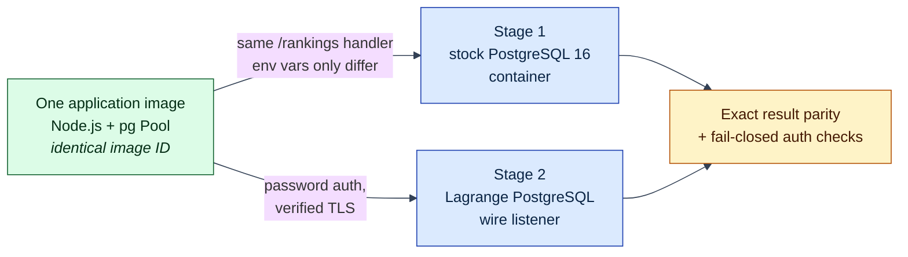

# PostgreSQL application portability

## The problem this example addresses

Adopting a new database usually means rewriting application code first — new
client libraries, new query dialect, new authentication. Lagrange's adoption
story deliberately starts at the other end (see the
[examples overview](../README.md)): **an existing PostgreSQL application
should connect to Lagrange unchanged**, because Lagrange speaks the standard
[PostgreSQL wire protocol](https://www.postgresql.org/docs/current/protocol.html)
— the same TCP protocol every PostgreSQL client library already implements.

No WebAssembly, no rewrites, no Lagrange APIs appear in this example. It is
the compatibility path: point an existing application at Lagrange first, then
extract data-local hot paths into a service —
[The Lagrange Native Programming Model](../../docs/native-programming-model.md)
— only where they pay.

Concretely, one ordinary Node.js HTTP application image runs, unchanged,
against two database endpoints:

1. a stock PostgreSQL container; and
2. Lagrange's production PostgreSQL wire listener.



The application source, Dockerfile, entrypoint, command, and inspected image
ID stay identical. Only connection, credential, and TLS environment variables
change. The Lagrange stage runs in a separate application container, uses
password authentication, validates the server certificate, and keeps the demo
private key outside the application image.

## Run it

Prerequisites: Node.js 20+ and a running [Docker](https://docs.docker.com/)
daemon. From the repository root:

```sh
node examples/service-portability/run-database-portability.js
```

The command builds the application image once, starts an isolated PostgreSQL
baseline, starts the Lagrange listener through `createRuntimeStartupWiring` and
`ServiceRuntimeLifecycle`, invokes the same `/rankings` handler in both stages,
and checks exact result parity. It then tries a wrong password and a wrong CA
against the Lagrange stage (both must fail), writes a versioned report under
`test-output/reports/`, and tears everything down.

## What's covered

The PostgreSQL slice exercised here is intentionally explicit:

- the real [`pg`](https://node-postgres.com/) Pool from an external
  application container;
- password authentication and verified TLS on the Lagrange connection;
- parameterized
  [extended queries](https://www.postgresql.org/docs/current/protocol-flow.html#PROTOCOL-FLOW-EXT-QUERY);
- `BEGIN`/`COMMIT` transaction handling;
- portable `DROP TABLE`, `CREATE TABLE`, and multi-row `INSERT` operations; and
- a filtered multi-row `SELECT` with deterministic ordering.

This is **not** a claim of arbitrary ORM compatibility or complete PostgreSQL
behavior, and Lagrange does not install or manage the application container
here — the application stays wherever it already runs. (Managed OCI
execution inside Lagrange is unsupported scaffolding today; WASM is the
service packaging format. See
[Current Capabilities And Limitations](../../docs/current-capabilities-and-limitations.md)
for the authoritative status.)

Note that this example starts the built-in `sys-postgres-wire` runtime service
directly — one of the axiomatic bootstrap services that exists before any
Binding. It exercises the runtime substrate, not the user deployment surface;
user services are deployed through `INSTALL SERVICE` and `CREATE BINDING`
([`architecture/minimal-deployment-surface.md`](../../architecture/minimal-deployment-surface.md)),
which the [request-binding examples](../request-binding-deployment/README.md)
demonstrate.

The certificates and private key in `certs/` are local example fixtures only.
Never use them anywhere else.

## Continue

- [request-binding-deployment](../request-binding-deployment/README.md) — the
  next rung: deploying sandboxed code *into* the cluster.
- [service-data-affinity](../service-data-affinity/README.md) — the payoff
  rung: what changes when a hot path becomes data-local.
