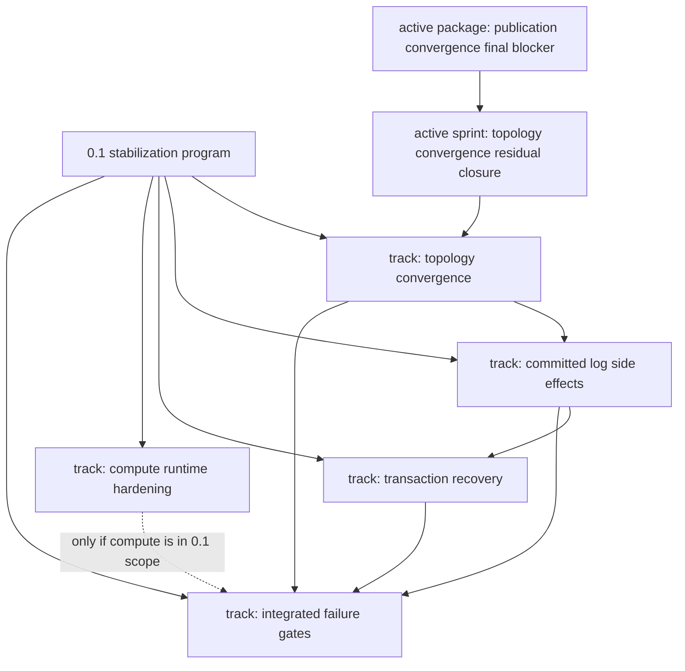

# 0.1 Dependency Map

## Document Role

This is the quick dependency view for the generic tracks consumed by the 0.1
stabilization program and the sprints that currently execute them.

It is a planning map only. It does not activate packages, close sprints, or
replace package metadata.

## Current Execution Attachment

| Execution item | Attached track | Depends on | Unblocks | Status |
| --- | --- | --- | --- | --- |
| `work/sprints/active-2026-q2-topology-convergence-residual-closure.md` | [`topology-convergence`](../tracks/topology-convergence.md) | current active package proof or explicit re-scope | committed side-effect work only after topology closes, migrates, or names that blocker | active |
| `work/packages/active-20260514-topology-publication-convergence-final-blocker.md` | [`topology-convergence`](../tracks/topology-convergence.md) | explicit re-scope, subagent review, and focused publication-owner proof | topology track reduction, migration, or representative green evidence | active handoff |

## Track Dependencies

| Track | Depends on | Unblocks | Current state |
| --- | --- | --- | --- |
| [`topology-convergence`](../tracks/topology-convergence.md) | current active publication-convergence blocker | committed-log side-effect investigation, or a narrower topology successor | live-red publication convergence risk |
| [`committed-log-side-effects`](../tracks/committed-log-side-effects.md) | topology no longer owns the active execution slot, or evidence names uncommitted side effects as the blocker | transaction recovery hardening and integrated failure gates | planned |
| [`transaction-recovery`](../tracks/transaction-recovery.md) | committed-entry side-effect ordering understood or explicitly unrelated | integrated failure gates | planned |
| [`compute-runtime-hardening`](../tracks/compute-runtime-hardening.md) | 0.1 product decision: compute in scope or explicitly scoped out | integrated failure gates only when compute is in scope | optional/planned |
| [`integrated-failure-gates`](../tracks/integrated-failure-gates.md) | topology, side effects, transaction recovery, and compute decision if applicable | 0.1 release confidence | planned |

## Graph

## Reading Rules

1. A dependency means "do not claim this downstream track is ready for release
   proof yet." It does not forbid exploratory read-only analysis.
2. A planned track becomes executable only through a work package.
3. If canonical evidence names a downstream track as the current blocker, update
   this map and the relevant track before opening the successor package.
4. If the active package migrates to a narrower owner boundary, attach the
   successor package to the track that owns that new boundary.
5. Do not add individual package-to-package edges here unless they affect track
   or release ordering.

## Update Triggers

Update this map when:

- the active sprint changes
- the active package changes
- a package migrates to another track
- a track becomes blocked, active, closed, or out of scope
- the compute-runtime track is declared in or out of 0.1 scope
